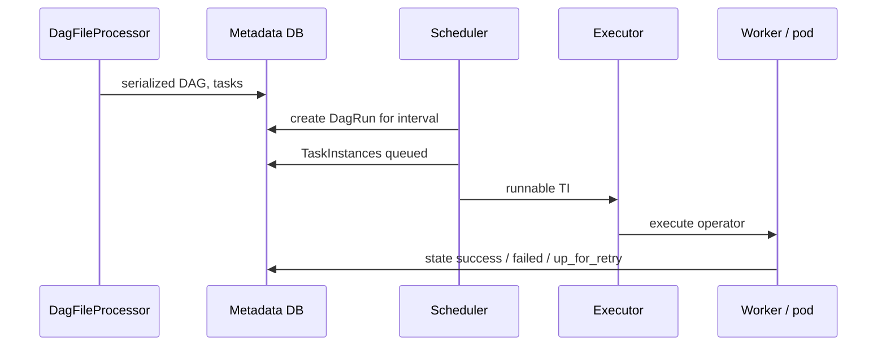

# Airflow DAGs

Someone clears task `join_enrich` — task 12 of 25 — after fixing a bug in it, expecting only that task and its downstream neighbors to rerun for today's `ds`. Twenty minutes later, three unrelated tenant dashboards are also empty, and yesterday's revenue number has quietly changed.

A. A hidden dependency that never showed up as a graph edge.
B. Two DagRuns wrote the same partition at the same time.
C. The graph was fine; the write itself wasn't idempotent, so the rerun doubled rows.
D. A backfill for another date collided with this one.

Pick one before reading on. A DAG is supposed to make dependencies explicit enough that an incident like this has one traceable cause instead of four guesses — it defines *what* runs and in *what order*, not *how fast* or *on what data*. Compute still belongs in Spark, Flink, dbt, or a warehouse; Airflow just records that those jobs ran for a data interval. Twenty-five dependent jobs — extract orders, extract Stripe, drain yesterday's Kafka partition, join, enrich, metrics, load, reports — is the running shape for this whole module; here is where the graph gets tested for real.

---

## Use Case

**SaaS analytics, daily tenant metrics.** By 07:00 the product dashboard must show yesterday. Sources: Postgres orders, Stripe API, Kafka events compacted to S3. Downstream: Iceberg metrics table, then Trino, then email reports.

**E-commerce CDC.** Airflow does not apply CDC. It starts the Hudi/Iceberg upsert job after Debezium lag is healthy, then runs quality checks.

**Observability.** Hourly: compact small Parquet files, expire snapshots, publish partition stats. One DAG, few tasks, strict runtime cap so compaction cannot overlap itself.

The DAG is the control plane for those three. It is not the query engine.

---

## Why This Is Hard

At one job, cron is enough. At 25 jobs the failure modes compound:

- Step 4 fails after writing half a partition. Steps 5–8 already ran on yesterday's data, or worse, on the half-write.
- You fix a metric bug and need 45 days backfilled without 45 Spark jobs slamming the cluster.
- A sensor waits for a file that another DAG on the same worker pool is supposed to write.
- Two DAG runs for the same `ds` overlap (`max_active_runs` unset) and overwrite each other's output.
- Someone loops rows in a `PythonOperator` because "it's just Python."

Airflow makes the graph visible. It does not make the writes safe. Safety is [idempotency](idempotency.md) plus task granularity.

---

## Intuition

Treat a DAG run as **one data interval, many tasks, one intended table state**.

```
logical_date / ds = 2024-01-15
  extract  →  spark transform  →  validate  →  load  →  report
```

The scheduler's job is: *given this interval, which TIs are still missing, and may I start them?* Your job is: *if any TI runs twice, the lake still has one correct 2024-01-15.*

A DAG is a **good DAG** if it is:

1. **Idempotent** — running the same DAG run twice produces the same result
2. **Atomic** — each task either fully succeeds or fully fails (no partial writes)
3. **Isolated** — tasks do not share mutable state through files or databases mid-run

Most Airflow problems stem from violating one of these three properties.

---

## Internals: From File to Task Instance



1. The **DagFileProcessor** imports your `.py` on a loop. Import-time code runs in the scheduler process, not on the worker. Heavy Spark sessions at module top stall *every* DAG.
2. A **DagRun** is created for a data interval (`logical_date` / historically `execution_date`). `{{ ds }}` is that interval's date, not "now."
3. Each task becomes a **TaskInstance** with state: `none → scheduled → queued → running → success | failed | up_for_retry | up_for_reschedule`.
4. The **executor** places the TI on a local process, Celery worker, or Kubernetes pod. See [Executors](executors.md).
5. The worker runs the operator, pushes XCom, heartbeats. If the worker dies, the scheduler marks the TI failed (after heartbeat timeout) and retries if configured.

The metadata DB is the lock. Two schedulers (HA) coordinate through it. If you store DataFrames in XCom, you store them in this database.

---

## Wrong DAG vs Right DAG

### Wrong: Spark inside Python, looping rows

```python
def process_events(**context):
    ds = context["ds"]
    spark = SparkSession.builder.master("local[*]").getOrCreate()
    df = spark.read.parquet(f"s3://events/dt={ds}/")
    out = []
    for row in df.collect():          # 1 TB to the Airflow worker
        if row.status == 500:
            out.append(row)
    pd.DataFrame(out).to_csv(f"/tmp/errors_{ds}.csv")
    next_task_reads_tmp()             # next TI may be another machine
```

Failures: worker OOM, 8-hour task, local `/tmp` invisible to the next task, retries append garbage, scheduler heartbeat timeout kills the "job" while Spark is still thinking.

### Right: submit compute, pass dates, validate

```python
from datetime import datetime, timedelta
from airflow import DAG
from airflow.providers.apache.spark.operators.spark_submit import SparkSubmitOperator
from airflow.operators.python import PythonOperator
from airflow.providers.databricks.operators.databricks import DatabricksSubmitRunOperator

default_args = {
    "owner": "data-engineering",
    "retries": 2,
    "retry_delay": timedelta(minutes=5),
    "email_on_failure": True,
}

with DAG(
    dag_id="daily_events_pipeline",
    default_args=default_args,
    schedule_interval="0 2 * * *",  # 2 AM daily
    start_date=datetime(2024, 1, 1),
    catchup=False,  # Do not backfill missed runs
    max_active_runs=1,
    tags=["events", "daily"],
) as dag:

    validate_source = PythonOperator(
        task_id="validate_source_data",
        python_callable=check_source_partition_exists,
        op_kwargs={"date": "{{ ds }}"},
    )

    transform = SparkSubmitOperator(
        task_id="transform_events",
        application="s3://code/transform_events.py",
        application_args=["--date", "{{ ds }}"],
        conf={
            "spark.executor.memory": "4g",
            "spark.executor.cores": "2",
        },
        execution_timeout=timedelta(hours=2),
    )

    # Databricks shops: same idea, different operator
    # DatabricksSubmitRunOperator(task_id="transform", json={...})

    load_clickhouse = PythonOperator(
        task_id="load_to_clickhouse",
        python_callable=insert_daily_partition,  # DELETE+INSERT for ds
        op_kwargs={"date": "{{ ds }}"},
    )

    validate_source >> transform >> load_clickhouse
```

The PythonOperators here are *control*: existence checks, partition swap. They do not iterate events.

---

## DAG Structure: Dates, Catchup, Concurrency

### `schedule_interval` / `schedule`

Airflow uses cron expressions or presets (`@daily`, `@hourly`). The `execution_date` (now called `logical_date`) is the *start* of the interval, not the time the DAG runs.

For a `@daily` DAG scheduled at midnight, the `execution_date` for the run that fires on Jan 2 is **Jan 1**. This is the "data interval" convention — the DAG processes data *for* that date.

This confuses almost everyone initially. Template with `{{ ds }}` and unit-test it. Do not use `datetime.utcnow()` inside operators.

### `catchup`

If `catchup=True` and a DAG has a `start_date` in the past, Airflow will backfill every missed run. This is often not what you want for production pipelines. Set `catchup=False` unless you explicitly need backfill.

### `max_active_runs`

Limits how many concurrent DAG runs can execute. Important for pipelines that write to shared tables — you don't want two runs writing the same partition simultaneously.

```python
max_active_runs=1  # Only one run at a time
```

Backfills ignore your intuition unless this is set. Pair with `depends_on_past=True` only when day D honestly cannot start until D−1 succeeded (running balances, not independent daily partitions).

---

## Templating

Airflow's Jinja templating lets tasks use the execution date:

```python
"{{ ds }}"           # execution date as YYYY-MM-DD
"{{ ds_nodash }}"    # execution date as YYYYMMDD
"{{ execution_date }}" # datetime object
"{{ prev_ds }}"      # previous execution date
"{{ next_ds }}"      # next execution date
"{{ data_interval_start }}"  # prefer in modern DAGs
"{{ data_interval_end }}"
```

Use this to make tasks date-aware without hardcoding dates. Only fields in the operator's `template_fields` are rendered. Passing a date into a plain Python kwarg without `op_kwargs` / templated fields is a silent bug: you will write the literal string `{{ ds }}`.

---

## XCom: Passing Data Between Tasks

XCom lets tasks share small values:

```python
def extract(**context):
    row_count = count_source_rows()
    context["ti"].xcom_push(key="row_count", value=row_count)

def validate(**context):
    row_count = context["ti"].xcom_pull(task_ids="extract", key="row_count")
    if row_count == 0:
        raise ValueError("No rows found in source")
```

**XCom is not for large data.** It stores values in the Airflow metadata database (Postgres/MySQL). Do not push DataFrames, large files, or anything over a few KB. For large data, write to S3 and pass the path.

!!! production-gotcha "XCom in the critical row path"
    A 5 MB pickle per mapped task × 2,000 mapped TIs is a 10 GB metadata incident. Push `{path, row_count, bytes}`. Never push the dataset.

---

## Sensors Are Deadlock Machines

Sensors wait for an external condition before proceeding:

```python
from airflow.sensors.s3_key_sensor import S3KeySensor

wait_for_upstream = S3KeySensor(
    task_id="wait_for_upstream_data",
    bucket_name="my-data-lake",
    bucket_key="events/dt={{ ds }}/_SUCCESS",
    timeout=3600,        # Give up after 1 hour
    poke_interval=60,    # Check every minute
    mode="reschedule",   # Release worker slot while waiting
)
```

Use `mode="reschedule"` (not `"poke"`) so the sensor releases its worker slot while waiting. `"poke"` mode holds the slot for the full wait duration.

Deadlock pattern:

1. DAG A: `wait_for_B` (poke) then `produce_A`.
2. DAG B: `wait_for_A` (poke) then `produce_B`.
3. Worker pool size 8, 8 sensors running, zero producers.

Same shape with `ExternalTaskSensor` loops across teams. Always: timeout, reschedule, a **pool** for sensors smaller than total worker slots, and prefer **data-aware scheduling** (downstream DAG triggered by a Dataset update) over eternal sensors.

Deferring sensors (Triggerer + `asyncio`) are the modern form of reschedule: they wait off-worker. Still set timeouts.

---

## Task Groups and Dynamic Task Mapping

Organise related tasks visually:

```python
from airflow.utils.task_group import TaskGroup

with TaskGroup("quality_checks") as quality_checks:
    check_nulls = PythonOperator(task_id="check_nulls", python_callable=check_nulls)
    check_duplicates = PythonOperator(task_id="check_duplicates", python_callable=check_dups)
    check_schema = PythonOperator(task_id="check_schema", python_callable=check_schema)

transform >> quality_checks >> load
```

**Dynamic task mapping** creates TIs from a list at runtime:

```python
@task
def list_tenants(ds: str) -> list[str]:
    return s3_list(f"s3://landed/{ds}/")  # tens of tenants, not millions of files

@task
def spark_for_tenant(tenant: str, ds: str):
    submit_spark(["--tenant", tenant, "--date", ds])

spark_for_tenant.partial(ds="{{ ds }}").expand(tenant=list_tenants("{{ ds }}"))
```

Map over *partitions of work* (tenants, tables, shards). Mapping over rows or files recreates the fine-grained DAG antipattern and blows the metadata DB.

Cap mapped fan-out (`max_map_length` / `max_active_tis_per_dag`). A surprise 8,000-tenant day should shed load, not take the scheduler with it.

---

## Pools, SLAs, Data-Aware Scheduling

**Pools.** Named semaphores in the metadata DB.

```python
PythonOperator(
    task_id="call_stripe",
    python_callable=pull_stripe,
    pool="stripe_api",   # slots=4 in the UI
    pool_slots=1,
)
```

Put every rate-limited API and every "only one writer" warehouse load in a pool. Sensors get their own small pool so they cannot consume `parallelism`.

**SLAs.** `sla=timedelta(hours=3)` on a task emits an SLA miss if the TI has not succeeded by `logical_date + schedule + sla` (check the version you run; the definition has moved). Wire `sla_miss_callback` to paging. An SLA is not a timeout: `execution_timeout` *kills* the task; SLA only *notifies*.

**Data-aware scheduling.** Conceptually:

```python
events = Dataset("s3://lake/events")

# upstream
SparkSubmitOperator(..., outlets=[events])

# downstream DAG
schedule=[events]
```

DAG B runs because the events dataset updated, not because cron guessed 02:30. You still need idempotent writers: a dataset update can fire twice.

---

## How: A 25-Job Shape That Survives Production

Collapse 25 cron scripts into **units of failure**, not units of SQL.

| Task | Engine | Why it is a task |
|------|--------|------------------|
| `assert_sources` | Python (HEAD S3 / SQL count) | Fail fast, cheap |
| `extract_orders` | SparkSubmit / dump job | Independent source |
| `extract_stripe` | Python + pool | Rate limit |
| `events_to_iceberg` | SparkSubmit | Heavy |
| `join_enrich` | SparkSubmit | Heavy, one job not five |
| `dbt_metrics` | Bash / Cosmos | Warehouse transform |
| `quality` | Task group | Block load on bad data |
| `publish` | Python | Swap partition / notify |

Retries: 2–3 on extract and Spark, exponential backoff, `execution_timeout` on every heavy task. `catchup=False`, `max_active_runs=1` until you prove overlapping days are safe. See [idempotency](idempotency.md) for the write side.

---

## Gotchas

**Avoid mutable global state in tasks.** Tasks may run on different workers. Don't write temporary files to local disk and expect the next task to find them.

**Don't import heavy libraries at DAG parse time.** Airflow parses DAGs continuously. Heavy imports at module level slow down the scheduler.

**Use `retry_delay` and `retries`.** Transient failures (network, downstream unavailability) should retry automatically.

**Set `execution_timeout` on long-running tasks.** Otherwise a hung task blocks forever.

```python
transform = SparkSubmitOperator(
    task_id="transform",
    execution_timeout=timedelta(hours=2),
    ...
)
```

**Top-level `datetime.now()` in `start_date`.** The DAG's identity changes every parse. Use a fixed, timezone-aware `start_date`.

**`trigger_rule="all_done"` hiding failures.** Downstream "cleanup" runs after a failed load and looks green.

---

## Failure Modes

| Failure | What you see | Actual cause |
|---------|--------------|--------------|
| DAG never scheduled | Empty UI | Parse error; `start_date` in the future; `schedule=None` |
| Tasks stuck `queued` | Growing backlog | Executor slots, pool=0, worker down, DB locks |
| Zombie TIs | `running` then fail | Worker OOM / kill; heartbeat lost |
| Partial table | Downstream "success" | Non-atomic write; no validate task |
| Sensor deadlock | All workers busy, 0 CPU | Poke sensors |
| Backfill brownout | Warehouse CPU 100% | `catchup` or unbounded backfill |
| Mapped task explosion | Metadata DB CPU | `expand` on a huge list |

---

## Debugging

1. **Parse**: `airflow dags list-import-errors`. If the file imports Spark, you already lost.
2. **Why hasn't it run?** Graph view: state, `logical_date`, next run. Logs: scheduler (`dagbag`, `slot`).
3. **TI log** is the operator log. For SparkSubmit, that is often *submit* logs only — the job log is on YARN/K8s. Jump there.
4. **SQL on metadata** (read replica): `task_instance` states, duration, `queued_dttm - start_date` as scheduler lag.
5. **Clear vs rerun.** Clearing a TI re-executes it for the *same* `ds`. If the write is not idempotent, clearing is how you duplicate data. Confirm the write path first.

```sql
SELECT dag_id, task_id, state, COUNT(*)
FROM task_instance
WHERE start_date > NOW() - INTERVAL '6 hours'
GROUP BY 1, 2, 3
ORDER BY 4 DESC;
```

---

## Scale: 10× / 100× / 1000×

| Scale | What 10× means | What breaks | What to change |
|-------|----------------|-------------|----------------|
| **10×** | ~50 DAGs, tens of TIs/hour | Parse time, poke sensors | Split DAG files, reschedule, pools |
| **100×** | Hundreds of DAGs, backfills | Metadata DB, `queued` TIs | HA scheduler, Celery/K8s, `max_active_runs`, Dag processor isolation |
| **1000×** | Thousands of DAGs or huge mapping | Scheduler loop, DB bloat, UI | DAG-as-config with few files, datasets instead of sensor meshes, do not map per row, dedicated DAG processors |

Airflow 2+ HA schedulers help CPU, not a 20-second import. At 1000× the win is fewer TIs, not more executors. One Spark job per day still beats 10,000 mapped Python tasks.

---

## Trade-offs

| Choice | You gain | You give up |
|--------|----------|-------------|
| Few fat Spark tasks | Scheduler cheap, one log | Slow inner steps less visible |
| Many small tasks | Retry granularity | Parse + DB + sensor risk |
| Cron schedule | Simple | Coupled DAGs drift |
| Datasets | Event-driven | Harder mental model, still need idempotency |
| `depends_on_past` | Serial correctness | One old failure blocks the future |
| Mapping | Fan-out without code gen | Metadata and slot storms |

---

## Alternatives

- **Cron + Make** — fine for one box, five scripts. No backfill UI, no SLAs.
- **Prefect / Dagster** — Python-native, often nicer local DX; still an orchestrator, still not Spark.
- **dbt Cloud / warehouse schedulers** — excellent *inside* SQL; weak at mixed Spark + API + Kafka.
- **Temporal / Cadence** — long-running *business* workflows with signals; not a data-interval backfill tool.
- **Spark unstructured jobs** — no cross-system graph.

Airflow wins when you need a durable graph of heterogeneous jobs and human operations (clear, backfill, pause). It loses when the "DAG" is actually one streaming Flink application.

---

## How to Apply This at Work

When you open a DAG PR:

1. Circle every `PythonOperator`. Does it submit work or process 1 TB?
2. Search for `poke`, `datetime.now()`, `mode="append"`, `catchup=True`.
3. Count TIs on a bad day (mapping). Would the metadata DB survive?
4. Ask: "If I clear `transform` for `ds=2024-01-15`, is the lake still correct?"
5. Draw the worker-slot budget: sensors vs producers.

If the answer to (4) is no, stop and fix [idempotency](idempotency.md) before adding tasks.

---

## Exercise

A team adds `expand` over every S3 object in `s3://events/dt={{ ds }}/` (≈ 40,000 part files). Each mapped task is a `PythonOperator` that reads one Parquet file with pandas and appends to a warehouse table. `catchup` was left default; `start_date` is 90 days ago.

??? question "Name three independent incidents this DAG will cause, in the order they appear after deploy."
    Think scheduler, metadata, and data.

    ??? success "Answer"
        1. **Catchup fan-out**: 90 days × 40,000 mapped TIs queued; scheduler and metadata DB melt before any useful load. 2. **Worker-side processing**: pandas on Airflow workers OOM / slot starvation — orchestration used as compute. 3. **Non-idempotent appends**: retries and overlapping days duplicate rows; clearing a TI makes it worse. The correct shape is one Spark/Databricks job per `ds` (or per large tenant), `catchup=False`, partition overwrite, and mapping only if you have tens of tenants not tens of thousands of files.
