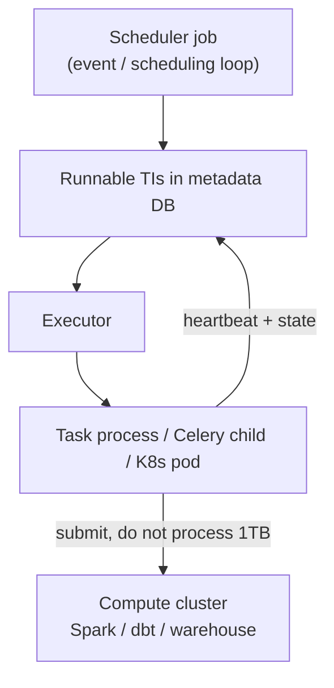

# Airflow Executors

02:03 AM. Forty DagRuns become runnable at once — one per tenant. `parallelism=32` in `airflow.cfg`. Only 4 tasks are actually running; the rest sit `queued`. Two Celery workers respond to a ping; six others are simply missing from the fleet, and nobody paged on it.

A. `parallelism` is set too low — raise it further.
B. Worker count (or `worker_concurrency`) is the real limiter, and the `parallelism` knob is lying about what's actually constrained.
C. A pool is misconfigured to size 0.
D. The scheduler process itself crashed.

Predict before reading on. The executor is the layer that turns "runnable" into "running," and getting the placement policy wrong looks exactly like this: task instances stuck `queued` while the resource everyone is staring at says there's headroom.

---

## Use Case

**SaaS analytics.** Daily SparkSubmit plus a handful of Python checks. Tasks are bursty at 02:00. You need tens of concurrent TIs, not hundreds of long-lived workers.

**E-commerce CDC.** Mostly idle Airflow; a few upsert jobs when lag is low. Isolation matters (CDC jar vs dbt image). KubernetesExecutor or a small Celery queue fits.

**Observability.** Compaction every hour, 200 tables. Tasks are homogeneous, short if they only *submit* Spark, long if they *are* Spark. The executor must not be the compute cluster.

The executor is a placement policy, not a data plane.

---

## Why This Is Hard

The scheduler determines *which* tasks are ready to run and *when*. The executor determines *where* and *how* they run.

Hard parts:

- **Slot accounting is a lie if tasks are fat.** `parallelism=32` with 32 pandas jobs each reading 50 GB is 32 OOMs, not 32 units of work.
- **Start-up vs isolation.** Local processes start in milliseconds and share the box. Kubernetes pods isolate memory and images and cost 10–30 seconds each.
- **Queueing is not throughput.** Growing `queued` TIs means the executor or workers are the bottleneck — or sensors stole the slots. See [DAGs](dags.md).
- **The metadata DB sits on the hot path** of every state change. Scaling workers without scaling Postgres just moves the pile-up.

---

## Intuition

Picture a dispatch window:

```
Scheduler: "TI transform / 2024-01-15 is runnable"
Executor:  "I have a slot on worker 3"  OR  "I will create pod airflow-transform-7f2a"
Worker:    runs operator, heartbeats, writes state
```

If the operator is `SparkSubmitOperator`, the worker should return in seconds-to-minutes (submit + wait for cluster). If the operator is "loop 1 TB in Python," the worker *is* the cluster — and the executor choice cannot save you.

---

## Internals: Shared Machinery

Regardless of executor:



Knobs that apply everywhere:

```
parallelism = 32                    # Max tasks running across entire Airflow
dag_concurrency = 16                # Max tasks running per DAG (max_active_tasks)
max_active_runs_per_dag = 1         # Max concurrent DAG runs per DAG
worker_concurrency = 8              # (Celery) Tasks per worker
```

Tune these based on your cluster capacity and the resource requirements of your tasks — **after** you have moved heavy work off the worker.

---

## SequentialExecutor

Runs one task at a time in the same process as the scheduler. No parallelism.

**Use case**: local development, debugging. Never use in production.

A stuck `time.sleep` in a sensor freezes scheduling for every DAG on that box.

---

## LocalExecutor

Runs tasks as subprocesses on the same machine as the scheduler. Supports parallelism (multiple tasks running simultaneously).

**Use case**: small deployments with a single-machine Airflow instance. Not horizontally scalable — all tasks share the scheduler's resources.

Internals: scheduler forks/execs task processes. Memory is the sum of all running operators plus the scheduler plus the webserver if colocated.

!!! production-gotcha "LocalExecutor plus pandas"
    One "small" production box, `parallelism=16`, each TI loads a 4 GB frame. You have a 64 GB OOM with a healthy-looking DAG. LocalExecutor is safe only if tasks are submit/check/SQL-control.

---

## CeleryExecutor

The traditional production executor. Distributes tasks to a pool of Celery workers via a message broker (Redis or RabbitMQ).

```
Scheduler → Redis/RabbitMQ (message broker) → Celery Workers (run tasks)
```

**Scaling**: add more Celery workers to increase throughput.

**Operations**: you must operate and monitor the broker, the workers, and the Airflow web server separately. Non-trivial.

**Use case**: large Airflow deployments where you need many parallel workers and have the operational capacity to manage Celery.

Internals worth knowing:

- The scheduler pushes a message; a worker `ack`s and runs. If a worker dies after ack, Celery visibility timeout and Airflow heartbeat must agree or you get **duplicate TIs** or **stuck running**.
- **Queues** route heavy vs light tasks (`queue="spark_submit"` vs `queue="sensors"`). This is how you keep poke-mode from starving producers if you have not killed poke yet.
- Worker machines are **pets**: image, Python deps, Spark submit clients, IAM. Drift between workers is a class of "works on worker 2" bugs.

```python
SparkSubmitOperator(..., queue="submitters")
S3KeySensor(..., queue="sensors", mode="reschedule")
```

---

## KubernetesExecutor

Spawns a new Kubernetes pod for each task. Tasks run in isolation and are cleaned up after completion.

```
Scheduler → Kubernetes API → Pod per task (runs and exits)
```

**Advantages**:
- No persistent workers to manage
- Each task gets its own pod with configurable CPU/memory
- Tasks can use different Docker images
- Native Kubernetes scaling

**Disadvantages**:
- Pod startup overhead (~10-30 seconds per task)
- Requires a Kubernetes cluster
- More complex debugging (pod logs, not Celery logs)

**Use case**: Kubernetes-native deployments, tasks with heterogeneous resource requirements, or where operational simplicity of no persistent workers is valued.

```python
from kubernetes.client import models as k8s

transform = SparkSubmitOperator(
    task_id="transform",
    executor_config={
        "pod_override": k8s.V1Pod(
            spec=k8s.V1PodSpec(
                containers=[
                    k8s.V1Container(
                        name="base",
                        resources=k8s.V1ResourceRequirements(
                            requests={"cpu": "2", "memory": "4Gi"},
                            limits={"cpu": "4", "memory": "8Gi"},
                        ),
                    )
                ]
            )
        )
    },
)
```

If `transform` still reads 1 TB into pandas, you just paid for a bigger doomed pod. The right K8s pattern is a small submit pod that creates a Spark `Application` / Databricks run.

---

## CeleryKubernetesExecutor and LocalKubernetes

Hybrid: routes some tasks to Celery workers (low startup cost) and others to Kubernetes pods (resource isolation). Routes based on queue.

```python
run_on_k8s = PythonOperator(
    task_id="heavy_task",
    queue="kubernetes",  # This task goes to K8s
    ...
)
```

**Use case**: mixed workloads where most tasks are lightweight (use Celery) but some need resource isolation or custom images (use Kubernetes).

Default queue: Celery (sensors, checks, dbt CLI). `kubernetes` queue: one-off images, GPU, fat compiles. Do not put 5,000 mapped TIs on KubernetesExecutor unless you like API-server load.

---

## Comparing Executors

| Executor | Parallelism | Operations | Pod startup | Use case |
|----------|------------|------------|------------|---------|
| Sequential | None | Trivial | N/A | Dev only |
| Local | Yes (single machine) | Trivial | N/A | Small deployments |
| Celery | Yes (multi-machine) | High (broker + workers) | N/A | Large traditional deployments |
| Kubernetes | Yes (multi-pod) | Medium (cluster) | ~10–30s | K8s-native deployments |
| CeleryKubernetes | Yes | Highest | Mixed | Mixed light/heavy |

---

## How: Pick and Wire It

1. **Dev**: Sequential or Local. Same DAG code as prod.
2. **First production**: LocalExecutor only if every operator is submit/check and `parallelism` fits RAM.
3. **Multi-machine, stable images**: Celery + Redis, two queues (work vs wait), worker_concurrency sized to RAM not CPU if Python is fat — better: make Python thin.
4. **Multi-image, bursty, K8s already**: KubernetesExecutor, pod templates, Spark on a real cluster.
5. **Always**: Postgres metadata, HA scheduler when you outgrow one CPU, `execution_timeout` on TIs.

Worker resource configuration belongs **per task** for K8s (above) and **per queue** for Celery (machine type). Do not run Stripe API calls and Spark drivers on the same 2 Gi pod spec.

---

## Gotchas

**Executor is not Spark.** `KubernetesExecutor` ≠ Spark-on-K8s. You still need `SparkSubmitOperator`, Databricks, EMR, or a Spark Operator CRD.

**`parallelism` vs Celery `worker_concurrency`.** Global parallelism 128 with two workers at concurrency 4 yields 8 running TIs. The rest sit `queued`. People "fix" this by raising parallelism and wonder why nothing changes.

**Broker as SPOF.** Redis OOM from giant XCom in the message (misconfig) or RabbitMQ disk alarm pauses all DAGs.

**Pod storm.** Dynamic mapping × KubernetesExecutor × catchup = thousands of Pending pods, cluster autoscaler thrash, scheduler time spent in the K8s API.

**Image pull on every TI.** Missing `imagePullPolicy` / no warm cache adds 30–90 s. SLA dies in pull time.

**Timezone / clock skew** between workers: less an executor issue than a logging issue; still pin UTC.

---

## Failure Modes

| Symptom | Likely layer |
|---------|----------------|
| TIs `queued` forever | No worker on that queue; pool empty; K8s quota |
| TIs `running` then zombie | Worker kill, OOM, lost heartbeat |
| Duplicate work | Celery retry + non-idempotent operator; visibility timeout |
| Scheduler 100% CPU | Not executor — DAG parse. See [gotchas](gotchas.md) |
| API server latency | K8s executor pod churn |
| Node CPU 100%, Spark cluster idle | Tasks processing data on workers |

Debugging starts by asking: *is the TI even assigned?* Then *is the worker alive?* Then *is the operator blocking on submit or on pandas?*

---

## Debugging

```bash
airflow jobs check          # scheduler alive
airflow executor            # what is configured (version-dependent)
# Celery
celery -A airflow.executors.celery_executor inspect active
# K8s
kubectl get pods -l airflow_version --field-selector=status.phase=Pending
```

In the UI: Task Instance details show queue, try number, hostname / pod. If hostname is empty and state is `queued`, the executor never accepted it.

Metrics that matter:

- `executor.open_slots` vs `queued_tasks`
- worker memory, not just CPU
- K8s `Pending` reason (`ImagePullBackOff`, `Insufficient cpu`)
- metadata DB `task_instance` rows in `running` older than `execution_timeout`

---

## Scale: 10× / 100× / 1000×

| Scale | Workload | Executor reality |
|-------|----------|------------------|
| **10×** | 20 DAGs, LocalExecutor | Fine if tasks submit Spark. Add RAM, not pandas. |
| **100×** | 200 DAGs, burst 02:00 | Celery with 3+ workers or K8s. Split queues. Postgres sized. `max_active_runs`. |
| **1000×** | 2,000 DAGs or huge mapping | Horizontal workers do nothing if each TI is heavy. Collapse TIs. DAG processors. Dedicated submit pool. Consider whether Airflow is still the right granularity vs a single streaming job. |

At 1000×, KubernetesExecutor start-up * 50,000 TIs/day is days of wasted pull time. Batch work into fewer operators.

---

## Trade-offs

| You choose | Benefit | Cost |
|------------|---------|------|
| LocalExecutor | Simple | One box, no isolation |
| Celery | Fast start, known ops | Pets, broker, dep drift |
| Kubernetes | Isolation, per-task image | Cold start, API load |
| High worker_concurrency | Better packing | Noisy neighbour, OOM |
| Low concurrency, many machines | Isolation | Cost, idle RAM |

---

## Alternatives

- **MWAA / Cloud Composer / Astro** — managed executor + broker. You still write the same operators and can still process 1 TB in Python if you insist.
- **Spark Kubernetes Operator only** — no Airflow; you lose cross-system DAGs, backfill UI, SLAs across dbt + Spark + API.
- **Ray / Flink as the "executor"** — those are compute. Keep Airflow as submitter.
- **Prefect work pools / Dagster launchers** — same design problem, different product.

Do not replace Celery with Kubernetes to "go faster" if the bottleneck is a 1 TB pandas task. Replace the task.

---

## How to Apply This at Work

1. List the top 20 TIs by duration. If duration is *compute*, move it out of the worker.
2. Measure `queued` time vs `running` time. Long queued → slots/executor. Long running → operator.
3. Put sensors on a throttled queue/pool.
4. Size `worker_concurrency` from **peak RSS × concurrency < 0.7 × node RAM**.
5. For K8s, budget pod start-up in the SLA (30 s × task count on the critical path).

---

## Exercise

SLA: metrics ready 90 minutes after midnight. Critical path: 3 SparkSubmit tasks (each Spark job 20 min) + 1 sensor waiting up to 40 min for Stripe. KubernetesExecutor, pod start 25 s, `parallelism=8`. A new engineer changes the Spark tasks to `PythonOperator` that starts `local[*]` Spark inside the pod with 1 TB shuffle.

??? question "Does the executor change or the operator change dominate the SLA miss? What is the fix?"
    Separate placement cost from compute cost.

    ??? success "Answer"
        Operator change dominates. Three extra 25 s pod starts are ~75 s; local Spark on a 4 Gi pod for 1 TB will spill, OOM, or run for hours. The executor was never the compute cluster. Fix: restore SparkSubmit/Databricks to a real cluster, keep K8s pods tiny, sensor in `reschedule` so it does not consume a slot for 40 min, and do not confuse KubernetesExecutor with Spark-on-K8s.
