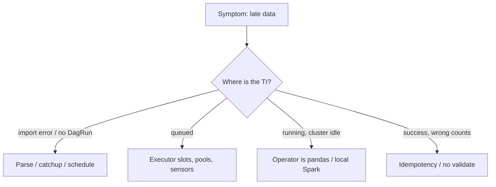

# Airflow Production Gotchas

07:05 AM. Dashboard: empty. Airflow UI: twenty-five tasks marked "running." Spark cluster: idle, zero jobs submitted in the last forty minutes. Celery workers: twelve of them, each pinned at 1% CPU.

A. The scheduler crashed.
B. Every worker is parked inside a poke-mode sensor, holding its slot while it waits.
C. Spark itself is down.
D. The metadata database is the bottleneck.

Predict before reading on. This is not a Spark incident — it is Airflow using worker slots to wait, parse, or process data it should never have touched. Every item on this page is a real failure mode of exactly this shape: the UI says "running," the cluster is doing nothing. The module's other pages are the design; this page is the incident list.

---

## Start with the situation { #use-case }

**SaaS analytics.** A new daily DAG ships on Monday with `start_date=2023-01-01`. Catchup queues hundreds of Spark jobs. The 07:00 SLA DAG never gets slots.

**E-commerce CDC.** `ExternalTaskSensor` (poke) waits on the CDC DAG; the CDC DAG waits on a warehouse pool held by the sensor's workers.

**Observability.** XCom pushes partition lists (megabytes) per hour × 200 tables. Postgres bloats; the scheduler's heartbeat stalls; compaction stops.

Same orchestrator, three ways to stall the control plane.

---

## Why These Are Hard

Airflow failures often look like "data is late" rather than "the scheduler loop is 45 seconds." The UI shows green or running while the lake is wrong. Sensors look productive. PythonOperators look convenient. Catchup looks helpful.

You are debugging a **distributed queue with a shared relational database**, not a Spark job. Metrics: parse time, queued TIs, worker slots, metadata DB CPU, not shuffle read.

---

## Build the mental picture { #intuition }

If Airflow is healthy, TIs move `queued → running → success` in seconds (submit) or in the duration of the *external* job. If TIs sit `queued` while workers are busy poking, or `running` while Spark UIs are empty, the DAG is lying.



---

## Internals: The Scheduler Loop

The scheduler repeatedly:

1. Parse DAG files (or read serialized DAGs from the DB).
2. Create DagRuns for due intervals.
3. Schedule TIs whose deps are met.
4. Queue them to the [executor](executors.md).
5. Adopt orphans / expire zombies.

Anything that makes (1) slow delays (2–5) for **every** DAG. A single `pandas.read_parquet` at import time is a fleet-wide outage.

Airflow 1.x had a single-threaded scheduler that parsed all DAGs serially. Even in Airflow 2.x, a poorly written DAG can slow down the entire scheduler loop. HA schedulers share the DB; they do not isolate a 20-second import.

---

## 1. The Scheduler Bottleneck

**What happens**: Airflow scheduler is slow, tasks don't start on time, backlog builds up.

**Why**: parse-time work, too many DAG files, metadata DB locks, DAG serialization cost.

**Fix**:
- Avoid heavy imports at DAG file level
- Use `@dag` decorator with lazy imports inside tasks
- Set `min_file_process_interval` to reduce re-parsing frequency
- Use `dag_discovery_safe_mode = False` if you control all DAG files
- Consider Airflow 2.x's improved scheduler with HA mode
- Split monster DAG files; disable unused example DAGs

```python
# DAG file: cheap
from airflow.decorators import dag, task

@dag(...)
def daily_metrics():
    @task
    def submit():
        from heavy_spark_client import run  # inside the task
        run()
```

---

## 2. Operator Confusion: Orchestrator vs Executor

**What happens**: engineers put heavy logic directly in PythonOperators.

```python
# WRONG: heavy data processing in Airflow task
def process_events(**context):
    df = pd.read_csv("s3://events/large_file.csv")  # 50GB file
    result = df.groupby("user_id").sum()
    result.to_parquet("s3://output/")

task = PythonOperator(task_id="process", python_callable=process_events)
```

Airflow is an **orchestrator**. The Airflow worker does not have the memory to process 50GB. The worker should submit a Spark job.

**Fix**:
```python
task = SparkSubmitOperator(
    task_id="process",
    application="s3://code/process_events.py",
    application_args=["--date", "{{ ds }}"],
)
# or DatabricksSubmitRunOperator / EmrAddStepsOperator
```

Looping rows in Python on the worker is the same bug with worse constants.

---

## 3. Unbounded Sensor Polling

**What happens**: sensors using `mode="poke"` hold a worker slot indefinitely.

```python
# WRONG: holds worker slot while waiting
wait = S3KeySensor(
    task_id="wait",
    mode="poke",        # Holds slot
    poke_interval=60,   # Checks every 60s
    timeout=86400,      # Waits up to 24 hours
)
```

With `mode="poke"`, the Celery worker is occupied for the full wait period. If you have 10 DAGs waiting for upstream data with 10 workers, all workers are occupied.

**Fix**:
```python
wait = S3KeySensor(
    task_id="wait",
    mode="reschedule",  # Releases worker slot between checks
    poke_interval=300,
    timeout=86400,
    pool="sensors",
)
```

Sensors are deadlock machines when they wait on work that needs the same slots. Prefer Assets (Datasets in Airflow 2.x) so DAG B starts when DAG A updates an asset, not a 24-hour poke.

---

## 4. Missing Retry Logic

**What happens**: transient failures (network blip, source unavailable) cause DAG failures that require manual intervention.

**Fix**: always configure retries on tasks that interact with external systems:

```python
default_args = {
    "retries": 3,
    "retry_delay": timedelta(minutes=5),
    "retry_exponential_backoff": True,  # Backoff between retries
}
```

Retries without [idempotency](idempotency.md) are worse than no retries. Pair them.

---

## 5. Catchup=True on New DAGs

**What happens**: you deploy a new daily DAG with `start_date=datetime(2023, 1, 1)`. Airflow immediately queues 365+ backfill runs, overwhelming the executor.

**Fix**: set `catchup=False` on new DAGs unless you explicitly need the backfill. Trigger backfills manually when needed:

```bash
airflow dags backfill my_dag --start-date 2024-01-01 --end-date 2024-01-31
```

Cap `max_active_runs`. Backfills are load tests.

---

## 6. Timezone Confusion

**What happens**: DAG scheduled at `0 2 * * *` runs at unexpected times because timezones are mismatched.

**Fix**: always use timezone-aware datetimes:

```python
from datetime import datetime
import pendulum

start_date = pendulum.datetime(2024, 1, 1, tz="UTC")
```

Airflow's scheduler operates in UTC internally. Be explicit. SaaS "yesterday" in `America/Los_Angeles` is not `{{ ds }}` in UTC near midnight. Encode the business day in the Spark job from `data_interval_start` with an explicit zone.

---

## 7. XCom Abuse

**What happens**: tasks push large objects to XCom, bloating the metadata database.

**Fix**: XCom is for metadata (row counts, S3 paths, status flags), not data. If a task needs to pass a large result to the next task, write it to S3 and push the path via XCom.

!!! production-gotcha "Mapped TIs × fat XCom"
    2,000 mapped tasks × 500 KB = 1 GB of rows in `xcom` per DAG run. The scheduler and UI query that table constantly.

---

## 8. No Data Validation Between Tasks

**What happens**: a Spark job writes 0 rows due to a filter bug. The downstream load task succeeds (loads 0 rows). Dashboards show blank data. No alert fired.

**Fix**: add validation tasks between major processing steps:

```python
def validate_output(**context):
    date = context["ds"]
    count = spark.sql(f"SELECT COUNT(*) FROM output WHERE dt='{date}'").collect()[0][0]
    if count == 0:
        raise ValueError(f"Zero rows in output for {date}")
    if count < MIN_EXPECTED_ROWS:
        raise ValueError(f"Only {count} rows, expected >{MIN_EXPECTED_ROWS}")

validate = PythonOperator(task_id="validate_output", python_callable=validate_output)
transform >> validate >> load
```

Keep the count query a *control* query (warehouse/Trino), not a pandas scan of the lake on the worker. Better: the Spark job writes `_metrics.json` next to the partition and the PythonOperator reads a 200-byte file.

---

## 9. DAG Dependencies Without ExternalTaskSensor

**What happens**: DAG B must run after DAG A. Engineers solve this with an arbitrary sleep or a time-based schedule offset. DAG A occasionally runs late and DAG B reads stale data.

**Fix**: use `ExternalTaskSensor` (reschedule + timeout) or Assets (Datasets in Airflow 2.x):

```python
from airflow.sensors.external_task import ExternalTaskSensor

wait_for_dag_a = ExternalTaskSensor(
    task_id="wait_for_upstream",
    external_dag_id="dag_a",
    external_task_id="final_task",
    mode="reschedule",
    timeout=3600,
    pool="sensors",
)
```

Circular `ExternalTaskSensor` pairs are deadlocks. Draw the graph across DAG files; the scheduler cannot.

---

## 10. No Alerting

**What happens**: a DAG fails silently. Engineers discover the issue hours later when a stakeholder reports missing data.

**Fix**: configure email or Slack alerts on failure:

```python
from airflow.operators.slack_webhook_operator import SlackWebhookOperator

def alert_slack(context):
    SlackWebhookOperator(
        task_id="slack_alert",
        http_conn_id="slack",
        message=f"DAG {context['dag'].dag_id} failed on {context['ds']}",
    ).execute(context)

default_args = {
    "on_failure_callback": alert_slack,
}
```

Also alert on: SLA miss, scheduler heartbeat missing, TI `queued` age, sensor timeout, *zero-row success*. Failure callbacks do not fire on skipped/empty-success.

---

## More Incidents Worth the Same Rank

**Fine-grained DAGs.** 50 Airflow tasks wrapping 50 SQL lines: scheduler tax, 50 logs, no extra atomicity. Collapse into one Spark/dbt model.

**Local disk between tasks.** Task 1 writes `/tmp/out.parquet`; task 2 runs on another [worker](executors.md). Use S3.

**`start_date=datetime.now()`.** DAG identity thrashes; catchup behaviour is undefined in practice.

**Pools of size 0 / forgotten pool names.** TIs queued forever. Typo in `pool=` is a silent stall.

**`execution_timeout` missing.** Hung Spark-submit waits for a driver that died. Slot held until zombie detection.

**Dynamic mapping over files.** See [DAGs](dags.md). Metadata explosion.

**SQLite in "prod."** One writer; HA scheduler impossible.

---

## How: An Incident Checklist

1. Is the scheduler heartbeating?
2. Import errors?
3. DagRun created for the expected `logical_date`?
4. TI state: `queued` (slots/pools) vs `up_for_reschedule` (sensor) vs `running` (where?).
5. Worker hostname: is compute on Spark or on the worker RSS?
6. Row counts for `ds` vs yesterday.
7. Try number > 1 + append writes?

Do not start with Spark UI if step 4 says `queued`.

---

## Failure Modes (compressed)

| User-visible | Root |
|--------------|------|
| SLA miss, UI "running" | Poke sensors / pandas |
| 365 Spark jobs Monday | Catchup |
| Duplicated `dt` | Retries, no overwrite |
| Blank dashboard, green DAG | No validate |
| UI timeouts | XCom / metadata DB |
| Random 2 AM vs 2 PM | Timezones |
| DAG never runs | Parse error, `schedule=None` |
| Two teams blocked | Sensor deadlock |

---

## How to investigate { #debugging }

```bash
airflow dags list-import-errors
airflow tasks states-for-dag-run daily_analytics 2024-01-15
# scheduler logs: "DAG <id> is missing" / "Last run"
```

SQL:

```sql
SELECT state, COUNT(*) FROM task_instance
WHERE dag_id = 'daily_analytics'
  AND execution_date = '2024-01-15'
GROUP BY 1;

SELECT dag_id, COUNT(*) FROM task_instance
WHERE state = 'running' GROUP BY 1 ORDER BY 2 DESC;
```

If `running` count ≈ worker concurrency and CPU ≈ 0, you are poking.

---

## Scale: 10× / 100× / 1000×

| Scale | Gotcha that starts to kill you |
|-------|--------------------------------|
| **10×** | Pandas on workers, missing retries, no alerts |
| **100×** | Catchup, poke sensors, parse-time imports, fat XCom |
| **1000×** | Mapping, metadata DB, scheduler loop, cross-DAG sensor mesh |

At 1000× DAGs, every gotcha is a platform outage. Invest in DAG lint (no poke, no pandas, `catchup=False`, pool required, `execution_timeout` required) as CI.

---

## Trade-offs

Strict CI (ban PythonOperator) slows legitimate control tasks. Allow Python for counts and API calls with a RAM lint. Assets add coupling via URIs; still better than cron offset. Retries=5 on a non-idempotent load is not "more reliable."

---

## Alternatives

If most "gotchas" are "we use Airflow as Spark," the alternative is not Prefect — it is SparkSubmit. If most are "10,000 DAGs," the alternative is fewer graphs: one Flink job, dbt on a schedule, or generated DAGs from a table with a single file.

---

## How to Apply This at Work

Add a review checklist to DAG PRs (also listed on the [index](index.md)):

1. Orchestration vs processing?
2. Idempotent writes?
3. `catchup` intentional?
4. Retries + backoff?
5. SLAs + paging?
6. Granularity?
7. Sensor mode/pool?
8. Backfill blast radius?

If any answer is "we will monitor it," it is not fixed.

---

## Check your understanding { #exercise }

After deploy, `queued` TIs grow, Spark cluster CPU is 0%, 12 Celery workers show Python processes sleeping in `time.sleep`. A new `HttpSensor` for Stripe was added in poke mode to 12 tenant DAGs. `catchup=False`.

??? question "Which gotcha is this, what is not the problem, and what three config changes restore the SLA?"
    Worker CPU and Spark CPU are clues.

    ??? success "Answer"
        Unbounded poke sensors (gotcha 3), possibly plus pool starvation. Not catchup (disabled), not Spark, not the executor type. Fix: `mode="reschedule"` (or deferrable), `pool="sensors"` with slots ≪ 12, timeout so Stripe outages fail the wait; keep SparkSubmit on the critical path from a queue that sensors cannot consume. Optional: an Asset when the Stripe dump lands, instead of a sensor mesh.
