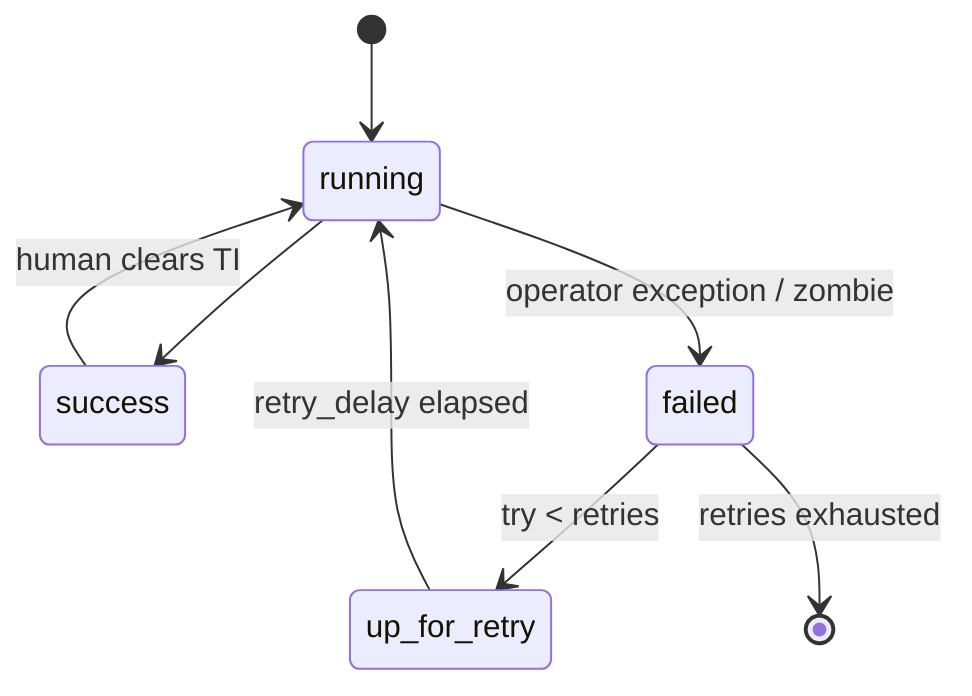

# Idempotency in Airflow Pipelines

Task 4 of 25 failed after writing 40% of yesterday's orders. Airflow retries it. If the write is an append, you now have 140% of yesterday. If the retry is a partition overwrite, you have 100% and a story you can tell in standup.

Idempotency is the single most important property of a production data pipeline. A pipeline is idempotent if running it twice for the same time period produces the same result as running it once.

Airflow will retry. Humans will clear TIs. Backfills will replay `ds`. The scheduler assumes that is safe. Only your write path can make it true.

---

## Use Case

**SaaS analytics.** Daily `metrics` table partitioned by `dt`. A Spark job fails at 90%. Retry must not double MRR.

**E-commerce CDC.** Hudi/Iceberg upserts by `order_id`. Re-running the same Kafka offsets must not resurrect deleted orders or drop later statuses. Precombine / merge-on-key is the idempotency story — see [Hudi](../lakehouse/hudi.md) and [Iceberg](../lakehouse/iceberg.md).

**Observability.** Compaction rewrites small files. Running compaction twice must not drop live snapshots or vacuum files a reader still holds.

The common thread: **the data interval (`{{ ds }}`) is the idempotency key**, not "the current time."

---

## Why It Matters

Things that go wrong in production:

- A task fails halfway through a write
- You deploy a bug fix and need to reprocess last month
- A source system sends duplicate data
- You manually trigger a backfill after a monitoring outage
- Celery visibility timeout runs the same TI on two workers
- `catchup` replays 90 days you already loaded

In every case, you need to be able to re-run the pipeline and get a correct result. Without idempotency, re-running creates duplicates, mixed data, or incorrect aggregations.

Retries without idempotency are a data-corruption feature.

---

## Intuition

A function `f` is idempotent if `f(x) = f(f(x))`. For pipelines:

```
load(ds=2024-01-15); load(ds=2024-01-15)  ==  load(ds=2024-01-15) once
```

Not:

```
append(rows); append(rows)  ==  2× rows
now() as partition; now() as partition  ==  two different folders
```

**Reads** should be addressed by `ds`. **Writes** should replace the unit of data for that `ds` (partition, day slice, merge key set), not "whatever is in the table."

Airflow's job is to call `load(ds)` again. Your job is to make `load` a replace/merge.

---

## Internals: What Airflow Actually Repeats



Each arrow into `running` is a full operator invoke with the **same** `logical_date`. Airflow does not undo S3 objects, Kafka offsets, or `INSERT`s.

| Mechanism | Same `ds`? | Danger if append |
|-----------|------------|------------------|
| `retries` | Yes | Duplicate slice |
| Clear task | Yes | Duplicate slice |
| Backfill | Yes per day | Duplicate all days |
| Two workers, one TI | Yes, concurrent | Duplicate or torn write |
| `catchup` | Yes per missed interval | Historical duplicates |

Concurrent double-run is why `max_active_runs=1` and table-format optimistic concurrency matter. Overwrite of the same partition from two jobs is still a race unless the table format commits atomically ([lakehouse](../lakehouse/why-table-formats.md)).

---

## The Non-Idempotent Pipeline

```python
def load_events(date, **context):
    df = spark.read.parquet(f"s3://events/dt={date}/")
    # WRONG: appending to a table that already has today's data
    df.write.mode("append").parquet(f"s3://output/events/")
```

If this task fails and retries, you get duplicate data for `date`.

Worse sibling: Spark inside a `PythonOperator` looping rows and `INSERT`ing each one. Half-loop + retry = duplicates plus a worker that thought it was a database.

---

## Making Writes Idempotent

**Pattern 1: Overwrite the partition**

```python
def load_events(date, **context):
    df = spark.read.parquet(f"s3://events/dt={date}/")
    # Overwrite only this partition, not the entire table
    df.write \
      .mode("overwrite") \
      .option("partitionOverwriteMode", "dynamic") \
      .partitionBy("dt") \
      .parquet("s3://output/events/")
```

Running this twice for the same `date` produces the same result. The partition is replaced, not appended to.

On Iceberg/Delta, prefer a table commit:

```sql
DELETE FROM lake.events WHERE dt = '{{ ds }}';
-- or INSERT OVERWRITE PARTITION
INSERT INTO lake.events
SELECT * FROM staged_events WHERE dt = '{{ ds }}';
```

Iceberg snapshot commit makes the swap atomic for readers. Raw Parquet overwrite is *not* atomic: readers can see a deleted directory mid-job. That is why table formats exist.

**Pattern 2: Delete then insert (for databases)**

```python
def load_events(date, **context):
    conn.execute(f"DELETE FROM events WHERE dt = '{date}'")
    # Now safe to insert — no duplicates possible
    insert_rows(df, table="events")
```

!!! production-gotcha "DELETE then INSERT is two transactions unless you wrap it"
    Crash after DELETE, before INSERT: the day is gone. Downstream DAG may still "succeed" on empty. Use one transaction, a staging table + swap, or `INSERT ... ON CONFLICT`. Always validate row counts after load.

**Pattern 3: MERGE / UPSERT**

For tables that need updates (CDC targets):

```sql
MERGE INTO target t
USING source s ON (t.id = s.id AND t.dt = '{{ ds }}')
WHEN MATCHED THEN UPDATE SET *
WHEN NOT MATCHED THEN INSERT *
```

Hudi `upsert` with record key + precombine is this pattern as a table type. Re-reading the same CDC batch must pick the latest `updated_at`, not concatenate versions.

**Pattern 4: Immutable landing + publish**

Write `s3://out/dt=DS/run_id=TRY/` then atomically copy a `_SUCCESS` or swap a Hive/Iceberg snapshot. Retries write a new `run_id`; publish points at the winner. Useful when overwrite of a hot partition is too disruptive.

---

## Idempotent Aggregations

Avoid:
```python
# NOT idempotent: adds to existing counts
UPDATE daily_stats SET event_count = event_count + :new_count
WHERE dt = :date
```

Use instead:
```python
# Idempotent: replaces the computed value
INSERT INTO daily_stats (dt, event_count)
VALUES (:date, :computed_count)
ON CONFLICT (dt) DO UPDATE SET event_count = EXCLUDED.event_count
```

Recompute the day from source, do not increment. Increment is only valid if you have a strictly-once offset store *and* you never backfill. You will backfill.

---

## The Execution Date Convention

Airflow's execution date convention supports idempotent backfills:

```python
def process(**context):
    date = context["ds"]  # Always the same value for the same DAG run
    source_path = f"s3://events/dt={date}/"
    output_path = f"s3://output/events/dt={date}/"
    # Read from fixed input, write to fixed output
    # Running twice → same result
```

The execution date is fixed per DAG run. If you trigger a backfill for January 15, every task in that run sees `ds = "2024-01-15"` regardless of when it actually executes.

That is the whole trick. `{{ ds }}` is a pure key. `datetime.now()` is not.

---

## How: A Retry-Safe Daily Load

```python
def publish_metrics(ds: str, **_):
    spark = get_spark()  # inside the Spark job, not the Airflow worker
    metrics = spark.read.table("lake.events").where(f"dt = '{ds}'").groupBy("tenant").count()
    metrics = metrics.withColumn("dt", lit(ds))
    (
        metrics.writeTo("lake.daily_metrics")
        .overwritePartitions()   # Iceberg: only dt=ds
    )
    n = spark.table("lake.daily_metrics").where(f"dt='{ds}'").count()
    if n == 0:
        raise ValueError(f"empty publish for {ds}")
```

Airflow side: `SparkSubmitOperator(..., application_args=["--date", "{{ ds }}"], retries=3)`. Validate task fails the DAG if empty. Quality is part of idempotency: a successful empty overwrite is "idempotent" and still wrong.

---

## Testing Idempotency

Before deploying a pipeline to production, test it:

1. Run the pipeline for a date
2. Check the output row count: `COUNT(*)`
3. Run the pipeline again for the same date
4. Check the output row count again

If the row count is the same both times, the pipeline is idempotent. If it doubled, it is not.

Also test:

5. Kill the job at 50% (send SIGTERM to the Spark driver), retry, compare checksums.
6. Run two publishes concurrently for the same `ds` if you ever allow `max_active_runs>1`.
7. Backfill three days out of order; day-independent partitions should not care.

---

## Common Violations

**Reading from `current_date()`** instead of execution date:
```python
# WRONG: produces different results depending on when it runs
df.filter(df.dt == current_date())

# RIGHT: uses fixed execution date
df.filter(df.dt == execution_date)
```

**Writing to paths without date partitions**:
```python
# WRONG: second run overwrites different data
write_to("s3://output/latest/")

# RIGHT: deterministic output path per run
write_to(f"s3://output/dt={execution_date}/")
```

**Incrementing counters in place**:
```python
# WRONG: not idempotent
UPDATE stats SET count = count + 1 WHERE user_id = ?
```

**Kafka `commit` in the operator.** Retry re-reads or skips depending on commit timing. Prefer batch jobs that read `ds`-partitioned dumps; if you must consume Kafka from Airflow, store offsets *with* the output commit (transactional sink / Iceberg snapshot).

**Non-idempotent side effects:** sending the same invoice email on every retry. Gate side effects on "state changed" or use an idempotency key in the downstream API.

---

## Gotchas

- **`overwrite` of the whole table** when you meant one partition. Backfill of `ds=2024-01-01` wipes the year. Use dynamic partition overwrite or `DELETE WHERE dt=`.
- **Late-arriving CDC + overwrite of the day** wipes updates that landed in an hourly job. Mixed schedules need merge, not daily replace, or a single owner per partition.
- **Floating `LIMIT` / `SAMPLE`.** Not deterministic; retries "succeed" with different rows.
- **UUID primary keys generated in the job.** Retry inserts new identities. Derive IDs from source keys.
- **XCom row lists.** Retry pushes again; downstream duplicates. Push a path.

---

## Failure Modes

| Event | Non-idempotent result | Idempotent result |
|-------|----------------------|-------------------|
| Retry after 40% write | 140% rows | 100% rows |
| Clear success TI | 200% rows | 100% rows |
| Backfill | N copies | 1 copy |
| Concurrent DAG runs | Torn partition | One snapshot wins or one waits |
| Empty source | DELETE left table empty, DAG green | Validate fails the DAG |

Debugging duplicates almost always starts with `COUNT(*) GROUP BY dt` and `MAX(inserted_at) - MIN(inserted_at)` per day.

---

## Debugging

```sql
SELECT dt, COUNT(*) AS n, COUNT(DISTINCT event_id) AS u
FROM events
WHERE dt BETWEEN '2024-01-01' AND '2024-01-07'
GROUP BY dt
HAVING COUNT(*) <> COUNT(DISTINCT event_id);
```

Then correlate with Airflow: try number > 1, cleared TIs, overlapping `start_date` of two DagRuns. Object storage listing: extra part files after retry often means append.

If using Iceberg, compare snapshots: two commits for the same `ds` close together is a retry. Time-travel the snapshot before the retry to see the partial write that readers should never have seen — if they did, you were on raw Parquet.

---

## Scale: 10× / 100× / 1000×

| Scale | Idempotency pressure |
|-------|----------------------|
| **10×** | Retries rare; a duplicate day is a support ticket. Partition overwrite is enough. |
| **100×** | Backfills weekly. Concurrent writers. You need table-format commits and `max_active_runs`. |
| **1000×** | Continuous CDC + hourly batch + GDPR deletes. Overwrite-by-day fights upserts. One writer model per table, MERGE, snapshot isolation, compaction separate from publish. |

At 1000×, "just overwrite the lake" is too slow (rewrite 10 TB) and too wide (kills concurrent readers). Idempotency becomes *small atomic commits* (Iceberg snapshots, Delta versions, Hudi instants), not full-table replace.

---

## Trade-offs

| Pattern | Safe retry | Cost |
|---------|------------|------|
| Partition overwrite | Yes | Rewrite day's files |
| DELETE+INSERT | Yes if transactional | Empty window; warehouse locks |
| MERGE | Yes for CDC | Compute; need keys |
| Append + dedup view | Reads pay merge | Easy to forget the view |
| Exactly-once stream | Yes if sink supports | Operational complexity |

Airflow retries are **at-least-once**. Exactly-once is a property of the sink, not of the scheduler.

---

## Alternatives

- **Workflow engines with compensation** (Temporal): undo steps. Rarely maps to S3 rewrites.
- **Databases as the system of record** with transactional ETL: good for small data; not 1 TB pandas.
- **Streaming only (Flink exactly-once sinks):** no daily `ds` overwrite; still need idempotent batch backfills for corrections.
- **Manual "delete the day then run"** runbooks: this *is* the DELETE+INSERT pattern; automate it.

---

## How to Apply This at Work

When reviewing a DAG:

1. For each write, ask "what is the grain?" (`dt`, `order_id`, snapshot).
2. Force a retry in staging. Diff counts.
3. Ban `current_date()` in Spark jobs launched from Airflow.
4. Put a `COUNT(*)` gate after every publish.
5. If the task is not idempotent, **retries must be 0** and you must say that out loud — then go make it idempotent anyway.

---

## Exercise

`load_orders` DELETE+INSERT for `dt={{ ds }}` in two statements, autocommit on. `retries=5`. Spark job (correctly outside Airflow) writes to `s3://stg/dt={{ ds }}/` with overwrite, then the PythonOperator copies files into the warehouse with `COPY`. A worker OOM hits during `COPY`.

??? question "What is the table state after retries succeed, and how do you fix the operator without processing 1 TB in Airflow?"
    Track transactions and which process holds the data.

    ??? success "Answer"
        First DELETE committed; COPY died; retry DELETE on a half-loaded day then COPY again — you may land correct *or* empty-if-COPY reads a non-overwritten stage. Worse: overlapping retries. Fix: Spark (or the warehouse) should `INSERT OVERWRITE` / Iceberg `overwritePartitions` directly from `s3://stg/dt=ds/` in **one atomic commit**. Airflow only SparkSubmits and validates counts. Staging overwrite is already idempotent; the warehouse load must be one transaction, not DELETE then COPY from a Python worker.
