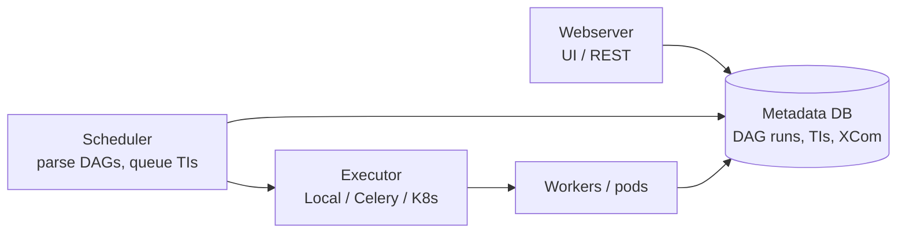

# Apache Airflow

!!! info "Version and source policy"
    Executor and scheduler behavior changes across releases. Check [Versions & Primary Sources](../reference/version-matrix.md) before production use.

3:47 AM. Step 4 of a 25-task nightly pipeline throws an exception after writing 40% of a partition. Steps 5 through 8 already started — on the partial data. In the incident channel, nobody can say, without opening five different cron logs, which of the 25 jobs actually ran, which are still queued, and which touched today's partition twice.

What's actually missing here?

A. More retries.
B. A bigger cron box.
C. A system of record for which task ran, for which data interval, with which outcome.
D. More logging.

Predict before reading on — then see how precisely the next section states the problem.

## The Problem

Your data pipeline contains 25 dependent jobs:

1. Extract orders from PostgreSQL
2. Extract payments from Stripe API
3. Extract user events from Kafka
4. Join orders and payments
5. Enrich with user data
6. Compute daily metrics
7. Load to data warehouse
8. Trigger downstream reports
9. ...and 17 more

How do you coordinate them reliably? What happens when step 4 fails? How do you rerun steps 5–8 after fixing the bug in step 4? How do you know which step is currently running?

That is the problem Airflow exists to solve. It is not "a Python scheduler." It is a system of record for *which work ran, for which data interval, with which outcome*.

!!! note "This is SaaSCo at Stage 5"
    [SaaSCo: The Evolving Company](../architectures/saasco-evolution.md#stage-5-100-workflows-airflow-appears-phase-5) hits this wall once the batch DAG, the CDC pipeline, a Flink job, and a pile of one-off cron scripts cross into the hundreds of workflows: nobody can say which one ran, in what order, or on what data, until dependency-aware scheduling replaces "eyeball the crontab."

---

## Running Systems

Three production shapes appear throughout this module.

**SaaS analytics.** Nightly warehouse load: extract product events, join billing, compute per-tenant metrics, publish dashboards. Twenty-plus tasks, one logical day, a 07:00 SLA.

**E-commerce CDC.** Debezium writes order and payment changes to Kafka. Airflow does *not* consume the stream. It kicks Flink/Spark jobs, waits for a `_SUCCESS` object, then runs dbt and quality checks.

**Observability.** Hourly compaction of Iceberg log tables, snapshot expiration, and partition stats. The work is maintenance, not "processing 5 million events/sec inside a PythonOperator."

If a DAG is reading 1 TB into pandas, you have the wrong system doing the work.

---

## Orchestration Is Not Data Processing

Before going further, understand this distinction:

**Orchestration**: scheduling, coordinating, monitoring, and retrying jobs.

**Data processing**: actually reading, transforming, and writing data.

Airflow is an orchestrator. It should schedule Spark jobs, trigger dbt models, call APIs, and monitor outcomes. It should not itself process a 1 TB dataset by reading it into a Python function.

When Airflow is used to process data directly — reading a CSV in Python, transforming it with pandas — the bottleneck is the single Airflow worker executing that code. This is a common and expensive antipattern.

**Use Airflow to run Spark. Don't use Airflow as Spark.**

```python
# WRONG — Airflow worker is the compute engine
def process_day(**context):
    df = pd.read_parquet("s3://events/dt={{ ds }}/")  # 1 TB
    for _, row in df.iterrows():                      # serial Python
        ...

# RIGHT — Airflow submits work; Spark/Databricks is the compute engine
SparkSubmitOperator(
    task_id="process_day",
    application="/opt/spark_jobs/process_events.py",
    application_args=["--date", "{{ ds }}"],
)
```

The rest of this module is how to make that distinction hold under retries, backfills, and 10× DAG count.

---

## The Control Plane

Airflow is four cooperating processes plus a database. Tasks never "just run."



| Component | Job |
|-----------|-----|
| **Scheduler** | Parse DAG files, decide which task instances (TIs) are runnable, persist state, hand work to the executor |
| **Executor** | Policy for *where* a TI runs: local process, Celery worker, Kubernetes pod |
| **Workers** | Execute operator code. Must be stateless with respect to other tasks |
| **Metadata DB** | Source of truth: DAG runs, TI states, XCom, connections, pools. Postgres in production, never SQLite |
| **Webserver** | Humans and APIs. Must not be the scheduler |

If the metadata DB is slow, *everything* is slow. Scheduler heartbeat, TI state transitions, and the UI all contend for the same rows.

Details live in [Executors](executors.md). DAG shape lives in [DAGs](dags.md). Retry safety lives in [Idempotency](idempotency.md). Incidents live in [Gotchas](gotchas.md).

---

## Core Concepts

### DAGs

A **DAG** (Directed Acyclic Graph) defines a workflow: tasks and their dependencies.

```python
from airflow import DAG
from airflow.operators.bash import BashOperator
from airflow.providers.apache.spark.operators.spark_submit import SparkSubmitOperator
from datetime import datetime, timedelta

with DAG(
    'daily_analytics',
    start_date=datetime(2024, 1, 1),
    schedule_interval='@daily',
    default_args={'retries': 3, 'retry_delay': timedelta(minutes=5)},
    catchup=False
) as dag:

    extract_orders = BashOperator(
        task_id='extract_orders',
        bash_command='python /opt/scripts/extract_orders.py --date {{ ds }}'
    )

    process_events = SparkSubmitOperator(
        task_id='process_events',
        application='/opt/spark_jobs/process_events.py',
        conf={'spark.executor.memory': '4g'}
    )

    compute_metrics = SparkSubmitOperator(
        task_id='compute_metrics',
        application='/opt/spark_jobs/compute_metrics.py'
    )

    # Dependencies
    extract_orders >> process_events >> compute_metrics
```

A DAG is *not* a Spark DAG. Airflow's graph is task-level. Spark's graph is operator-level inside one job. Mixing the two granularities — fifty Airflow tasks that each run one `SELECT` — produces a scheduler tax with no extra reliability.

### Schedulers and executors

**Scheduler**: reads DAG definitions, determines which tasks are ready to run (dependencies met, schedule time reached), and sends them to the executor.

**Executors** determine where tasks run:

| Executor | How Tasks Run | Use Case |
|----------|--------------|----------|
| SequentialExecutor | One at a time in the scheduler process | Development only |
| LocalExecutor | Multiple processes on one machine | Small-scale production |
| CeleryExecutor | Distributed across multiple worker machines | Medium-large scale |
| KubernetesExecutor | Each task in a new Kubernetes pod | Cloud-native, isolation |

---

## Idempotency, Catchup, Backfills

Airflow tasks should be **idempotent**: running the same task twice produces the same result.

Why: tasks can be retried automatically. If a task is not idempotent, a retry may corrupt data (e.g., double-counting rows).

**Non-idempotent** (avoid):
```python
# Appends regardless of whether today's data already exists
df.write.mode("append").parquet(f"s3://data/events/date={execution_date}")
```

**Idempotent** (prefer):
```python
# Overwrites — safe to rerun
df.write.mode("overwrite").parquet(f"s3://data/events/date={execution_date}")
```

When you deploy a new DAG or fix a bug in an existing one, you often need to reprocess historical dates. This is a **backfill**.

```bash
airflow dags backfill daily_analytics \
  --start-date 2024-01-01 \
  --end-date 2024-01-15
```

!!! production-gotcha "Catchup is a load test you did not schedule"
    A new DAG with `catchup=True` (historically the default) and a start date two years ago queues ~730 DAG runs. Backfills also run in parallel unless you cap `max_active_runs`. Ninety days × a Spark job is a cluster incident, not a convenience.

---

## Sensors, Pools, Mapping, SLAs, Assets

**Sensors wait.** In `poke` mode they occupy a worker slot for the entire wait. At tens of DAGs they become deadlock machines: every worker is poking, nothing that could *produce* the file can start. Use `reschedule`, timeouts, and [pools](dags.md) so waiting cannot starve work.

**Dynamic task mapping** expands one task into N mapped TIs at runtime (`expand`). Good for "one Spark job per tenant that landed today." Bad for "one TI per row."

**Pools** are named concurrency tokens. Put Stripe API calls in a pool of size 4. Put the warehouse load in a pool of size 1 if two loads cannot share a table.

**SLAs** are "this TI should have succeeded by T." They are not substitutes for monitoring. An SLA miss without a pager is a log line.

**Data-aware scheduling** (**Assets** in Airflow 3.x — the same idea was called **Datasets** in Airflow 2.x) is the conceptual replacement for "DAG B cron is 30 minutes after DAG A." A downstream DAG starts when an upstream asset is updated, not when a clock fires. Treat it as an event, still with idempotent writers. Orchestration triggers generally fall into four flavors: **clock-driven** (cron), **dependency-driven** (DAG B waits on DAG A's task), **data-state-driven** (Assets — DAG B waits on data actually landing), and **event-driven** (a message or webhook fires the run). Most production orchestration is a mix, and it is worth naming which one you are actually using before debugging "why did this run early/late."

```text
OLD MODEL (schedule-driven)          NEW MODEL (asset/dependency-driven)

02:00 ─▶ Run DAG A                   orders_ready
02:30 ─▶ Run DAG B (guessed gap)          │
03:00 ─▶ Run DAG C (guessed gap)          ▼
                                     customer_ready ──▶ revenue_model
The 30-minute gaps are a bet on      DAG C starts the moment the asset
how long upstream usually takes.     it depends on is actually updated —
When A runs long, B starts on        not 30 minutes after a guess. Late
stale data anyway.                   or early A still triggers B correctly.
```

This is a genuine architectural shift, not Airflow trivia: orchestration around **data state** rather than only clock time. A downstream Airflow 3.x `@asset` consumer, a dbt model with a fresh-data check, and a Kafka consumer are all instances of the same idea — react to state changing, not to a clock you hope matches reality. It composes with the mechanisms above: dynamic task mapping still expands per-tenant work, deferrable operators still free a worker slot while waiting, and idempotent writers are still required because an asset can update twice.

---

## What This Module Covers

| Topic | What you will be able to do |
|-------|-----------------------------|
| [DAGs](dags.md) | Shape a 25-task pipeline: granularity, mapping, sensors, pools, SLAs |
| [Executors](executors.md) | Choose Local vs Celery vs Kubernetes and tune concurrency |
| [Idempotency](idempotency.md) | Make retries and backfills safe at the write path |
| [Gotchas](gotchas.md) | Recognise scheduler, sensor, XCom, and catchup incidents before they page |

---

## Common Gotchas (preview)

### DAGs that are too fine-grained

Breaking a Spark job into 50 Airflow tasks (one per transformation) adds no value and makes debugging harder. Airflow tasks should represent meaningful units of work — not individual SQL statements.

### Using Airflow for data processing

```python
# ANTIPATTERN: Airflow worker processing 1 TB of data
def process_big_data(**context):
    df = pd.read_csv("s3://events/1TB.csv")  # Memory explosion
    ...
```

### Unbounded catchup

A new DAG with `catchup=True` and a start date 2 years ago triggers 730 DAG runs immediately. Set `catchup=False` unless you explicitly want historical backfill.

### Sensor poke mode at scale

`FileSensor`, `ExternalTaskSensor` and others in poke mode occupy a worker slot while waiting. With many sensors, you exhaust worker capacity. Use `reschedule` mode instead.

---

## How to Apply This at Work

When reviewing or designing a pipeline:

1. Is Airflow orchestrating compute engines (Spark, dbt, etc.) or executing data processing itself?
2. Are tasks idempotent — safe to retry?
3. Is `catchup` configured intentionally?
4. Are retries configured with appropriate backoff?
5. Are SLAs monitored?
6. Is there a sensible task granularity (not too fine, not monolithic)?
7. Can a sensor deadlock the executor (poke + no pool)?
8. Would a 90-day backfill take down the warehouse?

If you cannot answer those, you cannot operate the DAG.

---

## Check your understanding { #exercise }

A SaaS analytics DAG starts at 02:00 UTC. Task `spark_metrics` submits a Spark job. Task `wait_stripe` is an `HttpSensor` in poke mode with a 6-hour timeout. There are 12 Celery workers, concurrency 1 each. Twelve tenants each have this DAG.

??? question "What fails first on a Stripe outage, and what is the smallest fix?"
    Think in worker slots, not in "the sensor is waiting."

    ??? success "Answer"
        All 12 workers sit in `wait_stripe` poke loops. `spark_metrics` never starts even for tenants whose Stripe data already landed. The DAG looks "running" in the UI; the Spark cluster is idle. Smallest fix: `mode="reschedule"`, a dedicated sensor pool of size 2, and a timeout that fails the wait instead of occupying the fleet. The Spark task must not live *behind* an unbounded poke.
