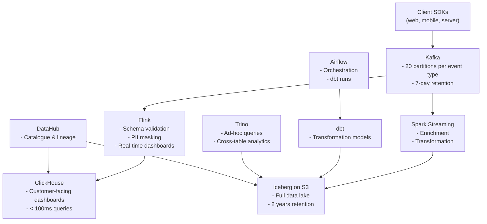

# SaaS Analytics Platform Architecture

## Requirements

- **Users**: millions generating product events
- **Customers**: multi-tenant (each SaaS customer sees only their data)
- **Features**: event collection, streaming, warehouse, dashboards, ad-hoc querying, retention
- **Scale target**: 100K events/sec ingestion, 1 TB/day

---

## Full-Stack Architecture

---

## Multi-Tenancy

Each customer's data must be isolated. Options:

**Row-level security**: all data in shared tables, filtered by `customer_id`. Simple, cost-effective but relies on application-level filtering.

**Separate tables per customer**: complete isolation but operational complexity at scale (10K customers = 10K tables).

**Separate schemas per customer**: middle ground in PostgreSQL/Trino.

For ClickHouse dashboards: row-level security is standard — add `customer_id` to all queries and trust the application layer. Use TTL to expire old customer data per retention agreement.

---

## Cost Engineering

At 1 TB/day ingested:
- Kafka (7-day retention): ~7 TB on disk (before replication) → ~$500/month (managed)
- ClickHouse (hot, 30 days): ~30 TB → ~$1,500/month
- Iceberg on S3 (2 years): ~730 TB → ~$17/TB/month = ~$12,000/month (but compressible)
- Flink/Spark compute: $2,000–5,000/month
- Airflow: minimal

Total: ~$20,000–30,000/month for the full stack at 1 TB/day.

At 10 TB/day, costs scale roughly linearly but with some economies of scale.
