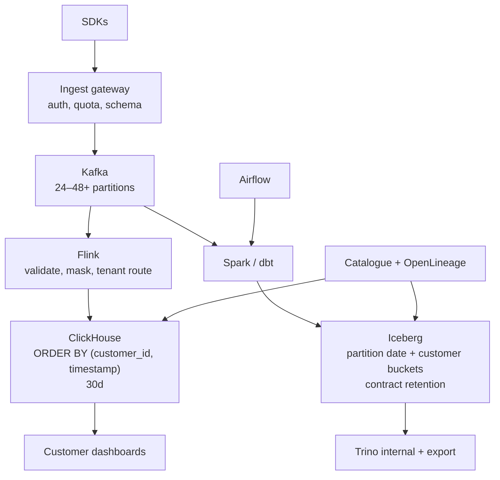

# SaaS Analytics Platform Architecture

A support ticket comes in: customer A's dashboard briefly showed a spike in `api-gateway` traffic that, on inspection, belonged to customer B. Nobody wrote a cross-tenant query on purpose — a noisy tenant's burst just happened to land in the same query window as a smaller tenant's aggregate. Predict before you read on: is this a Kafka partitioning bug, a ClickHouse `ORDER BY`/query problem, or a symptom of not treating tenancy as a first-class requirement at every layer?

It's the third one, and it recurs at every layer if you let it: you ingest product events from **your customers' users**, and each customer expects dashboards that look like a single-tenant product. The dominant constraints are **multi-tenancy, cost, and not mixing tenants** — not "can Kafka take 100k/s" (it can).

This is the running "System A" event shape used in labs. Related: [observability](observability.md) (similar ingest, different tenant model), [security](../security/index.md), [metadata](../metadata/index.md), [ClickHouse vs Trino](../comparisons/clickhouse-vs-trino.md).

---

## Requirements

| Axis | Target |
|------|--------|
| **Volume** | 100k events/s, ~1 TB/day uncompressed. 10× = 1M/s, ~10 TB/day. |
| **Latency** | Customer dashboards: **< 100–300 ms** on the last 7–30 days. Internal analytics: minutes–hours. |
| **Access** | Tenant-filtered aggregates (`WHERE customer_id = ?`). Internal: cross-tenant **ops** only, tightly controlled. |
| **Retention** | Per contract: 30–90 days "product," 1–2 years lake. Hot CH must not hold 2 years of raw. |
| **Cost** | This product's margin **is** the pipeline. Waste shows up as COGS. |
| **Failure** | Tenant A cannot see tenant B. A noisy tenant cannot take down ingest for everyone. Replay a bad transform without double-counting dashboards. |

Event (canonical):

```json
{
  "timestamp": "2024-01-15T10:30:00Z",
  "customer_id": "cust_0042",
  "user_id": "user_98712",
  "service": "api-gateway",
  "endpoint": "/v2/events",
  "region": "eu-west-1",
  "latency_ms": 45,
  "status_code": 200,
  "bytes": 1024
}
```

---

## Capacity sketch (100k events/s, 500 B)

1e5 × 500 × 86400 ≈ **4.3 TB/day** uncompressed.

| Layer | Sketch | Monthly $ (order of mag.) |
|-------|--------|---------------------------|
| Kafka 7 d, ~4× compress, RF=3 | 4.3/4 × 3 × 7 ≈ **~22 TB** disk | Hundreds–low thousands managed |
| ClickHouse 30 d, ~10× | 4.3/10 × 30 ≈ **13 TB** | ~$1–3k class if you are careful |
| Iceberg 2 y | 4.3 × 730 ≈ **3 PB raw** — **you will not store raw 2y** | Roll up, compress Parquet, expire; budget **hundreds of TB** not PB |
| Flink/Spark | parse + agg | $2–8k |
| If you keep 7 d Kafka **and** 30 d raw CH **and** 2 y raw S3 | COGS explosion | Don't |

Partitions: 100k/s / ~5k/s ≈ 20; use **24–48** on `events`. Key = `customer_id` for tenant-local processing — **and** plan the hot-tenant story (one customer = 40% of traffic).

---

## V1 — fewest parts (one tenant-aware serving table)

```
SDKs → Kafka (24–48 partitions, key=customer_id, 2–3 d retention in V1)
    → Flink or Spark Structured Streaming (schema, PII strip)
    → ClickHouse (customer_id in ORDER BY, 14–30 d TTL)
    → customer UI (every query forced through tenant filter)
```

Internal analysts: **SQL on ClickHouse with row policy**, or nightly export to Iceberg if you already have a lake. V1 can skip Trino.

### What V1 includes

- Schema registry; reject or DLQ unknown required fields.
- PII policy: do not land emails in CH if the product does not need them.
- `customer_id` on **every** row, metric, log, and trace of the pipeline.
- Quotas: max events/s per tenant (SDK + gateway).
- Kafka retention as replay, not product history.

### What you would **not** add yet

- Per-customer Kafka clusters / CH databases (at 10k customers this is an ops career)
- Trino + Iceberg before a customer asked for "export my data / 2 year SQL"
- JupyterHub with SELECT on the raw table for all staff ([notebooks](../notebooks/index.md))
- Pinot
- dbt on ClickHouse **and** Spark **and** a third warehouse copying the same facts

### This architecture works while… / breaks when… { #v1-limits }

**Works while:**

```text
every query is tenant-scoped and customer_id leads the ORDER BY
product questions fit a 14–30 day window
one shared ClickHouse cluster absorbs all tenants without a whale starving the rest
Kafka retention is a replay buffer, not the product's history
PII stays out of the serving store because the product does not need it
```

**Breaks when:**

```text
a customer asks for "export my data" or two years of SQL — that is a lakehouse
   requirement, and it will not be satisfied by raising the TTL
one tenant is large enough to dominate a shard or a partition, and per-tenant
   quotas at the gateway stop being sufficient isolation
hot-storage cost per tenant exceeds what the tier's price supports — the fix is a
   cost/retention decision, not a bigger cluster
data residency becomes a contractual requirement — "one global Kafka" is now
   a compliance problem, not an architecture preference
the number of customers makes per-customer anything (clusters, databases, DAGs)
   an operational impossibility rather than merely expensive
```

Only one of these is a scale problem. The rest are requirement changes — which is why the [cost engineering](#cost-engineering-the-real-architecture) and residency sections below are as load-bearing as the capacity sketch.

---

## Bottleneck at the end of V1

| Symptom | Cause | Wrong fix |
|---------|-------|-----------|
| One customer lags | Hot `customer_id` partition | More consumers |
| All tenants slow | CH `ORDER BY (timestamp, customer_id)` or too many parts | Bigger nodes only |
| Bill shock month 3 | Raw forever, JSON in CH, 7 d Kafka at RF=3 plus copies | "Negotiate cloud credits" |
| Cross-tenant leak | Query builder forgot `customer_id` | App-only filter without DB policy |
| SDK retry storm | 502 from your API | No backpressure, no quotas |

Hot tenant: compound key or dedicated partition **for that tenant**, not a global random key (that destroys locality for everyone else). See [Kafka hot partition incident](../incidents/index.md).

---

## V2 — lake, catalogue, honest cost



### Multi-tenancy options (pick one and enforce it twice)

| Pattern | When | Cost | Risk |
|---------|------|------|------|
| Shared tables + `customer_id` + **DB row policy** + app filter | Default | Lowest | One missed predicate |
| Separate CH database per **large** tenant | 1–N whales | Isolation | Ops |
| Separate Kafka cluster per **enterprise** | Contract / residency | High | Fan-out of everything else |

At 10k tenants, **shared table is V1 and V2**. Add row-level security in ClickHouse, not only in the API:

```sql
-- conceptual: every dashboard role is constrained
-- queries from the product user must set the tenant
-- never expose a SQL console to customers on the shared table
```

Physical layout:

```sql
CREATE TABLE product_events
(
    customer_id String,
    timestamp   DateTime64(3),
    user_id     String,
    service     LowCardinality(String),
    endpoint    LowCardinality(String),
    region      LowCardinality(String),
    latency_ms  UInt32,
    status_code UInt16,
    bytes       UInt32
)
ENGINE = MergeTree
PARTITION BY toYYYYMMDD(timestamp)
ORDER BY (customer_id, timestamp)
TTL timestamp + INTERVAL 30 DAY;
```

`ORDER BY (customer_id, timestamp)` matches tenant dashboards. `ORDER BY (timestamp, customer_id)` matches **your** global SRE view and **punishes** every customer query. Choose the product.

### Iceberg partitioning

`date` first (always), then bucket/hash `customer_id` so a tenant export does not list a million files — and so one tenant does not become one 5 TB file.

### Metadata as operations

Every dataset: owner, tenant-visibility, PII tags, freshness SLO. OpenLineage from Airflow/Spark. This is how you answer "why is customer 42's funnel empty." See [metadata](../metadata/index.md).

---

## Cost engineering (the real architecture)

At 1 TB/day **accepted** (after quotas):

| If you do this | Consequence |
|----------------|-------------|
| Store JSON blobs in CH | Compression and CPU die |
| 7 d Kafka + 90 d raw CH + 2 y raw S3 | You pay three times |
| Shuffle-heavy Spark every hour on raw | Compute > storage |
| 200 dashboards each scanning 30 d | CH CPU; pre-agg instead |
| No tenant quotas | One customer is your 10× event |

Pre-aggregate **product tiles** (events per endpoint per 1 min per customer) in Flink. Raw stays for "session replay" style features or not at all.

The existing back-of-envelope (~$20–30k/month full stack at 1 TB/day) is plausible **before** waste. 10 TB/day is not 10× if you roll up; it **is** 10× if you copy raw to every system.

---

## How it fails { #failure-modes }

| Failure | Symptom | Absorb with |
|---------|---------|-------------|
| Hot tenant | One partition lag, one CH hot range | Quotas; isolate whale; salt only that key |
| Schema poison | Parse failures, empty dashboards | DLQ + quality on count by tenant |
| RLS bypass | Support engineer `SELECT *` | Audit; masked views; no raw notebooks |
| Iceberg snapshot pile | Planning 10× | Expire; [incident](../incidents/index.md) |
| Trino wild join | Coordinator OOM | [incident](../incidents/index.md); no customer Trino on CH |
| Region pin (EU data) | Legal | Separate Kafka/CH/S3 in-region; do not "fix" with a column |

---

## What V2 still does not add

- A query engine **per customer**.
- Notebooks as the customer-facing product.
- Pinot unless QPS/freshness measurements say ClickHouse lost.
- Cross-tenant "benchmark you vs peers" without a legal and aggregation design.

---

## Evolution at 10× (1M events/s)

1. Quotas and SDK sampling **before** new brokers. 10× is often one tenant.
2. More partitions; **re-key whales**.
3. CH shards by `customer_id` hash so tenant queries stay on fewer nodes.
4. Regional buses for residency and latency.
5. More rollups; shorter raw TTL.
6. Dedicated isolation for 1–3 enterprise whales — still not 10k clusters.

---

## Decision table

| Decision | Choice | Why |
|----------|--------|-----|
| Ingest | Kafka + gateway quotas | Backpressure, replay, fan-out |
| Hot product UI | ClickHouse, tenant-first `ORDER BY` | <100 ms aggs |
| History / export | Iceberg + Trino | Cost, customer export |
| Processing | Flink for validate/agg; Spark/dbt for lake | SLA split |
| Isolation | Shared table + RLS + whale exceptions | Ops |
| Catalogue | OpenLineage + ownership | Empty-dashboard debug |

---

## Apply this at work

1. Put `customer_id` in the Kafka key, CH `ORDER BY`, Iceberg partition, and every metric.
2. Write a noisy-neighbour test: 40% traffic from one tenant. Watch lag.
3. Cap Kafka retention; cap CH TTL; **define** lake rollups before the first invoice.
4. Enforce tenant filters in the database, not only in React.
5. Price a "raw 2 years" SKU separately — it is a different architecture.

Labs: [Kafka hot partition](../labs/index.md), [ClickHouse ORDER BY](../labs/index.md), [simulations](../simulations/index.md). Incidents: Kafka lag, CH parts, Iceberg snapshots, Trino OOM.

---

## Ingest gateway (the real V1 security boundary)

SDKs should not speak Kafka on the internet.

| Check | Why |
|-------|-----|
| Customer API key → `customer_id` | Do not trust payload `customer_id` |
| Quota tokens /s | Noisy neighbour |
| Schema validate | DLQ vs 400 to SDK |
| Payload size cap | 10 MB "events" |
| PII strip | email/IP policy |
| Region pin | residency |

The gateway is where [security](../security/index.md) and [quality](../quality/index.md) start. Flink still validates — defense in depth.

---

## Product tiles vs raw

If the UI is 12 charts, **pre-compute** those 12 in Flink 1-minute keyed by `customer_id`. Raw in CH is for "explore this endpoint." Raw in Iceberg is for export SKU.

```sql
CREATE TABLE tiles_1m
(
    customer_id String,
    ts_minute   DateTime,
    endpoint    LowCardinality(String),
    events      UInt64,
    errors      UInt64,
    sum_latency UInt64
)
ENGINE = SummingMergeTree
PARTITION BY toYYYYMMDD(ts_minute)
ORDER BY (customer_id, endpoint, ts_minute)
TTL ts_minute + INTERVAL 90 DAY;
```

Dashboards that scan 30 days of raw `product_events` at 100k/s ingest will not stay <100 ms.

---

## Residency and "one global Kafka"

A `region` field on a US cluster is not GDPR. Options:

- Regional ingest + regional CH; global **aggregates** only (no PII) in HQ.
- Separate EU stack for EU keys (expensive, honest).

Trino cross-region joins of raw events are how you accidentally export the EU.

---

## Support engineer path

Support wants "this customer's events." Give a **tool** that sets `customer_id` from the ticket and queries a masked view. Do not give `clickhouse-client` as `default`. Audit the tool. This is cheaper than a breach.

---

## On-call 15 minutes

1. One tenant lagging: partition lag + produce bytes for that key — incident 1.
2. All tenants empty: ingest gateway 5xx or schema registry block.
3. One tenant empty, others fine: quota, API key, or quality drop for that id (z-score).
4. Slow UI: CH `ORDER BY` / parts / missing tile table.
5. Bill alert: Kafka retention or raw CH TTL extended "temporarily."

---

## Pricing the raw-retention SKU

| SKU | Architecture |
|-----|----------------|
| 30 d product analytics | CH 30 d + 1-min tiles 90 d |
| 2 y export | Iceberg rollups + Parquet; **not** CH raw 2 y |
| Replay debugger 7 d | extra CH/S3 raw sampled |

If sales sold "infinite raw" on the cheap tier, that is a **company** incident. Engineering cannot clickhouse-TTL their way out of a contract. Bring this table to product.

---

## Schema registry compatibility

Producers: **FORWARD** or **FULL** so old Flink can read new events (new optional fields). Breaking a required field is a versioned topic (`product-events-v2`) plus a dual-read window — not a Friday JSON change.

Quality: count `schema_id` parse fails per tenant. Silent drop of a whale looks like "their dashboard is broken" and pages you as a product bug.
