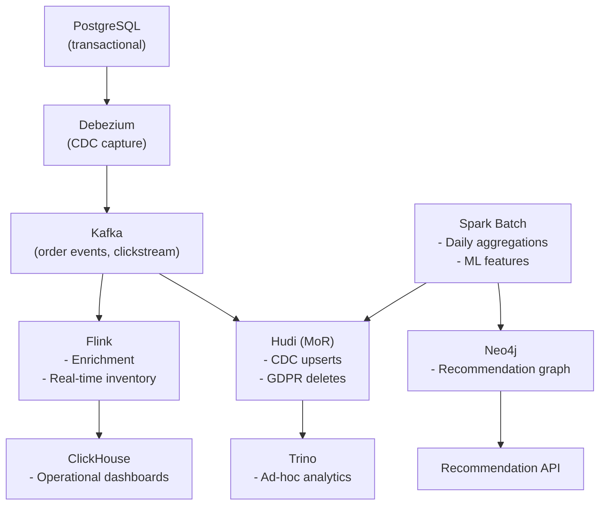

# E-Commerce Platform Architecture

## Requirements

- **Data**: Orders, Payments, Users, Inventory, Clickstream, Recommendations
- **CDC**: database changes must flow into the data platform in near-real-time
- **Use cases**: order analytics, recommendation engine, fraud detection, real-time inventory

---

## CDC Pipeline

PostgreSQL → Debezium → Kafka → Flink/Spark → Iceberg

```sql
-- Debezium captures every INSERT/UPDATE/DELETE from PostgreSQL
-- Kafka message for an order update:
{
  "before": {"order_id": "o001", "status": "PENDING"},
  "after": {"order_id": "o001", "status": "SHIPPED"},
  "op": "u",  -- update
  "ts_ms": 1705312800000
}
```

Flink processes CDC events to maintain materialised views:

```python
# Flink CDC processing
def handle_order_event(event):
    if event['op'] == 'c':  # create
        upsert_order(event['after'])
    elif event['op'] == 'u':  # update
        upsert_order(event['after'])
    elif event['op'] == 'd':  # delete
        mark_deleted(event['before']['order_id'])
```

---

## Architecture



---

## Why Hudi for CDC

Orders are frequently updated (status changes: PENDING → CONFIRMED → SHIPPED → DELIVERED). Hudi's MoR table absorbs these updates efficiently without rewriting entire files. Iceberg would work but requires more coordination for high-frequency upserts.

---

## Recommendation Graph

```cypher
// Co-purchase recommendations: products bought together
MATCH (u:User)-[:BOUGHT]->(p1:Product)
MATCH (u)-[:BOUGHT]->(p2:Product)
WHERE p1 <> p2
WITH p1, p2, count(u) as co_purchases
WHERE co_purchases > 100
MERGE (p1)-[:FREQUENTLY_BOUGHT_WITH {count: co_purchases}]->(p2)
```

Real-time: when user views product P, query Neo4j for top 5 co-purchased products.
