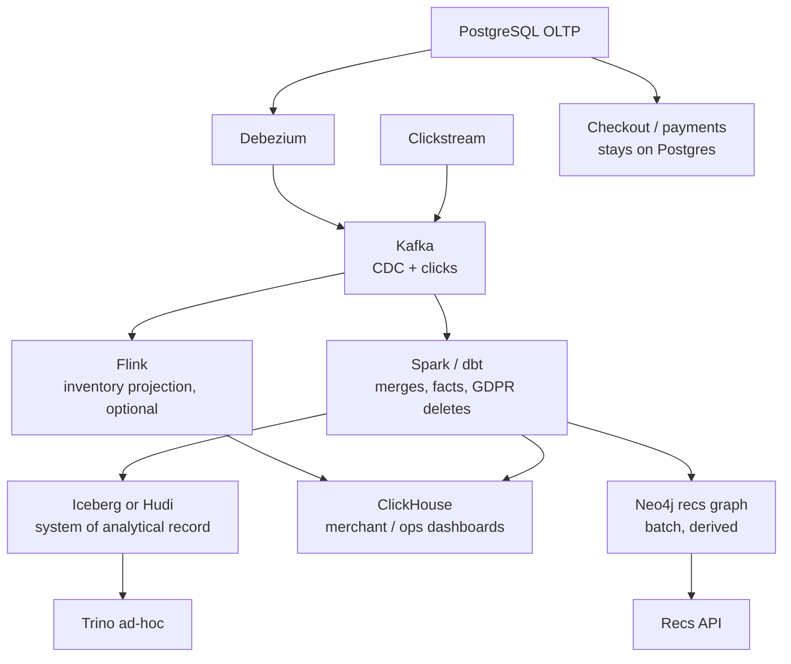

# E-Commerce Platform Architecture

A GDPR erasure request lands for a customer who checked out eleven months ago. Legal wants confirmation within 30 days that the record is gone from every system — not just Postgres. The on-call engineer opens the lakehouse and finds the customer's order rows sitting in twenty different Parquet files across as many partitions, written by a CDC pipeline that only ever appends. Predict before you read on: is this pipeline's *append-only* design a reasonable trade-off here, or is it the root cause of the incident?

It is the root cause: orders, payments, inventory, users, clickstream, and (later) recommendations all flow through this platform, and the dominant constraint is **correctness of mutable facts**, not dashboard milliseconds. An order goes `PENDING → PAID → SHIPPED → DELIVERED` and may be cancelled, refunded, or GDPR-erased. If your lake cannot upsert and delete, you do not have a commerce platform — you have a log of rumours.

Related: [lakehouse comparison](../lakehouse/comparison.md), [Kafka exactly-once](../kafka/exactly-once.md), [Airflow idempotency](../airflow/idempotency.md).

---

## Requirements

| Axis | Target |
|------|--------|
| **Volume** | Start: 50–200 orders/s peak, 2–10k clickstream events/s. 10×: 1k orders/s, 100k clicks/s. Facts are **small**; events are large. |
| **Latency** | Checkout path is **Postgres**, not the lake. Analytics: minutes to an hour is fine for "revenue today." Inventory *signals* for the website may need seconds. |
| **Access** | Operational: point-get order by id (OLTP). Analytics: joins orders×items×users. Inventory: current quantity per SKU. Recs: co-purchase (later). |
| **Retention** | Orders: years (legal). Clickstream: 90 days hot-ish, 1–2 years lake. CDC topics: long enough to rebuild the lake (days to weeks) plus compacted changelog if you need current state. |
| **Cost** | Do not put clickstream in Postgres. Do not put orders *only* in ClickHouse. |
| **Failure** | Duplicate CDC events must not double revenue. A replay must be idempotent. GDPR delete must reach lake + serving + search, not only prod Postgres. |

!!! danger "The lake is not the checkout database"
    If ClickHouse or Iceberg is on the purchase critical path, you have coupled conversion to compaction. Checkout stays OLTP (Postgres/MySQL). The data platform is a **derived** system.

---

## Capacity sketch (V1 commerce, not hyperscale)

Assume 100 orders/s peak, 5k click events/s, 800-byte clicks, 1.5 KB order CDC payloads.

| Stream | Events/s | GB/day uncompressed |
|--------|----------|---------------------|
| Order CDC | 100 (plus updates: ×3–8 row events ≈ 400/s) | 400 × 1.5 KB × 86400 ≈ **50 GB/day** |
| Clickstream | 5,000 × 800 B × 86400 | **~345 GB/day** |
| Inventory CDC | bursty, small | low tens of GB/day |

Kafka: **clickstream** dominates partitions and disk. Orders need **correctness** (`acks=all`, compacted topics for current order state optional).

Partitioning:

- `orders` CDC: key = `order_id` (all mutations for an order land in one partition — required for ordered upserts).
- `clicks`: key = `user_id` or `session_id`. Watch hot celebrities / bots.
- Target 12–48 partitions on clicks at 5k/s; 6–12 on orders.

Serving:

- Postgres: primary, sized for OLTP + CDC slot lag, **not** 90 days of clicks.
- Iceberg: 345 GB/day clicks × 90 d ≈ 30 TB raw, much less as Parquet.
- ClickHouse (if you add it): last 7–30 days of shop metrics, not the legal order archive.

---

## V1 — fewest parts

**Goal:** reliable analytics on orders + a clickstream lake. No recs, no real-time inventory microservice.

```
Postgres (orders, payments, users, stock)
    → Debezium
    → Kafka (CDC topics, keyed by PK)
    → Spark Structured Streaming or hourly Spark
    → Iceberg (or Hudi if updates are very frequent)
    → Trino (analyst SQL)

App clickstream
    → Kafka
    → same Spark job family
    → Iceberg partitioned by date
```

Orchestrate **batch** models with Airflow + dbt on Iceberg (or on a warehouse if you already have one). That is enough to answer "GMV yesterday" and "funnel by campaign."

### What V1 includes

- Debezium with a schema registry (Avro/Protobuf). JSON CDC without a registry will break on the first column add.
- Exactly-once or **idempotent** lake writes: merge on `order_id` + version/`ts_ms`, or Hudi upsert.
- Partition Iceberg clicks by `date`. Partition orders by `order_date` (business date, not ingest date).
- A **single** CDC pipeline owned by data engineering + DBA (slot lag is a prod incident).

### What you would **not** add yet

- Neo4j / GNN recs
- Flink (unless inventory-on-site is a launched product requirement)
- ClickHouse (unless a merchant dashboard has a sub-second SLA)
- Per-shop Kafka clusters
- Dual lakehouses (Iceberg *and* Hudi *and* Delta) "to evaluate"

!!! tip "Hudi vs Iceberg in V1"
    Orders **update**. Iceberg merge-on-read/copy-on-write can do this; Hudi MoR is purpose-built for high-frequency upserts. If update rate is "status changes a few times per order," Iceberg is simpler and matches Trino/Spark well. If you are merging **every** item-level change at high QPS into a huge fact table, look at Hudi. See [lakehouse comparison](../lakehouse/comparison.md). Do not pick Hudi because CDC exists — pick it because **upsert volume** exists.

---

## Bottleneck at the end of V1

| Symptom | Cause | Wrong fix |
|---------|-------|-----------|
| Debezium lag / WAL disk on Postgres | Slow sink or too much noise (update-heavy tables) | Bigger Kafka only |
| Revenue double-counts after a job retry | Append-only Parquet, not merge | "Exactly-once Kafka" without idempotent sink |
| Trino queries scan 30 TB clicks for one day | Missing partition predicate / wrong partition column | Bigger Trino cluster |
| GDPR ticket cannot finish | Deletes only in Postgres | Pretend the lake is ephemeral |
| Spark job OOMs on customer join | Skew: one wholesale buyer or one bot user | More executors |

CDC is a **load** on the primary. If you CDC the entire `users` table including columns you never query, you pay WAL and Kafka for nothing. Filter at Debezium.

The first *analytics* bottleneck is usually **clickstream volume + bad partitioning**, not order volume.

---

## V2 — when a real product needs derived serving

Add components only with a named consumer.



### Inventory (seconds)

If the storefront must not sell air:

- **V1.5:** read stock from Postgres (it is already correct). Cache with TTL if read-heavy.
- **V2:** Flink projects `sku → quantity` from CDC into Redis/Cassandra **or** a compact Kafka changelog. This is a **materialised view**, rebuildable from CDC.

Do not make ClickHouse the inventory lock.

### Merchant dashboards (sub-second)

Flink or Spark dumps **aggregates** (GMV per shop per minute) into ClickHouse. Raw orders stay in the lake + Postgres.

### Recommendations

Nightly (then hourly) Spark builds co-purchase edges into Neo4j. The recs API hits Neo4j; it is **not** on the checkout path. Rebuild from Iceberg if the graph is wrong.

```cypher
MATCH (u:User)-[:BOUGHT]->(p1:Product)
MATCH (u)-[:BOUGHT]->(p2:Product)
WHERE p1 <> p2
WITH p1, p2, count(u) AS co
WHERE co > 100
MERGE (p1)-[:FREQUENTLY_BOUGHT_WITH {count: co}]->(p2)
```

---

## CDC handling (the actual engineering)

Debezium payload (simplified):

```json
{
  "before": {"order_id": "o001", "status": "PENDING", "total": 49.00},
  "after":  {"order_id": "o001", "status": "SHIPPED", "total": 49.00},
  "op": "u",
  "ts_ms": 1705312800000
}
```

Rules:

1. **Key** Kafka records by primary key so a single-partition consumer can apply in order.
2. **Never** `INSERT` CDC updates into an append-only revenue table and `SUM(total)`.
3. Use `op` + version: `c/r` upsert, `u` upsert `after`, `d` delete or tombstone.
4. Snapshot + streaming: the initial Debezium snapshot will re-emit the world; sinks must be idempotent.
5. **Outbox** if you need "order created" *business* events with payload you control — CDC is a mirror of tables, not a public API.

```python
def apply_cdc(event, dest):
    op = event["op"]
    if op in ("c", "r", "u"):
        dest.merge(event["after"], key="order_id")
    elif op == "d":
        dest.delete(event["before"]["order_id"])
```

Hudi MoR / Iceberg MERGE INTO are the batch form of this.

---

## GDPR and deletes

A user erasure is a **pipeline**, not a SQL statement on prod:

1. OLTP delete/anonymise (source of truth).
2. CDC delete events flow to the lake (Hudi/Iceberg row-level deletes).
3. ClickHouse mutation or ReplacingMergeTree + delete row; compact.
4. Search / recs graph / object-storage files with exports.
5. Backups: **retention policy**, not instant erase. Document the legal delay.

If your lake is append-only Parquet without a table format, GDPR is a rewrite of every file that ever contained that user. That is why V1 already uses Iceberg or Hudi.

---

## How it fails { #failure-modes }

| Failure | Symptom | Absorb with |
|---------|---------|-------------|
| Postgres disk on WAL | Primary down, not "data lag" | Fast sink, drop unused tables, monitor replication slot |
| Duplicate Spark run | Double GMV | Partition overwrite, MERGE, or transactional Iceberg commit |
| Schema change on `orders` | Consumers crash or null columns | Registry compatibility; expand/contract |
| Hot `user_id` in clicks | One Spark task / one Kafka partition | Salt bots; see [Spark OOM incident](../incidents/index.md) |
| Iceberg planning slow | Trino/Spark takes minutes before reading | Expire snapshots, rewrite manifests; [Iceberg incident](../incidents/index.md) |
| Recs graph drift | Weird recommendations | Rebuild from lake; graph is derived |

---

## What still stays out at V2

- Training recs **in** Neo4j (export features, train elsewhere).
- Multi-region active-active Postgres unless product needs it (CDC gets much harder).
- Streaming every click through Flink into ClickHouse raw. Aggregate first.
- Using Kafka as the order system of record.

---

## Evolution at 10×

| 10× of… | Change |
|---------|--------|
| Clickstream | More Kafka partitions, Iceberg compaction budget, maybe Flink pre-agg into ClickHouse. Still not Postgres. |
| Orders | Postgres primary vertical then Citus/shard by `shop_id` / `customer_id`. CDC per shard. Lake partitioned the same way. |
| Merchants querying live | ClickHouse tenant filter `shop_id` in `ORDER BY`. Row-level security. |
| GDPR volume | Incremental deletes + compaction SLAs; do not accumulate delete files forever. |
| Cross-shop analytics | Trino on Iceberg; keep OLTP out of those joins. |

At 10× you still should **not** put Neo4j on the 200 ms checkout path or replace Postgres with a lakehouse.

---

## Decision table

| Decision | Choice | Why | Not yet / not this |
|----------|--------|-----|---------------------|
| System of record | Postgres | Transactions, checkout | ClickHouse, Kafka |
| Movement | Debezium → Kafka | Ordered per PK, replay | Polling dumps |
| Analytical SoR | Iceberg (or Hudi if upsert-heavy) | ACID, time travel, deletes | Raw S3 JSON |
| Dashboards <100 ms | ClickHouse aggregates | Scan cost | Trino on hot path |
| Ad-hoc | Trino | Federation | Copying to a fourth warehouse first |
| Recs | Batch graph derived from lake | Rebuildable | Online graph writes from checkout |

---

## Apply this at work

1. List entities and whether they **append** (clicks) or **mutate** (orders). Different sinks.
2. Put CDC load on a staging diagram: which tables, estimated update rate, slot lag SLO.
3. Write the revenue metric as a MERGE, not a SUM of CDC events.
4. Name the GDPR path through every copy.
5. Delay Flink and Neo4j until a product SLA names them.

Pair with [Kafka labs](../labs/index.md) (ordering per key) and the [Spark skew incident](../incidents/index.md) (wholesale customer_id).

---

## Entity map (what mutates)

| Entity | System of record | Stream | Lake pattern | Serving |
|--------|------------------|--------|--------------|---------|
| Order header | Postgres | CDC, key `order_id` | MERGE / Hudi upsert | CH daily GMV (derived) |
| Order items | Postgres | CDC, key `item_id` or `order_id` | Nested or 1:N table | not on checkout |
| Payment | Postgres / PSP | CDC or PSP webhooks | Append + status merge | never CH as truth |
| User | Postgres | CDC; **PII** | masked curated | RLS |
| Inventory | Postgres | CDC `sku` | projection | Redis/API from projection **or** Postgres |
| Clickstream | App | Kafka only | append Iceberg by date | CH 7–30 d aggs |
| Co-purchase | Derived | batch | optional | Neo4j |

If two rows in this table share a store, good. If **checkout** shares a store with **clickstream**, bad.

---

## Ordering guarantees you actually need

- All CDC events for `order_id=o001` must be applied **in order**. Kafka partition key = PK. A consumer that shares the partition with other keys is fine; a **random** key is not.
- Clickstream does **not** need total order across users. Per `session_id` is enough if you sessionize.
- Inventory decrements: if two Flink subtasks apply CDC out of order, stock goes negative. **Key by SKU.**

`enable.idempotence=true` on producers is not a substitute for keyed partitions.

---

## Revenue metric (correct vs naive)

Naive: `SUM(after.total) WHERE op='u'` → every status change re-adds GMV.

Correct (current state):

```sql
-- Iceberg MERGE into dim/fact current
MERGE INTO fct_orders t
USING staging s
ON t.order_id = s.order_id
WHEN MATCHED AND s.ts_ms >= t.ts_ms THEN UPDATE SET *
WHEN NOT MATCHED THEN INSERT *;

-- reporting
SELECT order_date, sum(total)
FROM fct_orders
WHERE status NOT IN ('CANCELLED', 'FAILED')
GROUP BY 1;
```

Or snapshot-style: emit a daily fact from **Postgres** (truth) and use the lake for **clickstream + history of changes**, not for GMV. Many finance teams prefer the replica dump for money and the lake for behaviour. That is a valid V1.

---

## Debezium load sketch

Postgres logical decoding cost scales with **WAL volume**, not with "tables you care about" unless you filter.

- Full-row updates of a 50-column `users` table on every `last_login` → Kafka is full of login noise.
- `REPLICA IDENTITY FULL` on wide tables doubles payload (`before` + `after`).
- Slot lag SLO: minutes, paged to DBA **and** data eng. If the sink dies, the **primary** dies next (disk).

V1: CDC only `orders`, `payments`, `order_items`. Users via nightly dump if they change slowly.

---

## On-call 15 minutes

1. Slot lag high? Sink or CH/Spark down — **protect WAL disk** first (pause noisy tables, never delete the slot without a rebuild plan).
2. GMV 2× after a backfill? Duplicate MERGE or append-only fact — [quality](../quality/index.md) recon.
3. Trino "today's clicks" scans 90 days? Missing `date=` predicate / wrong partition column.
4. Inventory API stale? Flink lag on `sku` hot partition (flash sale SKU) — same as Kafka incident 1.

---

## GDPR drill (tabletop)

Pick user `U`. List every copy: PG, Kafka (retention days), Iceberg files, CH, Neo4j, S3 exports, notebooks. Time-box a staging delete. If Kafka retention is 14 days, erasure is **not** instant there — document it. If Iceberg expire is 30 days, time travel still sees `U` — [security](../security/index.md).
