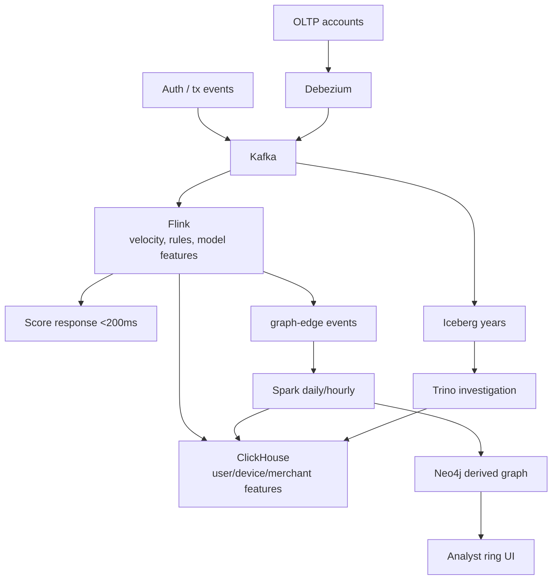

# Fraud Detection Architecture

Transactions, devices, cards, IPs, merchants, users. Four products share a bus and **must not share a latency budget**:

1. **Score this payment** — p99 < 200 ms (authorisation path).
2. **Find rings** — multi-hop graph, minutes to hours, batch is fine.
3. **Investigate a case** — ad-hoc SQL over months.
4. **Report** — fraud rate by MCC/region, dashboards.

No single database is good at all four. The architecture is a **deliberate split**. Related: [graph vs relational](../graph/graph-vs-relational.md), [Spark vs Flink](../comparisons/spark-vs-flink.md), [Flink state](../flink/state.md).

---

## Requirements

| Axis | Target |
|------|--------|
| **Volume** | V1: 200–2,000 tx/s. Serious: 10k–50k tx/s. Each tx fans out to features, graph edges, lake rows. |
| **Latency** | Score: **< 200 ms** p99 in-process. Ring job: < 1 h. Investigation: seconds–minutes. |
| **Access** | Score: keyed features + rules + tiny model. Rings: 2–4 hop connectivity. Investigation: joins and time travel. |
| **Retention** | Features: days–weeks hot. Graph: current derived view + rebuild. Lake: years (chargebacks arrive late). |
| **Cost** | 200 ms path must be **small**. Do not hop to Neo4j and Trino on authorisation. |
| **Failure** | Fail **open or closed** is a product decision (lost sale vs fraud). Timeouts, stale features, model fallback. Replay must not alert twice without care. |

!!! danger "Graph on the authorisation path"
    A 3-hop Cypher query at p99 200 ms under load is how payments time out. Neo4j is for rings and investigators, not for `POST /charge`.

---

## Capacity sketch (2,000 tx/s V1 → 20,000 at 10×)

| Item | 2k tx/s | Notes |
|------|---------|--------|
| Kafka `transactions` | 2k/s × 1 KB × 86400 ≈ **170 GB/day** | Key = `transaction_id` or `user_id` depending on ordering needs |
| Feature lookups | 2–6 CH/KV gets per tx | p99 budget: **10–20 ms** each, parallel |
| Flink state | velocity windows per user/card/device | State size ≈ active keys × window. 10M active users × 1 KB is ~10 GB + RocksDB |
| Graph edges/day | few edges per tx | Batch load; not 2k Cypher writes/s in V1 |
| Lake | years of tx | Iceberg; investigators use Trino |

Partitions: 24–48 at 2k/s if scoring is heavier than the broker. **Key for scoring state** is `user_id` / `card_id` so velocity counts are local to a Flink key. If you key only by `transaction_id`, every velocity check is a distributed mess.

---

## V1 — fewest parts (ship a score)

```
Payment API → Kafka (or sync call into a scorer that also logs to Kafka)
           → Flink (rules + keyed velocity + in-process model)
           → response (sync sidecar) or async with a tight timeout
           → Kafka `scores` + Iceberg (async)
           → ClickHouse (features and analyst tables, async)
```

**Synchronous pattern that stays honest:** the payment service calls a **scorer process** that shares the same Flink/feature logic *or* a request/reply Kafka with a 150 ms timeout. Many teams run a **gRPC feature service** + a model sidecar, and use Flink only to **maintain** features. V1 can be:

- Flink job maintains `user_id → velocity` in state, writes snapshots to ClickHouse/Redis.
- Scorer reads Redis/CH + local rules in < 50 ms.

Do not wait for Iceberg commits on the charge.

### What V1 includes

- Rules: amount vs user average, country change, velocity (`>5 tx / 1 min`).
- Keyed Flink or Redis sliding counters.
- ClickHouse `user_features` updated async (seconds late is OK for *some* features; mark them `as_of`).
- Iceberg append of every tx + score for later labels (chargeback).
- A **fail policy**: timeout → default score.

### What you would **not** add yet

- Neo4j
- Online graph embeddings
- Trino on the hot path
- Pinot
- Per-feature microservices
- Exactly-once *business* side effects (emails) without an outbox

---

## Bottleneck at the end of V1

| Symptom | Cause | Wrong fix |
|---------|-------|-----------|
| p99 score 800 ms | Remote CH query per feature, serial | Cache/KV; batch; denormalise into one row |
| Hot user/card | One partition / one Flink key hot | Rare; salt **after** scoring or isolate VIPs |
| Chargebacks not matching scores | Clock, duplicate tx ids, late labels | Idempotent tx id; lake is source for labels |
| Redis as entire feature store | Cold restart empty | Rebuild from Kafka/CH; Redis is a cache |
| Rules fire twice on replay | Side effects in the scorer | Scores are data; actions are idempotent consumers |

The 200 ms budget dies on **network hops**, not on a logistic regression.

---

## V2 — add graph and investigation the slow way



### Hot path (< 200 ms) — still no graph

```
tx in → Flink / scorer
        lookup user_features (CH or KV)
        lookup device_risk
        velocity in local state
        model in-process
      → score + reasons
```

ClickHouse for **analytical** features (30-day aggregates). Redis/KV for **hot counters** if CH p99 is unsafe. Total hops: one or two, in parallel.

```sql
CREATE TABLE user_features
(
    user_id              String,
    last_updated         DateTime,
    avg_txn_amount_30d   Float32,
    txn_count_30d        UInt32,
    unique_devices_30d   UInt16,
    unique_merchants_30d UInt16,
    fraud_flags_30d      UInt8,
    risk_score           Float32
)
ENGINE = ReplacingMergeTree(last_updated)
ORDER BY user_id;
```

### Ring detection (batch)

```
hourly/daily:
1. Edges from Kafka/Iceberg: user–device, device–ip, user–card, user–merchant
2. MERGE into Neo4j (or rebuild)
3. GDS connected components / WCC
4. Components over threshold → ClickHouse + case queue
```

Neo4j is **derived**. If it burns down, scoring continues. Rebuild from Iceberg.

### Investigation

Trino over Iceberg + CH. Time travel when a model version is disputed. Do not give investigators production Redis.

---

## Why four stores

| Question | Store | Why not ClickHouse only |
|----------|-------|-------------------------|
| Score now | Flink state + KV/CH row | Graph hops blow the SLA |
| 30d user average | ClickHouse | Redis is a poor 30d agg |
| Shared devices across 4 hops | Neo4j | Recursive SQL at this depth is fragile |
| "All tx for this ring last year" | Iceberg + Trino | CH TTL will have dropped raw |

---

## Failure modes

| Failure | Symptom | Absorb with |
|---------|---------|-------------|
| Feature store timeout | p99 spike | Default score; stale-if-error; budget per hop |
| Flink watermark stall | Velocity windows freeze | Idle watermarks; processing-time velocity if business allows |
| Skewed join in nightly labels | Spark OOM | See [Spark incident](../incidents/index.md) |
| Graph write in Flink per tx | Neo4j falls over | Queue edges; batch |
| Poison tx payload | Scorer crash loop | DLQ; fail policy |
| Training/serving skew | Model looks great offline | Same feature code path; snapshot features with the score |

!!! warning "Alerting on scores"
    A Flink replay will re-emit scores. Downstream "block this user" consumers must be **idempotent** on `transaction_id`.

---

## What V2 still does not add

- Online multi-hop during authorisation.
- A second stream processor "for ML."
- Storing PCI PAN in ClickHouse/Iceberg (tokenise; [security](../security/index.md)).
- Analysts querying Kafka with Trino as the investigation UI (possible, wrong SLA).

---

## Evolution at 10× (20k tx/s)

1. **More partitions keyed by user/card** — velocity state shards with keys.
2. **CH cluster** for features; or move the hottest keys to KV entirely.
3. **Regional scoring** — do not RTT to another continent in the 200 ms.
4. Graph job may need **graph compute** (Spark GraphX / GDS on a bigger box), not 10× Cypher writes.
5. Feature count will try to explode; **budget dimensions** like cardinality in observability.
6. Still no Neo4j on the hot path at 10×. Especially not at 10×.

---

## Decision table

| Decision | Choice | Alternative | Why |
|----------|--------|-------------|-----|
| Stream processor | Flink | Kafka Streams | Keyed state, timers, event time |
| Hot features | CH + KV | CH only | p99 |
| Graph | Neo4j derived | CH `JOIN` depth 1 only | Multi-hop |
| History | Iceberg | CH forever | Cost, chargeback lag |
| Investigation | Trino | Notebook vs prod Redis | Auditability |
| Model | In-process | Remote GPU | 200 ms |

---

## Apply this at work

1. Write the four use cases on a whiteboard. Assign an SLA and a store to each. Anything that sits on two SLAs is a bug.
2. Budget the 200 ms: parse, features, model, margin. Cut hops until it fits.
3. Define fail-open vs fail-closed with product/risk, not with engineering taste.
4. Put `transaction_id` on every score, feature snapshot, and alert.
5. Rebuild the graph from the lake on purpose once, so you know you can.

Pair with [Flink labs](../labs/index.md) (state + watermarks) and [graph modelling](../graph/graph-modelling.md).

---

## Feature budget (200 ms)

Write a table in the design review. Numbers are illustrative; **measure**.

| Step | Budget (ms) | Notes |
|------|-------------|-------|
| Parse + auth context | 5 | |
| Parallel feature fetch (CH/KV) | 40 | p99; timeout 50 |
| Velocity in Flink/local state | 5 | no network |
| Rules | 2 | |
| Model | 20 | CPU, not GPU remotely |
| Margin / GC / tail | 80 | |
| **Total p99** | **≤ 200** | |

If CH p99 is 80 ms, it does not fit. Move that feature to KV or accept staleness. Adding "one more microservice" is adding a tail.

---

## Labels and chargebacks

Fraud models need **labels** that arrive **days later**. Architecture:

- Score time: write `transaction_id`, `score`, `model_version`, `feature_snapshot_id` to Iceberg.
- Chargeback time: join labels in **Spark** (minutes, skew-prone — incident 2 if one merchant).
- Never train on CH TTL data that already expired.

If you cannot join scores to labels, you do not have ML; you have rules with extra steps.

---

## Graph edge model (batch)

```
(:User)-[:USED]->(:Device)
(:User)-[:USED]->(:IP)
(:User)-[:HAS]->(:Card)
(:User)-[:PAYS]->(:Merchant)
```

Connected component size > N → queue. False positives: families, offices, CGNAT IPs. **IP edges need recency TTL** or the graph becomes one component.

Do not emit an edge per tick of a web session. Sample or debounce in Flink before the graph topic.

---

## Fail-open vs fail-closed

| Policy | When score path dies | Business |
|--------|----------------------|----------|
| Fail-open | Allow payment | Lost fraud, kept conversion |
| Fail-closed | Decline | Lost conversion, safer |
| Fail-to-rules | Skip model, run velocity only | Common compromise |

This is not an engineering preference. Write it with risk. Timeouts **must** implement the policy, not hang until the processor dies.

---

## PCI / PII

- PAN → token before Kafka.
- CVV never stored.
- Scores, devices, emails still PII-ish; mask in notebooks ([security](../security/index.md)).
- Analysts query **Iceberg curated**, not Redis prod.

---

## On-call 15 minutes

1. p99 score > 200 ms: trace **which hop** (CH vs model vs Kafka reply). Not "scale Flink" first.
2. Alert storm after a replay: missing idempotency on `transaction_id`.
3. Graph UI empty: batch job failed; **scoring should still work**.
4. One user hot: velocity state for a bot — isolate; do not salt **before** velocity (you would split the count).

Salt **after** you no longer need a single key for state, or use a dedicated key-group for bots.

---

## Why Redis appears and when to remove it

Redis is a **p99** tool for hot features. It is a bad 30-day aggregate store and a bad SoR. Populate from Flink; rebuild from CH/Kafka on flush. If CH p99 is already 8 ms, skip Redis (operational cost). V1 in many shops is CH-only until the SLO misses.
