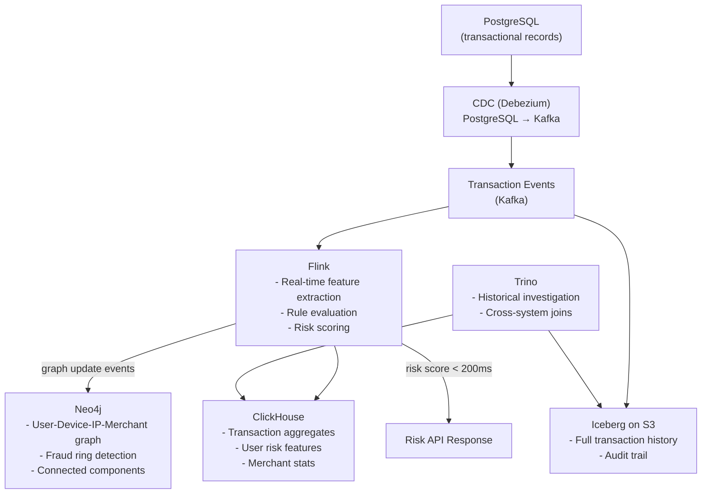

# Fraud Detection Architecture

## Requirements

**Entities**: Users, Cards, Devices, IPs, Merchants, Transactions

**Use Cases**:
1. Real-time scoring: is this transaction fraudulent? (< 200ms)
2. Fraud ring detection: find connected accounts via shared devices/IPs (minutes, batch)
3. Historical investigation: forensic analysis of a known fraudster's network
4. Reporting: fraud rates by merchant category, region

---

## The Core Challenge

No single database solves all of these:

- **Real-time scoring** needs feature lookup by transaction ID in milliseconds — key-value or ClickHouse
- **Fraud ring detection** needs multi-hop graph traversal — Neo4j
- **Historical investigation** needs flexible ad-hoc SQL — Trino + Iceberg
- **Reporting** needs fast aggregations — ClickHouse

---

## Architecture



---

## Real-Time Scoring (< 200ms path)

```
Transaction arrives → Kafka → Flink
                                 ↓
                     Look up user features (ClickHouse: avg spend, location history)
                     Look up device risk (ClickHouse: device fraud rate)
                     Apply rules (velocity check: >5 transactions in 1 min?)
                     Apply ML model (pre-loaded in Flink operator)
                                 ↓
                     Risk score → response to payment API
```

Flink maintains state for velocity checks (per-user event counts in sliding windows). ClickHouse provides aggregate features. Total latency: 50–150ms.

---

## Fraud Ring Detection (batch path)

```
Daily batch job (Spark/Flink):
1. Extract entity relationship events from Kafka/Iceberg
2. Upsert into Neo4j (user-device, device-ip, ip-transaction edges)
3. Run Neo4j GDS: Connected Components algorithm
4. Components > 50 nodes flagged for review
5. Results written to ClickHouse for analyst dashboards
```

Neo4j is not the system of record — it is a derived graph built from Kafka events. It can be rebuilt from scratch if needed.

---

## ClickHouse Schema for Fraud Features

```sql
-- User aggregate features (updated in real-time via Flink)
CREATE TABLE user_features (
    user_id String,
    last_updated DateTime,
    avg_txn_amount_30d Float32,
    txn_count_30d UInt32,
    unique_devices_30d UInt16,
    unique_merchants_30d UInt16,
    fraud_flags_30d UInt8,
    risk_score Float32
) ENGINE = ReplacingMergeTree(last_updated)
ORDER BY user_id;
```

---

## Trade-offs

| Decision | Choice | Alternative | Reason |
|---------|--------|-------------|--------|
| Graph store | Neo4j | ClickHouse (limited graph) | Multi-hop traversal is first-class |
| Real-time features | ClickHouse | Redis | ClickHouse scales better for analytical features |
| Stream processor | Flink | Kafka Streams | Complex state, event time, low latency |
| Historical store | Iceberg | Delta Lake | Multi-engine access (Trino + Spark) |
