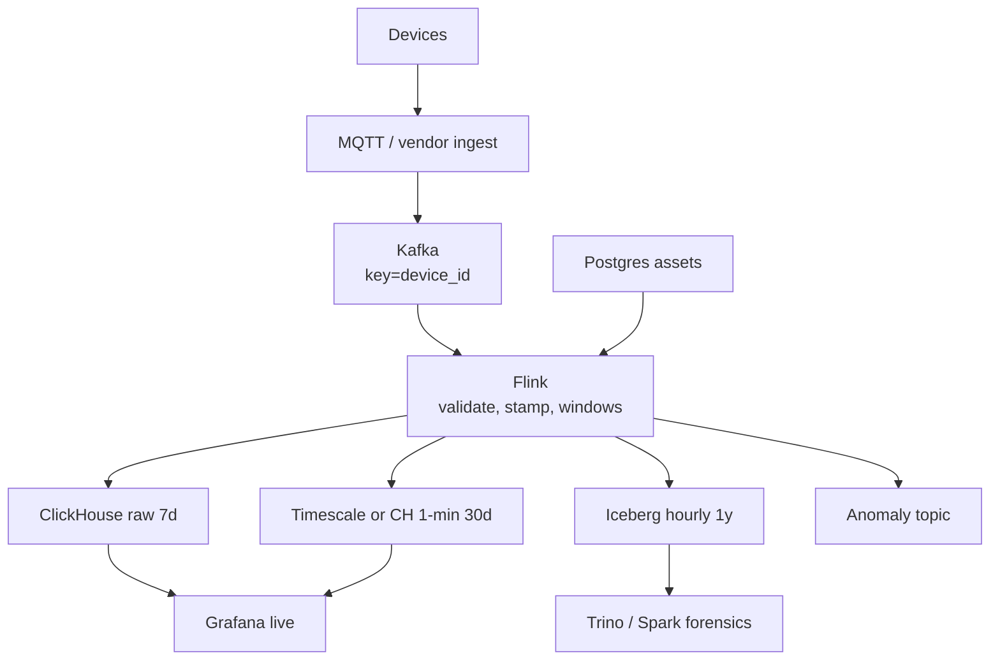

# IoT Platform Architecture

A finance review flags the storage bill: 10 million devices, one sample every 30 seconds, and someone kept "just in case" raw resolution for a full year. Nobody has plotted a single point older than three weeks at anything finer than an hourly average. A. The fix is a bigger discount on object storage. B. The fix is a downsample pyramid that never should have been skipped. C. The fix is dropping to 5-minute sampling at the device. Predict before you read on.

B: tens of millions of devices, small numeric samples, a handful of query shapes, and a **downsample pyramid** are the actual shape of this workload. The dominant constraint is **write rate + retention cost**, not join complexity. If you model this as "just events in a lakehouse," you will pay full-resolution storage for data nobody plots at 1 Hz a year later.

Related: [time series](../time-series/index.md), [downsampling](../time-series/downsampling.md), [TSDB vs OLAP](../comparisons/tsdb-vs-olap.md), [cardinality](../time-series/cardinality.md).

---

## Requirements

| Axis | Target |
|------|--------|
| **Volume** | 10 million devices × 1 sample / 30 s ≈ **333k samples/s**. Multiple sensors per device can multiply this. Payload ~80–200 bytes. |
| **Latency** | Latest value per device: < 1 s after ingest is nice, < 5 s is usually enough. 1-hour chart: sub-second. 1-year trend: seconds, on **hourly** data. Anomaly flag: seconds. |
| **Access** | Latest-by-device, range charts, fleet aggregates (`avg` by firmware), exception lists. Rarely: arbitrary joins to CRM on the hot path. |
| **Retention** | 7 days raw. 30 days at 1-minute. 1 year at hourly. Raw older than 7 days is a **cost bug** unless compliance says otherwise. |
| **Cost** | Storage follows resolution. 333k/s raw for a year is tens of TB/day uncompressed — do not keep it. |
| **Failure** | Device storms (retry loops), clock skew, a dead partition for one factory, poisoned NaNs. Losing a 1-minute rollup is worse than losing one raw second. |

!!! warning "Do not topic-per-device"
    10 million Kafka topics (or ClickHouse tables) is an operations incident. One (or a few) topics, key = `device_id`. Factories/regions may be **separate clusters** for isolation, not 10M topics.

---

## Capacity sketch

333,333 samples/s × 120 bytes × 86400 ≈ **3.5 TB/day** uncompressed raw.

| Layer | Sketch |
|-------|--------|
| Kafka | 3.5 TB/day × ~2× compression × RF=3 / 24 h retention ≈ **~9 TB** disk for one day of replay. Partitions: 333k/s / ~5k/s/partition ≈ **70+ partitions**; use 96–192 to leave headroom. |
| ClickHouse raw 7 d | Columnar 10:1 → ~0.35 TB/day × 7 ≈ **2.5 TB** hot. |
| 1-min rollup | 30 s → 60 s is ~2× fewer points *if one sensor*; with min/max/avg/count you store more columns but far fewer rows per hour of wall time. 30 days of 1-min is small vs raw year. |
| Hourly 1 year | Fleet-scale, not device-second-scale. This is the only layer you should plot "last year" against. |

If each device has 10 sensors at 1 Hz instead of 1/30 s, multiply ingest by **300**. Architecture is the same; V1 hardware is not. Recompute before copying this page into a budget.

---

## V1 — fewest parts

**One** serving store. Pick from the query mix:

| Pick ClickHouse when | Pick TimescaleDB when |
|----------------------|-----------------------|
| Fleet SQL, high cardinality (`device_id` millions), already have CH | You want Postgres: joins to relational asset tables, moderate rate (<~100k samples/s), continuous aggregates |
| 333k/s is in-range for a small CH cluster | Operators live in SQL/Postgres |

V1 with ClickHouse (the 10M-device case):

```
devices → MQTT (or vendor cloud) → Kafka bridge
       → Kafka (device_id key, 96 partitions)
       → Flink or even Kafka Engine
       → ClickHouse raw 7d + 1-min MV
       → Grafana
```

Asset metadata (firmware, customer, lat/lon) lives in **Postgres**. Join it in Grafana or denormalise `customer_id` onto the sample in Flink. Do not join 10M-row dimension tables on every ingest query without thought.

### V1 table

```sql
CREATE TABLE device_metrics
(
    timestamp  DateTime64(3),
    device_id  String,
    sensor     LowCardinality(String),
    value      Float32,
    unit       LowCardinality(String),
    quality    UInt8
)
ENGINE = MergeTree
PARTITION BY toYYYYMMDD(timestamp)
ORDER BY (device_id, sensor, timestamp)
TTL timestamp + INTERVAL 7 DAY;
```

Latest values:

```sql
SELECT device_id, sensor, argMax(value, timestamp) AS latest
FROM device_metrics
WHERE device_id IN ('d001', 'd002', 'd003')
GROUP BY device_id, sensor;
```

At fleet scale, `argMax` over 7 days of **all** devices is a bad query. Constrain time (`timestamp > now() - interval 5 minute`) or keep a `ReplacingMergeTree` "latest" table updated by Flink.

### What you would **not** add yet

- Iceberg (add when 30-day/1-year rollups leave ClickHouse)
- Trino
- Per-device Kafka topics
- Prometheus as the device store (`device_id` cardinality will kill it)
- Anomaly ML platform
- Kafka Streams **and** Flink **and** Spark

!!! note "MQTT vs Kafka"
    MQTT is a **device protocol** (fan-in from constrained clients). Kafka is the **platform bus**. Bridge MQTT → Kafka; do not make Flink speak MQTT unless you enjoy operational pain.

### This architecture works while… / breaks when… { #v1-limits }

**Works while:**

```text
queries lead with device_id (+ sensor) and a time window — the ORDER BY prefix
"latest value" queries are constrained to a short recent window
sample rate stays in-range for one modest ClickHouse cluster (~333k samples/s)
asset metadata is small enough to join in Grafana or denormalise at ingest
7 days of raw plus a 1-minute rollup covers the operational questions
device clocks are trusted enough that event time ≈ ingest time
```

**Breaks when:**

```text
a fleet-wide query arrives ("latest value for ALL devices") — argMax over 7 days of
   every device is a different workload than argMax over three, and needs a
   ReplacingMergeTree latest-value table instead
device_id keying goes skewed — a gateway or a chatty firmware version dominates
   one partition
retention questions extend past raw+7d into months or years of history — that is a
   downsampling pyramid, not a bigger TTL
clock skew becomes material: late and out-of-order samples from disconnected devices
   need watermarks and a lateness policy, not "sort on read"
metadata joins get large enough that per-query dimension joins dominate the cost
```

Two of these — the fleet query and the clock domain — are the ones teams discover late, because both look fine at pilot scale with 100 well-connected devices.

---

## Bottleneck at the end of V1

| Symptom | Cause | Wrong fix |
|---------|-------|-----------|
| Insert storm, millions of parts | One-row inserts per sample | Batch 1–10 s in the bridge/Flink |
| Query "latest for 10M devices" times out | Scanning raw 7d | Dedicated latest table / 5 min window |
| One Kafka partition lagging | Hot gateway or mis-keyed region | Re-key; more consumers will not split the hot partition |
| Charts for last year are empty or huge | You queried raw | Hourly table only |
| Device clocks 3 hours off | Event time vs ingest time | Store both; window on ingest for "live", event time for science |
| NaN/Inf wrecks averages | No quality flag | `quality` column; `avgIf(value, quality=1)` |

Tiny inserts are the classic ClickHouse IoT footgun. The bridge must **batch**.

---

## V2 — pyramid + optional specialist TSDB



### Downsample in Flink (event time)

```python
stream \
    .key_by(lambda e: (e["device_id"], e["sensor"])) \
    .window(TumblingEventTimeWindows.of(Time.minutes(1))) \
    .aggregate(MetricAggregator())  # min, max, avg, count, p95 if you must \
    .add_sink(RollupSink())
```

Watermarks: devices go idle. Use **idleness** on keys or a separate processing-time flush, or 1-minute windows never close for quiet sensors. See [Flink watermark incident](../incidents/index.md).

### Where Timescale still wins

If the product is "Postgres + Grafana + joins to tickets," Timescale hypertables + continuous aggregates are operationally simpler **up to a rate you have measured**. At 333k/s and 10M series, ClickHouse (or a purpose TSDB like VictoriaMetrics for **metrics-shaped** data) is the safer hot store. Hybrid is allowed: VM for numeric fleet metrics, ClickHouse for wide events.

### Anomaly detection (stateful, not a new database)

```python
class AnomalyDetector(KeyedProcessFunction):
    def open(self, ctx):
        self.mean = self.get_runtime_context().get_state(
            ValueStateDescriptor("mean", Types.FLOAT()))
        self.m2 = self.get_runtime_context().get_state(
            ValueStateDescriptor("m2", Types.FLOAT()))
        self.n = self.get_runtime_context().get_state(
            ValueStateDescriptor("n", Types.LONG()))

    def process_element(self, reading, ctx):
        n = (self.n.value() or 0) + 1
        mean = self.mean.value() or 0.0
        delta = reading["value"] - mean
        mean += delta / n
        # Welford M2 omitted in this sketch; persist m2 similarly
        self.n.update(n)
        self.mean.update(mean)
        std = 1.0  # from M2
        if n > 30 and abs(reading["value"] - mean) > 3 * std:
            yield Anomaly(reading["device_id"], reading["value"])
```

This belongs in Flink keyed state. Do not query ClickHouse per sample for a z-score.

---

## How it fails { #failure-modes }

| Failure | Symptom | Absorb with |
|---------|---------|-------------|
| Device retry storm | Ingest 10×, duplicate timestamps | Dedup key `(device_id, sensor, timestamp)` ReplacingMergeTree; rate-limit the bridge |
| Idle keys stall watermarks | No 1-min output overnight | Watermark idleness; processing-time backup |
| Partition by `toYYYYMMDD` + tiny batches | Too many parts | Larger inserts; fewer partitions if needed |
| `ORDER BY (timestamp, device_id)` | "this device, 24h" scans the day | Device first in the key — [ORDER BY lab](../labs/index.md) |
| Losing MQTT broker | Gap in raw | Kafka as buffer **after** the bridge; QoS on MQTT; gap detection on `max(ts)` per device |
| Firmware sends new sensor name | Cardinality creep | `LowCardinality` is not infinite; allow-list sensors |

---

## What you still do not add at V2

- Pinot (unless a customer-facing live tile at huge QPS).
- Per-tenant ClickHouse clusters at 10k tiny tenants — use `tenant_id` in `ORDER BY` and quotas.
- Raw-to-S3 dump **without** a table format and a rollup job (you will never query it cheaply).
- Graph DB for device topology until someone has a multi-hop question.

---

## Evolution at 10× (3.3M samples/s or 100M devices)

1. **More Kafka partitions and Flink slots** — linear, if keys are even.
2. **Shard ClickHouse** by `hash(device_id)` so a device's series lives on one node (latest-value queries stay local).
3. **Regional ingest** — devices should not cross the ocean to a single Kafka.
4. **Drop raw sooner** (3 days) if 1-min is the real product.
5. **Pre-compute fleet dashboards** (per firmware per minute) so Grafana never scans 100M devices.
6. Revisit Timescale if you started there — 10× is often the ClickHouse/VM migration, not "bigger Postgres."

Hot keys: a **gateway** that reports 10k devices as one `device_id` will 10× worse. Key the actual series.

---

## Decision table

| Decision | Choice | Why | Reject |
|----------|--------|-----|--------|
| Device protocol | MQTT → Kafka | Constrained clients vs platform bus | Kafka on every sensor |
| Hot raw | ClickHouse | High card `device_id`, SQL charts | Prometheus labels |
| 1-min / hourly | Flink windows or CH MVs | Pyramid is the product | Keep raw forever |
| Assets | Postgres | Slowly changing, relational | Duplicating into 10M Kafka compacted topics first |
| Anomaly | Flink state | Per-key, sub-second | Batch Spark every hour only (too late) |
| Year views | Hourly Iceberg or CH | Scan budget | Raw 1 Hz |

---

## Apply this at work

1. Write samples/s = devices × sensors × Hz. Recompute GB/day.
2. Freeze the pyramid (7d / 30d / 1y) as a **product** spec.
3. Put `device_id` first in `ORDER BY` if the UI is per-device.
4. Batch inserts. Measure parts count on day two.
5. Decide latest-value path (query vs dedicated table) before demoing a fleet map.

Run the [ClickHouse lab](../labs/index.md) with a device-first vs time-first `ORDER BY`. Use the [cardinality calculator](../simulations/cardinality-calculator.html) before anyone adds `firmware_git_sha` as a Prometheus label.

---

## Query catalogue

| ID | Question | Resolution needed | Store |
|----|----------|-------------------|-------|
| Q1 | Latest temperature for device D | seconds | CH `argMax` on 5 min **or** latest table |
| Q2 | Chart D, sensor T, last 6 h at ~1 point/min | sub-second | 1-min rollup |
| Q3 | Fleet p95 by firmware, last 24 h | seconds | rollup, not 10M raw |
| Q4 | Year trend for D | seconds on **hourly** | hourly table |
| Q5 | Which devices were silent 15 min? | minutes | watermark/gap job, not Prom |
| Q6 | Join device → customer address | rare | Postgres assets + id |

Q1 vs Q4 using the **same** raw table is how year views take down the cluster.

---

## Clock domains

| Clock | Use |
|-------|-----|
| Device event time | Science, "when the sample was taken" |
| Ingest time | "is the pipeline alive"; gap detection |
| Processing time | Last-resort windows when devices are idle |

Store **both** `device_ts` and `ingest_ts`. Alerts on "pipeline down" use ingest. Alerts on "machine overheating" use event time **after** clamping skew (drop or sidecar 6-hour-off firmware).

NTP on devices is a **product** requirement. Flink cannot fix a factory full of 2019 clocks without a policy.

---

## Batching at the edge

| Where | Batch |
|-------|-------|
| Device | often 1 sample; constrained RAM |
| MQTT bridge / gateway | **must** batch 100s–1000s or 1 s |
| Flink sink to CH | 1–5 s / 100k rows |
| CH Kafka engine | `kafka_max_block_size`, flush interval |

If the gateway does one HTTP INSERT per sample, you will hit incident 4 shape B at 333k/s **immediately**.

---

## Latest-value table (when `argMax` dies)

```sql
CREATE TABLE device_latest
(
    device_id String,
    sensor    LowCardinality(String),
    timestamp DateTime64(3),
    value     Float32,
    quality   UInt8
)
ENGINE = ReplacingMergeTree(timestamp)
ORDER BY (device_id, sensor);
```

Flink upserts on every sample (or every N seconds). Grafana fleet map reads **this**, not 7 days of raw. `ReplacingMergeTree` needs `FINAL` or a `FROM device_latest FINAL` in queries / a collapsing pattern you understand. Alternative: Redis `device:sensor → value` for the map, CH for charts.

---

## On-call 15 minutes

1. No 1-min points overnight? Watermark idleness — incident 3. Check `current_watermark` vs wall clock.
2. One factory missing? Kafka key = factory gateway id (hot or dead), not 10k devices.
3. Averages are NaN? `quality` / `avgIf`.
4. CH insert delay? `system.parts`.
5. Prometheus scrape failing? That is **cluster** health, not device health — do not "fix" by adding `device_id` labels.

---

## What "10 million devices" does to Kafka keys

Hash(`device_id`) with 192 partitions is even **if** ids are even. Vendor ids that are MAC-ish are fine. Sequential ids are fine. A **single** `device_id=gateway-uk-1` reporting 50k sensors as one key is not. Model the **series** (`device_id, sensor`) in the Kafka key if one physical box fans in.

Estimate: 10M devices × 2 sensors = 20M keys. Flink keyed state for z-score at 100 B/key ≈ 2 GB plus RocksDB overhead — fits. Session state with 7-day raw buffers does **not**.
