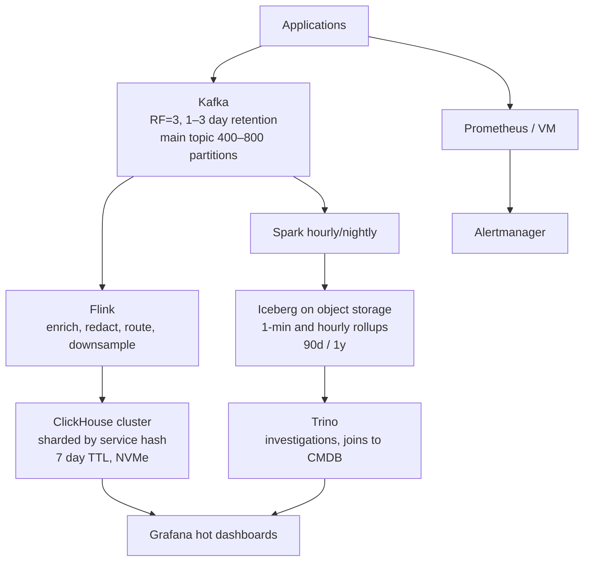

# Observability Platform Architecture

02:47 AM. Grafana is empty for `checkout-service`. Every other service still shows traffic. Someone on the bridge says "just add a Prometheus label for `user_id` so we can see which customer is affected" — and someone else objects. A. Add the label; Prometheus can take it. B. The label would work but would kill the TSDB at scale — reach for ClickHouse instead. C. The dashboard is empty because of an ingest problem that has nothing to do with labels. D. Restart Flink and see if it comes back. Pick one before reading on.

The dashboard being empty is a retention/routing question, and the `user_id`-as-label instinct is the cardinality trap this page exists to prevent. Logs, metrics, traces, and security events share one ingest path here, but the hard problem is not "collect everything" — it is **answering an on-call query in a second while not paying NVMe prices for a year of raw JSON**.

This page walks V1 → bottleneck → V2, then 10×. Related: [ClickHouse](../olap/clickhouse.md), [TSDB vs OLAP](../comparisons/tsdb-vs-olap.md), [ClickHouse vs Trino](../comparisons/clickhouse-vs-trino.md), [cardinality simulation](../simulations/cardinality-calculator.html).

---

## Requirements (write these down first)

| Axis | Target (production-shaped) |
|------|----------------------------|
| **Volume** | 5 million events/s mixed (logs + metrics + spans + audit). ~500 bytes/event uncompressed. |
| **Latency** | Last 15 min: sub-second dashboards. Last 24 h: 1–5 s. Forensics over months: minutes OK. |
| **Access** | Filter by `service`, `host`, `level`, `trace_id`; aggregate error rates; jump from a trace id to logs. Not "GROUP BY user_id over a year" on the hot path. |
| **Retention** | Hot: 7 days full resolution. Warm: 90 days at 1-minute rollup. Cold: 1 year hourly. |
| **Cost** | Hot storage is the bill. Cold must be object storage. |
| **Failure** | Lose a broker or a ClickHouse replica without losing ingest. Replay a bad enricher from Kafka. Dropping *debug* logs under overload is allowed; dropping *error* + traces is not. |

!!! warning "Cardinality is a requirement"
    If you treat `user_id` or `request_id` as a Prometheus label, you will not reach 5M/s — you will die at 50k/s on the TSDB index. High-cardinality **events** belong in ClickHouse. Moderate-cardinality **infra metrics** can stay in a TSDB for alerting. See [cardinality](../time-series/cardinality.md).

Out of scope for V1: full-text log search like Elasticsearch, customer-facing product analytics, and a second "security lake" cluster.

---

## Capacity sketch (do this before buying nodes)

Uncompressed ingest:

\[
5 \times 10^6 \times 500\,\text{B} \times 86400 \approx 216\,\text{TB/day}
\]

| Layer | Rule of thumb | Number |
|-------|---------------|--------|
| Kafka (3× RF, ~4× compression on logs) | Disk ≈ uncompressed / compression × RF | 216 / 4 × 3 ≈ **162 TB/day** if you retain a day of *everything*. You will not. Keep **1–3 days** of Kafka for replay, not 7. |
| Kafka partitions | 5–15 MB/s/partition uncompressed, or ~5–20k events/s if enrichers are heavy | **400–800 partitions** on the main events topic at 5M/s. Start lower at Stage 1. |
| ClickHouse hot (10:1 columnar compression, 7 days) | 216 TB/day / 10 × 7 | **~150 TB** compressed hot. |
| Warm/cold after 1-min then hourly rollup | 10–50× less than raw | Low single-digit TB/day equivalent. |

Kafka retention is a **replay buffer**, not the observability store. If you set Kafka to 7 days at this volume you are paying for a second, worse ClickHouse.

Produce/consume parallelism: a Flink job at 5M/s with 1k events/s/core (enrich + JSON parse is not free) wants **thousands of cores** or cheaper parse (binary proto, vectorised decode). V1 will not be 5M/s. V1 exists to prove the query shape.

---

## V1 — fewest parts (≈ 50k events/s, one team)

```
apps  →  Kafka (3 brokers, 24–48 partitions, RF=3)
      →  Flink (parse, drop debug if needed, add service metadata)
      →  ClickHouse (single replica or 1 shard × 2 replicas)
      →  Grafana
```

Keep **Prometheus** (or VictoriaMetrics) **beside** this path for scrape metrics and Alertmanager. Do not ingest per-request logs into Prometheus.

### What V1 includes

- One events topic, keyed by `service` (or `service + host` if one service is huge).
- ClickHouse `ORDER BY (service, timestamp)` — matches "this service, last 15 minutes."
- TTL 7 days on the MergeTree table.
- Kafka retention 24–72 h for replay only.
- Structured logs (JSON/proto). Unstructured text search is not V1.

### What you would **not** add yet

- Iceberg, Spark, Trino
- Pinot
- A second Kafka cluster "for logs vs traces"
- Elasticsearch / OpenSearch
- Per-team Kafka clusters
- A metadata catalogue as a blocker to shipping Grafana

!!! note "Why Flink in V1 at all?"
    You *can* land Kafka → ClickHouse Kafka Engine + materialized view and skip Flink. Do that if enrichment is "cast types and stash JSON." Add Flink when you need **dedup, trace stitching, or dropping fields by tenant**, or when ClickHouse insert pressure needs a buffer that can backpressure. See [Spark vs Flink](../comparisons/spark-vs-flink.md).

### V1 ClickHouse table

```sql
CREATE TABLE events
(
    timestamp   DateTime64(3),
    service     LowCardinality(String),
    host        LowCardinality(String),
    level       LowCardinality(String),
    trace_id    String,
    message     String,
    attributes  Map(String, String)
)
ENGINE = MergeTree
PARTITION BY toYYYYMMDD(timestamp)
ORDER BY (service, timestamp, host)
TTL timestamp + INTERVAL 7 DAY
SETTINGS index_granularity = 8192;
```

`trace_id` is **not** in `ORDER BY`. Point lookups of a random trace will scan the service+time range — that is acceptable if the UI always has a time window. A bloom skip index on `trace_id` is a later, cheap add. Do not rebuild the primary key around traces unless that is the #1 query.

---

## Bottleneck at the end of V1

You will hit **one** of these first. Name it; do not "scale the diagram."

| Symptom | Likely cause | Wrong fix |
|---------|--------------|-----------|
| Kafka lag on **all** partitions | ClickHouse merges/inserts or Flink sink slower than produce | More Kafka brokers |
| Lag on **one** partition, others idle | Hot `service` key | More consumers (they cannot split a partition) |
| Grafana queries 10× slower at day 5 | Too many parts, or `ORDER BY` does not match filters | Bigger ClickHouse box only |
| Prometheus OOM / scrape storms | High-cardinality labels (`user_id`, `trace_id`) | "Just use Thanos" |
| Disk fills on day 6 | No TTL, or debug logs 10× errors | Another NVMe array without dropping fields |

The ClickHouse cliff is usually **parts** (tiny inserts) or **wrong `ORDER BY`**, not CPU. Tiny Kafka Engine flushes create thousands of parts; queries read too many files. See [incident: ClickHouse 10× slower](../incidents/index.md).

Hot service: if `api-gateway` is 40% of traffic, keying only by `service` pins 40% of the topic to one partition. Compound the key (`service + host` or a hash suffix on the hot service only).

---

## V2 — remove the measured bottleneck (≈ 500k–5M events/s)

Split **hot path** (incident response) from **cold path** (forensics, compliance).



### Hot path

Kafka → Flink → ClickHouse.

- Latency: seconds from log line to Grafana.
- Retention: 7 days.
- Cost: NVMe, lots of cores, worth it for on-call.
- Shard ClickHouse by `cityHash64(service)` (or `service` + time) so one noisy service does not fill every node.

### Cold path

Kafka → Spark (or Flink batch) → Iceberg.

- Latency: minutes to hours.
- Retention: 90 days 1-min, 1 year hourly.
- Cost: object storage.
- Trino for "what did this service do last quarter?" and joins to asset inventory. **Not** for the 15-minute error graph.

### What V2 still does **not** add

- Pinot, unless you have **thousands of QPS** of fixed-dimension, sub-second-fresh dashboards. Grafana on-call is not that. See [ClickHouse vs Pinot](../comparisons/clickhouse-vs-pinot.md).
- Elasticsearch as the system of record. If you need inverted-index search on `message`, add it as a **derived** 7-day index, not a second ingest silo.
- Dual writes from every app (one to Kafka, one to ES, one to S3). One producer; fan-out in the cluster.

---

## Table design details that actually matter

### Metrics in ClickHouse (when cardinality is too high for a TSDB)

```sql
CREATE TABLE metrics
(
    timestamp DateTime64(3),
    metric    LowCardinality(String),
    labels    Map(LowCardinality(String), String),
    value     Float64
)
ENGINE = MergeTree
PARTITION BY toYYYYMMDD(timestamp)
ORDER BY (metric, timestamp)
TTL timestamp + INTERVAL 7 DAY;
```

Maps are convenient and easy to abuse. A label key with a million values still hurts compression and `GROUP BY`. Prefer **known columns** for dimensions you filter on (`service`, `status_code`).

### Rollups (warm/cold)

Flink or ClickHouse materialized views:

```sql
CREATE MATERIALIZED VIEW metrics_1m
ENGINE = SummingMergeTree
PARTITION BY toYYYYMMDD(ts_minute)
ORDER BY (metric, service, ts_minute)
AS
SELECT
    toStartOfMinute(timestamp) AS ts_minute,
    metric,
    labels['service']          AS service,
    count()                    AS n,
    sum(value)                 AS sum_value
FROM metrics
GROUP BY ts_minute, metric, service;
```

Do not keep raw 5M/s in Iceberg "just in case" without a compaction and expiry plan. That is how you get the [Iceberg snapshot incident](../incidents/index.md).

---

## Failure modes

| Failure | What you see | Absorb with |
|---------|--------------|-------------|
| Broker death | Under-replicated partitions, produce retries | RF=3, `min.insync.replicas=2`, `acks=all` on critical topics |
| Hot partition | Lag on one partition, one Flink subtask busy | Re-key; see [Kafka incident](../incidents/index.md) |
| ClickHouse replica down | Queries still work if RF≥2; inserts to that shard stall | Distributed table + retry; do not block app threads on insert |
| Merge backlog / too many parts | Inserts slow, queries 10× | Batch inserts (seconds, not rows); `parts_to_throw_insert` alerts |
| Flink checkpoint timeout | Job restarts, sink duplicates | Larger checkpoint timeout, unaligned checkpoints, idempotent ClickHouse inserts (`ReplacingMergeTree` or block dedup) |
| Watermark stall | Dashboards freeze on **windowed** Flink jobs | Idle source watermarks; see [Flink incident](../incidents/index.md) |
| Bad enricher shipped | Wrong `service` labels for 40 minutes | Kafka replay from offset; ClickHouse partition drop for the bad hour |
| Cardinality bomb | One deploy adds `user_id` label | Ingestion guardrails: drop/hash unknown high-card keys |

!!! danger "Silent wrongness"
    A parser that sets `status_code = 0` on a new JSON field will not crash Kafka. Grafana will show a successful deploy. Put [quality](../quality/index.md) checks on **ratios** (error rate, parse-fail count), not only on process uptime.

---

## Cost (order of magnitude, 5M/s)

| Tier | Rough monthly storage | Role |
|------|----------------------|------|
| Kafka 2 days compressed × RF=3 | Large but bounded; this is **not** the archive | Replay |
| ClickHouse 7 days ~150 TB NVMe | Often **$2k–8k+**/month depending on vendor/discount | Hot query |
| Iceberg 90d rollups on S3 | Hundreds of dollars to low thousands | Investigations |
| Keep 7 days raw in ClickHouse *and* 90 days raw in S3 | The bill that gets people fired | Don't |

Tiered retention is a 10–50× storage win versus "hot forever." Compute (Flink parse) can exceed storage at this rate — **binary encodings and dropping debug** are cost features.

---

## Evolution at 10× (50M events/s)

You probably do **not** replace ClickHouse. You:

1. **Pre-aggregate in Flink** (per service per second) so ClickHouse sees fewer rows for dashboards. Keep a sampled raw table for trace drill-down.
2. **Split topics** by telemetry type (logs vs spans) so retention and `ORDER BY` can differ.
3. **Shard more** — but by the query key (`service`), not randomly, or every query becomes a scatter-gather.
4. **Pull Prometheus out of the event path entirely** if it is still mixed in.
5. **Regional Kafka** — produce locally, aggregate centrally, or query federated ClickHouse. Cross-AZ traffic at 50M/s is a WAN bill.
6. **Refuse new high-card dimensions** in the hot table; they go to cold/sampled.

If 10× is 10× **query QPS** (many tenants staring at live graphs), that is the moment to evaluate Pinot or aggressive ClickHouse caching — a different bottleneck than ingest.

---

## Decision table

| Decision | Choice | Why | Alternative rejected |
|----------|--------|-----|----------------------|
| Hot store | ClickHouse | Sub-second agg, SQL, cheap compression | ES (cost, less agg); Postgres (scan) |
| Infra alerting | Prometheus / VM | Alertmanager, PromQL, scrape model | ClickHouse-only alerts (awkward) |
| Cold store | Iceberg on S3 | Cheap, Spark/Trino, time travel | ClickHouse S3 volumes for *all* history (ops) |
| Ad-hoc over cold | Trino | Federation, no copy | Querying Kafka directly |
| Processor | Flink | Stateful downsample, redact, backpressure | Spark micro-batch if 30s is OK |
| Bus | Kafka | Durability, replay, fan-out | HTTP to ClickHouse from every app |

---

## Apply this at work

1. Write the three query SLAs (15 min / 24 h / 90 d) with example SQL.
2. Compute GB/day uncompressed **and** compressed.
3. Choose `ORDER BY` from the **first** Grafana panel, not from "all possible filters."
4. Set Kafka retention as replay (days), ClickHouse TTL as hot (days), Iceberg as archive (months).
5. Add a cardinality budget: which fields may never become labels.
6. Draw V1 with three boxes. Put V2 on a second slide. Ship V1.

Work the [ClickHouse ORDER BY lab](../labs/index.md) and the [cardinality calculator](../simulations/cardinality-calculator.html) before you freeze the schema.

---

## Query catalogue (write these in the design doc)

The stack follows from **these** queries, not from "we need observability."

| ID | Query | SLA | Store |
|----|-------|-----|-------|
| Q1 | Error rate for `service=X`, last 15 min, 1s buckets | < 1 s | ClickHouse |
| Q2 | Logs for `service=X`, `level=error`, last 1 h, grep substring | < 3 s | ClickHouse (not ES in V1) |
| Q3 | Trace id → logs + spans, last 7 d | < 2 s if time window known | CH + bloom on `trace_id` |
| Q4 | p95 latency by endpoint, 24 h | 1–5 s | CH rollup or raw if `ORDER BY` fits |
| Q5 | Same as Q1, last 90 d | minutes | Iceberg + Trino / CH 1-min MV |
| Q6 | CPU by pod | 1 min alert | Prometheus, **not** CH |

If Q2 becomes "full-text across 30 days of unstructured logs," you have a **search** product. That is a new V2 component (OpenSearch) with **7-day** retention, not a reason to abandon CH.

---

## Partition and Flink parallelism (Stage 3)

At 5M events/s, 800 partitions:

- Flink Kafka source: `source parallelism` ≤ 800. Typical: 200–800 depending on parse cost.
- Checkpoint interval 30–60 s. At this rate, checkpoint size is **state**, not the events (events are not stored in Flink if you only map). If you sessionize or buffer 1-min windows, state = keys × window. 100k services × 1 min of raw is huge — **aggregate in the window**, do not buffer raw.
- ClickHouse insert: 100k–1M rows/block, every 1–5 s. Tiny blocks → [too many parts](../incidents/index.md).

Kafka consumer group for Flink: **one** group for the hot path. A second group for Spark batch. That is why Kafka exists — fan-out. Do not share a group between Flink and Spark.

---

## Sampling and overload

When ingest exceeds what CH can merge:

1. Drop `debug`/`info` first (keep `error`/`fatal` + traces).
2. Sample `info` at 1% **per service**, not globally (or a quiet service vanishes).
3. Never sample traces that are **in an error path** if the product is debugging.
4. Emit an `ingest_dropped_total` metric to Prometheus so the drop is visible.

Overload is a **requirement** ("what may we drop"). If you cannot answer, you will drop randomly when disks fill.

---

## On-call 15 minutes

1. Grafana empty? Check CH `max(timestamp)` and Kafka lag **per partition**.
2. One service missing? Hot key or parser fail for that service — [quality](../quality/index.md) parse-fail counter.
3. All services slow to query? `system.parts` and `query_log` marks — incident 4.
4. Alerts firing on CPU but not on errors? You are looking at Prometheus; the event path can still be dead.

Do not restart Flink as step 1. Restarts rewind checkpoints and duplicate inserts unless sinks are idempotent.

---

## Stage table (resume of the ladder)

| Stage | Events/s | Kafka | Processor | Serving | Lake |
|-------|----------|-------|-----------|---------|------|
| 1 | 50k | 3 brokers, 24–48 p | Flink 4 slots or CH Kafka engine | 1 CH replica pair | none |
| 2 | 500k | 6 brokers, ~120 p | Flink 4 workers | 3-node CH | optional Iceberg |
| 3 | 5M | ~20 brokers, 400–800 p | Flink 20 workers | 20-node CH, sharded | Iceberg + Trino |

Jumping to Stage 3 on day one is how you spend two quarters on Keeper and never ship Grafana. Ship Stage 1 with the **same** `ORDER BY` you will need at Stage 3. Changing `ORDER BY` later is a migration, not a config flag.
