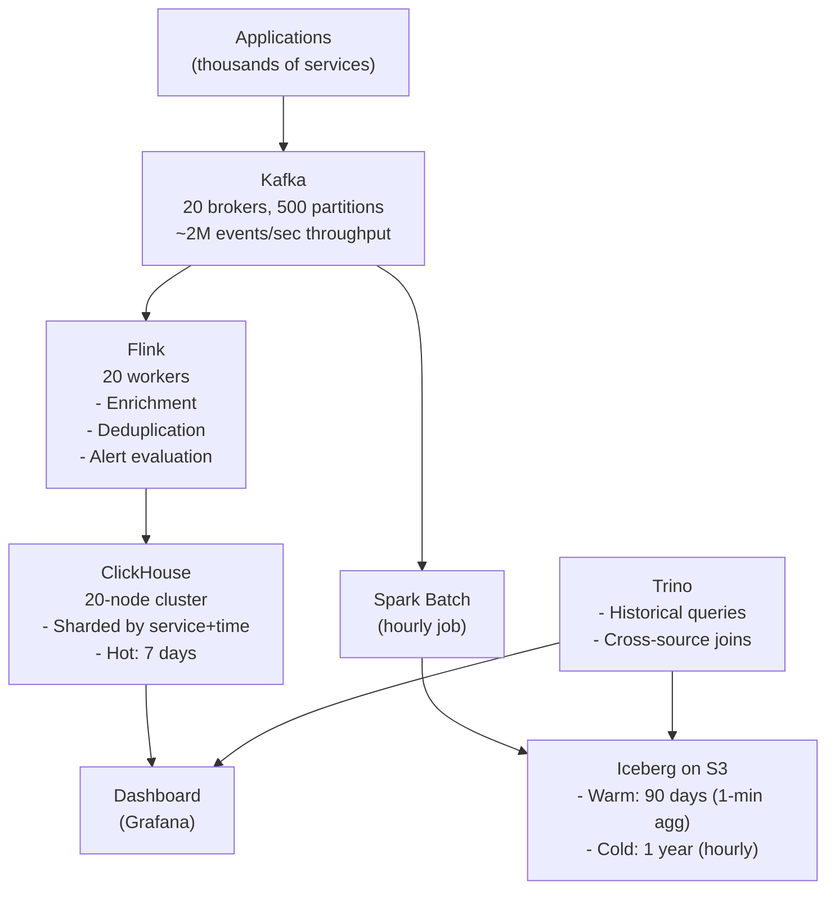

# Observability Platform Architecture

## Requirements

**Scale**: 5 million events per second (logs + metrics + traces + security events)

**Queries**:
- Last 15 minutes: sub-second dashboard queries (on-call engineer investigating an incident)
- Last 24 hours: 1–5 second queries (daily review)
- Historical investigation: minutes acceptable (forensic analysis)

**Retention**:
- Hot: 7 days at full resolution
- Warm: 90 days at 1-minute aggregation
- Cold: 1 year at hourly aggregation

---

## Scaling Through the Ladder

### Stage 1: 50K events/sec, 1 team

```
Applications → Kafka (3 brokers) → Flink (enrichment) → ClickHouse (single node)
```

One Kafka cluster, one Flink job, one ClickHouse node. Simple.

### Stage 2: 500K events/sec, 5 teams

```
Applications → Kafka (6 brokers, more partitions)
                    ↓
              Flink cluster (4 workers)
                    ↓
              ClickHouse (3-node cluster, ReplicatedMergeTree)
```

Add replication to ClickHouse. Scale Kafka partitions for parallelism.

### Stage 3: 5M events/sec, production scale



---

## The Hot Path and Cold Path

**Hot path** (Kafka → Flink → ClickHouse):
- Purpose: real-time dashboards, alert evaluation, incident response
- Latency: seconds
- Retention: 7 days
- Cost: expensive (fast NVMe storage, many cores)

**Cold path** (Kafka → Spark → Iceberg):
- Purpose: long-term retention, historical investigation, compliance
- Latency: minutes to hours
- Retention: 1+ year
- Cost: cheap (object storage at $0.02/GB)

---

## ClickHouse Table Design for Observability

```sql
-- Events table: optimized for recent queries by service
CREATE TABLE events (
    timestamp DateTime64(3),
    service LowCardinality(String),
    host LowCardinality(String),
    level LowCardinality(String),
    trace_id String,
    message String,
    attributes Map(String, String)
) ENGINE = MergeTree()
PARTITION BY (toYYYYMMDD(timestamp), service)
ORDER BY (service, timestamp, host)
TTL timestamp + INTERVAL 7 DAY;
```

```sql
-- Metrics table: high cardinality is manageable in ClickHouse
CREATE TABLE metrics (
    timestamp DateTime64(3),
    metric LowCardinality(String),
    labels Map(LowCardinality(String), String),
    value Float64
) ENGINE = MergeTree()
ORDER BY (metric, timestamp)
TTL timestamp + INTERVAL 7 DAY;
```

---

## Cost Analysis

At 5M events/sec, each event averaging 500 bytes:
- Raw ingestion: `5M × 500B × 86400 sec/day = ~216 TB/day` of raw data
- After compression in ClickHouse (10:1): ~22 TB/day
- 7 days of hot storage: ~154 TB of ClickHouse storage
- 1 year of warm/cold on S3 at 1-min aggregation: much cheaper (~1-5 TB/day)

Hot storage (ClickHouse on NVMe): $5–15/TB/month → ~$1,500–4,500/month for 7 days
Cold storage (S3 standard): $0.023/GB/month → ~$300–1000/month for 90 days

**Tiered retention saves 10–50× on storage costs** versus keeping everything hot.

---

## Trade-offs Discussed

| Decision | Choice | Reason |
|---------|--------|--------|
| Hot storage | ClickHouse | Sub-second analytical queries |
| Cold storage | Iceberg on S3 | Cost, long-term retention |
| Query engine for cold | Trino | Federation, ad-hoc SQL over Iceberg |
| Stream processor | Flink | Event time, enrichment, stateful alerting |
| Message broker | Kafka | Durability, replay, fan-out |

---

## How to Apply This at Work

If you are building an observability platform:

1. Define retention requirements: hot/warm/cold boundaries
2. Calculate data volume at target scale
3. Choose ClickHouse ORDER BY based on primary alert/dashboard predicates
4. Design the Flink enrichment pipeline before ingestion (add service context, parse structured logs)
5. Plan Iceberg partition scheme for historical investigation (usually `date` + `service`)
6. Budget: compute the storage cost differential between hot and cold tiers
