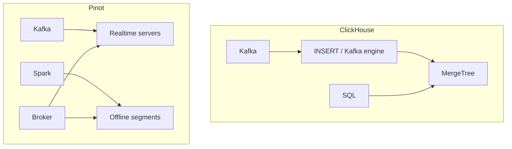

# ClickHouse vs Pinot

A product team wants a customer-facing "live usage" tile that must reflect events from the last 2-5 seconds, and expects tens of thousands of QPS once it ships to every logged-in user. The platform team's instinct is to add a materialized view to the existing ClickHouse cluster that already serves 20 Grafana panels at low QPS. A. ClickHouse with a tight insert interval handles this fine. B. This is a different product than the Grafana dashboards and deserves Pinot. C. Neither — cache the tile in Redis instead. Predict before you read on.

B is the shape this page argues for, though it depends on measuring the QPS and freshness numbers rather than assuming: both ClickHouse and Pinot are columnar OLAP systems for fast analytics on event-shaped data, but they are not interchangeable. **ClickHouse** is a general-purpose analytic database: you own storage, `ORDER BY` is the index, SQL is wide. **Pinot** is a serving system for **ultra-fresh, high-concurrency, mostly single-table** dashboards with a realtime/offline segment split and star-tree indexes.

If you have tens of QPS of Grafana and rich SQL, ClickHouse. If you have thousands of QPS of user-facing tiles that must include the last few seconds, measure Pinot.

Related: [ClickHouse](../olap/clickhouse.md), [Pinot](../olap/pinot.md), [observability](../architectures/observability.md), [analytics](../architectures/analytics-platform.md).

---

## The core difference

**ClickHouse:** MergeTree parts on disk, sparse primary index from `ORDER BY`, SQL that includes joins, windows, arrays. Ingest via INSERT, Kafka engine, or HTTP. One system to learn.

**Pinot:** servers hold **segments**. Realtime servers consume Kafka into consuming segments; offline segments come from Hadoop/Spark. Brokers scatter-gather. Star-tree pre-aggregates dimension combinations you declare.



---

## Latency, freshness, and SQL

| Scenario | ClickHouse | Pinot |
|----------|-----------|-------|
| Dashboard on well-keyed hot data | <100 ms typical | <10–50 ms typical |
| Include data from last 30–60 s | Easy with batched insert | Easy |
| Include data from last 2–5 s | Possible with small insert intervals and parts hygiene — measure `max(ts)` on the tile, it is a fight past this point | Designed for this |
| Thousands of QPS, same tile, known dimensions | Good with cache / pre-agg | Excellent (star-tree) |
| Ad-hoc SQL, joins, windows, funnels | Excellent | Limited — shape upstream, or don't |
| Historical, messy predicates | Strong | Not the point |

Pinot wins **freshness + QPS on known dimensions**. ClickHouse wins **flexibility + one ops surface**.

**Indexing:** ClickHouse's sparse primary index comes from `ORDER BY`; skip indexes (minmax, bloom, set, token) are secondary — you win by sorting for the query you have. Pinot has inverted, sorted, range, bloom, JSON, text, FST, and **star-tree** indexes; star-tree precomputes aggregations for dimension combinations you name up front. If you don't know the dimensions, you paid for an index you won't hit, and still can't join like ClickHouse. Neither replaces a search engine for arbitrary log text or Postgres for OLTP.

---

## Operations and ingest

| | ClickHouse | Pinot |
|--|------------|-------|
| Moving parts | Server (+ Keeper for clusters) | Controller, broker, server, minion, Helix |
| Mental model | Table, parts, merges | Segments, consuming vs online |
| Ingest | Batched INSERT, Kafka engine + MV, or HTTP — Flink/Spark inserting 1–5 s blocks is the grown-up path | Kafka → consuming segment on realtime servers; offline segments still need a Spark batch path — dual path is the product and the cost |
| Schema evolution | `ALTER TABLE ADD COLUMN` with defaults, cheap | Segment reload / versioned schema — plan it |
| Storage cost | Excellent compression, one copy | Similar per-column compression, but dual realtime/offline copies plus indexes can increase disk — cost was never the reason to pick Pinot; QPS/freshness was |
| Talent / examples | Very common | LinkedIn/Uber-shaped shops — copy the **query shape** (high QPS, low-dimensional, ultra-fresh) if it matches, not the logo |

If you do not want to run a batch path at all, you probably want ClickHouse (and should still batch your inserts).

---

## Decision

```
Need rich SQL / joins / funnels?           → ClickHouse
Need last-few-seconds + thousands QPS,
  dimensions known in advance?             → Pinot
Need both?                                 → ClickHouse default, Pinot for the one named tile that misses SLA
Need alerts on CPU / infra metrics?        → Neither — TSDB (see [TSDB vs OLAP](tsdb-vs-olap.md))
Need ad-hoc SQL across a lake + Postgres?  → Neither — Trino (see [ClickHouse vs Trino](clickhouse-vs-trino.md))
Have 5 QPS and 50 GB?                      → Neither — start with Postgres or one CH node
```

Two ingest paths (`Kafka → ClickHouse` **and** `Kafka → Pinot`) have a real ops cost. Do not dual-write "in case." Add Pinot when a **named** tile misses its QPS or freshness SLA on measured ClickHouse numbers — not because a conference talk used the word realtime.

!!! warning "Anti-patterns"
    - "User-facing analytics" is not automatically Pinot — a SaaS dashboard at 50 QPS with 30 s freshness is ClickHouse, or even a Flink pre-agg.
    - Dual-writing to CH **and** Pinot in V1 "for options."
    - Star-tree on 40 high-cardinality dimensions — it explodes.
    - Pinot for observability on-call — that's Prometheus/VictoriaMetrics + ClickHouse, not Pinot.

---

## Worked examples

**SaaS product analytics** ([analytics platform](../architectures/analytics-platform.md), 100k events/s, tenant dashboards <100 ms, SQL funnels): **ClickHouse**, `ORDER BY (customer_id, timestamp)`, rollups in Flink if needed — 5–30 s freshness is fine for "events today." Pinot would only enter if a *specific* multi-tenant live-overview tile needed 5k QPS with 2 s freshness including current Kafka lag; you'd still keep ClickHouse or Iceberg for everything ad-hoc.

**Observability Grafana** (40 panels, ~15 QPS): ClickHouse + Prometheus. 15–30 s freshness is fine for on-call, and star-tree buys nothing for an ad-hoc `trace_id` lookup or a `LIKE` scan.

**Consumer app "live viewers" tile** (50k QPS of the same `count()`): if dimensions are `{show_id, region}` and freshness needs to be ~2 s, Pinot's story is real. If it's a single global integer, that's a Redis counter, not an OLAP query at all — don't scale ClickHouse to 50k QPS of one `count()`.

---

## FAQ

**Is Pinot "faster ClickHouse"?** Only for a narrow class of workload: fresh + high QPS + known dimensions. For SQL flexibility, no.

**Druid?** A similar serving niche to Pinot historically. This academy does not use Druid in the running systems — don't add a third OLAP store without a workload that neither ClickHouse nor Pinot fits.

**Does managed hosting change the calculus?** Managed ClickHouse (ClickHouse Cloud) is why many teams never reach for Pinot at all. Managed Pinot exists too, but the segment/Helix concepts don't go away just because you're not racking servers.
