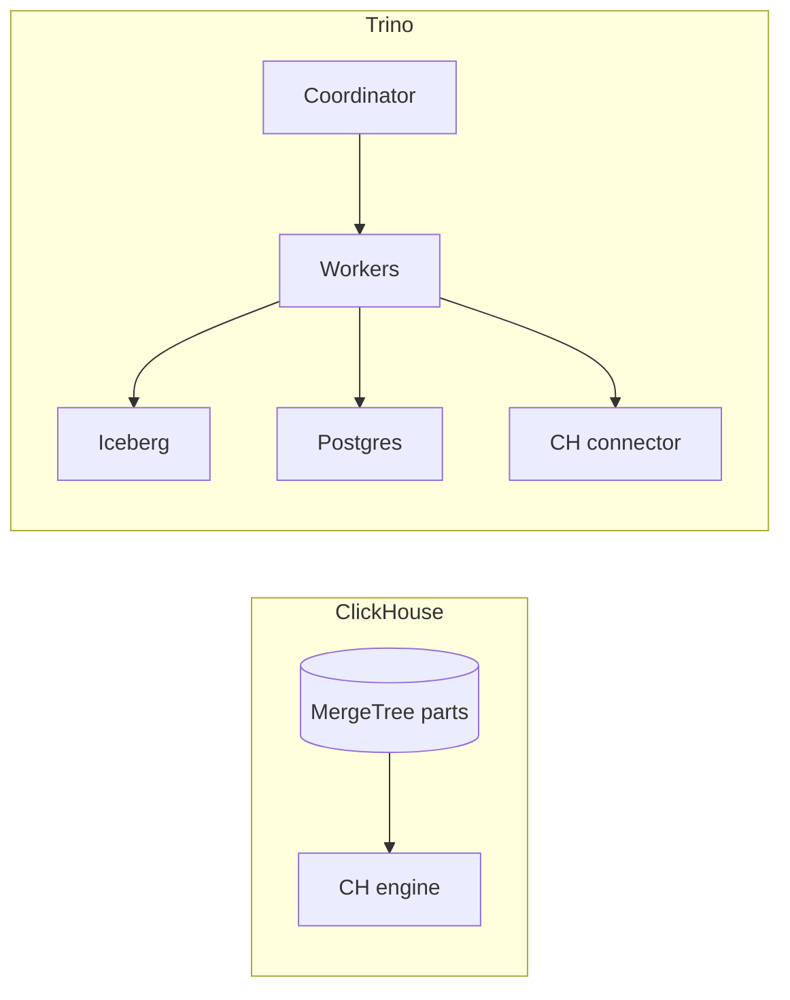

# ClickHouse vs Trino

These are the most commonly smashed-together names in analytics. They do not compete if you specify the workload.

**ClickHouse** is storage **plus** a vectorised engine. It is fast because of **how it lays out parts** (`ORDER BY`, granules, compression).

**Trino** is a **query engine only**. It is useful because it **does not store** your data and can join Iceberg, Postgres, and ClickHouse in one SQL statement.

Putting Trino in front of ClickHouse to serve a 100 ms dashboard throws away the reason you run ClickHouse. Putting ClickHouse in front of five company-wide systems as a federation layer throws away the reason you run Trino.

Related: [Trino](../query-engines/trino.md), [ClickHouse](../olap/clickhouse.md), [observability](../architectures/observability.md).

---

## The core difference



ClickHouse performance is a **physical design** problem — tuning `ORDER BY` and part layout does nothing for Trino-on-Iceberg. Trino performance is a **split, exchange, and connector pushdown** problem — tuning Iceberg file size does nothing for a ClickHouse table on NVMe. Applying one engine's tuning advice to the other is a category error. Coordinator RAM is a Trino incident; too many parts is a ClickHouse incident (see [incidents](../incidents/index.md)).

**Cost shape differs too:** Trino is compute-on-read — cheap if idle, expensive if analysts scan two years hourly, and can scale to zero. ClickHouse is storage+compute always-on for the hot set — idle ClickHouse still holds its NVMe. **Availability differs too:** ClickHouse replicas keep serving if one node dies (for that shard); a Trino coordinator death kills all in-flight queries cluster-wide, which is why production ETL needs an HA coordinator setup even though exploratory queries can tolerate a single one.

---

## Query shapes

| Scenario | ClickHouse | Trino |
|----------|------------|-------|
| Single-table dashboards on CH data | Extremely fast | Extra hop, worse |
| JOIN Iceberg ↔ Postgres | No (not as a federator) | Yes |
| Lakehouse SQL on Iceberg | Possible via S3 tables, not native-best | Native |
| 100 ms product tile | Yes, if designed | Only with cache / luck |
| ETL: Iceberg → Iceberg | Awkward | Common (Trino `CTAS`/`INSERT`, or Spark for heavier shuffles) |
| Persist results | Tables | Not its job — workers are compute, they don't remember data |

**What each cannot do, honestly.** ClickHouse cannot be a good catalogue of *other* systems, join CH to OLTP with Trino's elegance, or replace Iceberg as a cheap multi-year store without ops pain. Trino cannot match CH on CH-local parts, remember data between queries, or protect you from a cartesian join that OOMs the coordinator.

**The connector trap:** Trino *can* query ClickHouse, and ClickHouse *can* read S3/Iceberg in some setups — neither makes one a substitute for the other. Use the Trino→CH connector for ad-hoc joins of CH aggregates to lake data, not to serve the customer UI (two planners, extra serialization, coordinator as a SPOF). Reading Iceberg from CH throws away Iceberg's own metadata pruning; don't then blame CH for being slow.

---

## Decision

```
Is data already in CH and SLO is milliseconds?    → ClickHouse
Is data spread across Iceberg / Postgres / others? → Trino
Need both?                                         → ClickHouse hot (7–30 d), Trino cold (the lake)
Need to store data?                                → Not Trino
Need to federate five company systems?             → Not ClickHouse
Point get by primary key?                          → Postgres/KV, neither
Infra alerting?                                    → TSDB, neither
Multi-hop graph traversal?                         → Neo4j, neither
Total data under 10 GB?                            → Start with Postgres, neither
```

Collect Iceberg stats and limit bytes scanned before you let analysts `JOIN` unconstrained — Trino without stats **guesses** at broadcast vs partitioned join, and guessing wrong on a two-year events table is an incident. ClickHouse's planner is also simple, but its sparse index is a different safety net that only pays off when `ORDER BY` matches the query.

!!! warning "Anti-patterns"
    - "Trino on Kafka for live dashboards" — you're using a federated batch engine as a streaming store; use Flink + ClickHouse instead. The Trino Kafka connector is for exploration, not Grafana.
    - Putting Cube/Looker/Redis in front of Trino to hit 100 ms — you've built a worse ClickHouse (cache invalidation, cold starts) instead of materializing the known tile in CH or a materialized view.
    - One coordinator serving 200 analysts *and* production CTAS jobs.
    - A `JOIN` on an events table with no `date` filter.
    - Using Trino as a Kafka consumer group — you inherit lag *and* coordinator risk.

---

## On-call tells

| Symptom | Likely cause |
|---------|--------------|
| Query 10× slower after an `ORDER BY` change or part explosion | ClickHouse |
| Coordinator OOM during an exchange/hash join | Trino |
| S3 LIST storm, planning takes minutes | Iceberg + Trino (snapshot/file count) |
| Dashboard timeout at 03:00 | CH merges or Iceberg compaction — not "Trino is slow" |

| Engine | Classic OOM | Blast radius |
|--------|-------------|---------------|
| ClickHouse | `GROUP BY` / `JOIN` / `ORDER BY` without a memory limit | That query killed; others survive if `max_memory_usage` is set per query |
| Trino | Coordinator plan, broadcast, or result-gather buffer | Whole cluster down — see [incident 6](../incidents/index.md) |

Per-query memory limits are mandatory on Trino for exactly this reason; ClickHouse needs `max_memory_usage` so one analyst's query can't kill the on-call dashboard. Work the [ClickHouse lab](../labs/index.md) and a Trino incident before you let analysts run unconstrained joins.

---

## Worked examples

**Observability, hot vs cold** ([architecture](../architectures/observability.md)): error rate for one service over 15 minutes is ClickHouse (`ORDER BY (service, timestamp)`, NVMe). Traces for a service last quarter joined to a Postgres CMDB is Trino (Iceberg + Postgres connector). That same quarter-long query refreshed every 2 seconds in Grafana is neither — pre-aggregate it, or you'll DDoS both the coordinator and S3.

**Query pair that shows the trap:**

```sql
-- A: ClickHouse's job. ORDER BY (customer_id, timestamp) makes this a sparse-index hit.
-- Running it through Trino-on-Iceberg means reading files and paying S3 to miss 100 ms.
SELECT toStartOfMinute(ts), countIf(status >= 500)
FROM events WHERE customer_id = ? AND ts > now() - 3600 GROUP BY 1;

-- B: Trino's job (or Spark). ClickHouse would need a live copy of `billing`.
-- A nightly dump into CH is fine if this becomes a dashboard; if it's ad-hoc weekly, the copy is waste.
SELECT c.plan, count(DISTINCT e.user_id)
FROM iceberg.events e JOIN pg.billing c ON e.customer_id = c.id
WHERE e.date = '2024-01-15';
```

Forcing query A through Trino "so we only have one SQL engine" is how you pay p99 for a decision that was really about headcount.

**E-commerce Monday morning** ([architecture](../architectures/ecommerce.md)): `GMV yesterday` off Iceberg via Trino or a warehouse job takes minutes and that's fine. A merchant's live GMV tile is a ClickHouse aggregate, not Trino. Checkout stays on Postgres. Three engines, three SLAs, on purpose.

---

## FAQ

**Trino connector to ClickHouse for everything?** Ad-hoc only. Dashboards stay on ClickHouse native.

**ClickHouse's S3 table engine — is that federation?** It's useful for cheap storage of ClickHouse's own data. It is not a federated query mesh across other systems' data.

**Spark SQL vs Trino on Iceberg?** Both valid, different axis. Trino: many concurrent users, federation, no session state. Spark: heavy ETL and shuffles, same job as the writers. (See also [Spark vs Flink](spark-vs-flink.md) — a different comparison entirely.)

**Presto vs Trino?** Trino is the PrestoSQL lineage under a new name. Use Trino.
