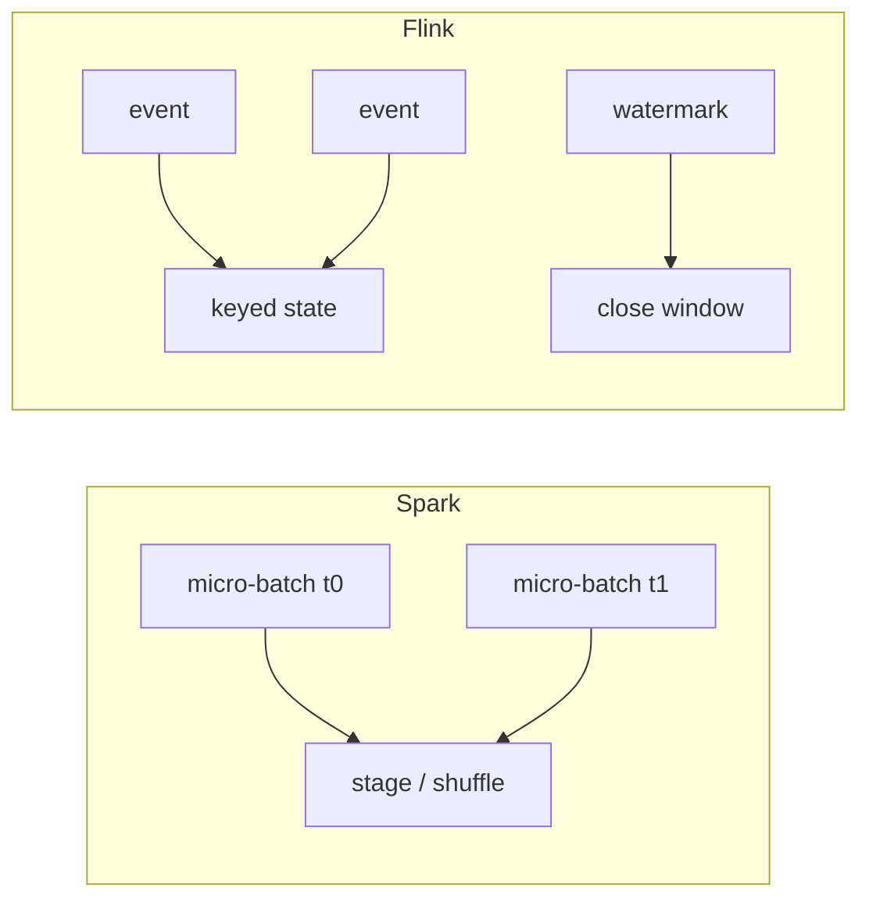

# Spark vs Flink

Both process data at scale. They are not two brands of the same engine. Spark's unit of work is a **batch (or micro-batch) of partitions**. Flink's unit of work is an **event and the keyed state it updates**. That origin story decides latency, time, recovery, and APIs. If you ignore it, you will implement sessionization in Spark and hate your life, or shuffle-join a 20 TB lake in Flink and hate your cluster.

Related: [Spark mental model](../spark/mental-model.md), [Flink time](../flink/time.md), [fraud](../architectures/fraud.md), [observability](../architectures/observability.md).

---

## The core difference

**Spark** was a batch engine. Structured Streaming arrived later as **micro-batches** on the same DAG, Catalyst, and shuffle. Batch is the native tongue.

**Flink** was a streaming engine. Batch is a bounded stream. State, watermarks, and checkpoints are native.



If your job is "read Iceberg, join, write Iceberg," you are speaking Spark. If your job is "count failed logins per user with event-time sessions," you are speaking Flink.

---

## Workload, not features

| Workload property | Spark | Flink |
|-------------------|-------|-------|
| SLA minutes–hours | Native | Works; more moving parts |
| SLA 10–500 ms | Poor fit | Native |
| Huge shuffle / SQL / lakehouse | Best | Possible, not why you bought it |
| Keyed state days long | Awkward | Native (RocksDB) |
| Event-time + late data | Supported, coarse | First-class |
| Team language | PySpark everywhere | JVM first; PyFlink OK |
| ML on the same cluster | MLlib / then Ray | Usually export |

---

## Latency

| Metric | Spark Structured Streaming | Flink |
|--------|---------------------------|-------|
| Floor | ~100 ms micro-batch (often 1–30 s in prod) | Event-by-event, <10 ms possible |
| Typical streaming | Seconds | 10–500 ms |
| Batch | Minutes–hours | Minutes–hours |

Sub-second **authorisation** ([fraud](../architectures/fraud.md)): Flink or not-a-stream-processor. "Streaming" Spark at 10 s is not a fraud score.

---

## State and time

**Spark:** `mapGroupsWithState` / `flatMapGroupsWithState` exist. You will still think in micro-batches. State TTL and size are less pleasant than Flink's.

**Flink:** `ValueState`, `ListState`, `MapState`, timers, RocksDB, per-key TTL. This is why Flink exists for velocity checks and sessions.

**Watermarks:** Spark applies them on batch boundaries. Flink's watermarks close windows in event time and have **idleness** and side outputs for late events. A stalled watermark with **no output** is a Flink-shaped incident — [practice it](../incidents/index.md).

---

## Exactly-once

**Spark:** end-to-end with idempotent sinks and offsets in a checkpoint location. Delta/Iceberg commits help.

**Flink:** checkpoint barrier alignment + two-phase commit sinks (Kafka). Easier to *say* exactly-once; you still need a sink that participates. ClickHouse JDBC is often **at-least-once + idempotent inserts**.

Neither magically deduplicates a non-transactional HTTP API.

---

## Ecosystem and APIs

**Spark:** PySpark DataFrames, Spark SQL, Iceberg/Delta/Hudi, MLlib, a UI every on-call has used. Structured Streaming is the same engine in smaller bites.

**Flink:** DataStream (power), Table/SQL (good, not Spark-shaped), connectors, RocksDB state. Talent pool smaller; checkpoint/watermark literacy is mandatory.

Pick the API you will **debug at 03:00**. A clever Flink job nobody can watermark is not a win. Operationally Spark is easier for batch teams. Flink pays off when you **need** state and time, not a resume keyword.

PyFlink vs PySpark: both are Python. PySpark DataFrame is mature. Heavy Flink still likes JVM. "We only know Python" is an argument for **Spark**, not Flink.

---

## Choose Spark when

- The job is read → transform → write on a lake, hourly or nightly.
- Latency of **minutes** is in the SLA.
- The team already ships PySpark and the problem is shuffle/skew, not event time.
- You need mature SQL, AQE, broadcast joins.
- Structured Streaming at 5–30 s is enough (simple enrich, no heavy sessions).

## Choose Flink when

- p99 is **sub-second** or a few hundred ms.
- Keyed state is the product (fraud velocity, IoT z-score, session windows).
- Event-time correctness with out-of-order devices/logs matters.
- You need continuous alerting/enrichment with backpressure into Kafka.

## Choose neither when

- A SQL warehouse + dbt nightly meets the SLA — no cluster.
- The 200 ms path is a **feature lookup + model sidecar**, and Kafka is only logging. That is a service, maybe fed by Flink **offline**.
- The work is hyperparameter search / PyTorch — [Spark vs Ray](spark-vs-ray.md).
- You only needed a message bus. Kafka is not a processor.

!!! warning "Anti-pattern"
    "We bought Kafka, so we need Flink." Kafka is a log. Nightly Spark from the log is a valid architecture ([e-commerce V1](../architectures/ecommerce.md)).

---

## Running example: observability

[Observability](../architectures/observability.md) at 5M events/s:

| Path | Engine | Why |
|------|--------|-----|
| Enrich, redact, 1-min rollup, alerts | **Flink** | Continuous, state, backpressure |
| Hourly raw → Iceberg, 90-day compact | **Spark** | Shuffle, SQL, table format |

Using Flink to rewrite a 200 TB Iceberg table is possible and usually worse. Using Spark Structured Streaming for watermarked anomaly windows is possible and usually worse.

**Fraud:** Flink on the score path; Spark for label joins and training sets. Neo4j is not in this comparison.

**IoT:** Flink windows for 1-min rollups; Spark only if rollups are batch-OK.

---

## Both together (default for serious platforms)

```
Kafka → Flink  → ClickHouse     (seconds)
     → Spark  → Iceberg → Trino (hours)
```

This is not waste. It is two SLAs. Sharing "one compute cluster to simplify ops" often **complicates** ops: checkpoint tuning next to shuffle-heavy SQL.

---

## Decision checklist

```
Latency < 1 s?                         → Flink (or not Spark)
Keyed state / sessions / velocity?     → Flink
Primary work is lakehouse SQL?         → Spark
Team is PySpark and SLA is minutes?    → Spark
Need both dashboards and history?      → Both, split by path
Only reason is "streaming someday"?    → Spark batch, revisit
```

---

## Internals you should be able to name on-call

| | Spark | Flink |
|---|-------|-------|
| Parallelism | Partitions / tasks | Max parallelism, keys, slots |
| Shuffle | Stage boundary, spill | Network buffers, credit-based backpressure |
| Recovery | Recompute lineage / shuffle files | Checkpoint restore |
| Skew | AQE, salting | Hot keys → one operator subtask |
| UI | Spark UI stages | Flink dashboard, backpressure, watermarks |

If you cannot name the metric for "this key is hot," you are not ready to run that engine. Labs: [Spark](../labs/index.md), [Flink](../labs/index.md). Incidents: executor OOM, stalled watermark.

---

## Worked numbers: 100k events/s enrich

Assume 500 B JSON, simple enrich (lookup country from IP in a map of 50k prefixes), write CH + Iceberg.

| If SLA is 30 s | Spark Structured Streaming trigger 10 s, 48 Kafka partitions, 48 cores. Enough. |
| If SLA is 200 ms | Flink, same partitions, in-memory map or async I/O. Spark micro-batch will not hit 200 ms p99. |
| If enrich is 20 TB Iceberg join | Spark. Flink can read Iceberg; you will still want Spark SQL for the join and AQE. |

Same Kafka topic, two jobs, two SLAs — [analytics](../architectures/analytics-platform.md).

---

## API gravity

Teams copy what they know.

- DataFrame-shaped people will implement Flink as "mini Spark" (batch windows of 5 minutes, no keyed state) and pay Flink's ops cost for Spark's model. Use Spark.
- Stream-shaped people will implement Spark as "Flink with pain" (`mapGroupsWithState` for velocity). Use Flink.

The **code shape** you want (map over events + state vs SQL over tables) is a valid selection input, not a cop-out.

PyFlink vs PySpark: both are Python. PySpark DataFrame is mature. PyFlink DataStream is usable; heavy UDFs still like JVM. Do not pick Flink "because the team only knows Python" — that argument picks **Spark**.

---

## Checkpoint vs shuffle file

When a Spark executor dies, the stage **recomputes** (or reruns from shuffle files). When a Flink TM dies, the job **restores a checkpoint** (all operators rewind to a consistent barrier). Operational consequences:

- Spark: a 2-hour batch can lose 20 minutes of a stage. Annoying. Idempotent sink still required on retries.
- Flink: a restore may **re-emit** a few seconds/minutes to the sink. CH duplicates unless idempotent. Kafka transactional sink if you need EOS.

"Exactly-once" in a slide without sink participation is a lie for both.

---

## Structured Streaming traps that look like Flink

- `foreachBatch` to CH: at-least-once; you wrote Spark and got a worse Flink sink.
- Watermark + window in Spark: works; late data handling is clumsier; UI is stages not watermarks.
- 1 s trigger: cluster sits in scheduling overhead; still not event-by-event.

If you need 1 s trigger everywhere, you wanted Flink (or not to use a general processor).

---

## Review script

1. Write the SLA in milliseconds.
2. Is there keyed state that must survive a restart? If yes and large, Flink RocksDB.
3. Is the output a table in Iceberg with huge joins? Spark.
4. Are you picking both? Name **two** consumers.
5. Reject "streaming someday."

---

## Operational complexity (what 03:00 looks like)

**Spark:** shuffle spill, executor OOM, driver OOM from `collect`, small files, dynamic allocation fighting autoscaler. UI is stages and tasks. Most data engineers have muscle memory.

**Flink:** checkpoint duration, aligned vs unaligned, RocksDB I/O, backpressure (OK vs high), watermark stalls, max parallelism frozen at job start, savepoint upgrade. UI is operators and watermarks. You cannot fake this literacy.

If the job is a nightly Iceberg compact, do not volunteer for the second list.

---

## Cost sketch (same 100k events/s)

- Spark 10 s micro-batch, 48 cores, CH sink: you pay **cores × hours**. Idle between batches if you over-provision.
- Flink 48 slots always on: you pay **24×7** for the privilege of 200 ms. Worth it for fraud; waste for NPS CSV.

Always-on is a **product** of streaming engines. Batch clusters can scale to zero. That cost difference is a selection input.

---

## Migration stories that fail

- "Rewrite all Spark in Flink" because Kafka arrived. Kafka is a log; Spark reads it.
- "Flink batch will replace Spark" — possible, rarely cheaper for SQL-on-lake.
- "Spark 1 s trigger is Flink" — it is not ([latency table](#latency)).

Migrate **one consumer** with a new SLA, leave the lake jobs.

---

## Side-by-side internals

| | Spark | Flink |
|--|-------|-------|
| Unit | Partition / stage | Record / key / operator |
| Time | Batch clock + optional watermark | Event time native |
| State | Limited streaming state | First-class, RocksDB |
| Recovery | Recompute stage | Restore checkpoint |
| Backpressure | Upstream lag / source rate | Credit-based, visible in UI |
| SQL | Very strong | Strong and catching up |
| Lakehouse writes | Native | Connectors, improving |

---

## Choose-neither recap

Use **neither** when the work is a SQL warehouse, a 200 ms sidecar with no stream, Ray Tune, or ClickHouse materialized from Kafka engine without logic. Processors are not mandatory because events exist.

---

## FAQ

**Can Flink SQL replace Spark SQL on Iceberg?** For some jobs. Huge shuffle, AQE, broadcast, file commit maturity still lean Spark. Do not migrate a lake platform for fashion.

**Can Spark do fraud velocity?** Poorly. Micro-batch counters lag the 200 ms path. Use Flink or an in-memory service.

**Do we need both clusters?** If you have both SLAs, yes. One k8s **cluster** with two operators is fine; one **job type** is not.

**Kafka Streams instead of Flink?** Valid for simple JVM apps colocated with Kafka. Complex event time, large state, SQL — Flink. Not Spark.

**Is batch a special case of streaming?** In Flink's theory, yes. In your team's operations, nightly Spark is still the special case you can run.

---

## Anti-patterns (explicit)

- 1 second Spark trigger on a 200-node cluster for a count that CH Kafka engine could do.
- Flink job that only `map`s JSON and writes Iceberg hourly — Spark.
- Shared checkpoint directory with no owner.
- Max parallelism 1 "until we scale" — you will rewrite state.

---

## Reading list in this academy

[Spark mental model](../spark/mental-model.md), [shuffle](../spark/shuffle.md), [Flink time](../flink/time.md), [state](../flink/state.md), [checkpoints](../flink/checkpoints.md), [module comparison](../flink/comparison.md), labs, incidents 2 and 3.
