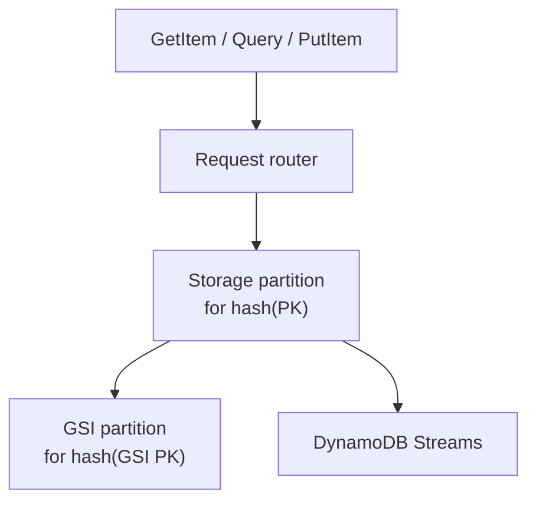

# DynamoDB

CloudWatch alarm, 11:40 AM: `ThrottledRequests` on the sessions table is nonzero. One enterprise tenant's checkout requests are timing out with `ProvisionedThroughputExceededException`; every other tenant reads and writes fine on the same table, same billing mode, same total provisioned capacity.

Why is one tenant throttled while the rest are healthy?

A. The table's overall throughput is under-provisioned — raise it.
B. That tenant's partition key is receiving disproportionate traffic — one hot partition, not a table-wide problem.
C. A GSI on that item is eventually consistent and lagging.
D. That tenant's items exceed the 400 KB item-size limit.

Pick one before reading on. The e-commerce session API needs to put and get a **cart + auth blob** in single-digit milliseconds, without a pager for compaction, repair, or a primary failover, and the IoT control plane needs the same shape for **device_id → firmware** — the kind of workload where the access pattern fits a **partition key and an optional sort key**, and you're willing to pay AWS for that convenience. DynamoDB is that store. It is not a SQL database with a different logo, and single-table design is a **technique**, not a religion.

---

## Use case

**Session store:** `session_id` → JSON, TTL, 200k QPS, no analytics.

**Device registry:** `device_id` → attributes; occasional `region + firmware` listing at 1 QPS.

**Observability** is usually the wrong fit: high ingest of unbounded time series belongs in Cassandra/ClickHouse/Kafka, not in a per-request WCU bill — unless you are storing **pointers** (trace id → S3 key), not the spans themselves.

---

## Why this is hard

Managed does not mean unconstrained:

- Throughput is **per partition**, not “infinite table.”
- Every extra access pattern is a **GSI** (or a second table) that **you pay on every write**.
- Strong consistency is per-item on the base table; **GSIs are eventually consistent**.
- Item size, 400 KB, collection size, hot keys — the physical model is still a hashed partition.

Teams fail by treating Dynamo as Postgres (ad-hoc query) or as Cassandra (cheap unbounded writes). The bill and the hot-key graphs arrive together.

---

## Intuition

A table is a set of items. Each item is identified by:

- **Partition key (PK / HASH)** — required. Hashes to a storage partition.
- **Sort key (SK / RANGE)** — optional. Orders items **inside** that partition. Enables `begins_with`, `between`, `>`, `LIMIT`.

```
PK                 SK                 attrs
USER#u001          PROFILE            name, email
USER#u001          SESS#s9            cart_json, ttl
USER#u001          SESS#s8            ...
DEVICE#d42         PROFILE            firmware, region
```

`Query` is “this PK, SK condition.” `GetItem` is “this PK+SK.” `Scan` is “the whole table” — a bug on the hot path.

PartiQL is a SQL-shaped skin over the same rules. `SELECT * FROM sessions WHERE coupon = 'X'` is still a **scan** unless `coupon` is the key or a GSI key.

---

## Internals



**Partitions.** AWS splits a table by key ranges as it grows. A single partition has a **throughput ceiling** (historically on the order of 3000 RCU and 1000 WCU — treat as a finite budget, check current docs). Adaptive capacity can **rebalance** over minutes, not milliseconds. A celebrity key still saturates **one** partition.

**Capacity.**

| Mode | Meaning |
|------|---------|
| On-demand | Pay per request; still partition-hotspot sensitive |
| Provisioned | RCU / WCU you set; burst + autoscaling |

**RCU:** one strongly consistent read of ≤4 KB = 1 RCU; eventually consistent = 0.5 RCU. **WCU:** one write ≤1 KB = 1 WCU. A 3 KB session write is 3 WCU. A GSI with the same item **adds WCU**.

**LSI vs GSI.**

| | LSI | GSI |
|--|-----|-----|
| Key | Same PK, different SK | Different PK/SK |
| Consistency | Can be strongly consistent | Eventually consistent |
| When | At table create; sparse-ish | Anytime; **you pay writes** |
| Projection | KEYS_ONLY / INCLUDE / ALL | Same — ALL doubles storage and write size |

**Streams.** Time-ordered change log per shard (not the same as Kafka, but usable): `NEW_IMAGE`, `OLD_IMAGE`, `NEW_AND_OLD_IMAGES`. Fan-out to Lambda, OpenSearch, a graph loader, or an Iceberg writer. This is how you **avoid** turning Dynamo into an analytics engine.

**Transactions.** `TransactWriteItems` — up to 100 items, extra WCU, not a replacement for a relational checkout saga. Conditional expressions (`attribute_not_exists`, version numbers) are the common CAS tool.

---

## How

### Session store (one table, one key)

```python
import os
from datetime import datetime, timedelta, timezone
import boto3
from boto3.dynamodb.conditions import Key

table = boto3.resource("dynamodb").Table("sessions")

def put_session(session_id: str, payload: dict, ttl_hours: int = 24):
    exp = int((datetime.now(timezone.utc) + timedelta(hours=ttl_hours)).timestamp())
    table.put_item(
        Item={
            "pk": f"SESS#{session_id}",
            "sk": "META",
            "payload": payload,
            "expires_at": exp,  # TTL attribute enabled on table
        }
    )

def get_session(session_id: str) -> dict | None:
    r = table.get_item(Key={"pk": f"SESS#{session_id}", "sk": "META"})
    return r.get("Item")
```

No GSI. Query pattern is GetItem. This is the design you want.

### Device registry + sparse fleet listing

Base table: PK `DEVICE#{id}`, SK `PROFILE`.

GSI only because Q3 exists: `gsi_region_fw` with PK `region`, SK `firmware#device_id`.

```python
def put_device(device_id, region, firmware):
    table.put_item(
        Item={
            "pk": f"DEVICE#{device_id}",
            "sk": "PROFILE",
            "region": region,
            "firmware": firmware,
            "gsi_pk": f"REGION#{region}",
            "gsi_sk": f"FW#{firmware}#{device_id}",
        }
    )

def devices_in_region_below(region, fw_exclusive, limit=100):
    return table.query(
        IndexName="gsi_region_fw",
        KeyConditionExpression=Key("gsi_pk").eq(f"REGION#{region}")
        & Key("gsi_sk").lt(f"FW#{fw_exclusive}"),
        Limit=limit,
    )
```

If fleet listing is rare and can be minutes-old, **Stream → warehouse** is cheaper than a GSI you write 50k times/s.

### Single-table when it actually helps

One **service** (checkout) with 4 known access patterns that share entity lifetime:

```
PK              SK                 GSI1PK           GSI1SK
USER#u001       PROFILE
USER#u001       ORDER#o88
ORDER#o88       ITEM#sku1
ORDER#o88       META               STATUS#OPEN      ORDER#o88
```

```python
# all orders for a user — one Query, one PK
table.query(KeyConditionExpression=Key("pk").eq("USER#u001") & Key("sk").begins_with("ORDER#"))
```

This is **not** “the company shares one table.” Cross-team overloaded keys are un-evolvable.

### PartiQL-style (same keys, SQL costume)

```sql
-- GetItem
SELECT payload FROM "sessions" WHERE pk = 'SESS#s9' AND sk = 'META';

-- Query
SELECT * FROM "shop" WHERE pk = 'USER#u001' AND sk BEGINS WITH 'ORDER#';

-- This is a SCAN unless coupon is a key/GSI
SELECT * FROM "sessions" WHERE payload.coupon = 'SAVE20';
```

Use PartiQL if the team will not accidentally write the third statement. The API is not a query planner like Postgres.

### Streams → downstream

```python
# Event source: DynamoDB stream NEW_AND_OLD_IMAGES
def handler(event, _ctx):
    for rec in event["Records"]:
        if rec["eventName"] in ("INSERT", "MODIFY"):
            new = rec["dynamodb"]["NewImage"]
            emit_to_kafka({"device_id": new["pk"]["S"], "firmware": new["firmware"]["S"]})
```

Fraud graph loaders and Iceberg CDC start here — Dynamo stays the **online** table.

---

## Single-table vs not (not a religion)

| Use one table when | Use many tables when |
|--------------------|----------------------|
| Access patterns known and few | Different teams, different SLOs |
| You need one Query to fetch a graph of items with the same PK | Isolated capacity, isolated IAM, isolated backup |
| Item collections stay bounded | Huge unrelated entities would share hot-key fate |

Single-table design exists because **Query is per PK** and **joins do not exist**. It is a way to colocate bytes. It is not a purity test. A sessions table + a devices table is professional. A 60-entity overloaded table with 8 GSIs is a tax.

---

## Gotchas

!!! warning "Hot keys"
    `PK = STATUS#OPEN` for all open orders. One partition, all the WCU. Shard: `STATUS#OPEN#{0..N}` and fan-out reads.

!!! warning "GSI write tax"
    Every PutItem that projects to a GSI pays extra WCU. `ALL` projection copies the whole item. Sparse GSIs (attribute missing → not indexed) are your friend.

!!! warning "Scan in production"
    Pagination + 1 MB pages + consumed capacity. You will page-limit yourself into an outage.

!!! warning "Large items"
    400 KB hard limit per item. Sessions that include clickstream will hit it fast. Store blobs in S3, pointer in Dynamo. (The 1 MB figure you'll see elsewhere is the Query/Scan response-page limit, not the item-size limit.)

!!! warning "Strongly consistent read on GSI"
    Does not exist. Do not “read your write” from a GSI.

!!! warning "On-demand is not a hotspot cure"
    Partition still has a ceiling. Adaptive capacity is slow relative to a flash sale.

!!! warning "Transactions as architecture"
    100-item transactions at checkout QPS will dominate cost and latency. Prefer single-item CAS + outbox.

---

## Failure modes

- **Throttling (`ProvisionedThroughputExceeded`)** on one key while the table-level metric looks fine. CloudWatch **per-partition** (or contributor insights) tells the truth.
- **GSI backlog.** Base table accepts writes; GSI lags; “query the GSI” returns stale or throttles independently if provisioned separately.
- **Hot partition during a sale** on `SKU#popular`. Inventory counters in one item are a famous anti-pattern — shard the counter.
- **TTL lag.** Expiry is best-effort (can be 48 h class delay historically). Do not use TTL as a legal-delete guarantee.
- **Stream iterator age.** Lambda too slow; you drop or lag change processing; downstream graph/search diverges.
- **Account / table limits** (max GSI count, max item size, max batch 25). Design reviews should list them.

---

## Debugging

| Signal | Tool |
|--------|------|
| Throttles vs consumed | CloudWatch: `ThrottledRequests`, `ConsumedRead/WriteCapacity` |
| Which key | CloudWatch Contributor Insights, or log PK from the app |
| Item size | ReturnConsumedCapacity TOTAL on a sample |
| GSI lag | GSI `OnlineIndexPercentageProgress` (build), then its own throttle metrics |
| Why a Query is slow | `Limit`, page count, `FilterExpression` (filter **after** read — you still pay) |

`FilterExpression` is not a key condition. You pay to read items, then throw them away. If you filter 99%, the key is wrong.

---

## Scale: 10× / 100× / 1000×

**10×.** On-demand or modest provisioned + autoscaling. Session table stays GetItem. Watch p99 and throttles on the busiest `user_id`.

**100×.** Hot keys dominate. Write sharding, cache (DAX or Redis) in front of **read-heavy** profiles, Streams to ClickHouse for anything resembling analytics. GSI count should go **down**, not up — extra patterns go to derived stores.

**1000×.** Partition math is the design: you cannot put 100k WCU on one `device_id`. Split entities, isolate tables per bounded context, and treat Dynamo as the **online micro-store**. Bulk export (Export to S3) for lakehouse; never Scan. Cost: WCU × copies (GSIs) × item KB will exceed an equivalent C* cluster if you stored observability payloads here — move that data.

---

## Trade-offs

You gain: no nodes, IAM-native, predictable item latency, Streams, TTL, global tables (with caveats).

You give up: query flexibility, cheap scans, strongly consistent secondary indexes, portable ops, and cost that tracks **request volume and item size** rather than a box you already own.

Global tables: multi-region **last-writer-wins** at item level. Not a distributed relational transaction.

---

## Alternatives

| If you need | Use |
|-------------|-----|
| Sub-ms ephemeral | Redis / MemoryDB |
| You already run CQL, huge time-series writes | [Cassandra / Scylla](cassandra.md) |
| Ad-hoc + joins | Postgres |
| Analytics | [ClickHouse](../olap/clickhouse.md) / Iceberg |
| Same key model, not AWS | Cassandra, FoundationDB, or Cosmos-class stores — **re-model**, do not lift PartiQL |

---

## Apply

You are here when a team says “put it in Dynamo, it scales,” when a GSI is added per sprint, when `Scan` is in a Lambda on a schedule “just for now,” or when single-table is mandated by an architecture review instead of a query list.

Write the access patterns on a wiki page. If they do not fit Query/GetItem, Dynamo is the wrong store — or you need a **derived** table, not a FilterExpression.

---

## Exercise

??? question "Sessions, devices, and a dangerous GSI"
    200k QPS session get/put, 2 KB items, TTL 24 h. 20M devices, 50k QPS point read, 1 QPS “devices in region with firmware < X.” Product then asks for “all sessions that contain SKU X.”

    1. Table keys for sessions and devices. One table or two? Why?
    2. On-demand vs provisioned at this QPS — what do you actually watch?
    3. Cost of a GSI that projects ALL on the session table (WCU intuition).
    4. How do you implement SKU X without scanning sessions?
    5. Why is storing 400k spans/s in Dynamo a bad academy answer?

??? success "Answer"
    1. **Two tables.** Sessions: PK=`SESS#{id}`, SK=`META` (or SK omitted if single-attribute table). Devices: PK=`DEVICE#{id}`, SK=`PROFILE`, optional sparse GSI `region` / `firmware#id`. Different SLOs, IAM, and TTL; colocating them is ideology.

    2. Either mode can work; watch **throttles per partition** and p99, not average consumed capacity. 200k × 2 KB writes is substantial WCU — provisioned+autoscaling or on-demand, but a hot `session_id` still dies.

    3. Session put already ~2 WCU (2 KB). GSI ALL ≈ another ~2 WCU per put. At 200k puts/s that is hundreds of thousands of extra WCU **continuously**, plus storage. You bought a second table the expensive way.

    4. Dual-write an inverted item `PK=SKU#{x} SK=SESS#{id}` on cart mutate, with TTL; or Stream cart items to a search/OLAP index. Do not Scan sessions; do not FilterExpression on payload.

    5. Span ingest is unbounded, analytical, TWCS-shaped. Dynamo charges per request and per KB, GSIs would multiply it, and time-range queries per service want Cassandra/ClickHouse. Use Dynamo for **trace id → pointer** if anything, not the payload firehose.
