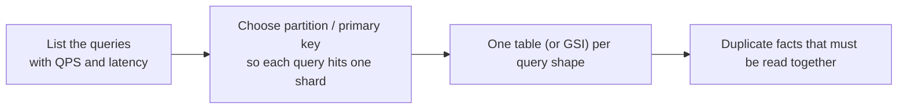
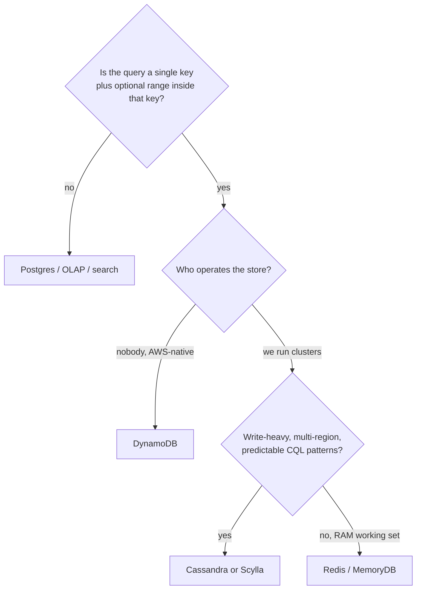

# NoSQL

!!! info "Version and source policy"
    Limits and billing models change. Verify service-specific numbers against primary documentation; see [Versions & Primary Sources](../reference/version-matrix.md).

Capacity review, two weeks before Black Friday. The single Postgres primary that serves checkout sessions, observability writes, and the IoT device registry is projected to blow past its connection limit and WAL throughput at 100× today's traffic. Someone proposes bigger hardware. Someone else proposes read replicas. Someone else says "just move it to NoSQL" without saying which store or why.

What actually fixes each workload?

A. Vertical-scale the Postgres primary — more CPU, more RAM, same schema.
B. Add read replicas in front of the existing tables.
C. Move each workload to a store chosen for its **access pattern** — a key-value or wide-column store keyed the way the hot query is keyed.
D. Shard Postgres by `user_id` and keep the joins.

Pick one per workload before reading on. The checkout API needs session state in single-digit milliseconds, the observability pipeline needs hundreds of thousands of writes per second that survive a zone loss, and the IoT control plane needs a device registry keyed by `device_id` — three shapes that "bigger Postgres" cannot fix at once, because at 100× the primary itself becomes the incident: WAL, bloat, vacuum, and joins you will not run on the hot path. This module is about stores that **start from the access pattern**, not from third-normal-form — they are not "schema-less," they are **query-bound**.

---

## What this module covers

| Topic | What you will learn |
|-------|---------------------|
| [NoSQL thinking](nosql.md) | Access-pattern-first modelling; key-value vs document vs wide-column; when Postgres is enough |
| [Cassandra & ScyllaDB](cassandra.md) | Partition key vs clustering key, wide rows, QUORUM, tombstones, compaction, hot partitions, LWT |
| [DynamoDB](dynamodb.md) | PK + SK, RCU/WCU, hot keys, GSI cost, streams, single-table without the religion |

Read [NoSQL thinking](nosql.md) first even if you already “know Cassandra.” The modelling error is almost always the same: treating the store as a schemaless Postgres.

---

## Three workloads (used everywhere below)

**E-commerce session store.** Key: `session_id` (or `user_id` + `session_id`). Value: cart, auth, A/B flags. TTL hours. Read/write by primary key only. No “carts where coupon = X” on the hot path.

**Observability writes.** Append-only events: `service`, `timestamp`, payload. Huge ingest, time-range reads per service or per host. Almost never “find this string in any field last month” from the write store — that is ClickHouse / a lake.

**IoT device registry.** Key: `device_id`. Attributes: firmware, last_seen, owner, region. Point reads for the control plane; occasional “all devices in region R with firmware < X” which is a **different** table or index, not an ad-hoc scan.

If a candidate design cannot name the **primary key of the hot query**, it is not a NoSQL design. It is a wish.

---

## Central intuition

Relational modelling: **store each fact once**, join at read time.

NoSQL modelling: **store the answer to a query in the shape of that query**, accept duplication, refuse queries you did not design.

That is why “we will add a secondary index later” is a production incident in Cassandra and a **bill** in DynamoDB.

---

## The map of stores (not a product tour)

| Family | Shape | Hot path | Academy examples |
|--------|-------|----------|------------------|
| Key-value | `GET/PUT key` | Session, feature flags, rate limits | Redis, DynamoDB |
| Document | JSON document by `_id` | Aggregates you always read whole (order, profile) | MongoDB, DynamoDB item |
| Wide-column | Partition key + clustered columns | Time-series-per-entity, inbox, event log per user | Cassandra, Scylla, Bigtable |

DynamoDB sits on the KV/document line with a **sort key** that gives you one-dimensional range queries inside a partition — a small slice of wide-column behaviour without CQL.

None of these replace [ClickHouse](../olap/clickhouse.md) for dashboards or [Iceberg](../lakehouse/iceberg.md) + [Trino](../query-engines/trino.md) for investigation. Using Cassandra as a warehouse is a classic failure.

---

## When Postgres is the right answer

Say this out loud in design reviews:

- QPS fits on a primary (or primary + read replicas).
- You need **ad-hoc** query and joins, or the access patterns will change weekly.
- You need multi-row ACID more often than “put this item.”
- The team already runs Postgres well, and the scale argument is theoretical.

A session table of 50k QPS with 2 kB values is often **Postgres + Redis**, not a new cluster. A 5k QPS order API with joins to inventory is **Postgres**. NoSQL starts when you can **list the queries and they are key-shaped**, and a single primary cannot take the write rate or the tail latency.

Details in [NoSQL thinking](nosql.md).

---

## Cassandra vs DynamoDB vs “just Redis”

| | Cassandra / Scylla | DynamoDB | Redis |
|--|-------------------|----------|-------|
| You operate | Nodes, compaction, repairs | Tables, capacity, GSIs | Memory, persistence story |
| Query | CQL matching PK/CK | Query by PK/SK, GSI | GET/SET, limited indexes |
| Multi-region | Tunable, classic | Global tables | Enterprise / replicas |
| Cost model | Hardware | RCU/WCU + storage + GSI writes | RAM |
| Footgun | Tombstones, hot partitions | Hot keys, GSI spend | Eviction, persistence |

**Scylla** is the shard-per-core Cassandra-compatible engine — not a different data model. Treat it as a **runtime**, then still learn partition keys. See [Cassandra & ScyllaDB](cassandra.md).

---

## Consistency, said without a textbook opening

You will choose **how many replicas must ack**. That choice is the product:

- Session store: stale cart for 50 ms is usually fine; lost cart is not. Writes that land on a quorum, reads that tolerate one stale replica — or Redis with AOF.
- Device registry: two writers for one `device_id` need a story (LWT, conditional put, or “last write wins” and live with it).
- Observability: lost 0.01% of spans vs stalled ingest — ingest usually wins; the lake is the system of record.

[Cassandra](cassandra.md) makes this explicit (`QUORUM`, `LOCAL_QUORUM`, `ALL`). [DynamoDB](dynamodb.md) makes you pay for strongly consistent reads and still has **eventually consistent GSIs**.

---

## Failure preview

- **Hot partition / hot key** — one `user_id`, one popular `device_id`, one `type=login` partition. One shard takes the QPS.
- **Tombstones** (Cassandra) — deletes and TTLs that make reads time out months later.
- **Wide rows** — “all events for this user forever” in one partition; a 10 GB row that cannot compact or compactly read.
- **GSI as a query language** — every new access pattern doubles write cost.
- **Single-table as ideology** — one DynamoDB table for the whole company, 40 overloaded keys, nobody can evolve it.

---

## Query list before product list

Write this table before you open a console. The academy workloads fill it like so:

| Workload | Query | Key | QPS | Latency | Rejected query |
|----------|-------|-----|-----|---------|----------------|
| E-commerce session | Get/put cart | `session_id` | 200k | 3 ms | Carts by coupon |
| Observability | Last 15 min spans | `(service, time bucket)` | 400k writes | write ms; read tens of ms | Full-text, global 500s |
| IoT registry | Device profile | `device_id` | 50k | 10 ms | Battery < 10% on this table |

If two queries share a key, they may share a table. If they do not, you are designing **two tables** (or a GSI you will pay for). That sentence is the module.

**Denormalisation is a write path.** Login writes `sess:{id}` *and* `user:{id}:sess:{id}` if you promised “sessions for user.” One of those writes will fail some day — decide whether that is an outbox, a retry, or an acceptable miss.

---

## What “enough Postgres” looks like in numbers

Not gospel — a Staff-level starting prior you must replace with measurements:

- **< 5–10k QPS** mixed read/write, < few hundred GB, joins required → Postgres.
- **Session 100k+ QPS**, tiny values, TTL → Redis or Dynamo in front of (or instead of) a session table.
- **> 100k durable writes/s** with known PK and multi-AZ → Cassandra/Scylla or a log + OLAP, not a bigger RDS instance.
- **Ad-hoc + 10 TB** → not this module ([OLAP](../olap/index.md), [lakehouse](../lakehouse/index.md)).

Vertical scaling still wins more arguments than Twitter-era folklore. The counter-argument is **tail latency and failover**, not average QPS.

---

## How to study this module

1. Write the **query list** for sessions, observability, and the device registry (QPS, latency, key).
2. Read [NoSQL thinking](nosql.md) until “schema-less” feels like a lie.
3. Design Cassandra PK/CK for the observability path on [Cassandra](cassandra.md). Predict the hot partition.
4. Price a DynamoDB GSI in your head on [DynamoDB](dynamodb.md).
5. Only then argue with someone who wants Mongo “because JSON.”

!!! tip "Exit criterion"
    Given a query list, you can pick Postgres vs Cassandra vs DynamoDB, write the keys, and name the failure at 100× (hot key, tombstones, or a GSI bill).

---

## Related modules

- [Partitioning](../foundations/partitions.md) — the same idea at every layer
- [E-commerce architecture](../architectures/ecommerce.md)
- [Observability architecture](../architectures/observability.md)
- [IoT architecture](../architectures/iot.md)
- [Time series](../time-series/index.md) — when the write path is actually a TSDB, not Cassandra
- [OLAP](../olap/index.md) — where the analytical queries go instead
- [Selection framework](../reference/selection-framework.md)
