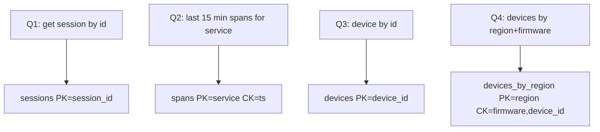
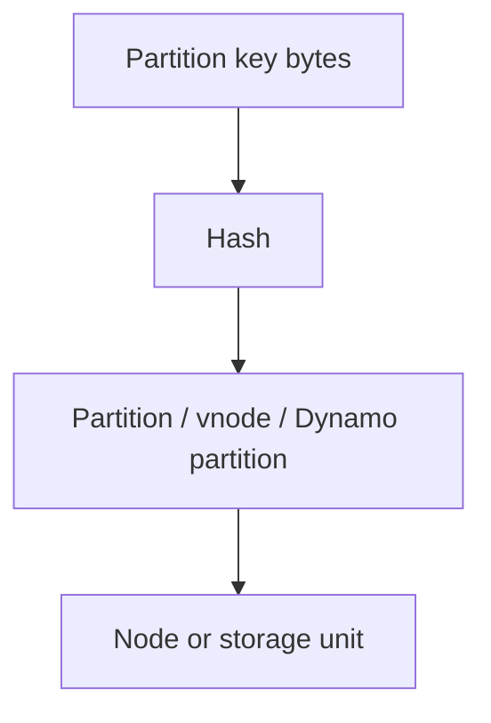

# NoSQL Thinking

Monday, design review. An engineer's one-pager proposes moving `sessions`, `spans`, and `devices` off the overloaded Postgres primary and "into a NoSQL database" — same three tables, same columns, new vendor logo. The reviewer asks one question before approving anything: "What's the primary key of your hottest query, for each table?" The room goes quiet.

What should the answer have been?

A. Whichever column is already the primary key in Postgres today.
B. The column filtered on most often, across all queries combined.
C. A key chosen so each named hot query — this session, this service's last 15 minutes, this device — hits exactly one partition.
D. It doesn't matter much, since the value can just be JSON.

Pick one before reading on. The e-commerce API actually has three storage problems that look similar in a slide deck and are not — a **session store** (`GET/PUT session_id`, TTL 24h, 200k QPS, 3ms p99), **observability writes** (400k spans/s, read last 15 minutes per `service`), and an **IoT device registry** (20M devices, point read/write by `device_id`, rare fleet queries by region + firmware) — and the modelling mistake in that one-pager is treating "NoSQL" as one thing instead of practicing **access-pattern-first design**: not schema-less, but **query-bound**.

---

## Use case

You are Staff on the e-commerce platform. Checkout cannot join `sessions ⨯ carts ⨯ coupons` on the request path. The observability pipeline cannot `INSERT` 400k rows/s into an InnoDB primary. The IoT fleet cannot `SELECT * FROM devices WHERE firmware < …` on the same table that serves 50k point reads/s from the control plane.

Each path needs a store whose **on-disk layout matches the lookup**. That is the use case for this page — not a taxonomy for its own sake.

---

## Why this is hard

Relational training says: normalise, add indexes, the optimiser will find a plan.

At these QPS and tail latencies:

- Extra indexes are extra **write amplification**.
- Joins are extra **round trips and lock domains**.
- A new `WHERE` clause is a **new physical layout**, not a new secondary index you add on Friday.
- Multi-row ACID across unknown keys does not scale like a single-partition put.

The difficulty is psychological: you must **refuse queries**. A store that can answer anything will answer the hot path slowly.

---

## Intuition

Imagine three filing cabinets:

| Cabinet | Label on the drawer | What you can ask |
|---------|---------------------|------------------|
| Sessions | `session_id` | This session, now |
| Spans | `service` then time | This service, this time range |
| Devices | `device_id` | This device; *not* “all cheap sensors in EU” unless you built another cabinet |

If someone asks “all sessions that used coupon SAVE20,” there is **no drawer**. You either scan (you will not) or you built a second table whose key is `coupon_id`. That second table is not a view. It is **denormalised data you now own**.

**Schema-less** in vendor marketing means “the value can be JSON.” It does not mean “query anything.” The **key** is the schema. Miss the key, miss the SLO.



Four queries, four layouts. That is NoSQL modelling.

---

## Internals (what “query-bound” means physically)

All of the interesting stores shard by a **partition key** (hash of the key, or a declared hash key).



Consequences that do not depend on brand:

1. **One request should touch one partition** (or a handful). Scatter-gather across 10k partitions is a denial of service you wrote in CQL/PartiQL.
2. **Hot keys** hash to one partition. `user_id = celebrity`, `service = api-gateway`, `region = us-east-1` as a *partition* key — one drawer gets all the traffic.
3. **Secondary indexes** are either local (same partition — limited) or global (another table you write twice). Global indexes have **their own** hot keys and consistency.
4. **Documents / wide rows** are storage convenience: keep bytes you will read together. They are not a license for unbounded growth (a 2 GB session JSON, a 20 GB Cassandra partition).

CAP/PACELC is real but secondary. The primary constraint is **the key**. Tune consistency after the key is right.

| System | Default bias | You still choose |
|--------|--------------|------------------|
| Postgres | One primary, strong | Replica lag for reads |
| Cassandra | AP, tunable per request | `ONE` vs `LOCAL_QUORUM` |
| DynamoDB | Per-item, strongly consistent reads optional | GSI always eventually consistent |
| MongoDB | Primary reads by default | Secondary reads, sharded scatter |

---

## How — model the three workloads

### 1. E-commerce session store

**Queries:**

- Q1: get session by `session_id` (200k QPS, 3 ms)
- Q2: destroy session (logout)
- Q3: TTL expiry 24 h

**Not queries:** sessions by coupon, sessions by user email, analytics.

```python
# Redis — honest key-value
r.setex(f"sess:{session_id}", 86400, session_json)
r.get(f"sess:{session_id}")
r.delete(f"sess:{session_id}")
```

DynamoDB equivalent: PK `SESS#{session_id}`, SK `META`, attribute `payload`, TTL attribute. No GSI.

If you also need “all sessions for this user” that is **Q4** — a second item collection: PK `USER#{user_id}`, SK `SESS#{session_id}`. You write **two items** on login. You did not become schema-less. You added a query.

Postgres is enough when QPS and size fit; Redis/Dynamo when tail latency and eviction/TTL are the product.

### 2. Observability writes

**Queries:**

- Q1: append span (`service`, `ts`, `trace_id`, payload) at 400k/s
- Q2: read spans for `service` in `[t0, t1]` (last 15 minutes, ops UI)

**Not queries:** full-text, “all 500s in the company,” joins to deploy metadata. Those are [ClickHouse](../olap/clickhouse.md) / the lake.

Cassandra-shaped table (see [Cassandra](cassandra.md) for production keys):

```sql
CREATE TABLE spans_by_service (
    service     text,
    bucket      int,          -- epoch hour — bounds the partition
    ts          timeuuid,
    trace_id    text,
    payload     blob,
    PRIMARY KEY ((service, bucket), ts)
) WITH CLUSTERING ORDER BY (ts DESC)
  AND default_time_to_live = 86400;
```

Partition key is **`(service, bucket)`**, not `service` alone — otherwise `api-gateway` is one infinite hot partition.

### 3. IoT device registry

**Queries:**

- Q1: get device (`device_id`) — 50k QPS
- Q2: update `last_seen`, firmware — same key
- Q3: list devices in `region` with `firmware < X` — 1 QPS, can be seconds

Q1/Q2 are a KV table. Q3 is a **different table** (or GSI) whose PK is `region` and SK is `firmware` + `device_id`. If Q3 were 10k QPS, you would precompute fleets, not scan a GSI.

```python
# DynamoDB items
# PK=DEVICE#{id}  SK=PROFILE     {region, firmware, last_seen}
# GSI1PK=REGION#{region}  GSI1SK=FW#{firmware}#{id}   # only if Q3 is real
```

Conditional write when two controllers update firmware:

```python
table.update_item(
    Key={"pk": f"DEVICE#{device_id}", "sk": "PROFILE"},
    UpdateExpression="SET firmware = :fw, last_seen = :ts",
    ConditionExpression="firmware = :old",
    ExpressionAttributeValues={":fw": new, ":old": old, ":ts": now},
)
```

That is “transaction” as **single-item condition**, not serialisable snapshot over the fleet.

---

## When Postgres is enough

Use Postgres (or Postgres + replica + Redis cache) when most of these hold:

- Peak QPS on the primary is comfortable (measure, do not mythologise).
- Access patterns **will change**; you need new `WHERE` clauses without a migration of every item.
- You need constraints, joins, multi-row transactions for **correctness** (payments, inventory).
- Data fits a vertical primary plus replicas; HA with a known failover story is acceptable.
- The team can operate it.

Examples that should stay relational:

- Orders + order lines + payments (e-commerce **system of record**).
- IAM users and roles with infrequent graph-shaped queries.
- Device registry at 200k devices and 200 QPS.

NoSQL for sessions **in front of** Postgres for orders is a normal hybrid. Replacing the order database with Mongo because the document “looks like JSON” is how you lose joins, reporting, and a decade of tooling.

!!! note "The honest split"
    OLTP system of record → Postgres.  
    Hot key-shaped path → Redis / Dynamo / Cassandra.  
    Analytics → warehouse / OLAP.  
    Multi-hop relationships → [graph](../graph/index.md), and only if the queries say so.

---

## Gotchas

!!! warning "Schema-less is a lie"
    JSON values still have a key, size limits, and indexes you must declare. Evolving the JSON without versioning is just unenforced schema.

!!! warning "One table for every query"
    If you did not list queries, you will add GSIs until the write path falls over.

!!! warning "Secondary index as a crutch"
    In Cassandra, 2i are per-node and dangerous. In Dynamo, GSIs cost write units forever.

!!! warning "Unbounded documents / wide rows"
    A cart with 10 items is a document. A 5-year event history is a time-bucketed log, not a JSON blob.

!!! warning "Using the write store as the analytics store"
    `SELECT count(*) FROM spans WHERE code = 500` on Cassandra is a full cluster scan. Ship to ClickHouse.

---

## Failure modes

- **Hidden query** from a new product manager: “filter sessions by coupon.” Engineering adds a GSI/index on a 200k QPS table. Write latency and cost double. Mitigate: query review as a change-managed interface.
- **Hot key** after a celebrity sale or a single IoT gateway id reused for a fleet.
- **Dual-write drift** when you denormalise user→sessions and only one write succeeds.
- **TTL vs backup.** Sessions expire; legal wants cart history. Those are different stores.
- **ORMs that hide the key.** If the ORM can `filter(coupon=…)` it will, in production.

---

## Debugging

Ask, in order:

1. **What is the partition key of this request?** If the answer is “we scan,” you found the incident.
2. **QPS per key**, not average QPS. p99 latency follows the hottest partition.
3. **Item / row size** over time. Sessions that swallowed clickstream will show as 100 kB+ values and timeouts.
4. **Index write traffic** vs primary write traffic. If GSI WCU ≈ table WCU × N, N is your problem.
5. **Which queries are not on the list.** Logs and ORM traces lie less than architecture diagrams.

---

## Scale: 10× / 100× / 1000×

**10×.** Postgres + cache still wins for the registry and orders. Session store moves to Redis/Dynamo because cache invalidation on the primary is already the outage. Observability **cannot** stay in Postgres — writes dominate.

**100×.** You must **bucket** time partitions, split hot keys (`service` + hour, `user` + shard), and stop serving analytics from the OLTP/NoSQL cluster. Multi-region: decide stale reads vs `LOCAL_QUORUM` / regional Dynamo tables.

**1000×.** Hardware is not the first problem — **key design** is. A single partition’s ceiling (Dynamo ~3k RCU / 1k WCU class limits; Cassandra one-node hotspot) does not grow with cluster size. You introduce write sharding, load-shedding, and a lake for anything that is not the hot GET. Teams that “sharded Mongo” without query lists rediscover this every year.

---

## Trade-offs

| You gain | You give up |
|----------|-------------|
| Predictable latency on listed queries | Ad-hoc query |
| Write throughput on many partitions | Cheap secondary indexes |
| Simple ops for a KV table (especially Dynamo) | Portability, local joins |
| Denormalised read speed | Dual-write correctness |

NoSQL is a **constraint on the product**, not a performance plugin.

---

## Alternatives

| Need | Prefer |
|------|--------|
| Unknown queries, joins, constraints | Postgres |
| Sub-ms cache, ephemeral | Redis |
| AWS-only, ops-averse, key+sort | [DynamoDB](dynamodb.md) |
| Multi-region write-heavy, CQL, you run boxes | [Cassandra / Scylla](cassandra.md) |
| Dashboards, aggregates | [ClickHouse](../olap/clickhouse.md) |
| Full-text | Search engine, not your KV store |
| Time-series metrics | [TSDB](../time-series/index.md) |
| Multi-hop fraud | [Graph](../graph/index.md) |

---

## Apply

You are in this problem when:

- A new index is the proposed fix for a timeout.
- Someone says “Mongo is schema-less so we can iterate.”
- The same Cassandra cluster is used for dashboards.
- Device “list by firmware” was bolted onto the point-read table.

Write the query list with QPS. If you cannot, you are not ready to pick a store.

---

## Document vs wide-column vs KV — same query list, different physical bet

**KV (Redis, Dynamo GetItem).** The value is opaque. You will not range-scan inside it. Sessions and device profiles that are always read whole belong here.

**Document (Mongo, Dynamo item with nested maps).** You occasionally project a path (`cart.items[0]`). You still **start from `_id`**. Nested arrays that grow without bound (append every click into the session document) recreate the wide-row problem inside JSON.

**Wide-column (Cassandra).** You explicitly range-scan **clustering keys** in one partition: last 15 minutes of spans, latest 50 events for a user. That is not “documents,” it is a sorted slice. If you never range-scan, you wanted KV.

The e-commerce **order** document (header + lines) is a reasonable Mongo/Dynamo item if the API always loads the whole order and the line count is bounded. The observability **stream** is a wide-column (or not a NoSQL OLTP store at all). Mixing those instincts — dumping spans into a Mongo document per service — produces 16 MB documents and a pager.

!!! tip "Postgres is a document store too"
    `JSONB` with a GIN index is how many teams should have stayed. Use it until the write rate or the tail latency says otherwise — then you still need a key, not a vibe.

---

## Dual-write and the outbox

Denormalised tables (session + user→sessions, device + region GSI) fail in the gap between two puts. Patterns that Staff are expected to name:

1. **Single item / single partition** as the atomic unit (Dynamo item, Cassandra partition).
2. **Outbox** in Postgres: commit order + outbox row, async projector to Dynamo/Cassandra.
3. **Stream as truth** for the derived table (Kafka → projector), ledger stays Postgres.

Do not “retry until both caches look right” without idempotency keys. Query-bound modelling **increases** the number of writes per business event.

---

## Exercise

??? question "Query-bind the three stores"
    For each workload (sessions, observability spans, device registry):

    1. Write the allowed queries (key, QPS, latency).
    2. Name a query you will **reject** and where it should run instead.
    3. Postgres, Redis, Cassandra, or Dynamo — pick one per workload at 10× and at 100×, and say what key you would hash on.
    4. Product adds “show me all carts that contain SKU X right now.” What do you build, and what do you not do?

??? success "Answer"
    1. Sessions: get/put/delete by `session_id`, ~200k QPS, 3 ms, TTL. Spans: write by `(service, time bucket)`, read last 15 min per service. Devices: get/put `device_id`; optional low-QPS `(region, firmware)` via a second table/GSI.

    2. Reject: session analytics (warehouse), span full-text (search/ClickHouse), “all devices with battery < 10%” on the registry hot table (fleet index or time-series, not the PK table).

    3. 10×: sessions Redis or Postgres; spans Cassandra/ClickHouse ingest path (Postgres no); devices Postgres. 100×: sessions Redis/Dynamo PK=`session_id`; spans Cassandra/Scylla or a TSDB/OLAP write path, PK=`(service, hour)`; devices Dynamo/Cassandra PK=`device_id` plus a sparse GSI for fleet if QPS stays low.

    4. Do **not** scan sessions. Build an inverted index table PK=`SKU#X` SK=`SESS#id` updated on cart mutation (dual write), or stream cart events to a search/OLAP system for “right now” approximations. The session store stays query-bound to `session_id`.
