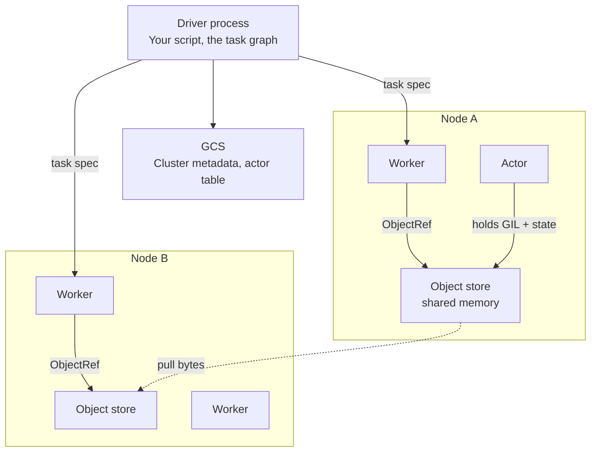

# Distributed Python

!!! info "Version and source policy"
    Ray APIs and scheduling behavior evolve. Check [Versions & Primary Sources](../reference/version-matrix.md) before production use.

02:50 AM. The nightly feature-scoring job for 40 million SaaS accounts is still running — it was due to finish by 03:00 so the training job can start on time. The Spark stage is 80% done after four hours; a function that profiled at 40 ms/user in a notebook is now averaging closer to 400 ms/user in production. The UDF, `score_user(events) -> vector`, is 80 lines of pandas, numpy, and a small sklearn model, unchanged since last week's deploy.

What's actually slow?

A. The cluster is under-provisioned — add executors.
B. The UDF runs row-at-a-time instead of vectorized.
C. Every call re-pickles the model and event batch across the JVM↔Python boundary.
D. The Parquet scan itself is the bottleneck, not the UDF.

Pick one before reading on — the answer is why this module exists: the work here is not "SQL over a table," it is a **graph of Python calls** (some embarrassingly parallel, some stateful — a loaded model, a simulator, a running counter), and that shape is what this module is for.

---

## What this module covers

| Topic | What you will learn |
|-------|---------------------|
| [Ray](ray.md) | Tasks vs actors, the object store, scheduling, failure, memory, and an honest Spark comparison |

There is one deep dive because the engineering problem is one problem: **how Python actually runs across machines**. Ray is the system that made that problem first-class. Dask, multiprocessing, and Spark UDFs appear as alternatives, not as a product catalogue.

---

## The workload that Spark UDFs make painful

The **SaaS analytics** feature pipeline looks like this:

```
Parquet events (Iceberg, already partitioned by date)
        │
        ▼
Per-user sessionisation + 40 Python features
  (rolling stats, embedding lookup, small sklearn model)
        │
        ▼
Write feature table → training job
```

Spark is excellent at the edges: scan Iceberg, filter by date, write Parquet. The middle is the tax. A Python UDF:

- Runs **row-at-a-time** (or pandas-UDF batch-at-a-time, still outside Catalyst).
- Must pickle every closure, every numpy array, every model weight across the JVM barrier.
- Cannot hold a **loaded model** as process-local mutable state without `broadcast` hacks that still copy.
- Cannot express “call A, then fan out B and C, then join results in Python” as a native task graph.

Ray’s unit of work is a **Python function or a Python object**, not a partition of a DataFrame. That is a different engine, not a faster Spark.

A second workload in this academy is **simulation**: IoT device digital twins, fraud-ring Monte Carlo, marketplace matching. Each simulator is a stateful object that steps through time. That is an **actor**, not a `map`.

---

## Central intuition



Three ideas, used everywhere:

1. **Tasks** are stateless remote functions. Submit thousands. They return `ObjectRef`s, not values.
2. **Actors** are stateful processes. One Python object, pinned to a worker, methods run one at a time (unless you opt into concurrency).
3. **The object store** is per-node shared memory (historically Plasma). Large results live there. Passing an `ObjectRef` does not copy the bytes until a worker actually needs them.

If you remember only one sentence: **Ray schedules a dynamic graph of Python tasks; Spark schedules a static DAG of data-parallel stages.**

---

## When you are in the wrong module

Stay on [Spark](../spark/index.md) if the job is:

- `read → filter → groupBy → join → write` on structured tables
- SQL, Iceberg/Delta commits, AQE, broadcast joins
- A 10 TB shuffle you can describe in relational algebra

Stay on [multiprocessing](https://docs.python.org/3/library/multiprocessing.html) if:

- One machine, a fork-safe function, no cluster, no GPUs to share

Reach for Ray when:

- The CPU work is **Python-native** (pandas, numpy, scipy, PyTorch, a simulator).
- You need **fine-grained** fan-out (millions of tasks, seconds each) rather than giant partitions.
- You need **stateful** workers: a loaded model, a running env, a parameter server.
- You are doing **ML training / tune / serve** on top of that compute.

Ray is **not** a warehouse, **not** a streaming database, and **not** a replacement for Iceberg + Trino. [Spark vs Ray](../comparisons/spark-vs-ray.md) exists so you do not have that argument in a design review without numbers.

---

## How the pieces fit a real platform

```
Kafka / Iceberg          Spark or Flink           Ray
  events, CDC      →     SQL ETL, wide joins  →   Python features,
  Parquet scans          Iceberg commits          simulation, Train/Tune/Serve
```

Typical Staff-level split:

| Layer | Engine | Why |
|-------|--------|-----|
| Ingest + lake | Kafka, Spark/Flink, Iceberg | Throughput, table format, SQL |
| Feature compute that is pandas/sklearn | **Ray tasks** | Avoid UDF tax |
| Model weights in process | **Ray actors** | Load once, infer many |
| Hyperparameter search | Ray Tune | Nested task graph |
| Online infer | Ray Serve *or* a dedicated serving stack | Not the same problem as training |
| Dashboard SQL | ClickHouse / Trino | Ray will lose |

The **IoT** platform uses Ray actors as per-device or per-cohort simulators. The **fraud** platform uses Ray to generate graph features (ego-net stats in Python) *after* Neo4j or a batch graph job has produced neighbourhoods — Ray does not replace the graph database.

---

## Mental model you must finish with

| Concept | One-line truth |
|---------|----------------|
| `@ray.remote` | Marks a function/class as schedulable; `.remote()` submits, does not run |
| `ObjectRef` | Handle into the object store; `ray.get` materialises |
| Task | Stateless, retryable if side-effect free |
| Actor | Process with identity; restart ≠ restore memory |
| Object store | Shared memory per node; fills, then spills or blocks |
| Scheduler | Locality-aware; actors hold resources until death |
| Driver | Your script is a single point of failure unless you detach |

---

## Failure preview (so the deep dive is not a surprise)

- **Actor died, state gone.** `max_restarts` brings back an empty `__init__`, not yesterday’s simulator. Checkpoint if the state matters.
- **Object store full.** Tasks block on `ray.put` / return. You will think the cluster is “stuck.” It is waiting for memory.
- **Tiny tasks.** 5 ms of work, 2 ms of scheduling. The driver and GCS become the bottleneck before CPUs do.
- **`ray.get` on a million refs at once.** Driver memory spike. Use `ray.wait`, batches, or write from workers.
- **Treating Ray Data as Spark SQL.** Group-bys and shuffles of warehouse-scale tables still belong in Spark.

Details, code, and debugging live in [Ray](ray.md).

---

## Bytes, not slogans

After `features.remote(batch)` the driver holds an `ObjectRef` (a few dozen bytes). The numpy/pandas result sits in the **object store of the node that ran the task**. A second task that takes that ref as an argument may run on the same node (locality) or pull the bytes over the network into another store.

`ray.get` on the driver copies onto the **driver heap** — the same class of accident as Spark `collect()`. Passing a 200 MB model as a plain Python argument serialises it into every task spec; `ray.put` stores it once.

Actors invert this: the 200 MB model can live in actor RAM and never enter the object store until you return it. That is faster for repeated infer — and **gone** when the process dies.

| After this call | Where the big bytes are |
|-----------------|-------------------------|
| `ref = task.remote(small)` | Object store on the worker, if the return is large |
| `ray.get(ref)` on driver | Driver process + still in store until refcount drops |
| `actor = Actor.remote()` | Actor heap (not durable) |
| `ray.put(model)` | Object store, pulled once per node that needs it |

If you cannot fill that table for your job, you are not ready to size the cluster.

---

## Anti-patterns you will see in reviews

- “Ray cluster for the warehouse.” No — Iceberg + Spark/Trino.
- One actor per user for 40 million users. That is 40 million processes, not a clever model.
- `num_cpus=0` on GPU actors “to pack more” then starving the raylet’s accounting.
- Detached actors as a database (they are processes with a name).
- Mixing Ray Serve and a 10 TB shuffle on the same autoscaling pool without isolation.

---

## How to study this module

1. Write the Spark UDF version of a 40 ms pandas feature function in your head. Name the copies.
2. Read [Ray](ray.md) through **tasks vs actors** and the **object store**. Draw where bytes live after `remote()` and after `get()`.
3. Read **failure of actors** and **scale 10× / 100× / 1000×** before you propose Ray for a training cluster.
4. Only then read [Spark vs Ray](../comparisons/spark-vs-ray.md) and decide which engine owns which box on your architecture diagram.

!!! tip "Exit criterion"
    You can explain, without slides, why a pandas feature job should leave Spark, why a 5 TB `GROUP BY customer` should not, and what happens to in-actor memory when the worker is killed.

---

## Related modules

- [Distributed execution](../foundations/distributed-execution.md) — jobs, stages, tasks as a general idea
- [Spark mental model](../spark/mental-model.md) and [Spark gotchas](../spark/gotchas.md) — UDF and driver-OOM contrast
- [Spark vs Ray](../comparisons/spark-vs-ray.md) — the comparison page, not a recap of this module
- [SaaS analytics architecture](../architectures/analytics-platform.md)
- [IoT architecture](../architectures/iot.md)
- [Fraud architecture](../architectures/fraud.md) — graph first, Python features second
