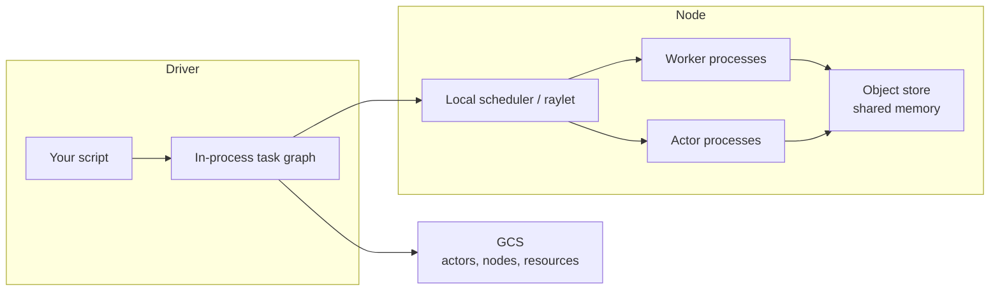

# Ray

Thursday, 4:15 PM, code review. The PR replaces the feature-scoring UDF with `@ray.remote` tasks and swaps the loaded sklearn model into a Ray actor. A reviewer comments: "Before I approve this — convince me this isn't just `spark.sql.shuffle.partitions` and more executors. What does Ray actually buy us that tuning Spark doesn't?"

What's the honest answer?

A. Ray tasks are just faster, lighter processes than a Spark UDF invocation.
B. Ray's win is a shared-memory object store that avoids re-serializing the model and data on every call.
C. Ray replaces Spark outright for this pipeline — one engine, one plan.
D. The real fix is actors holding the loaded model as long-lived state, not tasks alone.

Pick one before reading on: the same task — score 40 million SaaS accounts before the next training window, plus a marketplace simulation stepping millions of agents — is what made wrapping the function in a Spark UDF miss its SLO, and Ray is the cluster built to run that Python, as a graph of tasks and actors, without pretending to be a SQL engine.

---

## Use case

**SaaS analytics — feature compute.** For each `user_id`, sessionise last 14 days of events, compute 40 features (rolling rates, embedding lookup, a small model score), write a feature row. 40 ms of Python per user, independent across users, model loaded once per process.

**IoT / fraud — simulation.** Each actor is a device twin or a synthetic fraud ring. State mutates every tick. Spark has no honest primitive for “this Python object lives on a core for an hour and answers method calls.”

Both are **Python-native graphs of work**. They are not `SELECT … GROUP BY` over 5 TB.

---

## Why this is hard

1. **The GIL** makes threads useless for CPU-bound Python. You need processes, then machines.
2. **`multiprocessing`** stops at one box: no cluster scheduler, no shared object store, no GPU packing.
3. **Spark UDFs** cross the JVM. Catalyst cannot see inside the function. Pandas UDFs help, but you still ship data through Arrow into a Python worker that does not hold long-lived mutable state cleanly, and you still think in partitions, not in call graphs.
4. **State.** A loaded model, a simulator, a running RNG — these are processes, not rows.
5. **Memory.** Intermediate numpy arrays are large. Copying them through a driver or through JVM heap is how jobs die.

The hard part is not “run a function.” It is **schedule, move bytes once, keep state alive, and survive worker death without lying about durability**.

---

## Intuition

```python
# Local Python — one process, blocks
def features(events):
    return expensive(events)

out = features(batch)
```

```python
import ray
ray.init()

@ray.remote
def features(events):
    return expensive(events)

ref = features.remote(batch)   # schedule; returns ObjectRef
out = ray.get(ref)             # materialise when you actually need bytes
```

`.remote()` is submit. `ObjectRef` is a ticket into a **per-node shared-memory object store**. `ray.get` is a copy (sometimes zero-copy for Arrow/numpy) onto the caller’s heap.

**Tasks** = stateless functions, many in flight, retryable if pure.

**Actors** = one Python object in one process. Methods are tasks *pinned* to that process. Memory inside `__init__` is not in the object store unless you `ray.put` it.

Ray builds a **dynamic task graph** as your program runs. Spark builds a **lazy DataFrame plan**, then stages. Do not mix those pictures.

---

## Internals



**Global Control Store (GCS).** Cluster membership, actor locations, resource views. Not the data path. If GCS is unhealthy, scheduling degrades; in-flight object copies can still proceed for a while.

**Raylet.** Per-node process: local scheduling, object-store accounting, spilling. Tasks that can run on objects already on the node prefer that node (**locality**).

**Workers.** Stateless processes that execute tasks. They are reused. They do not remember your variables across tasks unless you pass `ObjectRef`s.

**Object store (Plasma lineage).** Each node has a shared-memory segment. Large task returns and `ray.put` values live here, **immutable**. Historically Apache Arrow Plasma; current Ray still behaves like a Plasma store: fixed-size shared memory, reference counted, spill to disk when full. Default size is a fraction of node RAM (commonly ~30% — check `ray.init` / cluster config, do not assume).

**Ownership.** The worker that *created* the `ObjectRef` owns the refcount. If the owner dies, the object can be deleted even if copies exist. This is why “the bytes are on node B” does not mean “the value survived the driver crash.”

**Scheduling.**

| Kind | How it is placed |
|------|------------------|
| Task | Feasible node with CPU/GPU/custom resources; prefer object locality; spillback if the local raylet is busy |
| Actor | Resources **reserved for the actor’s lifetime**, not per method call |
| Placement group | Gang-schedule a bundle (e.g. 8 GPU actors on 2 nodes) or fail |

Actors that request `num_cpus=1` consume that CPU even while idle. A cluster of 100 idle actors is 100 cores you cannot use for tasks.

---

## How

### Tasks — per-user features

```python
import ray
import pickle
import pandas as pd

ray.init(address="auto")  # or ray.init() locally

MODEL = None

def _load_model():
    global MODEL
    if MODEL is None:
        with open("/models/fraud_v3.pkl", "rb") as f:
            MODEL = pickle.load(f)
    return MODEL

@ray.remote(num_cpus=1)
def compute_user_features(user_id: str, events: pd.DataFrame) -> dict:
    model = _load_model()
    sess = sessionise(events)
    x = pandas_features(sess)
    score = float(model.predict_proba(x)[0, 1])
    return {"user_id": user_id, "score": score, **x.iloc[0].to_dict()}

# Do not ray.get 40e6 refs at once — batch
refs = []
for user_id, ev in iter_user_batches(path="s3://events/dt=2024-01-15/"):
    refs.append(compute_user_features.remote(user_id, ev))
    if len(refs) >= 10_000:
        rows = ray.get(refs)
        write_parquet(rows)
        refs = []
if refs:
    write_parquet(ray.get(refs))
```

Better: **put the model once** so 10k tasks do not each unpickle from disk:

```python
model_ref = ray.put(pickle.load(open("/models/fraud_v3.pkl", "rb")))

@ray.remote
def compute_user_features(user_id, events, model):
    x = pandas_features(sessionise(events))
    return {"user_id": user_id, "score": float(model.predict_proba(x)[0, 1])}

refs = [
    compute_user_features.remote(uid, ev, model_ref)
    for uid, ev in batch
]
```

Passing `model_ref` does not serialise the 200 MB blob into every task spec. Workers pull it from the object store (once per node, then shared memory).

### Actors — simulation and loaded-model servers

```python
@ray.remote(num_cpus=1, max_restarts=3, max_task_retries=1)
class DeviceTwin:
    def __init__(self, device_id: str, seed: int):
        self.device_id = device_id
        self.rng = np.random.default_rng(seed)
        self.t = 0
        self.temp = 20.0
        self._ckpt = None

    def step(self, dt_s: float, ambient: float) -> dict:
        self.t += dt_s
        self.temp += 0.01 * (ambient - self.temp) + self.rng.normal(0, 0.05)
        return {"device_id": self.device_id, "t": self.t, "temp": self.temp}

    def snapshot(self) -> dict:
        return {"device_id": self.device_id, "t": self.t, "temp": self.temp}

twins = [DeviceTwin.remote(f"dev-{i}", i) for i in range(10_000)]
# One tick: 10k method calls in flight
tick_refs = [t.step.remote(1.0, 18.0) for t in twins]
samples = ray.get(tick_refs)
```

Actor methods on a given actor **queue**. Throughput per actor is one Python thread (unless `max_concurrency` and you are careful with the GIL). Scale-out is **more actors**, not more concurrency inside one.

### Nested tasks (a workload Ray expresses more naturally than Spark)

```python
@ray.remote
def neighbourhood_features(user_id, edge_list):
    # Python graph walk on a small ego-net — not Neo4j, not Spark GraphX
    return features_from_edges(user_id, edge_list)

@ray.remote
def score_cohort(cohort_id, users_and_edges):
    refs = [neighbourhood_features.remote(u, e) for u, e in users_and_edges]
    feats = ray.get(refs)
    return cohort_id, aggregate(feats)

cohort_refs = [score_cohort.remote(cid, chunk) for cid, chunk in cohorts]
ray.get(cohort_refs)
```

The inner fan-out is scheduled as real tasks. This is a **dynamic graph**, not a UDF inside a stage. Spark can express nested or data-dependent fan-out too — via UDFs, `mapPartitions`, or multiple driver-side jobs — but the pattern fights Spark's stage-based, statically-planned execution model. Ray schedules it natively.

### Object store control

```python
big = np.zeros((50_000, 512), dtype=np.float32)
ref = ray.put(big)          # driver RAM → object store
# pass ref, not big, into 200 tasks
out_refs = [matmul.remote(ref, i) for i in range(200)]

ready, pending = ray.wait(out_refs, num_returns=1)
first = ray.get(ready[0])   # pull one result; let others stay in store
```

`ray.wait` is how you avoid materialising the whole wave on the driver.

### Ray Data (use narrowly)

```python
import ray.data

ds = ray.data.read_parquet("s3://events/dt=2024-01-15/")
feat = ds.map_batches(pandas_feature_batch, batch_format="pandas")
feat.write_parquet("s3://features/dt=2024-01-15/")
```

This is a **streaming dataset** for ML preprocessing (images, tensors, ragged Python). It is not Spark SQL. Wide aggregations, Iceberg MERGE, and broadcast-hash joins of warehouse tables still belong in Spark.

---

## Tasks vs actors

| | Task | Actor |
|--|------|-------|
| State | None (arguments + object store) | Python `__dict__` in a process |
| Location | Any feasible worker | Pinned until death |
| Retry | Natural if pure | Restart re-runs `__init__`; RAM is gone |
| Resource hold | For the duration of the call | For the lifetime of the actor |
| Use | Map-style features, embarrassingly parallel | Loaded models, simulators, parameter servers |
| Failure unit | One call | The process and all queued methods |

If you only needed a loaded model, an actor pool is right. If each call is independent and the model fits in `ray.put`, **tasks plus `ray.put`** retry more cleanly.

---

## Ray vs Spark (do not oversell)

| Dimension | Spark | Ray |
|-----------|-------|-----|
| Unit of work | Partition of a DataFrame | Python task or actor method |
| Plan | Lazy SQL/DataFrame DAG, Catalyst | Dynamic Python call graph |
| Shuffle | Designed for it (sort/hash, spill, AQE) | Object-store shuffle; not a warehouse |
| Python | UDF tax, JVM bridge | Native |
| State | DataFrames, limited mapGroups | Actors |
| Lakehouse | Iceberg/Delta/Hudi mature | Readers exist; not the system of record |
| SQL | First-class | Not the product |

**Spark** answers: how do I transform this dataset with relational operators?

**Ray** answers: how do I run this Python across machines, including stateful objects?

A production ML platform often uses **both**: Spark (or Flink) writes the feature *inputs* to Iceberg; Ray computes Python features and trains; ClickHouse/Trino serve analytics. See [Spark vs Ray](../comparisons/spark-vs-ray.md).

---

## Gotchas

!!! warning "Actors are not a database"
    Killing a worker deletes actor memory. `max_restarts=3` gives you a new empty object after `__init__`. Persist snapshots yourself.

!!! warning "Object store is not infinite RAM"
    Large returns fill Plasma. The next `ray.put` **blocks**. Dashboards show idle CPUs. Look at object-store usage, not CPU.

!!! warning "`ray.get` on the driver is `collect()`"
    Same failure as Spark `collect()`. Batch, `ray.wait`, or write from workers.

!!! warning "Tiny tasks"
    Sub-10 ms tasks lose to scheduling and GCS chatter. Batch work into 50–500 ms units.

!!! warning "Passing giant Python objects as arguments"
    Without `ray.put`, every task spec serialises the blob (cloudpickle). Put once; pass the ref.

!!! warning "GIL inside an actor"
    `max_concurrency` does not give you N CPU-bound threads in one actor. Use more actors or `num_cpus` and processes.

!!! warning "Ray Data as ETL"
    If the job is a 12-way join and a 8 TB shuffle, you are in the wrong engine.

---

## Failure modes

**Worker SIGKILL / OOM.** Tasks on that worker fail. Pure tasks retry elsewhere (if retries configured). Actors on that worker are dead; queued `.remote()` calls error. Object-store contents on that node are gone; surviving copies depend on ownership and reconstruction.

**Owner death.** Driver crash loses the graph and typically the objects it owned. Detached actors can outlive a script; their state is still RAM.

**Object reconstruction.** If a downstream task needs an object whose producing task is still known, Ray may **re-execute** the producer. Side-effecting tasks then run twice. Treat tasks as at-least-once unless you made them idempotent.

**GCS / head-node loss.** New scheduling stops. This is an HA design problem (managed Ray, or a HA GCS story), not “the object store will save you.”

**Thrash from spill.** Object store full → spill to SSD → tasks wait on restore → SLOs collapse. Looks like “Ray is slow.” It is memory.

---

## Debugging

| Symptom | Where to look | Likely cause |
|---------|---------------|--------------|
| Idle CPUs, tasks pending | Ray dashboard → object store, `ray memory` | Store full / blocked `put` |
| One actor queue depth exploding | Actor pane, method latency | Hot actor (celebrity key); need a pool + shard |
| Driver RSS climbing | Driver process, number of `get`s | Materialising too many refs |
| Repeated `__init__` logs | Actor restarts | OOM or node death; missing checkpoint |
| Tasks 2 ms, scheduling 5 ms | Metrics: task length vs submit rate | Tasks too small |
| “Lost objects” | Owner line in error, node death | Owner died; not enough reconstruction |

Practical loop:

1. Dashboard: pending vs running vs failed, per-node object-store %.
2. `ray status` / logs on the raylet that hosts the slow actor.
3. Histogram task duration. If p50 is milliseconds, batch.
4. For actors: log `snapshot()` size and restart count. If restarts > 0, you lost in-memory state — prove you can rebuild it.

---

## Scale: 10× / 100× / 1000×

**10× (400M users, or 100k actors).** Batch `ray.get`. Put models once per cluster. Watch object-store fraction. Actor count ≈ cores; do not oversubscribe idle actors.

**100×.** The **driver** becomes the bottleneck (millions of task specs). Push control into nested tasks so the head node is not the fan-out root. Shard input listing (do not have the driver `list` 10 million files). Spill will start unless you bound in-flight results. Consider Ray Data *only* for the scan/map_batches shape.

**1000×.** You are in cluster-product territory: autoscaling, gang placement for GPUs, locality to data, multi-AZ object movement cost. Feature *generation* at this scale often moves back toward **Spark for the scan/shuffle** and Ray only for the Python that Spark cannot see. Simulation at this scale needs checkpointed actor groups and a store (S3/NFS) — not Plasma — as the system of record. Network will dominate if every task pulls a 200 MB model cold; pin model actors or use node-local caches.

Plasma does not become a data lake at any of these scales.

---

## Trade-offs

You gain: Python as the programming model, fine-grained parallelism, actors, nested graphs, decent GPU packing.

You give up: Catalyst, mature warehouse shuffle, Iceberg-as-native-table, SQL governance, a single engine for “all data work.” Operational surface: head node, GCS, per-node raylets, object-store sizing, a second on-call besides Spark.

Correctness: tasks are **at-least-once** under reconstruction. Actors are **not durable**.

---

## Alternatives

| Alternative | When it is better |
|-------------|-------------------|
| Spark / pandas UDF | Relational scan + light Python; lakehouse commit is the point |
| Spark + broadcast model | Model is small; work is still DataFrame-shaped |
| Dask | Familiar DataFrame API, single laptop → small cluster; weaker actor story |
| `multiprocessing` / joblib | One machine |
| Celery / a queue + workers | Coarse jobs, long-running, already a task queue |
| Flink / Spark Streaming | Unbounded event-time processing — [Flink](../flink/index.md), not Ray |
| Dedicated trainers (torchrun, TF) | You only need multi-GPU training, not a general task graph |
| Ray Tune / Train / Serve | Use the libraries *on* Ray; they do not change the memory/actor rules |

---

## Apply

You will see this at work when:

- A Spark job’s wall time is 90% Python UDF and 10% scan.
- Someone proposes “just use Spark” for a simulator.
- An ML platform wants one cluster for ETL **and** training — push back; split engines.
- A Ray cluster is “stuck” at 5% CPU — check object store before you add nodes.

Ask: **is the bottleneck a relational shuffle or a Python call graph?** Only the second is Ray’s home.

---

## Exercise

??? question "Design the feature job"
    40 million users. Feature function is 40 ms of pandas plus a 200 MB sklearn model. Inputs are Iceberg Parquet partitioned by `dt`, already shuffled to `user_id` files (~8k files). SLO is 30 minutes on a 200-core cluster.

    1. Tasks or actors? Where does the model live?
    2. What do you `ray.get`, and what do you never bring to the driver?
    3. What happens when a worker OOM-kills 40 minutes of actor state you *did not* use — and when you *did* use actors instead of tasks?
    4. Why is this the wrong job for Spark SQL, and why is a 5 TB `GROUP BY country` the wrong job for Ray?

??? success "Answer"
    1. **Tasks**, not actors. Each user is independent. `ray.put` the model (or load once per worker process in a warmup). Actors would pin cores while idle and lose the model on restart for no benefit.

    2. Driver lists files or, better, a handful of mapper tasks list prefixes. Each task reads one file, writes features to S3/Parquet, returns a **small** metadata struct (path, row count). Never `ray.get` 40 million feature dicts. Bound in-flight tasks so the object store does not fill with unconsumed returns.

    3. With tasks: the failed file’s task retries; completed files are already on S3. With actors holding per-user state for 40 minutes: that RAM is gone; you replay from the last snapshot you wrote — if you wrote none, you replay everything assigned to that actor.

    4. Spark SQL cannot see the pandas function; a UDF pays JVM↔Python and still will not nest a Python call graph. A 5 TB `GROUP BY country` is a shuffle + columnar aggregation — Spark/ClickHouse. Ray would copy rows through the object store without Catalyst and lose.

    Extra: 200 cores × 1800 s = 360k core-seconds. 40e6 × 0.04 s = 1.6e6 core-seconds if you naively run 40 ms sequentially per user on one core — you need ~4.4× more cores **or** you batch many users per task to amortise scheduling (you will). Object store must hold the model replica per node plus in-flight batch returns, not the full feature table.
