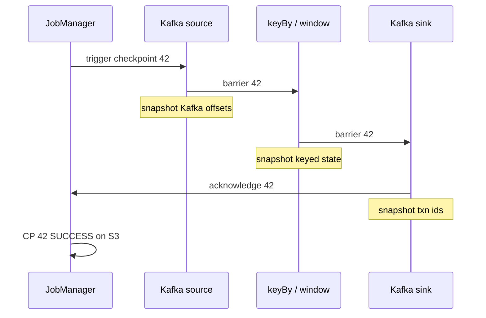

# Checkpoints and recovery

The checkpoint dashboard shows the last successful checkpoint 47 minutes ago and climbing. Job status: RUNNING. Kafka consumer lag on the source: also climbing. Nobody has touched the job.

A. A TaskManager silently died.
B. The sink is slow, backpressure is filling the pipeline, and checkpoint barriers cannot get through it to complete a snapshot.
C. S3 (the checkpoint store) is down.
D. The checkpoint interval was misconfigured to something absurd.

Predict which one before reading on — the fraud job downstream has been counting failed logins for six hours, and whichever answer is right determines how much of that six hours you can actually lose.

## Start with the situation { #use-case }

The fraud job has been counting failed logins for 10 million `user_id`s for six hours. A TaskManager loses its disk. Without a recovery story, those six hours of [state](state.md) are gone and you reprocess from Kafka `earliest` — if [retention](../kafka/log.md) still has the data.

With checkpoints, you restore state and Kafka offsets from a consistent snapshot a few seconds or minutes old. The job continues. Users do not re-trip every alert if the sink is exactly-once or idempotent.

---

## Why the obvious approach breaks at scale { #why-this-is-hard-at-scale }

A checkpoint is not `pickle.dump(the_job)`. It must be a **consistent cut** of:

- every operator's state
- every source's offset (Kafka partition offsets)
- in-flight records *relative to that cut*

At 1M events/s, a naive "stop the world and copy 80 GB" misses the SLO. Barriers, alignment, unaligned checkpoints, and incremental RocksDB snapshots exist because of that.

Backpressure makes it worse: if the sink is slow, barriers do not move, checkpoints abort on timeout, and recovery rewind grows.

---

## Build the mental picture { #intuition }

Periodically, the JobManager injects **checkpoint barriers** into each source stream. Barriers flow like records. When an operator has received barrier *n* from all its inputs, it snapshots its state, then forwards the barrier.



Everything **before** the barrier is in the snapshot; everything after is not. On restore, sources rewind to the snapshotted offsets and operators reload state. Records between checkpoint and crash are **replayed**. Downstream must tolerate that (idempotent or transactional).

---

## Internals: alignment, unaligned, backpressure

**Aligned checkpoints (default EXACTLY_ONCE):** an operator waits until **all** input channels deliver barrier *n* before snapshotting. Fast channels buffer records (or apply backpressure) so a slow channel can catch up. If one Kafka partition is stuck, alignment waits.

**Unaligned checkpoints (Flink 1.11+):** snapshot in-flight records too, so barriers can overtake. Faster under backpressure; more snapshot data.

**At-least-once checkpointing:** snapshot without waiting for alignment; faster; may duplicate more on recovery.

**Backpressure:** credit-based flow control. A slow sink fills network buffers; upstream subtasks pause. The UI shows an orange/red backpressure badge. Checkpoints **time out** (`checkpoint timeout`) if barriers cannot finish. You then have no recent checkpoint — a crash replays a long interval.

!!! production-gotcha "Checkpoint timeout is an availability bug"
    A job that "runs" but has not completed a checkpoint in 40 minutes has an RPO of 40 minutes. Page on `numberOfCompletedCheckpoints` stalling, not only on job `FAILED`.

---

## Internals: checkpoint vs savepoint

| | Checkpoint | Savepoint |
|--|------------|-----------|
| Trigger | Automatic | Operator (`flink savepoint`) |
| Purpose | Failure recovery | Upgrade, rescale, migrate |
| Retention | Typically only last N | Until you delete it |
| Format | Backend-specific, incremental OK | Canonical, portable enough for restore with new code (with care) |

Savepoints are how you change parallelism, Flink version (within support), or job graph **with** state. Always take a savepoint before a breaking deploy. Changing UID of operators makes state drop unless you map it.

```python
# stable operator identities
stream.map(parse, name="parse").uid("parse-json")
```

---

## Internals: exactly-once with Kafka

Flink's checkpoint makes **internal** processing exactly-once (state + offsets). End-to-end depends on the sink.

**Kafka source:** offsets stored in the checkpoint, **not** committed to a Kafka consumer group until checkpoint success — this is `KafkaSource`'s default behavior, not an opt-in flag. On recovery, Flink seeks to checkpoint offsets even if the group cursor disagrees.

**Kafka sink, `DeliveryGuarantee.AT_LEAST_ONCE`:** writes happen as they come; recovery may duplicate.

**Kafka sink, `DeliveryGuarantee.EXACTLY_ONCE`:** the sink writes with a **transactional producer**. On checkpoint complete, transactions commit. Downstream must use `isolation.level=read_committed`. This is the protocol in [Kafka EOS](../kafka/exactly-once.md), batched at checkpoint interval rather than per record.

```python
from pyflink.datastream.connectors.kafka import (
    KafkaSink,
    KafkaRecordSerializationSchema,
    DeliveryGuarantee,
)
from pyflink.common.serialization import SimpleStringSchema

sink = (
    KafkaSink.builder()
    .set_bootstrap_servers("localhost:9092")
    .set_record_serializer(
        KafkaRecordSerializationSchema.builder()
        .set_topic("fraud-alerts")
        .set_value_serialization_schema(SimpleStringSchema())
        .build()
    )
    .set_delivery_guarantee(DeliveryGuarantee.EXACTLY_ONCE)
    .set_transactional_id_prefix("fraud-alerts")
    .build()
)
```

**ClickHouse / HTTP / files:** no distributed transaction with Flink. Use idempotent writes (`event_id`) or a two-phase file commit (StreamingFileSink / FileSink with pending-to-finished rename, Iceberg commits). Do not claim EOS because checkpoints are on.

---

## How: configuration you will actually ship

```python
from pyflink.datastream import StreamExecutionEnvironment, CheckpointingMode
from pyflink.datastream.state_backend import EmbeddedRocksDBStateBackend
from pyflink.common import Configuration

env = StreamExecutionEnvironment.get_execution_environment()
env.set_state_backend(EmbeddedRocksDBStateBackend(True))
env.enable_checkpointing(60_000)  # 60s

cfg = env.get_checkpoint_config()
cfg.set_checkpointing_mode(CheckpointingMode.EXACTLY_ONCE)
cfg.set_checkpoint_timeout(10 * 60 * 1000)
cfg.set_min_pause_between_checkpoints(30_000)
cfg.set_max_concurrent_checkpoints(1)
cfg.set_tolerable_checkpoint_failure_number(3)
# cfg.enable_unaligned_checkpoints()  # if alignment time dominates under backpressure
```

Cluster: `state.checkpoints.dir` on S3/HDFS/GCS. Local `file://` is a lab toy.

---

## Internals: what is in a checkpoint directory

On S3 you will see, per checkpoint id: `_metadata`, operator-state files (RocksDB SST diffs if incremental), and source-offset blobs. Shared files across incremental checkpoints mean you cannot delete "old" checkpoints blindly without the retention manager. `state.checkpoints.num-retained` (often 1–3) is a restore-safety versus S3-cost knob.

A savepoint directory is similar but self-contained enough to move.

Do not mix "copy this chk-12 folder" with "this is a savepoint". The job UI's History tab lists both; only savepoints are for planned migration.

---

## Recovery sequence

1. JobManager notices TM failure (heartbeat).
2. Restarts affected tasks (or the whole job, depending on failover strategy).
3. Downloads last **successful** checkpoint.
4. Kafka source seeks to snapshotted offsets.
5. Replay. Duplicate side effects unless sink cooperated.

RTO ≈ restart + state download + catch-up of the rewind. Incremental checkpoints speed upload; restore may still need to rebuild local RocksDB.

---

## Where teams get caught { #gotchas }

- **No `uid`:** a code change shuffles operator ids; state is dropped or mis-assigned.
- **Checkpointing disabled** in a "temporary" debug session that became production.
- **Transactional Kafka sink + `read_uncommitted` consumers:** aborted transactions after a crash are visible. Same bug as [EOS](../kafka/exactly-once.md).
- **`transactional.id` prefix collisions** across jobs fence each other.
- **Huge checkpoint interval** (30 min) to "reduce S3 cost": RPO is 30 min plus in-flight.
- **Timers and processing time** after restore: processing-time timers fire based on new wall clock.

---

## How it fails { #failure-modes }

| Failure | Effect |
|---------|--------|
| TM kill | Restore last CP; replay Kafka |
| JM kill | Cluster HA (ZK/K8s) must restart JM with job graph; without HA the job is gone until resubmit from a savepoint |
| S3 outage | Checkpoints fail; job may continue; RPO grows; eventually `fail job on checkpoint error` |
| Backpressured sink | CP timeout; same RPO growth |
| Non-idempotent HTTP sink | Duplicate pages, duplicate charges |
| Savepoint incompatible | Deploy cannot restore; you replay from Kafka |

---

## How to investigate { #debugging }

| Metric | Meaning |
|--------|---------|
| `lastCheckpointDuration` | Snapshot + async upload |
| `lastCheckpointSize` / `lastCheckpointFullSize` | State growth |
| `numberOfFailedCheckpoints` | Alignment, timeout, S3 |
| Alignment time (UI) | Slow input / idle vs stuck |
| Backpressure ratio (UI badges) | Sink or hot key |
| Kafka **consumer lag by partition** | Catch-up after restore |
| Watermark lag | Replay of old event times |

If duration is dominated by **sync** phase, alignment or RocksDB snapshot is slow. If **async**, S3 upload. Incremental checkpoints should make async small after the first.

---

## Scale: 10× / 100× / 1000×

| Scale | Checkpointing |
|-------|----------------|
| **10×** | 10–30s interval, heap or RocksDB, S3 |
| **100×** | Incremental RocksDB; watch duration vs interval (need headroom) |
| **1000×** | Unaligned if backpressure; split jobs so a 200 GB state job is not on the critical alerting path; local recovery (`state.backend.local-recovery`) to avoid re-download |

A 50 GB RocksDB state uploaded fully at 100 MB/s is ~8 minutes — the number from the original notes. Incremental diffs of 500 MB are seconds. That is why the backend choice in [state](state.md) is a checkpointing choice.

---

## Trade-offs

| Choice | Gain | Cost |
|--------|------|------|
| Interval 10s | Small RPO | CPU, S3, sink txn rate |
| Interval 5 min | Cheap | RPO 5 min + catch-up |
| EXACTLY_ONCE aligned | Cleaner restore | Alignment under backpressure |
| Unaligned | CP succeeds under BP | Larger snapshots |
| Kafka EOS sink | No duplicate records | `read_committed`, txn prefix ops |
| At-least-once + idempotent sink | Works with ClickHouse | You design `event_id` |

---

## Alternatives

- **Kafka Streams** changelog topics instead of Flink checkpoints — restore from Kafka.
- **Spark Structured Streaming** micro-batch checkpoints (offsets + commit files).
- **No state, replay from Kafka each morning** — batch; not fraud.

---

## Two-phase commit, in one paragraph

For Kafka EOS sinks, Flink's `TwoPhaseCommitSinkFunction` (and the Kafka 2.x/3.x sink) does:

1. On element: `producer.send` inside an open transaction.
2. On checkpoint: `flush` and **pre-commit** (transaction in flight, not visible to `read_committed`).
3. On checkpoint **success** (JobManager notified all acks): **commit** the transaction.
4. On restore: **abort** any transaction that did not reach step 3.

If step 3 happens and then the sink crashes before the next elements, downstream already has the records; restore will not send them again. If step 3 does **not** happen, downstream `read_committed` never saw them; restore will reproduce them in a new transaction. That is the handshake [Kafka transactions](../kafka/exactly-once.md) described, triggered by barriers instead of `commit_transaction()` in your poll loop.

File sinks use `pending/` → `finished/` rename (or Iceberg commit) as the same two phases. HTTP sinks do not have a phase 3 that can be aborted. Stop claiming they do.

---

## Backpressure, in operational order

1. Look at the UI badge: which operator is RED?
2. If sink: sink p99, ClickHouse/Kafka produce time, DNS, thread pools.
3. If keyed operator: hot key (`customer_id` whale) — not "needs more parallelism".
4. If source: Kafka fetch, deserializer (JSON at 2M/s on PyFlink).
5. Check `lastCheckpointDuration` and failed checkpoints **during** the backpressure, not after.

Credit-based flow control means you will **not** see unbounded heap in Flink from a slow sink the way you see unbounded queues in a naive Python consumer. You will see throughput collapse and checkpoints die. That is a feature. Treat it as the alarm.

If the sink is Kafka and produce p99 is high, you may be looking at [ISR / URP](../kafka/replication.md) on the *output* cluster, not at Flink. Always split "Flink is slow" from "the sink cluster is degraded".

---

## Savepoint procedure (the boring runbook)

1. Job healthy, last checkpoint successful, watermark advancing.
2. `flink savepoint <jobId> s3://.../savepoints`
3. Wait for a path in the log. Do not Ctrl-C the job first.
4. Stop with savepoint if you want a terminal consistent cut (`flink stop --savepointPath ...`).
5. Deploy new JAR/Py with the **same UIDs**.
6. Start from the savepoint. Compare: records in/out, watermark, state size, sink uniqueness of `event_id`.
7. Keep the savepoint until you trust the deploy; then delete to save S3.

If step 6 shows empty keyed state, you changed UIDs or `maxParallelism`. Roll back to the old JAR from the same savepoint.

Never take the first savepoint in production on the deploy day. Practise the path in staging with a copy of state size (or a scaled-down but structurally identical job). Restore time is part of RTO; S3 download of 40 GB to a new pod is not free.

---

## Unaligned checkpoints — when to turn them on

Turn on when **alignment time** in the UI is most of `lastCheckpointDuration` and the job is backpressured. Leave off when the job is healthy: aligned checkpoints are simpler and smaller.

Unaligned snapshots include in-flight buffers. A job with large network buffers and a huge fan-in can produce surprisingly fat checkpoints. Measure.

---

## How to apply this at work

Dashboard (minimum):

1. Last checkpoint **age**
2. Last checkpoint **duration**
3. Failed checkpoint count
4. Backpressure by operator
5. Kafka lag by partition for the source group
6. Watermark lag

Alert: no successful checkpoint in 3× interval. Practise a TM kill in staging ([labs](labs.md)).

---

## Check your understanding { #exercise }

Job checkpoints every 60s to S3. RocksDB state 40 GB, incremental. Sink is Kafka `EXACTLY_ONCE`. A downstream warehouse consumer uses default isolation. You kill a TM. Then you notice duplicate rows in the warehouse for a 2-minute window.

1. Did Flink "lose" exactly-once?
2. Where are the duplicates from?
3. What two metrics confirm the story?

??? question "Answer"
    1. Flink likely kept **processing** EOS: state + source offsets restored together; the Kafka sink committed transactions only on completed checkpoints. Internally consistent.

    2. The warehouse read `read_uncommitted` (client default) and ingested records from **aborted** transactions (the in-flight txn of the dead TM) **and** the later committed txn of the restarted job. Alternatively, the warehouse is not keyed by `event_id` and you used `AT_LEAST_ONCE` by mistake. The isolation-level bug is the one this module exists to catch.

    3. Flink `lastCheckpointDuration` / successful CP around the kill; Kafka consumer of the sink topic showing transactional markers; warehouse row counts vs `count distinct event_id`. Also Kafka URP if the sink cluster was unhealthy — but duplicates with extra rows that share ids point at isolation, not ISR.
