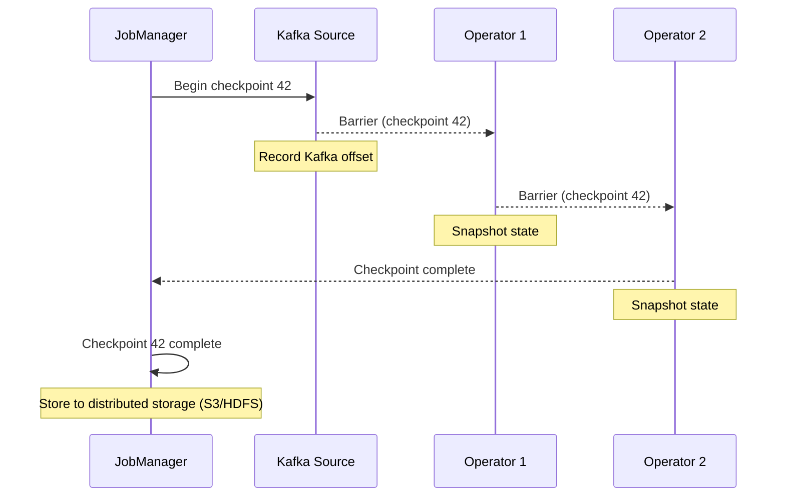

# Checkpoints & Recovery

## The Challenge

Your Flink job processes 1 million events/sec. It has maintained stateful counts for 10 million users for 6 hours.

One TaskManager dies.

Without a recovery mechanism: 6 hours of state is gone. You must reprocess from the beginning.

With checkpoints: you reprocess only the last few seconds.

---

## How Checkpointing Works

Flink periodically takes a consistent snapshot of all operator state, called a **checkpoint**.



The key mechanism is the **checkpoint barrier**: a special marker inserted into the stream. When an operator receives a barrier, it:
1. Finishes processing all events that arrived before the barrier
2. Snapshots its state
3. Passes the barrier downstream

This ensures the checkpoint is a consistent point-in-time snapshot of all state.

---

## Recovery

When a TaskManager fails:

1. JobManager detects failure
2. JobManager loads the latest successful checkpoint
3. Restarts affected TaskManagers from checkpoint state
4. Resets Kafka consumer to the offset recorded in the checkpoint
5. Processing resumes with a brief pause (typically seconds to minutes depending on state size)

No data is lost (assuming `acks=all` in Kafka). Events between the last checkpoint and the failure are reprocessed.

---

## Savepoints vs Checkpoints

| | Checkpoint | Savepoint |
|--|-----------|-----------|
| Triggered by | Automatically by Flink | Manually by operator |
| Purpose | Failure recovery | Planned maintenance, upgrades |
| Retention | Kept until next successful checkpoint | Kept indefinitely |
| Use case | "If we crash, restart here" | "Pause job, upgrade code, restart here" |

Savepoints allow you to:
- Upgrade your Flink job code without losing state
- Change parallelism (scale up/down)
- Migrate between Flink versions

---

## Configuration

```python
env = StreamExecutionEnvironment.get_execution_environment()

# Checkpoint every 60 seconds
env.enable_checkpointing(60_000)

# Exactly-once (default) or at-least-once
env.get_checkpoint_config().set_checkpointing_mode(CheckpointingMode.EXACTLY_ONCE)

# Timeout if checkpoint takes too long
env.get_checkpoint_config().set_checkpoint_timeout(120_000)

# Keep 2 checkpoints (in case latest is corrupted)
env.get_checkpoint_config().set_max_concurrent_checkpoints(1)
env.get_checkpoint_config().set_min_pause_between_checkpoints(30_000)
```

---

## Checkpoint Size and Latency Trade-off

Larger state → larger checkpoints → longer checkpoint time → more reprocessing on failure.

For a job with 50 GB of RocksDB state, checkpointing to S3 at 100 MB/s takes ~8 minutes. If the job fails, you replay the last 8 minutes of events.

**Incremental checkpoints** (available with RocksDB) only write state changes since the last checkpoint, dramatically reducing checkpoint size for large-state jobs.

```python
env.set_state_backend(EmbeddedRocksDBStateBackend(incremental=True))
```

---

## Exactly-Once End-to-End

Flink's internal exactly-once guarantees cover the state within Flink. End-to-end exactly-once requires coordination with sources and sinks.

- **Source (Kafka)**: checkpoint includes Kafka offsets → on recovery, replay from that offset
- **Sink**: must support transactions or idempotent writes

For Kafka-to-Kafka: use Kafka's transactional API.
For Kafka-to-ClickHouse: ClickHouse does not support distributed transactions — use idempotent writes (deduplication on insert).
