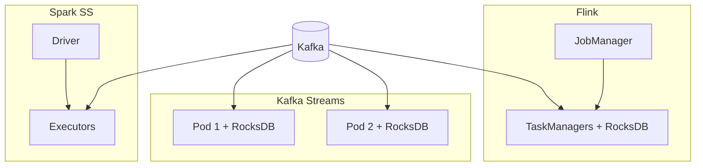

# Flink vs Kafka Streams vs Spark Structured Streaming

## Use case

You already have `{timestamp, customer_id, user_id, service, endpoint, region, latency_ms, status_code, bytes}` in Kafka. A team asks "should this be Flink?" The staff-engineer answer is never the vendor matrix first. It is: **what is the workload, the state, the latency, and who will be paged?**

This page compares three engines that all *can* window a Kafka topic. It does not declare a winner.

---

## Why this is hard at scale

All three products advertise event time, exactly-once, and Kafka. The differences show up when:

- State is 80 GB, not 80 MB
- You need 200 ms p99, not 30 s
- You need to join a stream with a slowly changing table
- The team is Spark-native or Java-microservice-native
- The sink is ClickHouse, not another topic

A feature table will say "yes, yes, yes". Production will not.

---

## Intuition: three deployment philosophies

**Flink** — a *cluster* whose job is to run dataflows. You scale TaskManagers independently of the apps that produce events. State lives on those TMs (RocksDB) and in checkpoints on object storage. Best mental model: "stream processor as infrastructure".

**Kafka Streams** — a *library* inside your JVM service. Partitions of the input topic *are* the parallelism (one task per partition, roughly). State is local RocksDB plus changelog topics. Best mental model: "the microservice *is* the processor".

**Spark Structured Streaming** — micro-batches (or a continuous mode you will rarely ship) on a Spark cluster. You reuse DataFrames, Catalyst, and the lakehouse sinks you already run at 02:00. Best mental model: "the batch engine, ticking".



---

## Internals: what actually has to run

Flink: JobManager + TaskManagers, checkpoint storage, a scheduler. Failure unit: TM or JM.

Kafka Streams: instances in a consumer group, local RocksDB, changelog topics, group coordinator. Failure unit: the pod, via rebalance.

Spark SS: driver + executors, checkpoint dir of offsets + sink commits, a trigger loop. Failure unit: the micro-batch.

All three read Kafka partitions; none of them add parallelism beyond what keys/partitions allow without a shuffle. Watermarks (Flink/Spark) and grace periods (Streams) are the same late-data idea with different knobs.

---

## Mental models (keep these)

### Flink

Separate cluster (K8s, YARN, standalone). First-class event time, watermarks, idle sources, large keyed state, CEP. Operational cost: JobManagers, checkpoints, savepoints, UI. See [time](time.md), [state](state.md), [checkpoints](checkpoints.md).

### Kafka Streams

No JobManager. Scale by adding app instances; group membership maps partitions ([Kafka consumers](../kafka/partitions.md)). Rebalances *are* your failover. State restore from changelog can dominate a bounce. Interactive queries (query local state) are a unique fit for "this service needs the count *now*".

### Spark Structured Streaming

Each trigger processes the new Kafka offsets as a DataFrame. Watermark + `groupBy(window)`. Latency typically **seconds to minutes**. Exactly-once to Iceberg/Delta is excellent. Exactly-once to a low-latency Kafka topic is not why you bought Spark.

---

## Comparison by dimension (secondary)

Use this only after the workloads below.

| Dimension | Flink | Kafka Streams | Spark Structured Streaming |
|-----------|-------|---------------|----------------------------|
| Typical latency | ms–s | ms–s | seconds (micro-batch) |
| State | TM RocksDB / heap, CP to S3 | Embedded RocksDB + changelog | Memory / HDFS commits |
| EOS with Kafka | Yes (txn sink + CP) | Yes (exactly_once_v2) | Yes with Kafka source/sink caveats |
| Event time | Mature, idle, side outputs | Grace period, similar idea | Watermark, batch-shaped |
| SQL | Flink SQL, mature streaming | ksqlDB (separate) | Spark SQL, excellent |
| Deploy | Cluster | Inside the app | Spark cluster |
| Scale independently of producers | Yes | Coupled to app / partitions | Yes |
| Team fit | Stream platform team | Java service team | Existing Spark/lake team |
| CEP / complex patterns | Strong | Weak | Weak |
| Lakehouse sinks | Good | Awkward | **Best** |

---

## Workload 1 — Fraud: 10 failed logins in 5 minutes

**Requirements:** event time, 5-minute sliding window, p99 < 2s to alert, state = active users, Kafka in/out.

| Engine | Fit |
|--------|-----|
| **Flink** | Native. Watermarks, sliding windows, keyed state, Kafka EOS sink. This module's running example. |
| **Kafka Streams** | Also native (`slidingWindows`, grace). Deploy next to the auth service if the team is JVM and state stays small. Restore time on 50 GB state will hurt a Kubernetes rolling update. |
| **Spark SS** | Window math works; a 1–10s trigger makes "5 minutes" a 5–10 minute product conversation. Usually **too slow** for interactive fraud. |

**Pick:** Flink if a platform team owns streaming; Kafka Streams if a single Java service owns the rule and state is modest.

---

## Workload 2 — Observability: p95 latency per service per minute at 2M events/s

**Requirements:** huge ingest, cheap aggregations, late events, sink to Pinot/ClickHouse, loss of a few lates acceptable.

| Engine | Fit |
|--------|-----|
| **Flink** | Strong if you pre-aggregate tumbling 1-minute keyed by `service,region` and sink in batches. Watch RocksDB if you keep wide sliding windows. |
| **Kafka Streams** | Painful at this volume: you would need huge partition counts and large pods. App-embedded is the wrong isolation. |
| **Spark SS** | Strong if 30–60s freshness is OK. Often **better** economics than Flink if the same cluster already writes the lake. |
| **Neither** | A ClickHouse materialized view or Pinot upsert from Kafka may remove the stream processor. |

**Pick:** often Spark SS or OLAP ingest, not Kafka Streams. Flink when freshness must be ~second and you already run Flink.

---

## Workload 3 — SaaS analytics dashboard: error rate per `customer_id` per minute

**Requirements:** tenant skew (whales), event time, sink to a serving store, 1–5s freshness.

| Engine | Fit |
|--------|-----|
| **Flink** | Key-by `customer_id` with whale isolation (same as [hot partitions](../kafka/partitions.md)). |
| **Kafka Streams** | Fine at modest tenants; interactive queries can serve the dashboard **from state stores** if you accept that operational model. |
| **Spark SS** | Fine at 30s. Whale skew is Spark skew ([shuffle](../spark/shuffle.md)). |

**Pick:** Flink or Kafka Streams for "live"; Spark if the dashboard already polls a warehouse.

---

## Workload 4 — E-commerce: enrich clicks with user profile, sessionise

**Requirements:** stream-table join, session windows, moderate rate, JVM commerce services.

| Engine | Fit |
|--------|-----|
| **Flink** | Broadcast small profiles, or changelog join. Session windows first-class. |
| **Kafka Streams** | **Sweet spot.** `KStream` join `KTable` from a compacted `user-profile` topic ([log compaction](../kafka/log.md)). Same language as the commerce services. |
| **Spark SS** | Stream-static join if profiles are a Delta table refreshed hourly. Weaker for per-user sessions at click latency. |

**Pick:** Kafka Streams unless state/join complexity outgrows the library.

---

## Workload 5 — IoT: 20M devices, sparse traffic, "offline if no event in 15 minutes"

**Requirements:** idle partitions, processing-time or event-time timers, huge key cardinality, TTL.

| Engine | Fit |
|--------|-----|
| **Flink** | Timers + TTL + idle watermarks. This is a [state](state.md) size problem more than an API problem. |
| **Kafka Streams** | Changelog topics for 20M keys will be a Kafka cluster problem. Punctuators exist; ops will hate restore. |
| **Spark SS** | Micro-batch "devices seen in last 15 min" as an anti-join can work **if** you accept batch delay and can hold the device set. |

**Pick:** Flink with aggressive TTL; or a purpose-built TSDB/heartbeat store.

---

## Workload 6 — Lake ETL: clean Kafka into Iceberg every minute

**Requirements:** schema evolution, exactly-once table commits, SQL, same job as nightly backfill.

| Engine | Fit |
|--------|-----|
| **Flink** | Flink SQL + Iceberg works; more moving parts if the team is Spark-centric. |
| **Kafka Streams** | Wrong tool (not a table engine). |
| **Spark SS** | **Sweet spot.** One DataFrame API, one catalog, one access-control story. |

---

## Internals recap (latency budget)

Fraud 200 ms: you cannot wait for a Spark trigger or a 60s Flink checkpoint to *emit* (checkpoints are for recovery, not for the alert path). The alert record leaves the window operator when the watermark says so; EOS only delays *committed* Kafka visibility by the checkpoint interval if you used transactional sinks. For fraud, many teams use at-least-once sink + idempotent paging.

---

## How: a decision sequence

```text
Is the sink a lakehouse table and latency ≥ 15s?
  → Spark Structured Streaming (or batch every N minutes)

Is the processor a single JVM microservice, state < tens of GB,
and parallelism = Kafka partitions?
  → Kafka Streams

Do you need CEP, huge state, independent scaling, or mixed
sources with serious watermarks/idleness?
  → Flink

Is it "10 failed logins in 5 minutes" and you have no stream
platform yet?
  → Start with Kafka Streams or Flink SQL on a small cluster;
     do not start with Spark if the SLO is seconds.
```

---

## Gotchas when teams "just pick Flink"

- **PyFlink at 2M/s** hot paths: you will rewrite operators in Java.
- **Kafka Streams + huge state + Kubernetes preStop 10s:** restore from changelog exceeds the budget; use standby replicas.
- **Spark SS "continuous processing":** still not the default; do not design fraud on it.
- **Exactly-once** still does not include Stripe. Same lecture as [Kafka EOS](../kafka/exactly-once.md).

---

## Failure modes (by engine)

| Engine | Characteristic failure |
|--------|------------------------|
| Flink | Checkpoint timeout under backpressure; watermark stall on idle Kafka partition |
| Kafka Streams | Rebalance storm; restore from changelog; hot partition = hot instance |
| Spark SS | Micro-batch duration > trigger interval (falls behind); small files in the lake |

Debugging metrics: Flink checkpoint duration + watermark; Kafka Streams `records-lag-max` + rebalance; Spark `latestBatchProcessingTime` + Kafka lag.

---

## Scale: 10× / 100× / 1000×

| Scale | Typical move |
|-------|----------------|
| **10×** | Any of the three works for a single aggregation |
| **100×** | Kafka Streams needs partition planning; Flink needs RocksDB; Spark needs AQE/shuffle hygiene |
| **1000×** | Split workloads: Spark/lake for fat ETL, Flink for the few second-level jobs, Kafka Streams for app-local joins. One engine for everything is a religion. |

---

## Trade-offs

You are trading **operational surface** (Flink/Spark clusters) against **coupling** (Kafka Streams inside the app) against **latency** (Spark micro-batch).

---

## Alternatives

- **ksqlDB** — SQL on Kafka Streams; good for simple filters/joins, less for heavy state.
- **ClickHouse / Pinot** materialized from Kafka — skip the processor for observability-shaped jobs.
- **Batch only** — if "5 minutes" can be a 5-minute Airflow DAG. See [batch vs stream](../foundations/batch-vs-stream.md).

---

## Cost and people (the dimension vendors skip)

Flink: a platform team, 24/7 cluster, checkpoint storage, a UI people must learn. Worth it if several jobs share that platform.

Kafka Streams: no cluster, but every microservice becomes a stateful stream processor — disk, restore, rebalances, changelog topics. Worth it if *that team* already ships JVM services and the job dies when the service dies (acceptable).

Spark SS: you already pay for Spark. Incremental cost is a long-running job stealing executors from batch. Worth it if latency is batch-shaped and the sink is the lake.

Headcount is an architectural constraint. A two-person data team should not run all three.

---

## Migration sketches

**Kafka Streams → Flink** when changelog restore exceeds deploy budgets or you need idle watermarks and CEP. Plan key compatibility and a dual-run on a new output topic.

**Spark SS → Flink** when product moves a dashboard from 1 minute to 1 second *and* the extra second is revenue. Do not migrate lake ETL.

**Flink → Spark SS** when the job is actually a 30s rollup into Iceberg and you are tired of operating RocksDB. This happens more often than conference talks admit.

Always keep Kafka as the system of record for the *stream*. Processors are replaceable; topics with a documented schema are not.

A fourth option, **not** in the title: do the aggregation in the serving store. Pinot/ClickHouse consuming Kafka with a 1-minute rollup removes Flink from observability more often than it removes Spark from the lake. Evaluate it as a first-class alternative on workload 2, not as an afterthought.

If the organisation already standardised on one engine, still run this workload list. Standardising on Spark does not make fraud fire in 200 ms. Standardising on Flink does not make Iceberg writers cheaper. Standards are defaults, not physics.

---

## Debugging across engines (same Kafka topic)

The input is always Kafka. Start there: **consumer lag by partition**, URP, ingest rate. Then branch:

| If you see… | Flink | Kafka Streams | Spark SS |
|-------------|-------|---------------|----------|
| No output, input lag 0 | Watermark / idle | Punctuation / grace | Watermark + trigger |
| Output dupes after bounce | Sink guarantee + isolation | `processing.guarantee` + `read_committed` | Output mode + sink commit |
| One hot instance | Key skew on TM | Hot partition on that pod | Spark skew / AQE |
| Slow deploys | Savepoint + restore from S3 | Changelog restore | Nothing to restore except offsets |

Do not tune Flink parallelism because a Kafka partition is hot. The engines do not repeal [partition math](../kafka/partitions.md).

---

## How to apply this at work

Write the workload in one paragraph (latency, state size, sink, team). Map it to one of the six workloads above. If it maps to none, you do not understand the workload yet — do not pick an engine to postpone that.

---

## Exercise

A company has Spark for the lake, Kafka for ingest, and a Java order service. They want (a) Iceberg tables from `service-events` within 1 minute, (b) sessionisation of shoppers for a recommendation service with 200 ms reads of "current session", (c) the fraud login rule at < 1s.

Which engine for a, b, c — and what do you *not* unify?

??? question "Answer"
    (a) **Spark Structured Streaming** (or micro-batch Spark) into Iceberg — the lake team, the catalog, the exactly-once table commits.

    (b) **Kafka Streams** inside or beside the order/recommendation JVM, with a `KTable` / state store and interactive queries (or a small RPC). Session state is app-shaped. Flink could compute sessions and sink to Redis, but you already have a Java service and compacted topics.

    (c) **Flink** (or Kafka Streams if state stays small and the fraud team is the Java team). Spark is the wrong latency class.

    Do **not** unify on one engine. The unification is the **event schema** and Kafka, not the processor.
