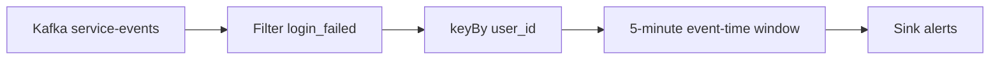
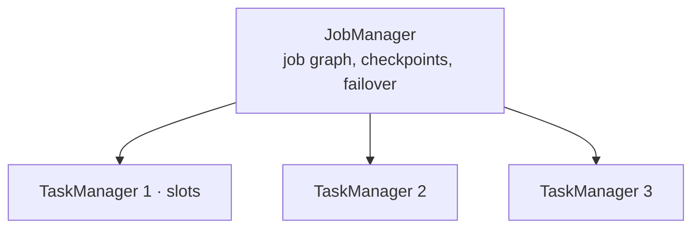

# Apache Flink

!!! info "Version and source policy"
    PyFlink and connector APIs are version-sensitive. Check [Versions & Primary Sources](../reference/version-matrix.md) and run the committed lab baseline.

02:11 AM. PagerDuty: the fraud team's `login-alerts` topic has been silent for six hours. Kafka consumer lag on `login-events` reads 0 — every record is being consumed. The job's CPU and network graphs look idle-normal, not crashed. A user who tripped 40 failed logins in eleven minutes never got flagged.

A. The job crashed quietly.
B. The alert threshold is wrong.
C. A watermark stopped advancing, so the 5-minute window that counts failed logins per user never closed.
D. Kafka silently dropped the events.

Predict which one before reading on. The rule behind that alert — **more than 10 failed logins for the same user in the last 5 minutes** — sounds like a one-line filter until you ask *whose clock* "5 minutes" runs on: the TaskManager's, Kafka's append time, or the timestamp inside the event. Get that wrong and a burst of late mobile retries can trip the rule for the wrong window, or never trip it at all.

Kafka stores the log ([Kafka module](../kafka/index.md)). Flink is the engine that keeps **state** across events and closes **windows** when it believes time has moved — which is exactly the mechanism that failed above.

---

## What this module covers

| Topic | What you will be able to reason about |
|-------|----------------------------------------|
| [Time semantics](time.md) | Event vs processing vs ingestion time; watermarks; idle sources |
| [Windows](windows.md) | Tumbling, sliding, session; triggers; late data |
| [State](state.md) | Keyed vs operator state; HashMap vs RocksDB; TTL |
| [Checkpoints](checkpoints.md) | Barriers, savepoints, Kafka EOS, backpressure |
| [Flink vs Kafka Streams vs Spark](comparison.md) | Workloads, not a feature bingo card |
| [Labs](labs.md) | Event-time vs processing-time, state, then stall a watermark |

You should already be comfortable with [Kafka partitions](../kafka/partitions.md) and [batch vs stream](../foundations/batch-vs-stream.md).

---

## The central intuition

A Flink job is a **dataflow graph**: sources, operators, sinks. Records flow forward. **State** lives in the operators (counts, last-seen timestamp, session buffers). **Watermarks** flow with the records and say "you will not see event-time older than T, except as late data". **Checkpoints** snapshot state and source offsets together so a crash replays from a consistent cut.



Without watermarks, the 5-minute window never knows when to emit. Without keyed state, you cannot count *per user*. Without checkpoints, a TaskManager death throws away six hours of counts.

---

## Five systems, same event

```json
{
  "timestamp": "2024-01-15T10:03:45.123Z",
  "customer_id": "cust_1842",
  "user_id": "u_99102",
  "service": "auth",
  "endpoint": "/login",
  "region": "eu-west-1",
  "latency_ms": 87,
  "status_code": 401,
  "bytes": 512
}
```

| System | Flink-shaped problem |
|--------|----------------------|
| **SaaS analytics** | Per-`customer_id` error rate every minute for a live dashboard. Late events from mobile. |
| **Observability** | p95 `latency_ms` per `service` per minute, 2M+ points/s, large keyed state. |
| **E-commerce** | Session windows per `user_id`; join add-to-cart with checkout. |
| **IoT** | Device sessions with hour-long gaps; idle partitions when a region goes quiet. |
| **Fraud** | "10 failed logins in 5 minutes" — the running example. False positives if you use processing time. |

---

## Architecture (what actually runs)



**JobManager:** master. Builds the execution graph, triggers checkpoints, recovers.

**TaskManagers:** workers. Each has **task slots**. Parallelism of a keyed operator is the number of subtasks; keys are hashed onto subtasks the same way Kafka keys are hashed onto [partitions](../kafka/partitions.md) — skew is the same enemy.

A job is submitted (JAR or PyFlink) to a session cluster, an application cluster, or a reactive Kubernetes deployment. Unlike Kafka Streams, **processing is not inside your microservice process** unless you embed mini-clusters (don't, in production).

---

## Programming model (PyFlink 1.18 shape)

```python
from pyflink.datastream import StreamExecutionEnvironment
from pyflink.datastream.connectors.kafka import KafkaSource, KafkaOffsetsInitializer
from pyflink.common.serialization import SimpleStringSchema
from pyflink.common.watermark_strategy import WatermarkStrategy
from pyflink.common import Time, Duration
from pyflink.datastream.window import TumblingEventTimeWindows

env = StreamExecutionEnvironment.get_execution_environment()
env.enable_checkpointing(60_000)

source = (
    KafkaSource.builder()
    .set_bootstrap_servers("localhost:9092")
    .set_topics("service-events")
    .set_group_id("flink-fraud")
    .set_starting_offsets(KafkaOffsetsInitializer.latest())
    .set_value_only_deserializer(SimpleStringSchema())
    .build()
)

# WatermarkStrategy + windowing: see time.md and windows.md
stream = env.from_source(
    source,
    WatermarkStrategy.for_bounded_out_of_orderness(Duration.of_seconds(10)),
    "service-events",
)
```

Parse JSON to the event dict in a `map`, `key_by(lambda e: e["user_id"])`, window, aggregate. The rest of the module fills in time, state, and failure.

`FlinkKafkaConsumer` was removed from the externalized Kafka connector used with Flink 1.17+ (including the 1.18 pinned in this course); labs and new jobs use `KafkaSource`.

---

## What Flink guarantees (and does not)

| Claim | Reality |
|-------|---------|
| Event-time correctness | If watermarks and timestamps are honest, windows match the world |
| Exactly-once **processing** | Checkpointed state + replay from Kafka offsets |
| Exactly-once **sink** | Only if the sink participates (Kafka transactional sink, or idempotent writes) |
| Sub-second latency | Possible; not automatic if checkpoints, windows, or RocksDB are heavy |
| Replaces Kafka | No. It reads Kafka (or Kinesis, files, Pulsar) |

Ingestion time (timestamp when Flink/Kafka first saw the record) is a compromise discussed in [time](time.md). Processing time is the wall clock — fine for "have we *received* a heartbeat in 30s", wrong for fraud windows.

---

## Scale snapshot

| Scale | What dominates |
|-------|----------------|
| **10×** | Wrong time domain; idle Kafka partitions stalling watermarks |
| **100×** | RocksDB vs heap; checkpoint duration; backpressure from a slow sink |
| **1000×** | Key skew, state TTL, incremental checkpoints to S3, operator chaining / slot sharing |

Those rows are expanded in [state](state.md) and [checkpoints](checkpoints.md).

---

## Operators, chaining, and backpressure

The job graph you write (`filter` → `key_by` → `window` → `sink`) is not always the graph that runs. Flink **chains** one-to-one operators into a single task to avoid serialisation. A `key_by` is a **network shuffle** — the same idea as Spark's shuffle, on the hot path, forever.

If the sink is slower than the source, credit-based flow control pauses upstream. The UI's backpressure badge is telling you the checkpoint barriers will also struggle. A "fast" job with a slow ClickHouse sink is a checkpoint-timeout incident in costume. Details in [checkpoints](checkpoints.md).

Parallelism is per operator. Sources often match Kafka partition count. Keyed windows match the number of slots you are willing to pay for. They do not have to be equal; a mismatch is a deliberate bottleneck.

---

## What not to use Flink for

- **Stateless filter-and-forward** at modest rate — Kafka Connect or a consumer in the app.
- **Nightly warehouse ETL** — [Spark](../spark/index.md) or a batch Flink job if you must share SQL, not a 24/7 streaming cluster.
- **Ad-hoc SQL** for analysts — a serving OLAP store, not a TaskManager.
- **Exactly-once HTTP calls** — not a thing; see [Kafka EOS](../kafka/exactly-once.md).

Flink earns its keep when **time + state + failure recovery** are the product.

Related: [observability](../architectures/observability.md), [fraud](../architectures/fraud.md), [IoT](../architectures/iot.md), [Spark vs Flink](../comparisons/spark-vs-flink.md).

---

## How to study this module

1. [Time](time.md) until you can explain a watermark to someone who thinks "event time" means "when Kafka appended".
2. [Windows](windows.md) with a paper sketch of tumbling vs sliding for the login rule.
3. [State](state.md) and estimate bytes for 10 million `user_id`s.
4. [Checkpoints](checkpoints.md) including the Kafka EOS handshake.
5. [Comparison](comparison.md) using the five workloads, not the table alone.
6. [Labs](labs.md), including **stall the watermark** and **kill a TaskManager**.

You are done when you can look at a Flink UI: checkpoint duration, backpressure badges, watermark lag, and say which one is the incident.
