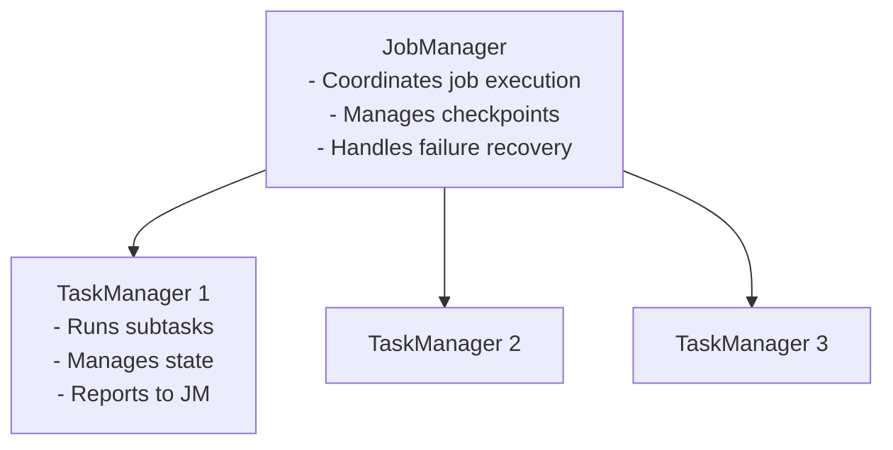

# Apache Flink

## The Problem

Processing events individually is easy:

```python
for event in kafka_stream:
    if event['status_code'] >= 500:
        send_alert(event)
```

Now add a requirement: "Alert when the *same user* has more than 10 failed logins in the last 5 minutes."

Suddenly time is part of your computation. And "5 minutes" measured by what — the clock on the processing server, or the timestamp in the event?

If your events arrive 30 seconds late (network delay, buffering, batching), does the user fall inside or outside the 5-minute window?

These questions are what stream processing is actually about.

---

## What This Module Covers

| Topic | What You Will Learn |
|-------|-------------------|
| [Time Semantics](time.md) | Event time vs processing time, why it matters |
| [Windows & Watermarks](windows.md) | How to bound time-based computations |
| [Stateful Processing](state.md) | Maintaining state across events |
| [Checkpoints & Recovery](checkpoints.md) | How Flink survives failures |
| [Flink vs Kafka Streams vs Spark](comparison.md) | When to use each |
| [Labs](labs.md) | Hands-on: windowed aggregations, failure recovery |

---

## Flink Architecture



**JobManager**: the master. Plans and coordinates execution, triggers checkpoints, reacts to failures.

**TaskManagers**: the workers. Each has a fixed number of **task slots**. Each slot runs one parallel instance of an operator (a **subtask**).

---

## The Flink Programming Model

A Flink job is a **streaming dataflow**: a DAG of operators connected by streams.

```python
# PySpark-like but for unbounded streams
from pyflink.datastream import StreamExecutionEnvironment

env = StreamExecutionEnvironment.get_execution_environment()

stream = env.add_source(FlinkKafkaConsumer('user-events', schema, props))

result = (stream
    .filter(lambda e: e['status_code'] >= 500)
    .key_by(lambda e: e['user_id'])
    .window(TumblingEventTimeWindows.of(Time.minutes(5)))
    .aggregate(CountAggregateFunction())
    .filter(lambda count: count.value > 10)
)

result.add_sink(AlertSink())
env.execute("Failed Login Detector")
```

---

## Running Use Case

The **Security / Observability Platform** needs to:
- Detect "user has 10+ failed logins in 5 minutes" in real time
- Calculate "error rate per service per minute" for dashboards
- Join security events with user profile data for enrichment
- Handle events that arrive up to 2 minutes late (mobile clients with intermittent connectivity)
