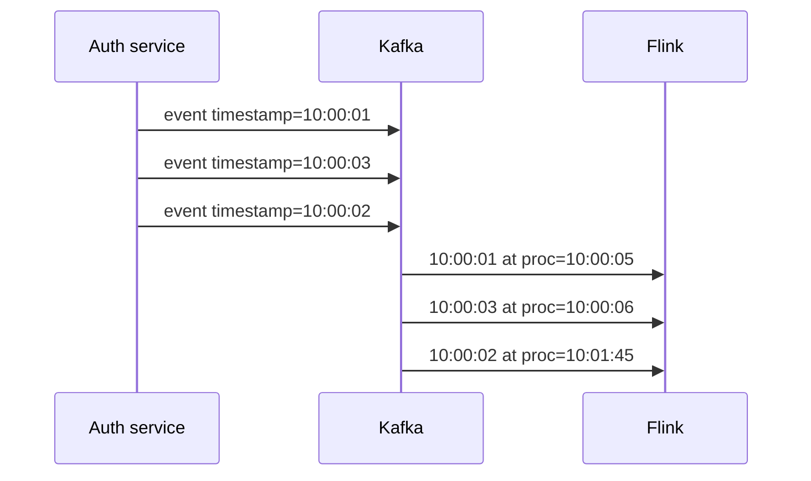

# Time semantics

10:47 PM. The EU fraud dashboard has not moved in twenty minutes. Kafka consumer lag on `login-events` is flat at zero on all 12 partitions — the topic is not backed up. A `SELECT count(*)` against the raw topic confirms events are still arriving. The 5-minute failed-login windows just are not closing.

A. The sink is down and silently swallowing output.
B. One or more Kafka partitions went idle overnight, and the job's watermark — the minimum across all partitions — froze with them.
C. The window trigger is misconfigured.
D. Someone disabled checkpointing and the job is stuck.

Predict which one before reading on, then check it against how a watermark is actually computed across partitions.

## Start with the situation { #use-case }

Fraud asks: **failed logins per user in the last 5 minutes.**

The event already carries the truth:

```json
{
  "timestamp": "2024-01-15T10:03:45.123Z",
  "customer_id": "cust_1842",
  "user_id": "u_99102",
  "service": "auth",
  "endpoint": "/login",
  "region": "eu-west-1",
  "latency_ms": 87,
  "status_code": 401,
  "bytes": 512
}
```

A laptop on a train buffers 40 failed PIN attempts and flushes them 90 seconds late. If you bucket by the TaskManager clock, those attempts land in the *current* minute and may not sit next to each other. The user looks innocent in the 10:03 window and noisy at 10:05 — or the opposite. SOC dashboards lie; the attacker still got in.

Observability p95 latency has the same bug if agents batch. IoT "device offline for 5 minutes" is the opposite problem: you *want* processing time ("we have not **received** a packet"). Mixing those up is the most expensive mistake in this module.

---

## Why the obvious approach breaks at scale { #why-this-is-hard-at-scale }

Events are not a single increasing timestamp:

- Many producers, many clocks (NTP drift, mobile timezones, `datetime.utcnow()` vs local).
- Kafka preserves **per-partition** order, not global event-time order ([Kafka partitions](../kafka/partitions.md)).
- Consumers lag: Flink may see 10:00 events at wall-clock 10:12.
- Kafka partitions that go **idle** stop sending timestamps, so a global watermark that is the min across partitions **freezes**.

At 50k events/s you can eyeball a few late records. At 2M/s, late data is a distribution you must encode as a watermark delay, not an exception handler.

---

## Build the mental picture { #intuition }

Three clocks:

| Clock | Definition | Use |
|-------|------------|-----|
| **Event time** | `timestamp` in the payload (when it happened) | Fraud, analytics, SLIs about the world |
| **Ingestion time** | When Kafka (or Flink source) first stamped the record | Compromise when producers have garbage clocks |
| **Processing time** | Wall clock when the operator runs | Heartbeats, "have we received data", ops metrics |



A processing-time 1-minute window assigns the third record to 10:01. An event-time window assigns it to 10:00 — **if you have not already closed 10:00**.

You cannot wait forever for stragglers. A **watermark** is an assertion: *I believe all events with event time ≤ W have arrived; anything older is late.*

---

## Internals: assigning timestamps

Flink does not magically read `event["timestamp"]`. You provide a timestamp assigner (ms since epoch) and a watermark strategy.

```python
from pyflink.common.watermark_strategy import WatermarkStrategy
from pyflink.common import Duration

def ts_ms(event, _record_ts):
    # parse event["timestamp"] → epoch millis
    return event["ts_ms"]

watermark = (
    WatermarkStrategy.for_bounded_out_of_orderness(Duration.of_seconds(10))
    .with_timestamp_assigner(ts_ms)
)
```

`for_bounded_out_of_orderness(10s)` means: watermark = max observed event time − 10s (per watermark generator, then combined). When the generator sees 10:00:50, it emits W=10:00:40. A tumbling window `[10:00, 10:01)` closes once W passes 10:01 — i.e. once you have seen event times around 10:01:10.

**Monotonous timestamps** (`for_monotonous_timestamps`) set W to the last event time. Only if you *know* the source is ordered (a single partition, already sorted). Observability is not.

**Ingestion time** in older Flink APIs stamped records at the source with processing time and then treated that stamp as event time. In 1.18, prefer: if producer clocks are lies, set the timestamp from Kafka's **record timestamp** (broker append time, `log.message.timestamp.type=LogAppendTime`) via the source's metadata, not from the payload.

---

## Internals: how watermarks move through the graph

Each parallel source subtask generates watermarks. At a shuffle (`key_by`), the watermark of a downstream subtask is the **minimum** of watermarks from its inputs. A window operator closes a window when its **input watermark** passes the window end.

Consequences:

- One slow/late source partition holds back **all** keys on that downstream task, and often the job's visible watermark.
- Idle inputs that send *nothing* never update their watermark.

---

## Internals: idle sources

Kafka topic `login-events`, 12 partitions. Night time in `ap-south-1` means partitions that only hold that region's keys go quiet. Flink's Kafka source still has those partitions assigned. Their watermark generator sees no events. The downstream min watermark **stalls**. Daytime EU fraud windows do not close. Dashboards freeze. State grows because windows never fire.

**Fix:** mark the source idle after a duration with no records:

```python
watermark = (
    WatermarkStrategy.for_bounded_out_of_orderness(Duration.of_seconds(15))
    .with_idleness(Duration.of_seconds(30))
    .with_timestamp_assigner(ts_ms)
)
```

After 30s of silence, that partition is excluded from the min. When it speaks again, it re-joins. Set idleness **longer than normal gaps, shorter than your stall SLO**. IoT devices that sleep for 15 minutes need a different value than auth traffic.

!!! production-gotcha "Idleness hides a dead producer"
    If a partition is idle because the producer crashed, watermarks advance and windows close **without** that region's events. Those events, when the producer returns, are late. Pair idleness with an alert on Kafka ingest per partition.

---

## Late events

After W has passed a window's end, an event for that window is **late**.

Policies:

1. **Drop** (default if you do nothing extra).
2. **Allowed lateness** — keep window state around and update (may emit revisions).
3. **Side output** — send lates to another sink for audit / reprocessing.

```python
from pyflink.datastream import OutputTag
from pyflink.datastream.window import TumblingEventTimeWindows
from pyflink.common import Time

late_tag = OutputTag("late-logins")  # Java/PyFlink type info omitted for clarity

windowed = (
    stream.key_by(lambda e: e["user_id"])
    .window(TumblingEventTimeWindows.of(Time.minutes(5)))
    .allowed_lateness(Time.minutes(1))
    .side_output_late_data(late_tag)
)
```

Allowed lateness **keeps keyed window state alive** — a cost against [RocksDB](state.md). A 5-minute window with 2 hours allowed lateness is a memory incident dressed as correctness.

---

## Processing time vs event time vs ingestion time

| Scenario | Clock |
|----------|--------|
| Failed logins in 5 minutes (fraud) | **Event time** |
| p95 latency per service per minute (observability) | **Event time** |
| Session length in e-commerce | **Event time** |
| "Have we received any IoT packet in 30s?" | **Processing time** |
| Producer clocks are garbage, Kafka `LogAppendTime` is trusted | **Ingestion** (broker timestamp as event time) |
| Simple ops alert, 30s error acceptable | Processing time is honest about being sloppy |

**Default to event time** for anything a human will treat as history.

---

## How: a fraud-shaped source

```python
from pyflink.datastream import StreamExecutionEnvironment
from pyflink.datastream.connectors.kafka import KafkaSource, KafkaOffsetsInitializer
from pyflink.common.serialization import SimpleStringSchema
from pyflink.common.watermark_strategy import WatermarkStrategy
from pyflink.common import Duration

env = StreamExecutionEnvironment.get_execution_environment()

source = (
    KafkaSource.builder()
    .set_bootstrap_servers("localhost:9092")
    .set_topics("login-events")
    .set_group_id("flink-fraud")
    .set_starting_offsets(KafkaOffsetsInitializer.latest())
    .set_value_only_deserializer(SimpleStringSchema())
    .build()
)

wm = (
    WatermarkStrategy.for_bounded_out_of_orderness(Duration.of_seconds(20))
    .with_idleness(Duration.of_seconds(60))
)

env.from_source(source, wm, "login-events")
```

Parse JSON in a `map` and, if you need payload timestamps rather than Kafka timestamps, use `assign_timestamps_and_watermarks` with a `with_timestamp_assigner` that reads `timestamp`. KafkaSource can also take a watermark strategy that uses record metadata — prefer that when `LogAppendTime` is the contract.

---

## Where teams get caught { #gotchas }

- **ISO strings without timezone** parse as local on one TaskManager and UTC on another. Store epoch millis at the producer.
- **`timestamp` = produce time in the API gateway** is ingestion time with extra steps; name it honestly.
- **Bad event timestamps:** an old record on an active split is late; it does not move a max-based bounded watermark backwards. A future timestamp can jump the watermark forward and make subsequent valid records late. A split that emits one old record and then goes idle can hold back the downstream minimum unless idleness is configured. Guard payload time (`now-1d <= ts <= now+1h`) before assigning watermarks.
- **Multiple Kafka topics in one source** with very different delay distributions: the slower topic's watermark holds back the faster one. Split jobs or use separate watermark strategies per source and a union with care.

---

## How it fails { #failure-modes }

| Failure | Symptom | Cause |
|---------|---------|-------|
| Windows never fire | Watermark stuck | Idle partition; broken assigner; no events |
| Windows fire empty / too small | Under-count | Processing time; watermark too aggressive |
| State grows without bound | Checkpoint duration ↑ | Windows never close; allowed lateness huge |
| Burst of "late" in side output | After a producer outage | Idleness advanced W; catch-up is late |
| Fraud misses a brute-force | Attacker spread across processing-time buckets | Wrong clock |

---

## How to investigate { #debugging }

Flink UI → Task → **watermarks**. Also emit watermark lag as a metric.

| Metric | Healthy | Investigate |
|--------|---------|-------------|
| `currentInputWatermark` advancing | Roughly event time − bound | Frozen: idle partition or dead assigner |
| `watermarkLag` (wall clock − W) | ≈ bound + Kafka lag | Minutes: source lag or idle |
| Kafka **consumer lag by partition** | Flat | One partition with lag explains a late burst |
| Late-record counter | Near 0 | Bound too small, or producer delay changed |
| Checkpoint duration | Stable | Window state piling up because W stuck |

Compare Kafka lag and watermark lag. High Kafka lag + advancing W means you assigned timestamps from **processing time** by accident. High watermark lag + low Kafka lag means the payload timestamps are old (buffered clients) or the bound is huge.

---

## Scale: 10× / 100× / 1000×

| Scale | Time-domain effect |
|-------|-------------------|
| **10×** | A 10s bound is fine; idle partitions already bite on multi-tenant Kafka topics |
| **100×** | Out-of-orderness is a histogram; set bound from p99 delay, not from folklore. Side-output lates to object storage |
| **1000×** | Do not keep hours of allowed lateness in Flink; close windows and repair from the [lake](../lakehouse/index.md) |

---

## Trade-offs

| Choice | Gain | Cost |
|--------|------|------|
| Event time + 10s bound | Correct buckets | +10s result delay |
| Event time + 10 min bound | Fewer lates | Dashboards 10 min stale; more in-flight windows |
| Processing time | Simple, low latency | Wrong history |
| Idleness | Windows close at night | Silent region-shaped data loss |
| Allowed lateness | Updates | State and retractions |

---

## Alternatives

- **Kafka Streams** punctuation / grace period: same watermark idea, embedded in the app ([comparison](comparison.md)).
- **Spark Structured Streaming** watermark: similar, micro-batch (seconds).
- **ClickHouse / Pinot** ingest-time aggregation: cheaper at observability volume if you can tolerate batch-ish windows.
- **Do the rule in the database** with `now() - interval`: processing time by another name.

---

## Ingestion time in practice

When mobile clocks are fiction, teams stamp **broker append time** (`log.message.timestamp.type=LogAppendTime`) and tell Flink to use the Kafka record timestamp as event time. You have not magically recovered the physical event; you have chosen a clock that is **monotonic per partition** and operated by you.

That is the right call for observability SLIs ("when did we *receive* the span"). It is the wrong call for "user failed login at 10:03" if the laptop was offline until 10:30 — those failures *happened* at 10:03. Fraud and audit want the payload timestamp **and** a bound on how late you will wait, then a late side output into a case-management topic.

Write the choice in the job's README. "We use event time" is not a choice if you never say *which field*.

---

## Watermark heuristics that survive contact with Kafka

1. Measure `now - event_ts` at the source operator for a day. Plot p50/p95/p99/p99.9.
2. Set bounded out-of-orderness near p99, not p50 (late side output for the tail) and not p99.9 (you will add minutes of latency for folklore).
3. Set idleness from **Kafka partition silence**, not from event delay. A partition can be silent while other partitions are merely late.
4. Revisit after a mobile-app release; delay histograms move.

```python
# Defensive assigner: drop clearly broken clocks before they touch W
def ts_ms(event, record_ts):
    t = event["ts_ms"]
    # record_ts is Kafka timestamp when the strategy has access to it
    if t < 1_000_000_000_000:  # not millis
        return record_ts
    return t
```

---

## How to apply this at work

Open the job. Search for `WatermarkStrategy`, `TimeCharacteristic`, `ProcessingTime`. If you cannot find a watermark on a windowed job, you are on processing time even if the JSON has a `timestamp` field.

Then measure **producer delay** = Flink ingest wall clock − payload timestamp. Set bounded out-of-orderness just above p99 of that delay, plus idle timeout from Kafka partition silence.

---

## Practice the idea

In the [watermark simulator](../simulations/watermark-simulator.html), freeze one
source split and predict the downstream minimum before enabling idleness. Then
run the [Flink lab](../labs/index.md#flink-labsflink) and use
`stalled_watermark.py` to assert the same rule. Finish with the
[stalled-watermark incident](../incidents/index.md#incident-3-flink-watermark-stalled-no-output).

## Check your understanding { #exercise }

`login-events` has 8 Kafka partitions. Seven receive a steady stream. Partition 7 is used only by a partner integration that sends traffic at 09:00 and 17:00. Watermark = bounded out-of-orderness 15s, **no** idleness. Fraud windows are 5 minutes.

1. What happens to windows between 09:30 and 16:30?
2. You add `with_idleness(30s)`. What happens to the 17:00 partner burst?
3. Should partner traffic share this topic?

??? question "Answer"
    1. Partition 7's watermark generator stays at the 09:00 tail (or never initialises). Downstream min watermark stalls. Five-minute windows **do not close** all afternoon. State grows. SOC sees a frozen dashboard.

    2. After 30s silence, p7 is idle; watermarks follow the other seven partitions; windows close. At 17:00 the partner events arrive with timestamps around 17:00 (or 09:00 if they were queued — read the payload). If they are truly 17:00, they land in open windows. If they were generated at 09:05 and buffered, they are **late** and dropped or side-outputted.

    3. Usually no. A sparse, high-delay source should not share the watermark min with the low-delay fraud path. Separate topic + job, or a union after independent watermarks with a documented idle policy.
