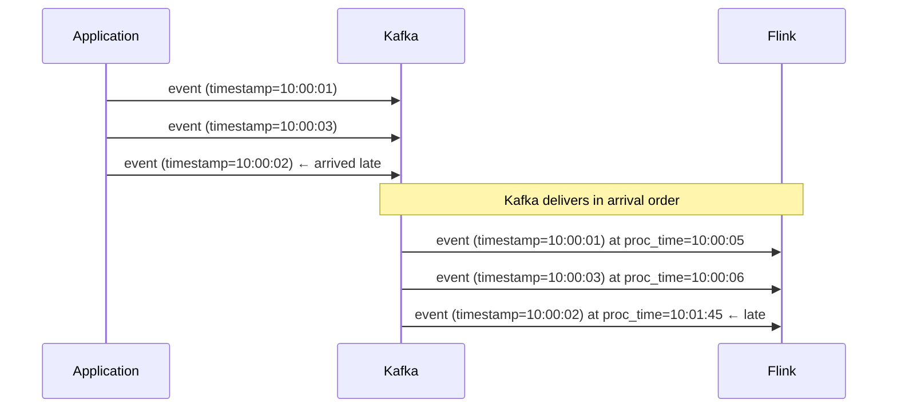

# Time Semantics

Time is the most subtle concept in stream processing. Getting it wrong produces silently incorrect results.

---

## Three Types of Time

### Event Time

The timestamp *embedded in the event* — when the event actually occurred in the physical world.

```json
{
  "user_id": "u123",
  "action": "login_failed",
  "timestamp": "2024-01-15T10:03:45.000Z"   ← event time
}
```

Event time is the "true" time. It is set by the application that generated the event, at the moment the event happened.

### Processing Time

The system clock time *when the event is processed* by Flink.

If an event was generated at 10:00:00 but arrived at Flink at 10:02:30 (delayed by buffering, network, batching), processing time is 10:02:30, but event time is 10:00:00.

### Ingestion Time

The time when Kafka received the event. Between event time and processing time.

---

## Why the Difference Matters

> Calculate "failed logins per user per minute"

If you use **processing time**:
- Events generated at 10:00 but delayed by 90 seconds arrive at Flink at 10:01:30
- They are assigned to the 10:01 minute window, not 10:00
- Your dashboard shows incorrect counts for the "real" time

If you use **event time**:
- The 90-second delayed events still get assigned to the 10:00 window
- Results are correct based on when events actually happened
- But: you must wait for late events before closing the window



At processing time 10:01:45, event time 10:00:02 arrives. If you are computing a 10:00–10:01 window, this event belongs in that window — but you have already "passed" it in processing time.

---

## Out-of-Order Events

Events do not arrive in event-time order. This happens because:

- Different paths through the network have different latencies
- Mobile clients buffer events offline and send them when reconnected
- Processing pipelines introduce delays
- Kafka consumers may be behind

```
Arrival order at Flink:
  t=10:00:01 ✓
  t=10:00:03 ✓
  t=10:00:02 ← out of order (arrived 2 seconds late)
  t=10:00:07 ✓
  t=10:00:04 ← out of order (arrived 3 seconds late)
```

When computing a 10:00–10:05 window using event time, you cannot close the window when you see `t=10:00:07` because there might still be late events for the 10:00–10:05 range.

**You need a mechanism to say "I have probably seen all events up to time T."**

That mechanism is the **watermark**.

---

## Watermarks

A watermark is an assertion: "I have seen all events with timestamps up to W. Future events with timestamps < W may still arrive, but I will treat them as late."

Flink advances watermarks based on the event timestamps it observes, with a configurable **out-of-order tolerance**:

```python
# Allow events up to 10 seconds late
watermark_strategy = WatermarkStrategy \
    .for_bounded_out_of_orderness(Duration.of_seconds(10)) \
    .with_timestamp_assigner(lambda e, t: e['timestamp_ms'])
```

With a 10-second tolerance:
- When Flink sees event time 10:00:50, it emits watermark 10:00:40
- The 10:00–10:01 window closes when watermark passes 10:01
- Events with event time < 10:00:40 arriving after watermark 10:00:40 are **late**

### Late Events

Late events (arriving after the window has closed) can be:
1. **Dropped** (simplest, may lose data)
2. **Sent to a side output** for separate handling
3. **Used to update** the already-emitted result (if the downstream accepts updates)

```python
late_output = OutputTag("late-events")
result = stream \
    .key_by("user_id") \
    .window(TumblingEventTimeWindows.of(Time.minutes(1))) \
    .allowed_lateness(Time.minutes(2)) \
    .side_output_late_data(late_output) \
    .aggregate(CountAggregateFunction())
```

---

## Processing Time vs Event Time: When to Use Each

| Scenario | Use |
|----------|-----|
| Need accurate historical results | **Event time** |
| Monitoring SLA: "has an event arrived in the last 30 seconds?" | **Processing time** |
| ML feature generation that should reflect when things happened | **Event time** |
| Simple alerting where a few seconds of skew is acceptable | **Processing time** |
| Joining streams from multiple sources with latency differences | **Event time** |

**Default to event time** for anything that will be used in dashboards, reports, or downstream ML. Processing time is acceptable for monitoring/alerting where small errors are tolerable.

---

## How to Apply This at Work

When reviewing a streaming job:

1. Which time domain is it using? (Check for `EventTime` or `ProcessingTime` in the config)
2. If event time: what is the watermark delay? Is it appropriate for the actual data latency?
3. What happens to late events? Are they dropped, counted separately, or handled?
4. How does window closure interact with data source latency?
