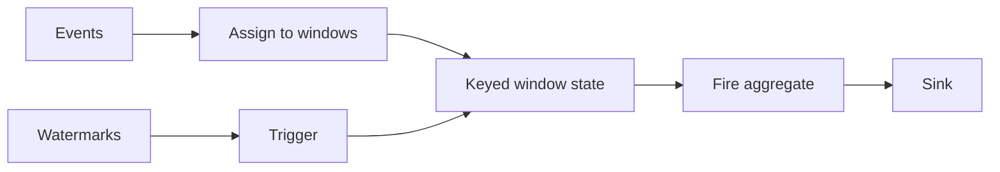

# Windows

11:58 PM. Fraud expects an alert: `u_44810` racked up 13 failed logins between 11:50 and 11:56 — well over the "10 in 5 minutes" threshold. No alert fired. Kafka lag is zero; the watermark is advancing normally.

A. The window is unkeyed, so it never ran per-user.
B. The job uses a tumbling 5-minute window, and the burst happened to straddle a bucket boundary — 6 attempts before 11:55, 7 after — so no single window ever saw more than 7.
C. The watermark is stuck.
D. Allowed lateness dropped the events.

Predict before reading on: which window shape would have caught this burst, and which one missed it?

## Use case

A stream never ends. "Average `latency_ms` for `service=api`" is undefined unless you say **over which slice of time**.

SaaS analytics wants error rate **per minute** per `customer_id`. Observability wants a **rolling 5-minute** p95, updated every 10 seconds. E-commerce wants **sessions**: activity until 30 minutes of silence. Fraud wants **10 failed logins in 5 minutes** per `user_id`.

Windows are how you turn an unbounded stream into finite aggregates without pretending the stream will stop.

---

## Why this is hard at scale

Every open window holds **state**. A 1-hour sliding window with a 1-second slide is not "the same as a 1-hour tumbling window". Each event is assigned to many windows; memory and CPU scale with `size / slide`.

Windows also **wait for watermarks** ([time](time.md)). A 5-minute event-time window does not emit at wall-clock T+5. It emits when W passes the window end, plus any allowed lateness. Product will ask why the "5-minute" alert took 5 minutes 40 seconds. You need a sentence ready.

At 2M events/s, a mistaken sliding window is a cluster-sized bill.

---

## Intuition

Bound the stream. Compute. Emit. Forget (unless sliding/session needs overlap).

```
Events: ●●●●●●●●●●●●●●●●●●
Tumbling:  ← W1 →← W2 →← W3 →
```

Tumbling: each event in **exactly one** window.
Sliding: each event in **size/slide** windows.
Session: windows *per key* grow with activity and close after a gap.

Always **key** first for "per user" / "per service". An unkeyed window is a single global pane — one task, no parallelism, a production incident waiting for a launch day.

---

## Internals: window types

### Tumbling

Fixed size, no overlap. `[10:00, 10:05)`, `[10:05, 10:10)`, …

```python
from pyflink.datastream.window import TumblingEventTimeWindows
from pyflink.common import Time

counts = (
    stream.key_by(lambda e: e["user_id"])
    .window(TumblingEventTimeWindows.of(Time.minutes(5)))
    .reduce(lambda a, b: {**a, "n": a["n"] + b["n"]})
)
```

**Use:** "error count per minute per service"; fraud "in the last 5 minutes" *if* you accept bucket edges (an attack split across 10:04 and 10:06 may be 6+6, never 10 in one bucket). For true rolling 5 minutes, use sliding.

### Sliding

Size S, slide D. Windows overlap.

```
S=5 min, D=1 min
[10:00, 10:05), [10:01, 10:06), [10:02, 10:07), ...
```

Each event in **5** windows. Cost ≈ 5× tumbling for the same size.

```python
from pyflink.datastream.window import SlidingEventTimeWindows

p95 = (
    stream.key_by(lambda e: e["service"])
    .window(SlidingEventTimeWindows.of(Time.minutes(5), Time.seconds(10)))
)
```

**Use:** rolling SLI. **Do not** use `slide=1ms`.

### Session

Per-key timeout. A session window is the span from first to last event with gaps < gap time.

```
user A: ●●●  gap>30m  ●●      → two sessions
```

```python
from pyflink.datastream.window import EventTimeSessionWindows

sessions = (
    stream.key_by(lambda e: e["user_id"])
    .window(EventTimeSessionWindows.with_gap(Time.minutes(30)))
)
```

**Use:** e-commerce sessions, IoT "burst then sleep". Merging sessions (an out-of-order event filling a gap) is why session state is harder than tumbling.

### Global

One window per key until you trigger. Raw power; you own cleanup. Prefer `ProcessFunction` with [keyed state](state.md) if you find yourself here.

---

## Internals: assignment, triggers, evictors

A window operator: **assigner** (which windows), **trigger** (when to fire), **evictor** (optional drop before fire), **function** (reduce/aggregate/process).

Default event-time trigger: fire when watermark passes window max timestamp.

You may add:

- **Processing-time timer** for speculative early results ("approximate count now")
- **Count trigger** (every 1000 events)
- Custom `Trigger`

Early firings without `PurgingTrigger` **keep** state so the final fire is correct. Downstream must handle **updates** (retraction or last-write-wins). Kafka sinks that only append will duplicate partials.

---

## Internals: watermark closes the window

Tumbling `[10:00, 10:01)` in event time closes when W ≥ 10:01:00.000.

With a 30s bounded-out-of-orderness, that happens when max seen event time is ~10:01:30. Result latency ≈ window size + out-of-orderness + Kafka lag + processing.



**Trade-off:** larger watermark delay → fewer lates, slower dashboards. Same as [time](time.md); windows are where users *feel* it.

---

## How: failed-login detector

```python
from pyflink.datastream import StreamExecutionEnvironment
from pyflink.datastream.window import SlidingEventTimeWindows
from pyflink.common import Time, Duration, Types
from pyflink.common.watermark_strategy import WatermarkStrategy
from pyflink.datastream.functions import AggregateFunction

class CountAgg(AggregateFunction):
    def create_accumulator(self):
        return 0

    def add(self, value, acc):
        return acc + 1

    def get_result(self, acc):
        return acc

    def merge(self, a, b):
        return a + b

env = StreamExecutionEnvironment.get_execution_environment()
env.enable_checkpointing(30_000)

# stream already has timestamps + watermarks from time.md
failed = stream.filter(
    lambda e: e["endpoint"] == "/login" and e["status_code"] in (401, 403)
)

alerts = (
    failed.key_by(lambda e: e["user_id"])
    .window(SlidingEventTimeWindows.of(Time.minutes(5), Time.minutes(1)))
    .aggregate(CountAgg(), output_type=Types.INT())
    .filter(lambda n: n > 10)
)
```

Sliding 5 minutes, slide 1 minute: an attack of 11 attempts in any 5-minute real interval will hit some window (with 1-minute resolution). Tumbling 5 minutes can split the attack.

For session-based "burst of failures then a success resets", a `KeyedProcessFunction` with a count and a timer is often clearer than windows — see [state](state.md).

---

## How: observability minute rollup

```python
from pyflink.datastream.window import TumblingEventTimeWindows

per_minute = (
    stream.key_by(lambda e: (e["service"], e["region"]))
    .window(TumblingEventTimeWindows.of(Time.minutes(1)))
    .reduce(lambda a, b: {
        "service": a["service"],
        "region": a["region"],
        "n": a["n"] + b["n"],
        "bytes": a["bytes"] + b["bytes"],
        "errors": a["errors"] + b["errors"],
    })
)
```

Pre-aggregate in Flink, sink to ClickHouse/Pinot. Do not slide by 1s at 2M events/s unless you have measured it.

---

## Gotchas

**Unkeyed windows.** `stream.window(...)` without `key_by` → parallelism 1.

**`timeWindow` vs event time.** If the env time characteristic or watermark is missing, you silently use processing time. Always set watermarks in 1.18 via `WatermarkStrategy`.

**Slide too small.** Memory ≈ keys × (size/slide) × accumulator. 10M users × 60 overlapping windows × 64 bytes is tens of GB *before* RocksDB overhead.

**Session gap vs watermark.** Sessions close when W passes last-event + gap. Idle Kafka partitions stall session close for **all** keys on that operator ([idle sources](time.md)).

**Overlapping alerts.** Sliding fraud windows fire every slide. Dedup notifications on `(user_id, window_end)` or "currently in violation" state, not every fire.

---

## Failure modes

| Failure | What you see |
|---------|----------------|
| Watermark stall | No window output; state ↑ |
| Hot key | One window subtask at 100%; others idle |
| Allowed lateness too large | Checkpoints balloon |
| Early triggers + append sink | Duplicate partial counts in Kafka |
| Processing-time windows after a catch-up | All historical events in *now* |

---

## Debugging

| Metric / UI | Meaning |
|-------------|---------|
| Watermark per subtask | Window close time |
| `numRecordsIn` vs `numRecordsOut` of window op | Out should be ~ keys × (windows firing per second), not event rate |
| Late count | Bound too tight |
| Checkpoint size of window operator | Accumulators not dropping |
| Kafka lag by partition | Catch-up will dump into processing-time windows |

In the Flink UI, a window operator with huge **state** and tiny **output** is almost always a watermark problem, not a "needs more parallelism" problem.

---

## Scale: 10× / 100× / 1000×

| Scale | Window design |
|-------|----------------|
| **10×** | Tumbling 1 minute per `service` is trivial on heap |
| **100×** | Prefer `reduce`/`aggregate` (incremental) over `process` that buffers all events. RocksDB. |
| **1000×** | Pre-aggregate tumbling 1s then a second job for longer windows; or push minute rollups to OLAP. Sliding 1-hour@1s is a research project, not a dashboard. |

IoT session windows at 1000× (100M devices) need aggressive [state TTL](state.md) and session gaps that match reality, not "30 days to be safe".

---

## Trade-offs

| Window | Correctness for "last 5 min" | Cost |
|--------|------------------------------|------|
| Tumbling 5 min | Weak at edges | Cheapest |
| Sliding 5 min / 1 min | Good | ~5× |
| Sliding 5 min / 1 s | Excellent | ~300× |
| ProcessFunction + timer | Exact sliding count possible | You write the code |

---

## Alternatives

- **Kafka Streams** `TimeWindows` / `SessionWindows` — same math, app-embedded.
- **Spark Structured Streaming** `groupBy(window(col, "5 minutes"))` — micro-batch; see [comparison](comparison.md).
- **Materialised OLAP** (Pinot, ClickHouse aggregating MT) — if the question is a dashboard at 1–5s freshness, you may not need Flink windows at all.
- **Redis sliding counters** — fraud prototype; not replay-safe.

---

## Incremental aggregation versus buffering

`ProcessWindowFunction` that does `for event in elements` stores **every record** until fire. At 2M/s and a 1-minute window that is 120 million objects of window state.

`ReduceFunction` / `AggregateFunction` keep a **fixed-size accumulator** per window per key (count, sum, sketch). This is the only acceptable default at scale.

Approximate p95: use a histogram/T-digest in the accumulator, not `list.sort()[int(0.95*n)]`. Observability p95 of `latency_ms` is why people cheat with a 100-bucket histogram — 100 ints per key per window, not 100k samples.

```python
class ErrorRateAcc(AggregateFunction):
    def create_accumulator(self):
        return (0, 0)  # errors, total

    def add(self, event, acc):
        err, tot = acc
        tot += 1
        if event["status_code"] >= 500:
            err += 1
        return (err, tot)

    def get_result(self, acc):
        err, tot = acc
        return err / tot if tot else 0.0

    def merge(self, a, b):
        return (a[0] + b[0], a[1] + b[1])
```

Session windows still need merge: two in-progress sessions become one when a late event fills the gap. If your accumulator cannot merge, you cannot sessionise.

---

## How to apply this at work

For every windowed job, write one line:

```
key = user_id
type = sliding 5m slide 1m
time = event
watermark = 20s + idle 60s
accumulator = count (not raw events)
sink = updates? yes/no
```

If you cannot fill `accumulator`, you are buffering whole windows and you will discover it at the first checkpoint.

---

## Exercise

You compute a **1-hour** sliding window with a **5-minute** slide on event time. Watermark bound = 2 minutes. Events can be 5 minutes late (p99). 10 million events/hour, keyed by `customer_id` (50k keys).

1. How many windows does an event at 10:23:15 belong to?
2. When does `[10:00, 11:00)` close (no allowed lateness)?
3. What watermark bound should you use given 5-minute late p99?
4. How does memory scale versus tumbling 1-hour?

??? question "Answer"
    1. Size/slide = 60/5 = **12** windows. (The event is in every 1-hour window whose start is in `(10:23:15 − 1h, 10:23:15]` aligned to 5-minute grid — 12 of them.)

    2. Window end is 11:00. Close when W ≥ 11:00. With a 2-minute bound, that is when max event time ≈ 11:02. Plus Kafka lag.

    3. A 2-minute bound will mark most 5-minute-late events **late**. Use ≥ 5 minutes (plus margin), or 2 minutes **and** a side output / allowed lateness of 5 minutes. Allowed lateness keeps 1-hour window state extra time — expensive. Better to set the watermark bound from the delay histogram.

    4. Tumbling 1-hour: each key has **one** open window (plus maybe the previous if W has not closed it). Sliding 5-minute: **12** open windows per key. Memory and CPU ~12× for incremental aggregates. At 50k keys that may still fit; at 50M IoT devices it will not.
