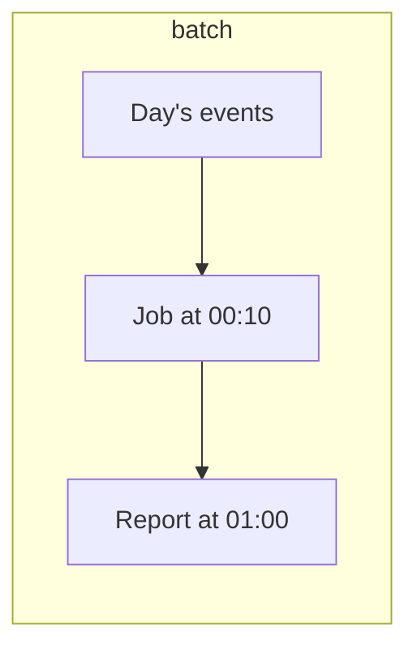
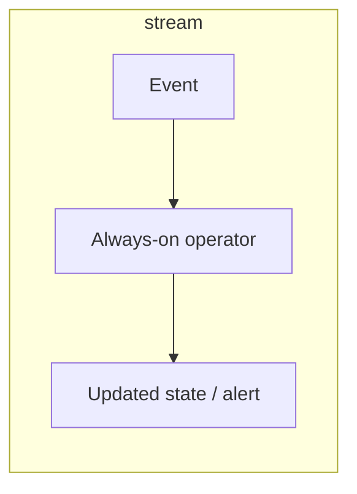

# Batch vs Stream Processing

Design review, Thursday. Someone proposes: "let's just put everything on Flink so we're real-time-ready." The same event —

```text
{timestamp, customer_id, user_id, service, endpoint, region, latency_ms, status_code, bytes}
```

— needs to answer three different questions: revenue-adjacent usage for last month, on the CFO's desk **Monday 09:00**; active users in the last hour, charted **every minute**; and whether this checkout request is fraudulent, in **200 ms**, before the card is charged.

Before you agree to "just put everything on Flink": does "real-time" mean the same thing for all three? Which of those three, answered an hour late, causes an actual incident rather than an annoyed Slack message?

Those are not three flavours of Spark — they are three **latency classes**, with three failure stories and three cost curves. Calling all of them "real-time" is how you inherit a Flink cluster that computes yesterday's CSV. Batch and stream are not rivals. They are points on a spectrum defined by **how late an answer is allowed to be**, and by **how much state you must remember between events**.

---

## Use case

Map the academy systems onto that spectrum:

| System | Question | If the answer is 1 h late… |
|--------|----------|------------------------------|
| SaaS analytics | Daily p95 per tenant | CFO is fine; on-call is not, for *error spikes* |
| Observability | Page on error budget burn | The incident is already in Slack |
| E-commerce CDC | Stock count after an order | Oversell; that is a **write path**, not a dashboard |
| IoT | Valve temperature vs threshold | Minutes may be fine; 24 h is a melted plant |
| Fraud graph | Score this device cluster | The transaction already settled |

The same Kafka topic can feed a **nightly Spark job**, a **micro-batch**, and a **Flink keyed state** job. The topic does not make you “streaming.” The **consumer’s SLA and state** do.

---

## Why this is hard at scale

Batch looks easy until the batch **does not finish in the batch window** ([scale](scale.md)). Stream looks easy until you admit:

- Events arrive **late** and **out of order** (mobile apps, IoT buffers, CDC lags).
- You must keep **per-key state** (session, rolling count, last-seen) across crashes.
- Exactly-once is a **sink protocol**, not a checkbox. See [Kafka exactly-once](../kafka/exactly-once.md) and [Flink checkpoints](../flink/checkpoints.md).
- Replay is a feature (Kafka) and a foot-gun (you replay 14 days into a stateful job with the wrong watermark).
- Cost is **always-on CPU + state backend**, not “one job at midnight.”

Micro-batch (Spark Structured Streaming) sits in the middle: easier ops than Flink for many teams, **worse** at event-time windows and large keyed state.

---

## Intuition

**Batch**: a bounded pile. You know when it is complete (the hour closed, the file landed, the snapshot finished). Failure = rerun the pile. Throughput first.

**Stream**: an unbounded pile. Completeness is a **watermark**, not a timestamp on a folder. Failure = restore state and continue. Latency first.





The honest picture is a **slider**:

| Latency class | Typical engine | Completeness trick |
|---------------|----------------|--------------------|
| Milliseconds | Flink, Kafka Streams, online model | Event-time + small windows, or no window (stateless) |
| Seconds | Flink / Spark SS (1–5 s trigger) | Micro-batch or async checkpoints |
| Minutes | Spark SS, scheduled Spark, materialized views | Hour/minute partitions |
| Hours–days | Spark / dbt / SQL | Folder `date=` is the watermark |

If the slider is on “hours,” a streaming framework is an expensive batch engine with worse APIs.

---

## Internals

### Batch

- Input is **finite**. Spark reads splits, [executes](distributed-execution.md) stages, writes, exits.
- Retry granularity: **task**, or whole job if the sink is not transactional.
- State is **inside the job** (shuffle agg) and thrown away.
- Natural fit: historical backfills, slowly changing dimensions, Iceberg compaction, ML training sets.

Spark batch on the SaaS lake:

```python
daily = spark.read.parquet("s3://analytics/events/date=2024-01-15/")
daily.groupBy("customer_id").count().write.mode("overwrite").parquet(
    "s3://marts/daily_active/date=2024-01-15/"
)
```

Overwrite-by-date is the batch idempotency story. It is a good story. Do not throw it out because “streaming is modern.”

### Stream

- Input is **infinite**. Operators run until you kill them.
- State lives in a **backend** (RocksDB + checkpoints in Flink; HDFS/S3 state store in Spark SS).
- Time is a first-class bug: **event time** vs **processing time**. A 02:00 event processed at 04:00 belongs in the 02:00 window or you will never match batch.
- Backpressure is load-shedding by another name: Kafka lag grows; you must decide whether to scale, drop, or fall behind.

### Lambda vs Kappa (and why the argument aged)

Classic **Lambda**: batch layer for truth, speed layer for approximations, serving layer merges.

```text
Events → Kafka → Spark nightly  → accurate history
               → Flink 5s      → fresh-but-maybe-wrong
               → merge in serving
```

Problems: two codebases, two numbers, two on-call rotations. Finance will notice the numbers disagree.

**Kappa**: one stream processor; “batch” is **replay from offset 0** (or from an Iceberg snapshot as a source). One codebase. Replay cost and state bootstrap become the tax.

In 2026 practice, most serious platforms are **neither slogan**: Kafka (or CDC) in, Flink or Spark SS for the low-latency paths that need it, **Spark/dbt batch on Iceberg** for the warehouse, ClickHouse/Pinot for serving. That is not a failure of purity. It is matching [latency classes](#intuition).

### State: the hard part of streaming

Batch is stateless *relative to the pile*: load, compute, die.

Streaming jobs that matter keep state:

- Counts / sums per key in a window
- Last-seen for anomaly detection
- Session in-progress
- CDC change-apply (the row as it currently is)

State must:

1. Survive worker death (checkpoint / changelog).
2. Scale with **key cardinality** (IoT device_id, observability series).
3. Match your consistency story (at-least-once duplicates vs exactly-once sinks).

This is why Flink’s state story is a module, not a bullet. Start at [Flink](../flink/index.md) and [state](../flink/state.md).

### Micro-batch

Spark Structured Streaming triggers every \(N\) seconds, runs a **mini Spark job** (same DAG, same shuffle).

```python
spark.conf.set("spark.sql.adaptive.enabled", "true")  # AQE in SS: version-dependent; test it

raw = (
    spark.readStream.format("kafka")
    .option("kafka.bootstrap.servers", "kafka:9092")
    .option("subscribe", "saas.events")
    .option("startingOffsets", "latest")
    .load()
)
events = raw.select(F.from_json(F.col("value").cast("string"), schema).alias("e")).select("e.*")

out = (
    events
    .withWatermark("timestamp", "10 minutes")
    .groupBy(F.window("timestamp", "1 hour"), "customer_id")
    .agg(F.count("*").alias("n"))
)

(
    out.writeStream
    .format("parquet")
    .option("path", "s3://marts/hourly_active/")
    .option("checkpointLocation", "s3://chk/hourly_active/")
    .outputMode("append")
    .trigger(processingTime="1 minute")
    .start()
)
```

You get Spark SQL and AQE-ish behaviour. You also get **batch-shaped shuffles every trigger**. If the shuffle cannot finish in the trigger interval, lag grows forever. That is the micro-batch cliff.

---

## How

### Decide with numbers, not adjectives

Write the SLA as a **percentile of event-to-serving delay**:

```text
p95(now - event.timestamp) ≤ 5 minutes
completeness ≥ 99.5% of events eventually counted
```

Then pick the cheapest engine that meets **both**. Completeness is why “just drop late events” is a product decision.

### Spark batch when the folder is the watermark

```python
# Airflow: data interval 2024-01-15, late sensors allowed until 02:00
spark.read.parquet(f"s3://analytics/events/date={date}/") \
    .filter(F.col("status_code") >= 500) \
    .write.mode("overwrite").parquet(f"s3://marts/errors/date={date}/")
```

### Flink when 200 ms and keyed state matter (fraud)

Stateless filter can be a Kafka consumer. **Graph features + rolling counts** cannot. You checkpoint keyed state, watermark event time, emit scores to a low-latency store. Do not fake this with 1-second Spark SS unless you have measured p99 trigger duration.

### Hybrid that does not become Lambda-by-accident

- Stream: alerts, fraud, CDC apply, “user is on fire.”
- Batch: finance-grade daily facts, backfills, model training.
- **Reconcile**: a daily job diffs stream mart vs batch mart and pages on drift. That one job replaces the serving-layer merge of Lambda.

---

## Production gotchas

!!! production-gotcha "'Real-time' meant 15 minutes"
    After two meetings, the dashboard user refreshes with coffee. Spark hourly is enough. You still built watermarks.

!!! production-gotcha "Streaming a problem that is a small file problem"
    IoT 1 Hz × 2 M devices is a **write amplification and cardinality** problem. Streaming it into a TSDB without downsampling just moves the cliff. See [IoT](../architectures/iot.md).

!!! production-gotcha "Two truths"
    Stream count 10 042 331, batch count 10 041 998. Without a reconciliation job this becomes a Slack religion. Pick a **source of record** per metric.

!!! production-gotcha "Checkpoint in the same bucket as output, then `rm -rf`"
    Spark SS / Flink will reprocess or refuse to start. Checkpoint location is **part of the identity of the job**. Treat it like a disk.

!!! production-gotcha "Processing-time windows on mobile events"
    Nightly syncs dump 18:00–22:00 local events at 07:00 UTC. Processing-time says they happened at 07:00. Your “evening engagement” dashboard is a sunrise chart.

---

## Failure modes

| Mode | Batch symptom | Stream symptom |
|------|---------------|----------------|
| Slow input | Job exceeds window; next day overlaps | Kafka lag; watermark stalls; state grows |
| Duplicate publish | Duplicate rows unless sink overwrites by key/date | Duplicate keys unless idempotent sink / EOS |
| Late events | Missing from yesterday’s folder unless you re-run | Dropped past watermark, or infinite state if you never watermark |
| Worker death | Task retry; job retry | Restore checkpoint; replay Kafka from offsets |
| State explosion | Rare (shuffle spill) | RocksDB / HDFS state 10× input; GC; checkpoint timeout |
| Schema change | Job fails at 00:10 | Job fails at 14:32 in prod traffic |

CDC-specific: the stream is a **log of mutations**. Treating it as a batch of “rows that exist” double-counts updates. You need an apply engine (Flink, Spark foreachBatch + MERGE, Debezium unwrap).

---

## Debugging

**Batch:** Spark UI as in [Distributed Execution](distributed-execution.md); Airflow duration vs data interval; row-count vs source; Iceberg snapshot diffs.

**Stream:**

| Signal | Tool | Meaning |
|--------|------|---------|
| Kafka lag (bytes and records) | consumer group metrics | Not keeping up, or stuck partition (skew) |
| Watermark vs max event time | Flink UI / Spark SS progress | Late data or idle sources stalling watermark |
| Checkpoint duration / size | Flink | State too large or sink too slow |
| `inputRowsPerSecond` vs `processed` | Spark SS `StreamingQueryProgress` | Micro-batch cliff |
| Duplicate keys in sink | Downstream unique constraint | At-least-once without idempotency |

```python
# Spark SS: log progress in the driver
query = out.writeStream.foreachBatch(lambda df, i: ...).start()
for p in query.recentProgress:
    print(p["timestamp"], p["numInputRows"], p.get("durationMs"))
```

Never debug streaming without **event-time histograms**. Processing-time lag alone cannot tell late data from slow CPU.

---

## Scale

| Factor | Batch | Stream |
|--------|-------|--------|
| **10×** volume | Bigger cluster or longer window; still nightly | Scale TaskManagers / SS receivers; watch lag |
| **100×** | Midnight job cannot finish; go incremental (hourly folders, Iceberg CDC) | State cardinality 100×; key skew; checkpoint timeouts |
| **1000×** | You no longer batch *raw*; you batch **aggregates** | Tier: hot stream for minutes, cold batch for months; drop or downsample (IoT) |

At 1000×, **everything is hybrid**. Observability platforms ingest streaming, downsample in minutes, compact in hours, expire in days. Fraud scores in milliseconds, trains models on batch weeks.

---

## Trade-offs

| | Batch | Stream |
|--|-------|--------|
| Throughput / $ | Better | Worse (always-on, small batches) |
| Latency | Window size | Sub-second possible |
| Ops | Job succeeds or fails | Never “done”; need SLOs on lag |
| Replay | Re-read files | Re-read log + restore or discard state |
| Semantics | Easy overwrite-by-partition | Hard: watermarks, EOS, idempotent sinks |
| Backfill | Trivial | Painful (separate batch path anyway) |

Micro-batch: reuses Spark skill; **caps** you at trigger interval + shuffle. Fine for 1–5 minute marts. A poor fraud engine.

---

## Alternatives

| Need | Prefer |
|------|--------|
| Daily finance metrics | Batch Spark / dbt on Iceberg |
| Dashboard 5–60 s | ClickHouse / Pinot ingest, not a custom stream job per chart |
| CDC into a lake | Batch micro-intervals **or** Flink/Spark SS with MERGE — measure |
| 200 ms fraud | Flink + feature store / graph; not Spark SS |
| “Streaming” because Kafka exists | **Kafka is a log.** Consumers can be batch (`spark.read` once an hour). |

See [Spark vs Flink](../comparisons/spark-vs-flink.md) once you can name the watermark requirement.

---

## How to apply at work

When someone says “we need this in real time,” interrogate:

1. **Number**: 200 ms, 5 s, 5 min, 1 h?
2. **Cost of delay**: money, safety, embarrassment, or a dashboard feeling stale?
3. **Human or machine consumer?** Humans rarely need 200 ms.
4. **Late events:** how late, how many, do we correct the number later?
5. **Recompute story:** can we rerun last Tuesday? If not, you do not have a platform.

Many “real-time” requirements collapse to **five minutes**. Five minutes is Spark Structured Streaming or even **frequent batch**. Streaming complexity is justified when **latency or incremental state** is the product.

**Streaming adds complexity. Make the SLA pay for it.**

---

## Exercise

You own SaaS events plus a new **fraud check** on `POST /checkout`. Legal wants a **daily** attestation of API error rates. Product wants a **live** “customers currently erroring” wall. Payments wants a **score < 200 ms**.

1. For each of the three, pick batch, micro-batch, or event-at-a-time. Name the sink.
2. A stakeholder says “one Flink job for all three so we have a single source of truth.” What actually happens at 100× volume?
3. CDC from `orders` arrives 45 s late during a database failover. Which of the three products breaks, and how do you degrade?
4. Design a **reconciliation** that runs at 02:00. What does it compare, and what is the page threshold?
5. IoT cousin: 5 M devices × 1/30 Hz. Do you stream raw values to the lake? What is the 1000× move?

??? question "Worked answer"
    1. **Legal error rates**: nightly Spark/dbt on Iceberg, overwrite `date=`, PDF/table to compliance. **Live erroring customers**: micro-batch 30–60 s into ClickHouse/Pinot or a small Flink window; wall can be 1 min late. **Fraud**: event-time Flink (or a service with in-memory features), sink = decision log + the HTTP response; **not** a lake write on the hot path.
    2. One Flink job **couples SLAs**. Checkpoint size and shuffle of the daily-attestation-shaped agg will miss 200 ms. Backpressure from the lake sink stalls fraud. At 100× you split: ingest once (Kafka), **three consumers**, shared schema, nightly recon.
    3. Fraud: degrade to **heuristic / allow-with-flag** using last-known features; do not block checkout on CDC. Live wall: lag badge, do not pretend freshness. Legal daily: still fine if the failover is inside the day; re-run after catch-up.
    4. Compare Flink-derived daily error counts vs Iceberg batch counts per `customer_id` (and global). Page if relative error > 0.5% **and** absolute > N, or if fraud decision log volume vs checkout CDC count diverges. Store the diff; do not “merge in serving.”
    5. **Do not** land raw 100-byte points as millions of tiny Parquet files per minute. Stream into a TSDB or wide-events table with **downsampling** (1 min / 1 h rollups); lake gets rollups + a sampled raw. 1000× is tiered retention, not a bigger Spark nightly on raw.
