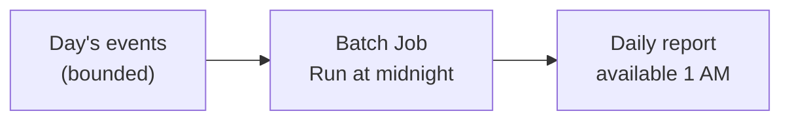
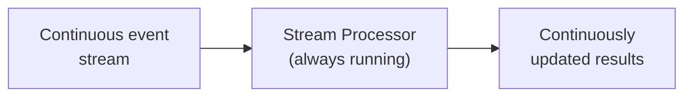

# Batch vs Stream Processing

Batch and stream processing are not competing paradigms. They are different points on a spectrum defined by latency requirements, and the right choice depends entirely on what your workload actually needs.

---

## The Problem

You are collecting user events. Stakeholders want to know:

1. Total revenue for last month — answer needed by 9 AM Monday
2. Number of active users in the last hour — updated every minute
3. Whether this specific transaction is fraudulent — answer needed in 200ms

These are three different problems. They have three different answers.

---

## Batch Processing

**Definition**: process a finite, bounded dataset as a unit.

You wait until data is "complete" (end of day, end of hour, end of ETL job), then run a computation over all of it.



**Characteristics**:
- High throughput (process huge volumes efficiently)
- High latency (data must accumulate before processing)
- Simple failure semantics (rerun the entire batch if it fails)
- Natural for: reports, aggregations, historical analysis, ETL

**Examples**: Spark batch jobs, Hadoop MapReduce, SQL on Hive

---

## Stream Processing

**Definition**: process events as they arrive, without waiting for a complete dataset.



**Characteristics**:
- Low latency (results updated as events arrive)
- Lower throughput per unit compute (processing overhead per event)
- Complex failure semantics (state must survive worker failures)
- Natural for: real-time dashboards, fraud detection, alerting, enrichment

**Examples**: Flink, Kafka Streams, Spark Structured Streaming

---

## The Latency Spectrum

There is no hard boundary between "batch" and "stream". There is a latency spectrum:

| Latency | Approach | Example use case |
|---------|----------|-----------------|
| Milliseconds | Streaming (event-by-event) | Fraud detection |
| Seconds | Micro-batch or streaming | Real-time dashboards |
| Minutes | Micro-batch | Near-real-time aggregations |
| Hours | Batch | Hourly reports |
| Days | Batch | Daily analytics |

Spark Structured Streaming can operate at minute-level latency. Flink can operate at millisecond latency. "Streaming" covers a wide range.

---

## The Lambda Architecture

Before unified streaming frameworks matured, teams built **Lambda architectures**: run both a batch layer and a streaming layer in parallel, merge results.

```
Events → Kafka → Batch Layer (Spark) → Historical accuracy
                 ↓
              Stream Layer (Flink) → Low-latency approximations
                 ↓
              Serving Layer → Merge results
```

The batch layer provided accurate historical data. The streaming layer provided fresh but potentially approximate data. The serving layer merged them.

**Problems with Lambda**:
- You maintain two codebases (batch + streaming)
- Results can diverge — the batch and stream disagree
- Debugging is complex

Modern **Kappa architectures** use only a streaming system, replaying historical data through the stream processor when needed.

---

## State: The Hard Part of Streaming

Batch processing is stateless relative to the batch: you load all data, compute, write results, done.

Stream processing often requires maintaining **state** — keeping track of information across events:

- Count per user over a rolling window
- Last seen value for anomaly detection
- Session state (open vs closed)
- Running totals

State in a stream processor must:
- Survive worker failure (stored in a fault-tolerant backend)
- Scale as the number of distinct keys grows
- Be consistent with exactly-once semantics if required

This is why Flink's state management is complex — and powerful. It is examined in depth in the [Flink module](../flink/index.md).

---

## Batch vs Stream: A Practical Guide

Use **batch** when:
- Results can tolerate hours of latency
- You need to process historical data
- Simplicity is more important than freshness
- Reprocessing from scratch is acceptable

Use **stream** when:
- Results must be fresh within minutes or seconds
- Events must trigger downstream actions
- You are enriching events in flight
- Latency directly affects business outcomes (fraud, alerting)

Use **micro-batch** (Spark Structured Streaming) when:
- Minutes of latency is acceptable
- You want to reuse your Spark skills and DataFrame API
- State management is relatively simple

---

## How to Apply This at Work

When a stakeholder asks for "real-time data", clarify:

1. What does "real-time" mean to them? Minutes? Seconds? Sub-second?
2. What is the cost of adding latency? (a 5-minute delay might be perfectly fine)
3. Is this for a human dashboard or for automated decision-making?
4. How much will accuracy suffer if some late events are missed?

Many "real-time" requirements turn out to be "5 minutes" requirements when clarified — and 5-minute latency can be served with micro-batch, not a fully stateful streaming job.

**Streaming adds complexity. Make sure the latency requirement justifies it.**
