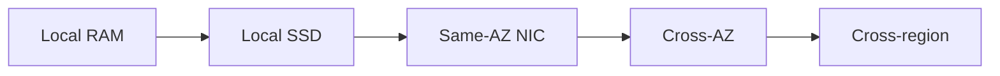
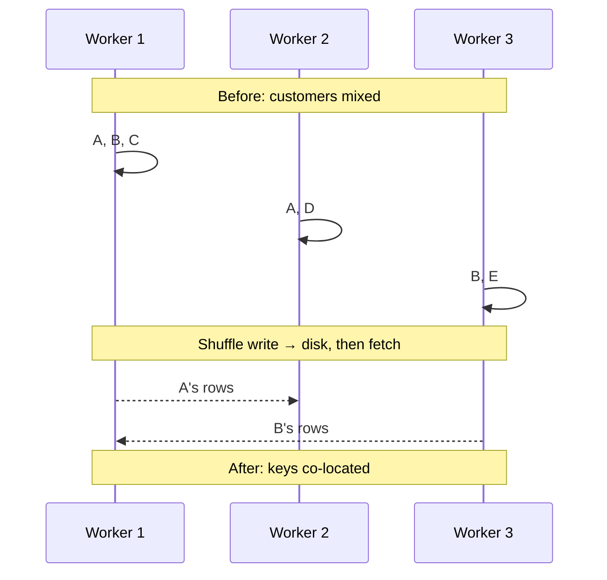

# Data Movement

You have 500 GB of SaaS events spread across twenty executors. You need `sum(bytes)` and p95 latency **per `customer_id`**. Customer `cust_0042` has rows on machines A, B, and C.

Until those rows **meet**, the aggregation is a lie. Meeting means bytes on a wire, on disk, and through a serialiser. That meeting is often **most of the wall clock** of a Spark job — more than the `percentile_approx`.

Moving data is expensive in time first, money second (especially cross-AZ and egress). Treat it as the design constraint, not as an implementation detail Spark will hide.

---

## Use case

SaaS analytics events, one day, ~500 GB Parquet:

```text
{timestamp, customer_id, user_id, service, endpoint, region, latency_ms, status_code, bytes}
```

Three movements hide in a “simple” pipeline:

1. **Read** from S3 into executors (storage → compute).
2. **Shuffle** for `groupBy("customer_id")` (compute → compute).
3. **Write** the tiny rollup back to S3, then **BI tools pull it again**.

Item 2 is the [shuffle](../spark/shuffle.md). Item 1 is why cloud lakes are slower than HDFS-on-the-same-box for the same cores. Item 3 is why a 20 MB mart that is **not compacted** still costs 20,000 GET requests.

The other academy systems are the same physics:

- **Observability**: fan-in of traces across AZs is a NIC problem long before it is a parse problem.
- **CDC**: Debezium → Kafka → lake is three serialisations of the same row.
- **IoT**: millions of 100-byte payloads; **header and RPC overhead** dominate the sensor value.
- **Fraud**: graph hops are data movement by another name (pointer chasing over the network).

---

## Why this is hard at scale

A “25 Gbps network” sounds infinite. Arithmetic:

- 500 GB uncompressed (or already-expanded rows)
- ~25 Gbps **effective** after TCP, TLS, checksums, and that you do not own the full bisection bandwidth
- \(500 \times 8 / 25 \approx 160\) seconds **if the shuffle is perfectly smooth**

At 1 TB, ~5 minutes. At 10 TB, on the order of an hour of *just* transfer, before skew, before spill, before the reducer CPU. JSON will inflate that; a 40% tenant will turn it into one machine’s problem.

CPU is rarely the scarce resource on ETL boxes. **Bytes × serialisation × distance** is.

---

## Intuition

Three slogans:

1. **Don’t move it.** Push predicates and projections to storage; aggregate twice (partial then final) so the second hop is small.
2. **If you must move it, shrink it.** Columnar layout, compression, binary rows, prune partitions — see [Partitioning](partitions.md).
3. **Distance has a price list.** Same NUMA node ≪ same host ≪ same rack ≪ same AZ ≪ cross-AZ ≪ cross-region ≪ internet egress.



HDFS put compute on the datanode because (1) was policy. S3 + Kubernetes makes (1) impossible for the read path; you can still obey it for the **shuffle** (keep executors in one AZ, enable the external shuffle service).

---

## Internals

### Serialisation

Before a row crosses a process boundary it becomes bytes. After, it becomes a row again. That pair can dwarf the aggregation.

| Format | Speed | Size | Notes |
|--------|-------|------|-------|
| Java / pickle | Poor–moderate | Large | Opaque, fragile, avoid on hot paths |
| JSON | Slow | Large | Fine at the edge, tax in the lake |
| Avro | Fast | Small | Kafka / CDC workhorse, schema registry |
| Parquet | Fast scan | Very small | Columnar; not a shuffle format |
| Arrow | Very fast | Small | pandas UDF batches, Trino/Spark exchange in places |
| Tungsten `UnsafeRow` | Fast | Compact | Spark’s in-memory / shuffle binary |

Spark shuffles Tungsten rows, then compresses the block (default `lz4` since Spark 2.0; `snappy` before that). Kafka serialises **your** payload: if you put JSON in, you pay JSON on every consumer.

```python
# Production Spark: Kryo for RDD/closures; SQL already uses UnsafeRow.
spark.conf.set("spark.serializer", "org.apache.spark.serializer.KryoSerializer")
spark.conf.set("spark.shuffle.compress", "true")
spark.conf.set("spark.shuffle.spill.compress", "true")
spark.conf.set("spark.io.compression.codec", "lz4")
```

!!! warning "Python UDFs are a hidden movement"
    Each row JVM → pickle/Arrow → Python worker → back. That is a shuffle-shaped tax **without** an `Exchange` in the plan. Prefer native functions; if you cannot, pandas UDFs. See [Gotchas](../spark/gotchas.md).

### Compression

Compression spends CPU to buy NIC and disk. For ETL, that trade almost always wins.

| Codec | Ratio | Speed | Where you see it |
|-------|-------|-------|------------------|
| gzip | High | Slow | Cold objects, not shuffles |
| snappy | Moderate | Fast | Older Spark/Parquet defaults |
| lz4 | Moderate | Very fast | Kafka, Spark shuffle, ClickHouse default |
| zstd | High | Fast | Parquet, ClickHouse cold, Kafka 2.1+ |

Kafka producers default to `compression.type=none`. Leaving it there is how you pay for extra brokers.

### The shuffle (the movement that matters)



Mechanically, in Spark 3.x sort-based shuffle:

1. **Map (shuffle write).** Each task sorts rows by **target partition id**, writes **one** data file + index (not \(N\) files per mapper — that was the old hash shuffle).
2. **Fetch (network).** Reducers pull the slice they own from every mapper (external shuffle service if dynamic allocation is on).
3. **Reduce (shuffle read).** Deserialise, merge, aggregate. If it does not fit: **spill**.

`GROUP BY`, `JOIN` (sort-merge), `DISTINCT`, `orderBy`, `repartition` all pay this. `filter` / `select` / `map` do not.

### Locality vs object storage

Spark still *asks* the scheduler for `NODE_LOCAL` tasks. On S3 the answer is almost always `ANY`. You then care about:

- **GET size** (`spark.sql.files.maxPartitionBytes`, 128 MB default is a reasonable start).
- **S3 throughput per prefix** — date partitions help more than people think.
- **Cross-AZ**: compute in AZ-a, bucket “multi-AZ,” shuffle crossing AZs. Pin the cluster.

This is a primary reason **the same 200 cores are slower in the cloud than on HDFS in 2016**. The cores are fine. The path to the first byte is longer.

### Partition count is a movement setting

- Too few: each fetch is huge → spill, few parallel fetches.
- Too many: millions of tiny fetches, task scheduling, small output files.

Default `spark.sql.shuffle.partitions = 200` is wrong at both 10 MB and 10 TB. AQE coalesces **after** measuring map output. Deep dive: [The Shuffle](../spark/shuffle.md).

---

## How

### Measure before you “optimise”

```python
from pyspark.sql import functions as F

spark.conf.set("spark.sql.adaptive.enabled", "true")
spark.conf.set("spark.sql.adaptive.skewJoin.enabled", "true")
spark.conf.set("spark.sql.autoBroadcastJoinThreshold", str(64 * 1024 * 1024))

events = spark.read.parquet("s3://analytics/events/date=2024-01-15/")

# Partial aggregate *before* a fat join — less movement.
partial = events.groupBy("customer_id", "region").agg(
    F.count("*").alias("n"),
    F.sum("bytes").alias("bytes"),
)

regions = spark.read.parquet("s3://dims/regions/")  # tiny
out = partial.join(F.broadcast(regions), "region")
out.write.mode("overwrite").parquet("s3://analytics/marts/daily_customer/")
```

Broadcast **eliminates** the shuffle of the large side. Memory math: 80 MB dimension × 50 executors ≈ 4 GB extra cluster-wide, **plus** copies per core if not careful. Thresholds are not “free speed.”

### Push down so S3 never sends the column

```python
df = (
    spark.read.parquet("s3://analytics/events/")
    .filter("date = '2024-01-15' AND status_code >= 500")
    .select("customer_id", "endpoint", "latency_ms")
)
df.explain("formatted")
# Expect: PushedFilters, PartitionFilters, ReadSchema with 3 fields
```

### Compress the log

```properties
# Kafka producer
compression.type=lz4
batch.size=65536
linger.ms=10
```

A 500 GB/day JSON topic can be ~80–150 GB/day lz4. That is broker disk, replication traffic, **and** consumer shuffle all at once.

---

## Production gotchas

!!! production-gotcha "Cross-AZ shuffle as a line item"
    Three AZs × sort-merge join = most shuffle bytes billed at cross-AZ rates. Pin Spark to one AZ; replicate the *result*, not the *exchange*.

!!! production-gotcha "Broadcast of a 'small' table that grew"
    Dimension was 8 MB at design time, 1.2 GB after a year of slowly changing dimensions. Every executor now holds 1.2 GB extra. Driver also collects it. Classic driver + executor OOM pair.

!!! production-gotcha "Uncompressed JSON in the lake"
    Pretty-printed JSON is a data-movement bug you stored. Convert once at the edge (Avro/Protobuf → Parquet). Do not make Spark parse JSON on every job.

!!! production-gotcha "`repartition(1000)` 'for parallelism' before `groupBy`"
    You just added a **full extra shuffle**. `groupBy` already shuffles. See [Gotchas](../spark/gotchas.md).

---

## Failure modes

| Failure | Mechanism | Symptom |
|---------|-----------|---------|
| Shuffle spill death spiral | Reducer partition > execution memory | Disk spill GB ≫ input; stage 10× slower |
| Fetch failures | Mapper executor gone, no shuffle service | `FetchFailedException`, stage retry, sometimes job abort |
| Timeout / 503 on S3 | Too many tiny GETs | Tasks flap, input rate collapses |
| Network saturation | Uncompressed shuffle + few partitions | High `shuffle read` time, low CPU |
| Silent skew | One key owns the NIC of one node | One task 50× slower; cluster looks idle |
| Replication storm | Kafka `acks=all`, uncompressed, rf=3 | Disk and NIC 3× payload |

Fetch failures under **dynamic allocation** happen because executors with shuffle files get reclaimed. Fix: `spark.shuffle.service.enabled=true` and `spark.dynamicAllocation.shuffleTracking.enabled=true` (Spark 3.x), or do not scale executors to zero mid-job.

---

## Debugging

Spark UI, in order:

1. **SQL tab** — count `Exchange` nodes. Each is a movement. `BroadcastHashJoin` vs `SortMergeJoin`.
2. **Stage metrics** — Shuffle Write Size, Shuffle Read Size, Spill (Memory/Disk). Spill should be ~0 on a healthy job.
3. **Task stragglers** — sort by Shuffle Read. If one task read 80 GB and the median read 400 MB, you have a key problem, not a NIC problem.
4. **Executors tab** — shuffle read/write per host. One host hot → skew or locality accident.
5. **Environment** — codec, `autoBroadcastJoinThreshold`, AQE flags.

Logs: `FetchFailedException`, `SparkOutOfMemoryError: error while calling spill`, S3 `SlowDown`.

Network: host-level `sar -n DEV` during the stage; cloud: AZ bytes. If shuffle bytes ≈ input bytes for a `filter` + `select` only, you introduced an accidental `repartition`.

---

## Scale

| Factor | Movement picture | Response |
|--------|------------------|----------|
| **10×** | Shuffle 10×; still one AZ | Compression on, AQE on, broadcast dims, prune dates |
| **100×** | Bisection bandwidth and S3 prefixes saturate; whales appear | Isolate top keys, increase partitions with size math, compact files, maybe shuffle service + more NICs |
| **1000×** | You cannot shuffle the whole day every hour | Incremental compute (Iceberg snapshots, merge-on-read vs copy-on-write), pre-aggregates, CDC of *changes*, colocate serving with storage (ClickHouse) for the hot slice |

At 1000× the winning move is **not moving**: materialised marts, incremental models, pushdown to an engine that already has the data laid out.

---

## Trade-offs

| Tactic | Saves | Costs |
|--------|-------|-------|
| Broadcast join | Shuffle of the fact table | Memory × executors; driver collect |
| Partial aggregation | Shuffle bytes | Two stages; not always valid (median needs care) |
| Higher compression (zstd) | NIC and disk | CPU, sometimes latency |
| More shuffle partitions | Spill risk | Scheduler + small files |
| Same-AZ cluster | $ and latency | AZ failure domain |
| HDFS locality | Read bandwidth | Ops, capacity coupling |
| S3 lake | Cost, elasticity | Every job re-reads over the NIC |

---

## Alternatives

- **Do the join in the database that already has both tables** (Postgres, ClickHouse) when they fit. Spark as a distributed `JOIN` engine is how 20 GB becomes a 20-minute story.
- **Trino** for ad-hoc: often *less* movement because it pipelines and pushdowns hard; still shuffles for joins. See [Trino](../query-engines/trino.md).
- **Flink** for incrementally maintained keyed state: you move each event **once** into state, not a 500 GB daily shuffle. See [Batch vs Stream](batch-vs-stream.md).
- **Pre-aggregate at ingest** (Kafka Streams / Flink window) so the lake never sees raw 100-byte IoT rows.
- **Avoid the movement entirely** with a serving OLAP copy of the hot window.

---

## How to apply at work

When a job is slow, refuse CPU dashboards until someone pastes:

1. Shuffle write **and** read bytes (Spark UI).
2. Serialisation / file format on the hot path (JSON vs Parquet vs Avro).
3. Compression on Kafka and on Parquet.
4. Partition count vs data size (200 partitions of 100 MB vs 50 GB).
5. Locality: cross-AZ? cross-region? S3 in another account?
6. Accidental extra `Exchange` (`repartition`, wide `partitionBy` write).

If shuffle bytes ≫ output bytes, you are paying to **rearrange** data that you then throw away. That is usually a key or a “select \*” problem.

---

## Exercise

A daily Spark job reads **800 GB** Parquet (S3, same region, three AZs). It:

```python
events = spark.read.parquet("s3://analytics/events/")  # no date filter
joined = events.join(customers, "customer_id")         # customers = 2 GB
agg = joined.groupBy("customer_id").agg(F.sum("bytes"))
agg.write.parquet("s3://out/")                         # default 200 files
```

Cluster: 40 executors × 4 cores, 16 GB each, spread across 3 AZs. `spark.sql.shuffle.partitions=200`. AQE off. `cust_0042` is 35% of events.

1. List every **network hop** and estimate which dominates.
2. What does 200 shuffle partitions imply per reducer, roughly?
3. Name three concrete changes (code or config) that cut movement the most.
4. After those changes, what still breaks because of `cust_0042`?
5. Would copying `events` onto HDFS-local disks be worth it? When?

??? question "Worked answer"
    1. S3 GET of **800 GB** (full lake — no prune) into executors, possibly cross-AZ; **sort-merge join** shuffles **both** events (~800 GB rows) and customers (2 GB); **second shuffle** for `groupBy`; write 200 files to S3. Dominant: the unpruned read + two fat shuffles, billed cross-AZ if the cluster is spread.
    2. 800 GB / 200 ≈ **4 GB** shuffle-read per task *if even* — already chubby; the whale task is ~0.35 × 800 GB ≈ **280 GB** on one reducer. That task spills or OOMs; the stage is that task.
    3. Filter `date=` (or partition discover) so scan is ~one day; `broadcast(customers)` (2 GB is **too big** at default 10 MB — raise threshold *or* project customers down to 50 MB of keys+attrs, then broadcast); enable AQE + skew join; pin cluster to one AZ; `spark.sql.shuffle.partitions` from size math or AQE advisory 128 MB; write with `coalesce` / `maxRecordsPerFile` so you do not create 200 tiny files *and* do not create 200 huge ones blindly.
    4. Broadcast removes the join shuffle of events but **groupBy still hashes `customer_id`**. Salt / two-phase agg / isolate `cust_0042`.
    5. HDFS locality helps the **read** if jobs re-scan the same 800 GB all day. For a once-daily job, copying 800 GB *to* HDFS *is* the movement you were trying to avoid. Worth it for a hot working set reused many times per hour, not for a nightly ETL.
