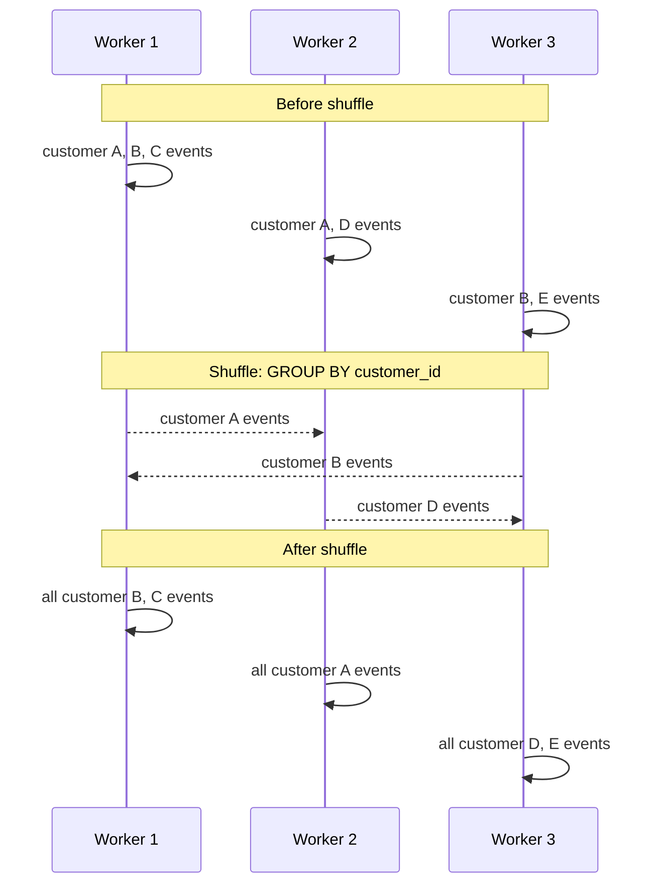

# Data Movement

Moving data is often the most expensive operation in distributed systems. Not expensive in dollars (though that too), but expensive in *time* — often dominating total job execution time.

---

## The Problem

You have 500 GB of data on Machine A. You need to aggregate it grouped by `customer_id`. Some customers' events are on Machine A, some are on Machine B, some on Machine C.

To compute per-customer aggregations, *all events for the same customer must be on the same machine at the same time*.

That means data must move.

---

## Network Is Not Free

A modern server network runs at 10–100 Gbps. That sounds fast. Let's do the math:

- 500 GB of uncompressed data
- 25 Gbps effective network bandwidth (real-world throughput after overhead)
- Transfer time: 500 GB ÷ 25 Gbps = **160 seconds just in network transfer**

And that is before any computation happens. At 1 TB it is 320 seconds. At 10 TB it is nearly an hour.

**Data movement is a performance bottleneck, not an implementation detail.**

---

## Serialization

Before data can move across a network, it must be serialized — converted from in-memory objects into bytes. After transfer, it must be deserialized back.

| Format | Speed | Size | Type Safety |
|--------|-------|------|-------------|
| Python pickle | Moderate | Large | Weak |
| JSON | Slow | Large | Weak |
| Apache Avro | Fast | Small | Strong |
| Apache Parquet | Fast | Very small | Strong |
| Apache Arrow | Very fast | Small | Strong |

Spark uses its own binary serialization (Tungsten). Kafka uses whatever format you put in the message. The choice of serialization format directly affects job performance.

---

## Compression

Compression reduces network transfer time at the cost of CPU. For data-intensive workloads, compression almost always wins because:

- CPU cycles are plentiful
- Network bandwidth and disk I/O are bottlenecks

| Codec | Compression Ratio | Speed | Use Case |
|-------|------------------|-------|----------|
| gzip | High | Slow | Cold storage, batch |
| snappy | Moderate | Fast | Kafka messages, streaming |
| lz4 | Moderate | Very fast | Low-latency, Kafka default |
| zstd | High | Fast | ClickHouse, Parquet, general purpose |

Kafka's default compression is `lz4` for producer output and `none` for stored messages. ClickHouse uses `lz4` by default with optional `zstd` for colder data.

---

## Data Locality

The ideal: process data where it lives. Moving compute to data is cheaper than moving data to compute.

This is why HDFS (Hadoop Distributed File System) placed compute nodes on the same machines as data nodes. Spark tries to schedule tasks on workers that already have the data locally.

With cloud object storage (S3, GCS), data locality is often impossible — your Spark job on EC2 and your data in S3 are not "local" to each other. The network hop is unavoidable.

**This is one reason cloud data processing is slower than on-premise processing for the same hardware spec.** The data access pattern is fundamentally different.

---

## The Shuffle

In distributed processing, the **shuffle** is the operation where records are redistributed across workers based on a key, enabling grouped computation.

The shuffle involves:

1. **Shuffle write**: each worker partitions its output by the grouping key and writes it to disk
2. **Network transfer**: workers pull the partitioned data they need from other workers
3. **Shuffle read**: each worker reads the data assigned to it

This is why `GROUP BY`, `JOIN`, and `DISTINCT` operations in Spark are expensive — they all require a shuffle.

---

## Partition Count and Data Movement

More partitions = more parallelism but also more overhead:

- **Too few partitions**: workers are underutilised, no parallelism benefit
- **Too many partitions**: high overhead from task scheduling, small files, coordination cost
- **The right number**: typically 2–4× the number of CPU cores available

In Spark, the default shuffle partition count is 200. For a 10 MB dataset this creates 200 tiny tasks with more scheduling overhead than computation. For a 10 TB dataset, 200 partitions might mean each partition is 50 GB — too large for memory.

---

## How to Apply This at Work

When diagnosing slow data pipelines:

1. Look at shuffle bytes in Spark UI — if shuffle writes dominate, you have a data movement problem
2. Check serialization format — JSON is expensive; consider Avro or Parquet
3. Check compression — uncompressed Kafka topics are wasting bandwidth
4. Check partition count — 200 partitions for a 100 MB dataset is excessive
5. Check data locality — are you pulling data across regions?
