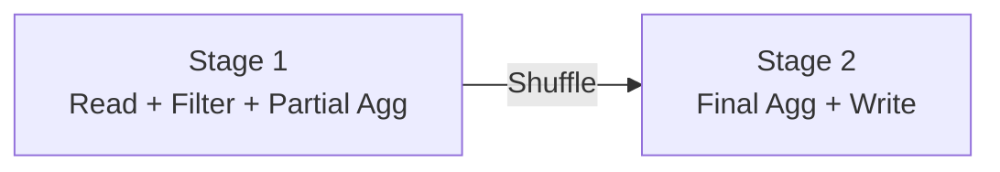
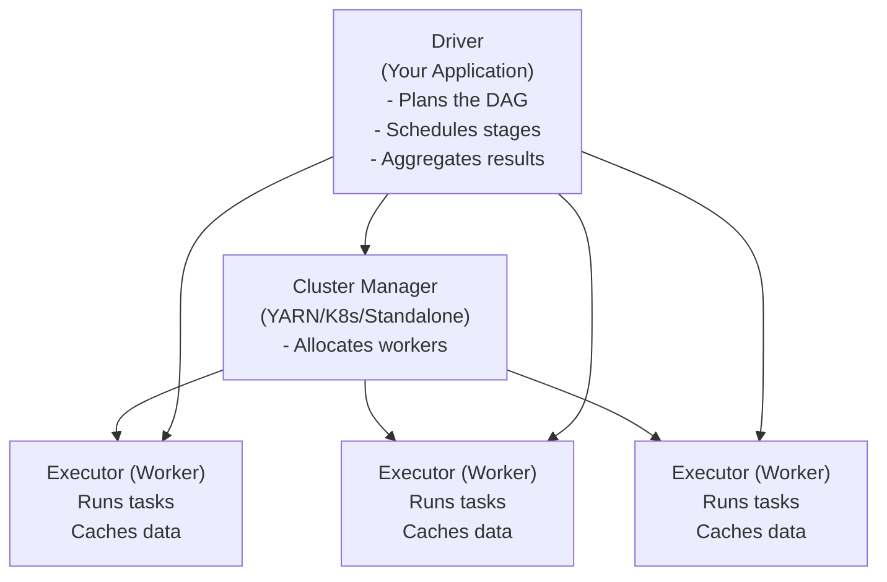

# Distributed Execution

When a distributed framework like Spark, Flink, or Trino runs a job, it does not simply execute your code on one machine. It decomposes the work into a hierarchy of units that can be parallelised and scheduled across a cluster.

Understanding this hierarchy is essential because most performance problems in distributed systems are expressed in terms of it.

---

## The Hierarchy

```
Job
 └── Stages
      └── Tasks
           └── Partitions → Workers
```

---

## Jobs

A **job** is the top-level unit of work — typically triggered by an action in your code (e.g., `df.write()`, `df.count()` in Spark).

One SQL query, one `write()` call, one Flink pipeline = typically one job.

---

## Stages

A **stage** is a group of tasks that can execute without a shuffle. A stage boundary occurs whenever data must be redistributed.

Example: a Spark job with a GROUP BY creates at least two stages:

- **Stage 1**: read data, apply filters, compute partial aggregations
- **Shuffle** (boundary between stages — data moves between workers)
- **Stage 2**: combine partial aggregations



Within a stage, tasks are independent — no communication between workers needed.

---

## Tasks

A **task** is the atomic unit of work — one function executed on one partition on one worker.

If Stage 1 has 200 partitions, it creates 200 tasks. Those 200 tasks can run in parallel across available workers.

Task duration is visible in the Spark UI and Flink UI. A task taking 10× longer than its siblings is a sign of data skew.

---

## Partitions and Workers

Each task processes one **partition**. A **worker** can run multiple tasks sequentially (or in parallel if it has multiple cores/slots).

```
Worker has 4 CPU cores → can run 4 tasks concurrently
20 tasks to execute → each core gets 5 tasks sequentially
Total time ≈ 5 × (average task duration)
```

The stragglers — tasks much slower than average — determine the total stage duration, because the stage cannot complete until all tasks are done.

---

## The Driver and Workers

### Spark Architecture



- **Driver**: coordinates everything, holds the DAG, collects final results. If the driver dies, the job dies.
- **Cluster Manager**: allocates resources (Executors)
- **Executors**: do the actual computation, hold cached data

> A common mistake: calling `df.collect()` in the driver. This moves all data from all Executors to the single Driver JVM. If the result is large, the driver OOMs.

---

## DAGs (Directed Acyclic Graphs)

Spark, Flink, and other distributed frameworks represent computation as a **DAG**:

- **Nodes** are operations (filter, join, aggregate, write)
- **Edges** are data dependencies (operation B depends on output of operation A)
- **Acyclic** means no cycles — you cannot have operation A depend on operation B which depends on operation A

The framework analyses the DAG to:
- Determine where shuffle boundaries occur (stage breaks)
- Optimise operation order (predicate pushdown, column pruning)
- Fuse adjacent operations that do not require a shuffle (operator chaining)

---

## Lazy Evaluation

Spark does not execute transformations immediately. Instead it builds up a plan — the DAG — and only executes when you trigger an action.

```python
# None of these lines execute immediately
df = spark.read.parquet("s3://events/")
df2 = df.filter(df.status == "ERROR")
df3 = df2.groupBy("customer_id").count()

# This triggers execution
df3.show()
```

This allows the optimizer to see the *full* computation before execution and apply optimizations across the entire plan.

---

## How This Connects to Other Technologies

| Technology | Driver equivalent | Worker equivalent | Task equivalent |
|------------|------------------|-------------------|-----------------|
| Spark | Driver | Executor | Task |
| Flink | JobManager | TaskManager | Subtask |
| Trino | Coordinator | Worker | Split |
| Ray | Head node | Worker node | Task/Actor |

The names differ, the structure is the same.

---

## Reasoning Exercise

A Spark job has:

- 400 input partitions
- A GROUP BY operation
- 200 shuffle partitions (Spark default)
- 10 workers with 4 cores each (40 cores total)

1. How many stages do you expect minimum?
2. In Stage 1, how long until all tasks complete if average task time is 30 seconds but one takes 300 seconds?
3. In Stage 2 with 200 partitions and 40 cores, what is the minimum elapsed time if each task takes 5 seconds?
4. What would you change to improve performance?
