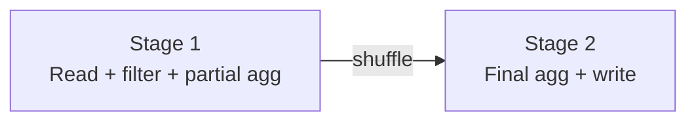
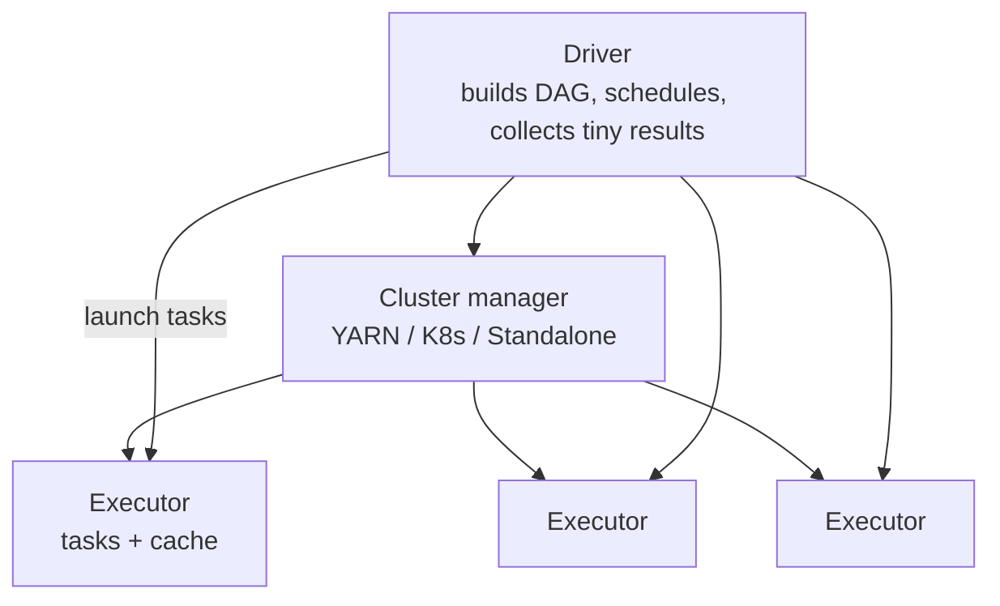

# Distributed Execution

16:03. The Spark UI is open. 199 tasks in this stage finished in under 10 seconds each. One is still running at 25 minutes. On-call is asked: is the cluster undersized, or is something else going on?

Before you answer: does adding 20 more executors fix a straggler task, or does it just add 20 more machines waiting on the same one? And what actually turns `groupBy("service").agg(...)` into "199 fast tasks and one slow one" in the first place?

Spark does not run your function on 8 TB directly — it builds a graph, cuts the graph at every place data must move, turns each cut into thousands of **tasks**, and bets the SLA on the slowest one. If you cannot name the job, the stages, the tasks, and the straggler, the Spark UI is just a colourful 404. The same hierarchy is how Flink, Trino, and Ray explain themselves — different nouns, same physics.

---

## Start with the situation { #use-case }

8 TB of events, 40 executor cores, this code:

```python
events = spark.read.parquet("s3://analytics/events/date=2024-01-15/")
errors = events.filter(F.col("status_code") >= 500)
per_service = errors.groupBy("service").agg(
    F.count("*").alias("n"),
    F.expr("percentile_approx(latency_ms, 0.95)").alias("p95"),
)
per_service.write.parquet("s3://marts/errors_by_service/date=2024-01-15/")
```

You need to answer, before the job runs:

- How many **jobs**? How many **stages**?
- How many **tasks** in the read stage vs the aggregate stage?
- What happens when one executor dies at 90%?
- What happens if you replace `write` with `collect()` because you wanted to “just inspect”?

Observability pipelines ask the same questions with Flink **subtasks**. Ad-hoc SQL asks them with Trino **splits**. Fraud feature jobs on Ray ask them with **tasks vs actors**. Learn the hierarchy once.

---

## Why the obvious approach breaks at scale { #why-this-is-hard-at-scale }

On one process, call stacks are enough. On a cluster:

- **Work is discrete.** You cannot use 39.5 cores; you use \(N\) tasks of a given size.
- **A stage is a barrier.** 199 tasks at 10 s and one at 25 min is a 25 min stage.
- **The coordinator is a single point of planning and of certain failures.** Driver dies → job dies. Collecting the result to the driver is how you *cause* that death.
- **Retries are per task**, not per row. A 4 GB task that OOMs retries the 4 GB, possibly forever, while siblings sit idle.
- **Speculation and dynamic allocation** change who runs what, which is why shuffle files vanish (see [Data Movement](data-movement.md)).

---

## Build the mental picture { #intuition }

```text
Action  →  Job  →  Stages  →  Tasks  →  (one partition each) on workers
                  ↑
            shuffle boundary
```

- **Narrow** dependency: each output partition needs one input partition (`filter`, `select`). Pipeline in one stage.
- **Wide** dependency: each output partition needs **many** input partitions (`groupBy`, `join`). New stage, after a shuffle.

Picture a kitchen: the head chef (driver) does not cook 8 TB of pasta. They print tickets (tasks). Each line cook owns a ticket. The dining room (your notebook) only sees the plates that come back — which is why you must not ask them to plate 8 TB.



---

## Under the hood { #internals }

### Jobs

A **job** is triggered by an **action**: `write()`, `count()`, `collect()`, `show()`, `take()`. One action ≈ one job (Spark may run extra jobs for `count` / AQE / InMemoryFileIndex).

Transformations (`filter`, `groupBy`, `join`) only grow the DAG.

### Stages

A **stage** is the maximal set of tasks that can run without a shuffle. Spark cuts the DAG at wide transformations.

For the use-case job you should expect **at least two** stages (read/filter/partial vs final agg/write). A sort-merge join of two large tables is typically three or more (read each side, then join).

Within a stage, tasks **do not communicate**. That is the point.

### Tasks and partitions

One task processes one **partition** (roughly). 400 input files/splits → 400 tasks in stage 1. After `groupBy`, task count = `spark.sql.shuffle.partitions` (or AQE’s coalesced count).

```text
Worker with 4 cores → 4 concurrent tasks
200 tasks, 40 cores → ~5 waves
elapsed ≈ waves × p99 task time    (not average)
```

The **straggler** sets the stage time. Skew, GC, S3 503s, and slow nodes all look like “one task.”

### Driver, cluster manager, executors



| Piece | Owns | Dies when |
|-------|------|-----------|
| Driver | Plan, scheduler, Spark UI, **broadcasts**, `collect` | Whole app |
| Cluster manager | CPU/RAM allocation | Executors come and go |
| Executor | Task JVM, cache, shuffle files | Tasks on it retry elsewhere |

!!! danger "`collect()` is a data-movement to a single JVM"
    Every executor ships rows to the driver. 100 GB DataFrame → driver heap + network in-cast. Use `write`, `take`, `show`, or an aggregate.

### DAGs and lazy evaluation

Nodes are operators; edges are dependencies; **acyclic** so the scheduler can topological-sort.

```python
df = spark.read.parquet("s3://events/")          # lazy
df2 = df.filter(df.status_code >= 500)            # lazy
df3 = df2.groupBy("customer_id").count()          # lazy
df3.show()                                        # action: analyse → optimise → execute
```

Laziness is why Catalyst can push the filter into the Parquet scan. Eager pandas cannot. See [Catalyst & Tungsten](../spark/optimizer.md).

### Same shape, other products

| System | Coordinator | Worker | Unit of work |
|--------|-------------|--------|--------------|
| Spark | Driver | Executor | Task (partition) |
| Flink | JobManager | TaskManager | Subtask (key-group) |
| Trino | Coordinator | Worker | Split |
| Ray | Head | Worker | Task / Actor |

When you open a UI you have never seen, find those four rows first.

---

## Put it to work { #how }

### Read the plan before you buy cores

```python
per_service.explain(mode="formatted")
```

Look for `FileScan` (splits), `Filter` (pushed?), `HashAggregate` (partial vs final), `Exchange` (stage boundary), `ShuffleQueryStage` under AQE.

### Size tasks on purpose

```python
spark.conf.set("spark.sql.files.maxPartitionBytes", str(128 * 1024 * 1024))
spark.conf.set("spark.sql.adaptive.enabled", "true")
spark.conf.set("spark.sql.adaptive.coalescePartitions.enabled", "true")
spark.conf.set("spark.sql.adaptive.advisoryPartitionSizeInBytes", str(128 * 1024 * 1024))
spark.conf.set("spark.sql.shuffle.partitions", "400")
```

Waves: \(\lceil n_{\text{tasks}} / n_{\text{slots}} \rceil\). 401 tasks and 400 slots is two waves — the second wave has **one** task. That looks like a straggler even when data is even. AQE coalescing exists partly to avoid this embarrassment.

### Cache is an execution decision

```python
hot = events.filter(F.col("date") == "2024-01-15").cache()
hot.count()  # materialise
# second action hits memory store — only if it fitted
```

Cache lives **on executors**. If the driver dies, cache dies. If executors are dynamic and idle, cache dies. Cache a dataset used **multiple times in this JVM**, that **fits**, and that is **expensive to recompute**. Otherwise you are running a very expensive `MEMORY_AND_DISK` souvenir. Details in [Gotchas](../spark/gotchas.md).

### Isolation of the whale

In execution terms, a 40% tenant is **one task** after a hash shuffle. Execution-level mitigations: AQE skew split, salting (more tasks for that key), or a **separate job** with its own stage parallelism. Partitioning theory: [Partitioning](partitions.md).

---

## Production gotchas

!!! production-gotcha "Notebook as driver on a laptop"
    `pyspark` attached to a 200-executor cluster with the driver on your Mac. VPN blip → app gone. Run drivers on the cluster (cluster/client mode in the same AZ).

!!! production-gotcha "One action per cell, twenty cells"
    Each `display(df)` / `count()` in a notebook is a **job** that may recompute the DAG unless you cached. You think you have one pipeline; you have twenty full scans.

!!! production-gotcha "Speculative execution as a band-aid for skew"
    `spark.speculation=true` duplicates slow tasks. Helps **bad nodes**. Hurts **bad keys** (you now have two tasks processing 280 GB). See [Gotchas](../spark/gotchas.md).

!!! production-gotcha "Assuming stage time ≈ average task time"
    Always use **max** (or p99) task time × waves.

---

## How it fails { #failure-modes }

| Failure | Where it shows | Cause |
|---------|----------------|-------|
| Driver OOM | Driver log, not executor | `collect`, `toPandas`, broadcast of a large table, huge DAG / file listing |
| Executor OOM | Task failed, then maybe executor lost | Fat partition, explosion join, Python RSS > `memoryOverhead` |
| Stage hang | One task 1/400 running | Skew, deadlock-ish fetch, stuck S3 GET |
| Cascade of `FetchFailed` | Stage retries increment | Executor with shuffle map output died |
| Job “succeeds” empty | Output path exists | Predicate removed all files; or write to wrong partition |
| Thread pool starvation on driver | Tasks not launching | Too many small tasks, driver overloaded |

Retries: Spark retries tasks, then stages (`spark.stage.maxConsecutiveAttempts`). It does **not** magically retry a half-written directory unless you use a transactional table format (Iceberg/Delta/Hudi). Execution retry ≠ sink idempotency.

---

## How to investigate { #debugging }

**Spark UI** (`:4040` locally, History Server in prod):

| Tab | Look at | Question |
|-----|---------|----------|
| Jobs | Duration, succeeded vs failed | Which action? How many jobs did we accidentally run? |
| Stages | Tasks, shuffle, spill, GC | Where is the barrier? |
| Stage detail | Task time histogram, input, shuffle read | Straggler? Skew? |
| SQL | DAG of operators | Extra `Exchange`? Nested loop join? |
| Executors | R vs W shuffle, failed tasks | Bad node vs bad key |
| Storage | Cached DF size vs fraction cached | Cache lie |
| Environment | Config actually applied | AQE off in prod despite the ticket |

Logs:

```text
Lost executor ...
FetchFailedException
Job aborted due to stage failure
java.lang.OutOfMemoryError: Java heap space
Container killed by YARN for exceeding memory limits
```

Flink analogue: JobManager vs TaskManager logs, backpressure badges, checkpoint duration. Trino: `Query exceeded per-node memory`, split count.

Lab practice: [Spark Labs](../spark/labs.md).

---

## Scale

Take the use-case job: 400 input partitions, `GROUP BY`, 200 shuffle partitions, 10 workers × 4 cores = 40 slots.

| Factor | Tasks / waves | What breaks |
|--------|---------------|-------------|
| **10× data**, same 200 shuffle parts | Reducers hold 10× → spill/OOM | Increase shuffle partitions or AQE advisory size; input splits grow via `maxPartitionBytes` |
| **100×** | Thousands of input tasks; driver listing files | File listing on driver, S3 rate limits; need Iceberg manifests, more parallelism **and** compaction |
| **1000×** | Millions of tasks is not a strategy | Hierarchical planning, incremental jobs, per-tenant execution, avoid global barriers (streaming / pipelines) |

Worked: Stage 1, 400 tasks, 40 slots → 10 waves. If mean 30 s but one task 300 s, **stage ≈ 300 s + 9×30 s** depending on which wave the straggler lands in — in the worst wave, the 300 s **replaces** a 30 s slot, so extra 270 s. Stage 2: 200 tasks / 40 slots = 5 waves × 5 s = **25 s** if even. The 300 s task is the only number the VP of Eng will remember.

---

## Trade-offs

| Choice | Gain | Cost |
|--------|------|------|
| More tasks | Smaller memory, more parallelism | Scheduling, small files, driver load |
| Fewer tasks | Less overhead | Fat tasks, worse retry granularity |
| Cache | Reuse | Memory stolen from execution |
| Dynamic allocation | $ | Shuffle fetch failures if no shuffle service |
| Cluster mode driver | Stable driver | Harder local debug |
| Lots of notebook actions | Interactive | Repeated jobs, surprise bills |

---

## Alternatives

- **Single-node DuckDB / Polars / ClickHouse** when the DAG would have one worker anyway. Distributed execution is overhead until [scale](scale.md) demands it.
- **Trino** when the “job” is an ad-hoc SQL and you want splits without a Spark app lifecycle.
- **Flink** when the DAG **never ends** and barriers are checkpoints, not stage ends.
- **Ray** when the unit of work is a Python function / actor with irregular fan-out (ML), not a tabular shuffle. [Spark vs Ray](../comparisons/spark-vs-ray.md).

---

## How to apply at work

For any slow or failed job, fill this in before changing config:

1. Which **action** triggered the job?
2. How many **stages**? Which has the time?
3. Tasks = ? Slots = ? Waves = ?
4. p50 vs **max** task duration; input/shuffle bytes of the max task.
5. Did we `collect` / `toPandas` / broadcast something fat?
6. On failure: driver vs executor vs fetch vs sink.

If the team cannot answer (4), they are not debugging execution. They are rebooting it.

Cross-link when the card is filled: straggler + fat shuffle read → [Shuffle](../spark/shuffle.md); extra jobs → [Mental model](../spark/mental-model.md); `collect` / UDFs / DA → [Gotchas](../spark/gotchas.md). The nouns change in Flink and Trino; the card does not.

---

## Check your understanding { #exercise }

A Spark job:

- 400 input partitions
- one `GROUP BY customer_id`
- `spark.sql.shuffle.partitions = 200`
- 10 workers × 4 cores (40 slots)
- AQE off

1. Minimum number of stages? Where is the shuffle boundary?
2. Stage 1 average task 30 s, **one** task 300 s. Rough stage 1 wall time?
3. Stage 2: 200 tasks, 5 s each, even. Minimum elapsed?
4. What would you change first to improve **elapsed** time (not CPU-hours)?
5. You add `.count()` before `write` “to log the row count.” What did you do to the execution model?
6. Same job in Flink batch vs Spark: what is the analogue of the 300 s task?

??? question "Worked answer"
    1. **Two stages** minimum: map-side read/filter/partial-hash-agg, then reduce-side final agg. Boundary = the `groupBy` shuffle (`Exchange`).
    2. 400/40 = 10 waves. If the 300 s task is a straggler in one wave, wall ≈ \(9 \times 30 + 300 = 570\) s in a simple model (other waves 30 s). You cannot finish before **300 s** regardless. Measure from the UI; do not use the mean.
    3. 200/40 = 5 waves × 5 s = **25 s**.
    4. **Kill the 300 s straggler cause** (skew, fat file, GC). Adding 40 more cores might cut waves but the 300 s task still dominates. Then: AQE, input split sizing, isolate whale customer.
    5. `count()` is an **extra action** → extra **job** (often two stages again). You pay the shuffle twice unless you `cache` after the agg (and even then you materialise). Log counts from the **write** metrics or a sink side-stat, not a preview action on production DAGs.
    6. Flink: a **slow subtask** / keyed operator with a hot key-group. Checkpoint barriers wait on it. Same straggler law.
