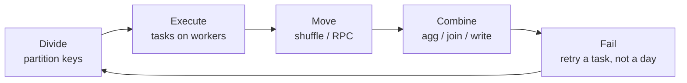

# Phase 0: Foundations

Foundations includes [analytical data modelling](data-modelling.md), [change data capture](cdc.md), and [transformation engineering](transformation-engineering.md). These connect distributed-system mechanics to the tables and pipelines data engineers are accountable for.

Monday morning. Product wants p95 latency by customer, service, and region for last week. The events look like this:

```json
{
  "timestamp": "2024-01-15T10:30:00Z",
  "customer_id": "cust_0042",
  "user_id": "user_98712",
  "service": "api-gateway",
  "endpoint": "/v2/events",
  "region": "eu-west-1",
  "latency_ms": 45,
  "status_code": 200,
  "bytes": 1024
}
```

On Friday that was 40 GB of Parquet and a pandas script on a laptop. Today it is 8 TB, one enterprise tenant (`cust_0042`) is 38% of volume, and the same script OOMs while the dashboard is still empty. Nothing about the *query* changed. The *physics* did.

This phase is not “what is a partition.” It is the shared vocabulary you will use when Spark, Kafka, Flink, Iceberg, and ClickHouse all fail in different costumes of the same four problems: **divide the work, move the data, survive a crash, combine the answers**.

Engineers who skip this learn tools in isolation and freeze in front of systems they have not seen. Engineers who have these models can open an unfamiliar UI and already know which metric is lying.

---

## Map of this module

Read in order. Each page is a primitive the rest of the academy reuses.

| Lesson | The question it answers | You should leave able to |
|--------|-------------------------|--------------------------|
| [Data at Scale](scale.md) | What actually breaks as volume grows 10× / 100× / 1000×? | Size a pipeline from bytes, not from a vendor slide |
| [Partitioning](partitions.md) | How do we assign independent slices of work? | Choose a key, predict hotspots, prune scans |
| [Data Modelling](data-modelling.md) | What grain, keys, and history policy does a fact need? | Design a model that survives late and changed data |
| [Data Movement](data-movement.md) | Why is the network the bill, not the CPU? | Count shuffle bytes before you count cores |
| [Distributed Execution](distributed-execution.md) | How does a job become stages, tasks, and stragglers? | Read a Spark / Flink / Trino UI without guessing |
| [Change Data Capture](cdc.md) | How do a snapshot and a stream meet without lost updates? | Design a snapshot-to-stream handoff and reconcile a sink |
| [Transformation Engineering](transformation-engineering.md) | What makes a transformation safe to rerun and backfill? | Choose incremental boundaries and deploy a model safely |
| [Batch vs Stream](batch-vs-stream.md) | When is “real-time” a latency SLA, not a product? | Push back on streaming that a nightly job already covers |

Downstream, the same primitives reappear with different names:

- Spark: shuffle partitions, stages, AQE — [Spark module](../spark/index.md)
- Kafka: log partitions, consumer lag — [Kafka](../kafka/index.md)
- Flink: keyed state, watermarks — [Flink](../flink/index.md)
- Lakehouse: file layout, compaction — [Lakehouse](../lakehouse/index.md)

---

## The central intuition

Every distributed data system is answering one question:

> Given more data than one machine can process efficiently, how do we **divide** the work, **execute** it in parallel, **move** only what we must, and **combine** the results without lying after a failure?

The mechanisms — partitioning, shuffling, checkpointing, replication, compaction — are implementations of that sentence. Once the *why* is solid, Spark vs Flink vs Trino is a catalogue of trade-offs, not a new religion.



Four facts you will reuse constantly:

1. **Independent work is free parallelism.** If two records never need to meet, they should never share a machine.
2. **Meeting is expensive.** `GROUP BY customer_id`, `JOIN`, `DISTINCT`, and global `ORDER BY` all force data to co-locate. That move is the [shuffle](../spark/shuffle.md).
3. **The slowest slice is the job.** A stage finishes when the last task finishes. Skew is not “uneven data”; it is *elapsed wall time owned by one key*.
4. **Failure is a design input.** At 20 workers, someone is always restarting. Retry granularity (task vs job vs day) is an architectural choice.

---

## A concrete walk-through (SaaS analytics)

You need `avg(latency_ms)` per `customer_id` per hour for last week.

| If you do this | What actually happens |
|----------------|------------------------|
| pandas `read_parquet` into RAM | 8 TB does not fit. Process dies. |
| Chunked Python on one box | Disk and one NIC cap throughput. Overnight is optimistic. |
| 40 Spark executors, hash-partition by `hour` | Hours are even; customers inside an hour are not. `cust_0042` still sits on one reducer. |
| Hash-partition by `customer_id` | Good for per-customer state. Terrible if one customer is 38% of bytes. |
| Partition files by `date`, then hash `customer_id` for the agg | Scan prunes to seven days; shuffle still pays for skew. You salt or two-phase agg. |

Nothing here is a Spark feature. It is [scale](scale.md) + [partitions](partitions.md) + [movement](data-movement.md) + [execution](distributed-execution.md). Spark is just the scheduler that makes the mistakes visible in a UI.

The same four questions apply to the other running systems:

- **Observability logs** — cardinality of `pod` × `endpoint` × `status` explodes partitions and files.
- **E-commerce CDC** — order updates for one SKU during a flash sale are a hot partition in Kafka *and* a skewed join in Spark.
- **IoT sensors** — time-range partitions prune beautifully; a stuck device that retries the same hour writes a hot file.
- **Fraud graph** — “partition by user” fails the moment the interesting query is a multi-hop traversal.

---

## When *not* to use distributed data systems

!!! danger "The most expensive architecture is the one you did not need"
    Kafka + Spark + Iceberg + Trino for 8 GB/day of events is not “future-proof.” It is a pager rotation, a IAM surface, and a cost line that will never pay for itself.

Reach for **one fat PostgreSQL**, a nightly SQL job, and object storage *until a specific resource is actually saturated*:

| Stay on one machine when… | You have evidence that… |
|---------------------------|-------------------------|
| Volume is tens of GB, not tens of TB | A laptop or a 64 GB box finishes inside the SLA |
| Access is CRUD + a few reports | Indexes and `PARTITION BY RANGE (day)` are enough |
| Freshness is “tomorrow morning” | [Batch](batch-vs-stream.md) is the correct latency class |
| Team is two engineers | Operational load of a cluster exceeds feature work |
| Failure domain can be “rerun the job” | You do not need per-event exactly-once yet |

Distributed systems earn their keep when **at least one** of these is true and measured:

- Scan or write volume exceeds one machine’s disk/NIC in the SLA window.
- Independent consumers need the *same* log (replay, fan-out) — that is Kafka’s reason to exist, not “we have microservices.”
- Latency SLA is seconds and the computation is stateful (fraud, alerting).
- Multi-tenant blast radius requires isolation you cannot get from one process.

!!! tip "Design for today’s 3×, not a fantasy 1000×"
    Capacity-plan the next order of magnitude. Do not implement it. The [scale](scale.md) lesson is explicitly about *not* building a petabyte architecture for a gigabyte problem.

---

## How the five systems will keep showing up

Treat these as the exam workloads, not flavour text.

| System | Events | Foundation stress |
|--------|--------|-------------------|
| SaaS analytics | `{timestamp, customer_id, user_id, service, endpoint, region, latency_ms, status_code, bytes}` | Tenant skew, time pruning, shuffle-heavy BI |
| Observability | logs / metrics / traces | Cardinality, late data, ingest fan-in |
| E-commerce CDC | orders, payments, inventory | Changelog vs snapshot, join fan-out |
| IoT | `{timestamp, device_id, sensor, value}` | Time partitions, hot devices, downsampling |
| Fraud graph | users–devices–IPs–txns | Co-location of *edges*, not rows |

When a later module says “the SaaS events,” it means this schema and this skew. Keep it in your head.

---

## How to study this phase

Do not skim. For each page:

1. **Predict** the bottleneck before the diagram (disk? NIC? one key?).
2. **Do the arithmetic** — bytes ÷ bandwidth, partitions ÷ cores, p99 task time vs median.
3. **Name the metric** you would open first (shuffle spill, consumer lag, straggler task).
4. **Write the wrong partition key** on paper, then the blast radius.

If you cannot explain a shuffle to a backend engineer without saying “Spark,” you are not done.

---

## Mistakes this phase is designed to kill

You will see these in design reviews. Name the foundation page that refutes each:

| Claim | Why it is wrong | Read |
|-------|-----------------|------|
| “We’ll just use Spark so we can grow.” | Spark is a tax until a resource is actually saturated. | [Scale](scale.md), [Spark](../spark/index.md) |
| “Partition by country; it is how the business thinks.” | GDP skew; cardinality too low. | [Partitioning](partitions.md) |
| “The job is CPU-bound; add 50 executors.” | Shuffle bytes and one hot key own wall time. | [Data Movement](data-movement.md) |
| “Average task time is 12 s so the SLA is safe.” | Stages wait on the **max** task. | [Distributed Execution](distributed-execution.md) |
| “Kafka means we are streaming.” | Kafka is a log; the consumer’s SLA is the product. | [Batch vs Stream](batch-vs-stream.md) |
| “We’ll cache the lake in Spark.” | Cache is executor RAM, not a warehouse. | [Gotchas](../spark/gotchas.md) |

If you catch yourself saying “the cluster will handle it,” you skipped the arithmetic.

---

## What “done” looks like

After this phase you can, without notes:

- Say which resource dies first at 10×, 100×, and 1000× for a given job.
- Pick a partition key and list two ways it goes hot.
- Estimate shuffle bytes for a `GROUP BY customer_id` on the SaaS table.
- Draw job → stage → task → partition and point at the straggler.
- Translate “we need this in real time” into a latency number and a batch/stream recommendation.

Then go to [Spark](../spark/index.md). Spark is the first *implementation* of these primitives, not a new subject.

---

## Suggested reading order

1. [Data at Scale](scale.md) — physics and the three tensions.
2. [Partitioning](partitions.md) — the lever everything else hangs on.
3. [Data Modelling](data-modelling.md) — grain, keys, and history before you touch a query.
4. [Data Movement](data-movement.md) — why locality and serialisation dominate CPU.
5. [Distributed Execution](distributed-execution.md) — DAGs, drivers, and why `collect()` is an incident.
6. [Change Data Capture](cdc.md) — snapshot and stream, ordering, and reconciliation.
7. [Transformation Engineering](transformation-engineering.md) — incremental models that survive retry and backfill.
8. [Batch vs Stream](batch-vs-stream.md) — latency as a product constraint.

Cross-check yourself against the [selection framework](../reference/selection-framework.md) once you can name the workload’s volume, access pattern, and failure unit.
