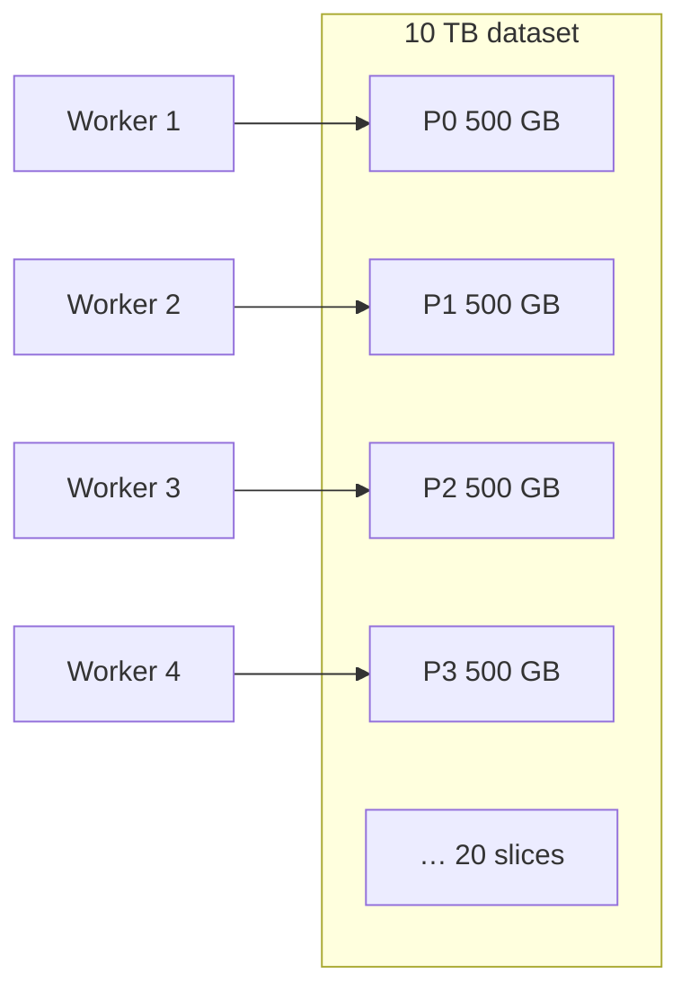
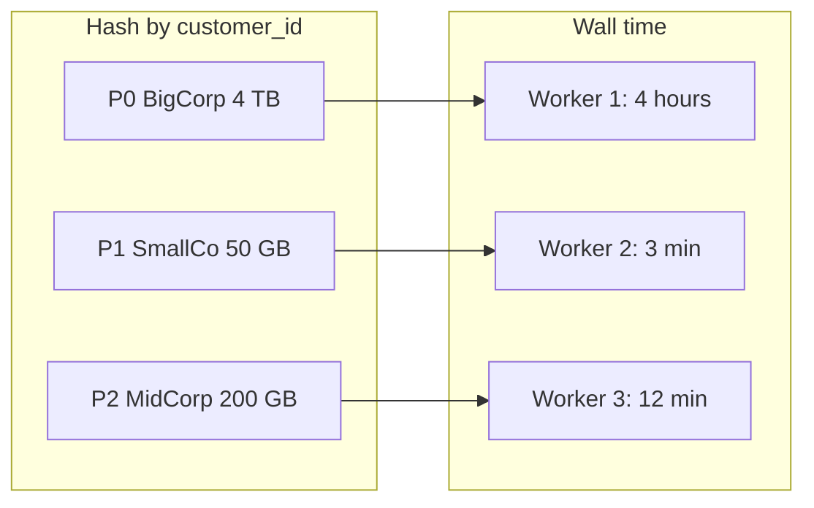

# Partitioning

14:20. Design review. Someone proposes partitioning the 10 TB SaaS events table by `region`, because "that's how the business thinks about it." You have 20 workers, each holds about 500 GB, and product wants p95 latency per customer for yesterday.

Before you weigh in: does partitioning by `region` help the BI scan that filters `WHERE region = 'eu-west-1'`, the `GROUP BY customer_id` rollup, both, or neither? And what happens to the one worker holding `eu-west-1` if that region is 60% of traffic?

That's the whole question this page answers: how you assign work so twenty machines don't all read the same 10 TB, and so `GROUP BY customer_id` is even possible. Kafka topics, Spark shuffles, Iceberg files, ClickHouse parts, Cassandra vnodes: different files, same idea. If you only remember one idea from Phase 0, remember this one.

---

## Use case

Events:

```text
{timestamp, customer_id, user_id, service, endpoint, region, latency_ms, status_code, bytes}
```

Two jobs share the lake:

1. **BI scan**: `WHERE date = yesterday AND region = 'eu-west-1'` — wants to **skip** data.
2. **Per-customer rollup**: `GROUP BY customer_id` — wants all rows for one customer **together**.

Those jobs want *different* keys. Partitioning is the compromise you write down, not a property of the data.

The same tension appears elsewhere:

- **Observability**: partition by time for “last hour,” but a noisy `cluster_id` is a hot shard.
- **E-commerce CDC**: partition Kafka by `order_id` so per-order history is ordered; a flash-sale SKU still hotspots inventory topics.
- **IoT**: partition by `device_id` for per-device state; a warehouse full of devices in one `site_id` wrecks site-level partitions.
- **Fraud**: partition by `user_id` is useless for “accounts sharing this device.”

---

## Why this is hard at scale

On one machine, “split the file into 8 chunks” is enough. On a cluster:

- Every record must belong to **exactly one** partition of a given scheme (or you double-count).
- Independent partitions can run in parallel; **dependent** ones (all rows for `cust_0042`) must meet — that meeting is a [shuffle](../spark/shuffle.md).
- The **slowest partition** is the job. See [Distributed Execution](distributed-execution.md).
- Changing the scheme later **rewrites the world**. Iceberg/Hudi rewrites files; Kafka needs a new topic; Spark pays a full shuffle.

!!! warning "Cardinality is a load-bearing number"
    Partition by `status_code` and you have ~20 buckets, two of which (`200`, `500`) hold almost everything. Partition by `event_id` (UUID) and you have perfect balance and **zero pruning** for every business query.

---

## Intuition

A partition is a **slice that a worker can own**.



Two different “partitions” get confused in reviews. Keep them separate:

| Kind | Example | Job |
|------|---------|-----|
| **Storage layout** | `s3://events/date=2024-01-15/region=eu-west-1/` | Skip I/O (pruning) |
| **Compute slices** | Spark partition / Kafka partition / Flink key group | Parallelism and ordering |

A well-laid-out lake still **repartitions in memory** when the compute key disagrees with the folder key. That is normal. Paying that shuffle *and* scanning 10 TB because you forgot `date=` is not.

"Partition" is one of the most overloaded words in this academy — the same term names at least seven different mechanisms across the systems you will touch:

| System | "Partition" means | Why it partitions |
|--------|---------------------|--------------------|
| Kafka | A topic's ordered, append-only shard | Ordering per key + parallel consumption |
| Spark | A slice of an RDD/DataFrame held by one task | Unit of parallel execution |
| Flink | A key group assigned to a parallel subtask | Keyed state locality + parallelism |
| Iceberg / Hive-style lake | A directory or partition spec value (`date=`, `region=`) | Pruning — skip files without reading them |
| Parquet row group | A horizontal slice *within one file* | Skip via min/max stats without opening the file's other row groups |
| ClickHouse `PARTITION BY` | A coarse, time-oriented grouping of parts | Lifecycle — drop/move/TTL a whole partition cheaply |
| ClickHouse `ORDER BY` | The physical sort order and sparse primary index *within* a part | Skip granules — a different mechanism from `PARTITION BY`, easy to conflate; see [ClickHouse](../olap/clickhouse.md) |
| Cassandra / DynamoDB | The unit that determines which node(s) own a row | Placement, distribution, and hot-partition throttling limits |

Two of these are worth calling out because they are routinely confused inside the *same* system: ClickHouse's `PARTITION BY` decides which coarse-grained parts exist (and can be dropped/TTL'd together); `ORDER BY` decides the physical row order and sparse index **inside** each part. A query can prune partitions and still scan every granule in the surviving ones if `ORDER BY` doesn't match the filter — the two mechanisms answer different questions and neither substitutes for the other.

Mental test: *If I delete one partition, did I delete a coherent business slice (a day, a tenant, a Kafka shard) or a random 128 MB?* Coherent slices are how you retry and how you expire data.

---

## Internals

### Hash partitioning

```text
partition = hash(key) % num_partitions
```

| customer_id | `hash % 4` | partition |
|-------------|------------|-----------|
| customer-001 | 1 | 1 |
| customer-002 | 2 | 2 |
| customer-001 | 1 | 1 |

All events for `customer-001` land together. Per-customer aggregations and keyed Flink state become local. Hashing **does not** preserve range locality: “customers A–C” is not a folder you can skip.

Spark’s default shuffle is hash (or hash + sort in the sort-shuffle writer). Kafka’s default partitioner hashes the message key.

### Range partitioning

- P0: `timestamp` 2024-01-01 → 2024-03-31
- P1: 2024-04-01 → 2024-06-30

Natural for time series and for Iceberg hidden partitioning on days. Queries with `BETWEEN` skip files. **Writes concentrate on “now”** — every producer hits today’s range.

### Time / identity partitioning (Hive-style)

```text
/events/date=2024-01-15/hour=10/
/events/date=2024-01-15/hour=11/
```

This is range partitioning with a path convention. Combined with Parquet, it is the default lake layout for the SaaS table.

### Composite keys

`(date, customer_id)` in storage: prune days, then hash customers inside the day. `(customer_id, hour)` as a *compute* key: splits a whale tenant across hours.

### Partition pruning

```sql
-- Without date layout: 10 TB scan
SELECT count(*) FROM events WHERE date = '2024-01-15';

-- With date identity partitions: ~27 GB if volume is flat over a year
SELECT count(*) FROM events WHERE date = '2024-01-15';
```

The engine reads **metadata** (Hive metastore, Iceberg manifests, Spark InMemoryFileIndex), not the data, to drop files. Filters that do not match the partition column (`WHERE endpoint = '/v2/events'`) do **not** prune.

!!! tip "Filter on the column you partitioned"
    `WHERE timestamp >= '2024-01-15' AND timestamp < '2024-01-16'` may **not** prune if the partition column is `date` and you never derived it. Iceberg hidden partitioning can extract `days(timestamp)`; Hive-style tables cannot.

### How many partitions?

| Too few | Too many |
|---------|----------|
| One task owns tens of GB → spill/OOM | Scheduling overhead, millions of tiny files, S3 LIST storms |
| Cores idle | Metastore / driver OOM listing files |

Rules of thumb (compute): **2–4× cores** at the shuffle, **100–300 MB** per Spark partition after compression. Storage: **one day (or hour) per partition**, files **128–512 MB** inside it after compaction.

Kafka: throughput ≈ `min(partitions, consumer threads)` for a group; ordering is **per partition**. See [Kafka partitions](../kafka/partitions.md).

---

## How

### Storage layout for the SaaS lake

```python
from pyspark.sql import functions as F

events = spark.read.json("s3://raw/events/")  # landing zone, not the lake

curated = (
    events
    .withColumn("date", F.to_date("timestamp"))
    .withColumn("hour", F.hour("timestamp"))
)

# Identity partitions for prune-friendly BI. Compact files, don't explode.
(
    curated
    .repartition(200, "date")   # control file count; don't use 200 × 365
    .write
    .mode("append")
    .partitionBy("date")
    .parquet("s3://analytics/events/")
)
```

!!! production-gotcha "`partitionBy` is a directory bomb"
    `partitionBy("date", "region", "service")` with 365 × 12 × 80 values and 200 Spark partitions can write **millions** of tiny files. Partition the lake on **low-cardinality time**, cluster/sort on the rest (Iceberg `sort_order`, Parquet row-group clustering).

### Compute: size the shuffle

```python
spark.conf.set("spark.sql.adaptive.enabled", "true")
spark.conf.set("spark.sql.adaptive.coalescePartitions.enabled", "true")
spark.conf.set("spark.sql.adaptive.advisoryPartitionSizeInBytes", str(128 * 1024 * 1024))
spark.conf.set("spark.sql.shuffle.partitions", "400")  # starting point, AQE coalesces

p95 = events.groupBy("customer_id").agg(F.expr("percentile_approx(latency_ms, 0.95)"))
```

### Detect a hot key before it pages you

```python
from pyspark.sql import functions as F

# Cheap sketch: top tenants by rows (and bytes if you have them)
events.groupBy("customer_id").count().orderBy(F.desc("count")).show(20)

# Distribution of partition sizes after a hash split
hashed = events.withColumn("p", F.pmod(F.hash("customer_id"), 200))
hashed.groupBy("p").count().agg(
    F.min("count"), F.expr("percentile_approx(count, 0.5)"), F.max("count")
).show()
```

If `max / median` is > 5, you have a reducer problem, not a “need more executors” problem.

### Salting a whale tenant

```python
from pyspark.sql.functions import col, concat, lit, floor, rand, split, sum as Fsum, count

SALTS = 16
salted = events.withColumn(
    "k",
    concat(col("customer_id"), lit("#"), floor(rand() * SALTS).cast("int").cast("string")),
)
partial = salted.groupBy("k").agg(count("*").alias("n"), Fsum("bytes").alias("bytes"))
final = (
    partial
    .withColumn("customer_id", split("k", "#")[0])
    .groupBy("customer_id")
    .agg(Fsum("n").alias("n"), Fsum("bytes").alias("bytes"))
)
```

Two-phase aggregation: first shuffle is balanced; second shuffle is tiny. Percentiles need a different trick (sample, t-digest merge, or isolate the whale into its own job).

---

## Production gotchas

### The key choice table

| Key | Why it fails |
|-----|----------------|
| `customer_id` | One enterprise is 40% of writes **and** of every shuffle |
| `country` / `region` | US/India/`us-east-1` dwarf the rest |
| `status` (`ACTIVE`/`INACTIVE`) | Cardinality 2 |
| `timestamp` alone as Kafka key | All producers hit “now”; also destroys per-entity order |
| `user_id` | Often balanced, but BI filters `date` and `customer_id`, so you still shuffle |
| UUID `event_id` | Perfect balance, no locality, no prune, no per-entity order |

### The right key is a checklist

1. **Write distribution** — will ingest be uniform across values *this hour*?
2. **Query filters** — do they match the *storage* key so pruning works?
3. **Cardinality** — enough distinct values for the parallelism you need, not 10× more files than cores.
4. **Hotspot risk** — can one value dominate? If yes, plan salt / isolated pipeline *now*.
5. **Ordering** — Kafka/Flink: order is per partition. If you need per-order FIFO, the key is `order_id`, not `country`.

!!! production-gotcha "Today is always the hot range"
    Time partitioning is correct for lakes and TSDBs and still hotspots **ingest**. Split writers by a secondary hash (`device_id`, `customer_id`) *inside* the hour, or you DDoS one Iceberg partition / one ClickHouse part.

---

## Failure modes



| Failure | Cause | Blast radius |
|---------|-------|--------------|
| Straggler stage | Hot hash bucket | Whole job waits |
| Kafka consumer lag on 1 of 60 partitions | Hot key | That partition’s lag; others look healthy |
| Driver OOM listing files | Too many storage partitions | Job never starts |
| Wrong counts after “adding partitions” | Kafka: new partitions do not rebalance old keys | Per-key ordering and sticky consumers surprise you |
| Empty prune | Filter on `timestamp` not `date` | Full scan, surprise bill |

Fixes, in order: **measure the histogram** → **change storage key** if pruning is wrong → **salt / isolate whales** if compute is skewed → **compact files** if you have a million 2 MB objects.

---

## Debugging

| System | What to open | Healthy vs sick |
|--------|--------------|-----------------|
| Spark | Stage → task duration, input size, shuffle read | max/median ≲ 3; one task at 50× is skew |
| Spark SQL | `Exchange` hash partitioning, partition count | 200 tasks on 8 GB is too many; 200 on 8 TB is too few |
| Kafka | `records-lag` **per partition**, `bytes-in` per partition | One partition at 80% of bytes-in |
| Iceberg / Hive | `files` / `partitions` metadata tables, file size histogram | Thousands of < 8 MB files per day |
| ClickHouse | `system.parts`, partition column | One part much larger than siblings |

```python
# Spark: confirm prune happened
events.filter("date = '2024-01-15'").explain("formatted")
# FileScan should list only that path / partition filters
```

Simulation: [Kafka partitions](../simulations/kafka-partitions.html) if you want to feel consumer parallelism before you pay for a cluster.

---

## Scale

| Factor | What happens to a bad key | What you do |
|--------|---------------------------|-------------|
| **10×** volume, same tenants | Hot customer is 10× hotter | Histogram + AQE skew join; maybe 8-way salt |
| **100×** | File count and Kafka partition count both wrong | Increase Kafka partitions with a migration plan; compact lake hourly; consider a dedicated pipeline for the top-N tenants |
| **1000×** | Metadata and name-nodes / manifests dominate | Hidden partitioning, hierarchical namespaces, tenant isolation, maybe shuffle service + more AZs *only after* keys are sane |

Partition **count** should grow with **bytes**, not with “number of microservices.” Doubling workers without doubling *useful* partitions just means each worker is idle waiting on the same fat tasks.

---

## Trade-offs

| Scheme | Good for | Bad for |
|--------|----------|---------|
| Hash(entity) | Balanced compute, keyed state, Kafka order per entity | Range queries, prune, “all of US-EAST” |
| Time range | Scans, retention, CDC windows | Ingest hotspots, “this user across 3 years” |
| Composite (day + hash) | Most lakes | Easy to over-partition into tiny files |
| Static (country) | Simple mental model | GDP-weighted skew |
| Random / no key | Max ingest spread | No locality, no order |

Repartitioning cost: Spark shuffle; Kafka **new topic + dual-write** or messy partition increase; Iceberg rewrite. **Choose the storage key as if you will live with it for two years.**

---

## Alternatives

- **Clustering / Z-order / sort_order** inside a coarse partition (Iceberg, Delta, ClickHouse `ORDER BY`) when you need extra skip without extra directories.
- **Separate tables** for whales (`events_whale`, `events_longtail`) instead of heroic salting forever.
- **Serving stores** (KV, search, graph) when the access pattern is point-get or multi-hop — partitioning a lake will never make “friends of friends” cheap. See [Fraud architecture](../architectures/fraud.md).
- **Single-node** with table partitions (`PARTITION BY RANGE (day)` in Postgres) until [scale](scale.md) says otherwise.

---

## How to apply at work

In every design review, force these answers onto the wiki:

1. What is the **storage** partition key? The **compute** key?
2. Histogram of that key (p50 / p95 / max bytes) — from production, not intuition.
3. Cardinality, and file/partition **count** after a day of writes.
4. Can one value dominate? Which tenant/device/SKU?
5. Do query `WHERE` clauses match the storage key?
6. What happens when **workers double** — do partitions double, or do fat tasks just move?
7. What is the rewrite plan if we change the key in 18 months?

If nobody can paste a histogram, you do not have a partitioning strategy. You have a hope.

---

## Exercise

You are designing a **Kafka topic** for e-commerce **order events**. Orders come from 50 countries. Volume is roughly proportional to GDP (US + EU + India dominate). Primary consumer *today* is “orders per country per hour.” A second consumer in Q3 wants **per-customer order history in event order**.

1. Trade-offs of partitioning by `country`?
2. By `order_id`?
3. By `customer_id`?
4. What key would you choose for consumer 1 only?
5. What do you choose if **both** consumers must be first-class, and what extra piece (topic, table, or job) do you add?
6. How do you stop a Black Friday SKU from hot-spotting a related `inventory_updates` topic?

??? question "Worked answer"
    1. **Country**: consumer 1 is a single-partition aggregation per country (nice), but US may be 30–40% of the topic — one partition / one consumer thread owns Black Friday. Low cardinality (50) caps parallelism. GDP skew is structural.
    2. **Order id**: excellent ingest balance and per-order FIFO. Consumer 1 must **shuffle** (Flink keyed by country, or Spark `groupBy`). History-by-customer is **not** ordered on one partition.
    3. **Customer id**: per-customer FIFO for consumer 2. Balance depends on whale retailers. Consumer 1 still shuffles. Hot customers = hot partitions.
    4. Consumer 1 only: **`country` is acceptable at small scale**; better is `hash(order_id)` plus a streaming agg keyed by country — more moving parts, no US hotspot.
    5. Both first-class: **partition by `customer_id`** (history is the hard constraint: order per customer). Build country-hour as a **derived stream or table** (Flink window or Spark job) — do not make the raw topic serve both locality needs. Alternatively two topics: `orders_by_customer` (log of record) and a compacted `orders_by_country_hour` sink.
    6. Inventory: **do not key by SKU**. Key by `warehouse_id + sku` salt, or isolate top SKUs to a dedicated topic/consumer, or buffer and coalesce updates. Same whale pattern as `cust_0042` in SaaS.
