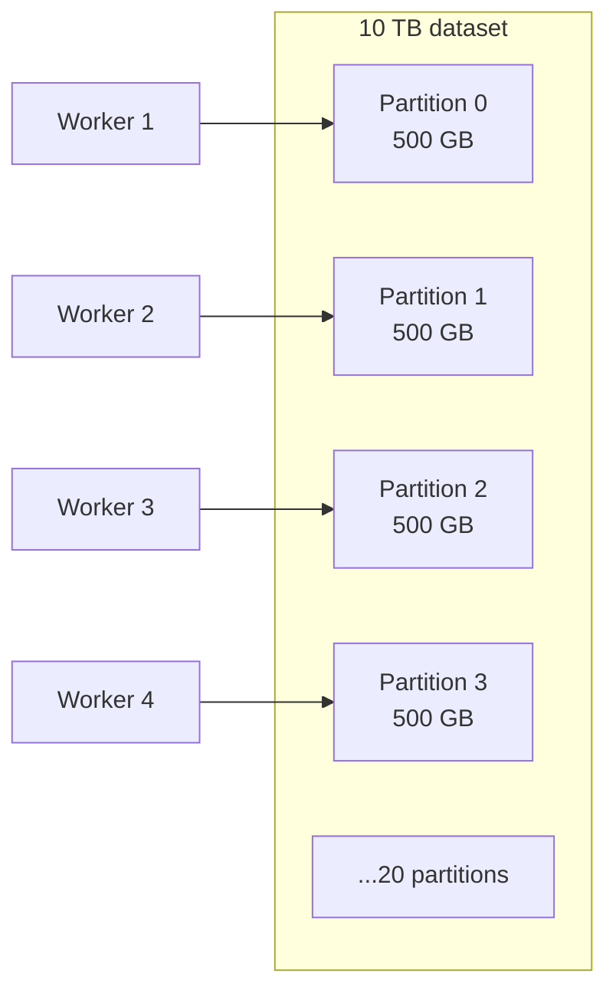
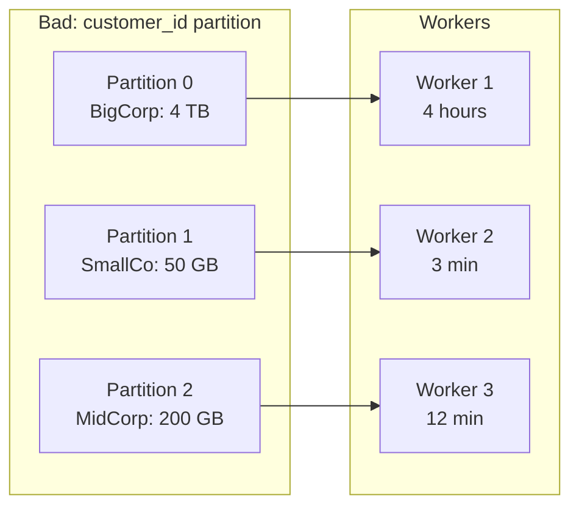

# Partitioning

Partitioning is the most important concept in distributed data systems. Everything else builds on it.

---

## The Problem

You have 10 TB of event data. You have 20 workers. Each worker has enough memory and CPU to process 500 GB.

How do you assign work?

---

## The Naive Approach

Worker 1 reads events from second 0 to second X.
Worker 2 reads events from second X to second 2X.
...

This works — as long as each worker reads a different *portion* of the data.

But how does each worker know which portion is its own? How do you divide a dataset?

**Partitioning.**

---

## What a Partition Is

A partition is a logical and often physical division of a dataset such that:

- Each record belongs to exactly one partition
- Different partitions can be processed independently (sometimes)
- A worker owns one or more partitions



---

## How Partition Keys Work

Every partitioning scheme assigns records to partitions based on a **partition key**.

### Hash Partitioning

```
partition = hash(key) % num_partitions
```

Example: partition by `customer_id`

| customer_id | hash(id) % 4 | partition |
|-------------|--------------|-----------|
| customer-001 | 12345 % 4 = 1 | 1 |
| customer-002 | 67890 % 4 = 2 | 2 |
| customer-001 | 12345 % 4 = 1 | 1 |

All events for `customer-001` land on partition 1. This allows you to compute per-customer aggregations without needing to shuffle data.

### Range Partitioning

Divide records by range of values:

- Partition 0: `timestamp` from 2024-01-01 to 2024-03-31
- Partition 1: `timestamp` from 2024-04-01 to 2024-06-30
- ...

Range partitioning is natural for time-series data. Queries filtering by time range can skip partitions entirely.

### Time Partitioning

A special case of range partitioning on timestamps — so common it is treated as its own category:

```
/events/date=2024-01-15/
/events/date=2024-01-16/
/events/date=2024-01-17/
```

---

## Partition Pruning

One of the most important benefits of partitioning is that **queries can skip entire partitions** if the partition key is in the WHERE clause.

```sql
-- Without time partitioning: scans all 10 TB
SELECT count(*) FROM events WHERE date = '2024-01-15';

-- With date partitioning: scans only 1 partition (~27 GB)
SELECT count(*) FROM events WHERE date = '2024-01-15';
```

The query engine reads partition metadata first, determines which partitions satisfy the filter, and reads only those. This is **partition pruning**.

---

## The Partition Key Choice Matters Enormously

> What happens if one customer generates 40% of all events?

If you partition by `customer_id`, partition containing that customer receives 40% of all writes and 40% of all data. Every query touching that customer must process a disproportionately large partition.

This is called a **hot partition** or **data skew**.

### Common Partition Key Mistakes

| Partition Key | Why It Can Fail |
|---------------|-----------------|
| `customer_id` | One large customer dominates |
| `country` | US/India dwarf smaller markets |
| `status` (ACTIVE/INACTIVE) | Extremely low cardinality — only 2 partitions |
| `timestamp` alone | Good for range scans, bad for concurrent writes (all writers hit "today") |
| `user_id` | Usually good distribution but may not align with query patterns |

### The Right Partition Key

There is no universally correct partition key. The right choice depends on:

1. **Write distribution** — will writes be uniform across partition key values?
2. **Query patterns** — what filters appear in most queries?
3. **Cardinality** — enough distinct values to create meaningful parallelism?
4. **Hotspot risk** — can a single key value dominate?

---

## Skew in Practice



Your job runs for 4 hours because one worker is processing 4 TB while the others finish in minutes.

The fix depends on context:

- **Salt the key**: append a random suffix to distribute the hot key across multiple partitions
- **Split-then-aggregate**: process the hot key in multiple passes
- **Choose a different key**: use `(customer_id, hour)` to sub-partition by time

---

## Repartitioning Cost

Changing the partition count or partition key at runtime requires **redistributing data**. Every record may move from one partition to another.

In Spark, this is called a **shuffle**. In Kafka, this requires rebalancing. In Iceberg/Hudi, it requires rewriting data files.

Repartitioning is expensive. Choose the initial partition key thoughtfully.

---

## How to Apply This at Work

When reviewing a data pipeline or system, ask:

1. What is the partition key?
2. Is the distribution of values across that key roughly uniform?
3. What is the cardinality of the partition key?
4. Can one key value dominate traffic?
5. Does the query filter align with the partition key? (if not, partition pruning does not help)
6. What happens when the number of workers doubles?

---

## Reasoning Exercise

You are designing a Kafka topic for order events. Orders come from 50 countries. Each country generates roughly proportional volume to its GDP.

1. What are the trade-offs of partitioning by `country`?
2. What are the trade-offs of partitioning by `order_id`?
3. What are the trade-offs of partitioning by `customer_id`?
4. What partition key would you choose if the primary consumer is computing "orders per country per hour"?
5. What if the primary consumer is "per-customer order history"?
