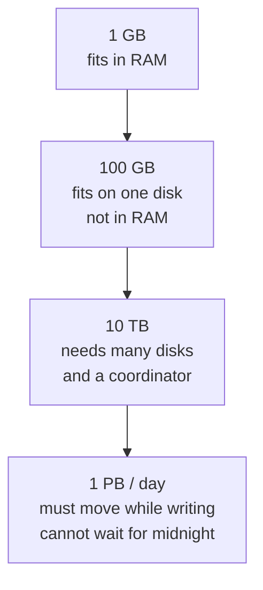

# Data at Scale

07:58 AM. The daily p95-by-customer job that finished in twelve minutes every morning last quarter just died at `read_parquet` with an OOM, on events shaped like this:

```text
{timestamp, customer_id, user_id, service, endpoint, region, latency_ms, status_code, bytes}
```

Nobody touched `pandas.groupby(["customer_id","hour"]).latency_ms.quantile(0.95)`. Last quarter this pipeline moved ~40 GB/day through a 32 GB notebook. This quarter a single enterprise tenant signed, volume is 400 GB/day, and product still wants the p95 by 07:00.

Before you read on: is this a RAM problem, a disk-format problem, or a code problem? Would a 128 GB notebook buy you another quarter, or has something more fundamental changed?

Nothing about the SQL changed. The **order of magnitude** did — scale is not “big data,” it is the moment a resource that was invisible (RAM, a single SSD, a single NIC, a single process, a single region) becomes the critical path.

!!! note "This is SaaSCo, stages 1 and 2"
    [SaaSCo: The Evolving Company](../architectures/saasco-evolution.md#stage-2-400-gbday-spark-appears-phase-0-phase-3) is this exact 40 GB → 400 GB jump, worked through as one company's timeline instead of one quarter's incident.

---

## Use case

You own daily p95 latency and error rate per `customer_id` × `service` × `region`. Stakeholders also want a 90-day trend and a “this customer is on fire *now*” page.

That is three workloads hiding in one sentence:

| Question | Volume in play | Freshness | What one machine can do |
|----------|----------------|-----------|-------------------------|
| Yesterday’s p95 for one tenant | hours of that tenant | 07:00 next day | Fine at 40 GB/day |
| 90-day trend, all tenants | 90 × daily volume | weekly is fine | Fails when daily volume exceeds RAM × a small constant |
| Live error spike for `cust_0042` | tail of the log | seconds | Fails as soon as ingest > one process |

The academy’s other systems hit the same cliffs with different units: observability in **events/s**, IoT in **devices × frequency**, e-commerce CDC in **row versions**, fraud in **edges traversed per decision**.

---

## Why this is hard at scale

On one box, “process the file” is a loop. At cluster scale the loop grows failure modes that do not exist locally:

- **Linear I/O is not optional.** 10 TB at 500 MB/s is ~5.5 hours *to read*, before aggregations.
- **RAM is not a warehouse.** Spilling to disk is not “slow pandas”; it is a different algorithm with a different SLA.
- **Parallelism is not 8× because you have 8 cores.** As parallelism grows, coordination (scheduling, shuffle, network, stragglers) increasingly competes with useful work — where that crossover happens depends on the workload's shape (shuffle-heavy vs embarrassingly parallel), not a fixed core count.
- **One slow key owns wall time.** `cust_0042` at 38% of events means 38% of shuffle bytes land on one reducer unless you change the key.
- **Retries multiply work.** A 2-hour job that fails at 90% and restarts from scratch is a 4-hour job wearing a 2-hour costume.

!!! warning "Scale is a cliff, not a slope"
    Systems that are “a bit slow” at 100 GB become *wrong* at 1 TB: timeouts skip partitions, memory pressure drops caches, and downstream jobs read partial hours as if they were complete.

---

## Intuition

Think in **orders of magnitude of *working set***, not in “rows.” Working set is the bytes you must touch to answer the query — after compression, after partition pruning, after column projection.



A useful picture: each 10× either (a) buys you another copy of the same machine, or (b) forces a *new* mechanism (chunking, partitioning, streaming, tiering). If you only buy (a) when you needed (b), you get a very expensive version of the original failure.

The three tensions you will navigate on every design review:

| Tension | One side | Other side |
|---------|----------|------------|
| **Compute vs storage** | More CPUs, ephemeral clusters | Cheap object storage, slower first-byte |
| **Throughput vs latency** | Big batches, full disks, high records/s | Small batches, low wait, more overhead per record |
| **Local vs distributed** | No shuffle, simple failure | Horizontal scale, coordination, partial failure |

Decoupled storage (S3) + ephemeral compute (Spark on Kubernetes) is a common modern analytical architecture *because* these tensions got explicit — it is not universal: streaming stateful systems, OLAP databases, and operational systems often keep storage and compute tightly coupled on purpose. It is not free either way: decoupling costs you data locality. See [Data Movement](data-movement.md).

---

## Internals

### 1 GB — in-memory analytics

A laptop with 16 GB RAM loads a 1 GB CSV into pandas and aggregates in seconds. The CPU cache and the page cache do the interesting work. **Nothing distributed is justified.**

### 100 GB — streaming the box

100 GB does not fit in 16 GB RAM. You now choose:

- Columnar files + column pruning (read 8 GB of `latency_ms` + keys, not 100 GB of JSON).
- Chunked scans (`pyarrow` batches, Spark with 128 MB splits).
- A bigger box (64–256 GB). This is a valid architecture.

Problems that appear:

- Sequential disk becomes the clock.
- A single Python process is hours, and a crash loses the hours.
- You start wanting **core-level parallelism**, which is [partitioning](partitions.md) on one machine.

> Before reading further: what would you do with 100 GB on a 16 GB machine? How many passes over the file? Which columns would you refuse to load?

### 10 TB — many machines

Even reading 10 TB from a fast SSD at 500 MB/s is over five hours. A single EBS volume is worse. You need many readers.

Distributed processing introduces problems that did not exist on one machine:

| Problem | Question | Typical answer |
|---------|----------|----------------|
| Coordination | Who assigns work? | Driver / JobManager / coordinator |
| Locality | Move bytes or move code? | Schedule tasks near data; on S3, admit the NIC |
| Failure | One of 20 workers dies at 80% | Retry the *task*, checkpoint state |
| Skew | 90% of keys hash to one worker | Salt, AQE, two-phase agg |

Each of those answers is a Spark, Flink, or Trino feature. The *problem* is scale.

### 1 PB/day — architecture inversion

You are no longer “running a job on a dataset.” You are operating a factory:

- **Distributed ingest** — no single writer keeps up (Kafka, Kinesis, Pub/Sub).
- **Partitioning on the way in** — workers need independent slices, not a midnight split.
- **Streaming or micro-batch** — waiting until 23:59 to start a 1 PB job misses the SLA by construction.
- **Tiered storage** — keeping 1 PB hot in an OLAP engine is a finance incident.
- **Columnar + compression** — CSV is a self-inflicted DDoS on the NIC.
- **Compaction** — millions of small files make metadata the bottleneck, not CPU.

**The architecture you designed for 1 GB fails catastrophically here**, usually silently: jobs “succeed” on a subset of partitions.

### What breaks, resource by resource

| Resource | Symptom at the cliff | First move |
|----------|----------------------|------------|
| Memory | OOM, GC thrash, spill | Chunk, columnar, more partitions |
| Single CPU | Job exceeds SLA linearly | Multiprocess / threads on one box |
| Single disk | I/O wait 80%+ | More volumes, sequential formats |
| Single machine | Can’t finish a read in the window | Cluster + object storage |
| Single NIC / AZ | Cross-AZ shuffle bills and latency | Keep shuffle in-AZ; compress |
| Single format | Row JSON scanned for two columns | Parquet / Iceberg |
| Single engine | Dashboards and ETL share a cluster | Separate serving from batch |
| Single region | RPO/RTO or user latency | Replicate with an explicit consistency story |

---

## How

You do not need a cluster to *measure* scale. You need arithmetic and a few Spark knobs when you *do* use one.

### Back-of-envelope (do this first)

```text
scan_seconds   ≈ working_set_bytes / (readers × bytes_per_sec_per_reader)
shuffle_seconds ≈ shuffle_bytes / effective_bisection_bandwidth
mem_per_task   ≈ partition_bytes × expansion_factor   # JSON→rows ≈ 3–5×
```

For the SaaS table, a week of 400 GB/day compressed Parquet is ~1.5–2 TB on disk. A p95 by `customer_id` that projects four columns might scan 400 GB. Twenty executors reading S3 at 200 MB/s each: ~100 seconds *ideal*. Then the `groupBy("customer_id")` shuffles those 400 GB. At 12.5 GB/s aggregate cluster bandwidth that is another ~32 seconds *ideal* — plus skew, plus serialisation.

```python
from pyspark.sql import SparkSession
from pyspark.sql import functions as F

spark = SparkSession.builder \
    .appName("saas-p95-daily") \
    .config("spark.sql.adaptive.enabled", "true") \
    .config("spark.sql.adaptive.coalescePartitions.enabled", "true") \
    .config("spark.sql.adaptive.advisoryPartitionSizeInBytes", str(128 * 1024 * 1024)) \
    .config("spark.sql.files.maxPartitionBytes", str(128 * 1024 * 1024)) \
    .config("spark.sql.shuffle.partitions", "400") \
    .getOrCreate()

events = spark.read.parquet("s3://analytics/events/date=2024-01-15/")

# Working set: four columns, one day, already date-partitioned.
per_customer = (
    events
    .select("customer_id", "service", "region", "latency_ms")
    .groupBy("customer_id", "service", "region")
    .agg(
        F.count("*").alias("n"),
        F.expr("percentile_approx(latency_ms, 0.95)").alias("p95_ms"),
    )
)

# Do not collect. Write the reduction.
per_customer.write.mode("overwrite").parquet(
    "s3://analytics/marts/p95/date=2024-01-15/"
)
```

!!! tip "Size shuffle partitions from bytes, not folklore"
    Target ~100–200 MB of *shuffle read* per task. `spark.sql.shuffle.partitions = 200` is a 2014-era default. AQE (Spark 3.x) coalesces after the fact; it does not excuse a 50 GB reducer. Details in [The Shuffle](../spark/shuffle.md).

On a single 16 GB machine at 100 GB, the analogue is chunking:

```python
import pyarrow.parquet as pq

pf = pq.ParquetFile("events.parquet")
# Read only the columns the aggregation needs.
for batch in pf.iter_batches(batch_size=64_000, columns=["customer_id", "latency_ms"]):
    df = batch.to_pandas()
    # partial agg, then combine
    ...
```

---

## Production gotchas

!!! production-gotcha "Designing for the fantasy petabyte"
    Teams buy Kafka + Flink + Iceberg because a slide said “platform.” At 10 GB/day the dominant cost is humans, not machines. PostgreSQL with daily partitions is allowed.

!!! production-gotcha "Confusing stored bytes with working set"
    10 TB of JSON in S3 might be 800 GB of Parquet of the two columns you need — or 10 TB of a `SELECT *` pipeline. Always quote **bytes scanned**, not **bytes stored**.

!!! production-gotcha "Growth is not uniform"
    SaaS volume follows tenants. One enterprise logo is a 10× event, not a smooth 20%/month. Skew arrives *before* “we crossed 10 TB.”

!!! production-gotcha "Silent incompleteness"
    Jobs that skip files on timeout, or streaming windows that drop late events, still write a partition. Downstream BI will treat it as truth. Scale makes this the default failure, not an exception.

---

## Failure modes

| Mode | What you see | What actually happened |
|------|----------------|------------------------|
| Driver / notebook OOM | `java.lang.OutOfMemoryError` on the driver | Someone `collect()`’d a 100 GB frame, or `toPandas()` after a high-cardinality group | 
| Executor OOM / kill | Task retries, then stage failure | Partition too big, broadcast too big, or Python worker RSS |
| SLA miss with “healthy” CPUs | Cluster CPU 30%, job 4 hours | Straggler from skew, or S3 503s, or too few partitions |
| Cost explosion | Same SQL, 8× bill | Cross-AZ shuffle, uncompressed text, daily full scans of 90 days |
| Wrong numbers at 10× | Counts drift vs source | Partial writes, duplicate retries without idempotent sinks |

Observability analogue: cardinality of labels turns a 2 TB TSDB into a 40 TB TSDB without anyone ingesting more *business* events. IoT analogue: one firmware bug that logs at 100 Hz instead of 1/30s is a 3000× ingest incident for that device cohort.

---

## Debugging

Start with **bytes and time**, not with “add executors.”

1. **How many bytes did we touch?** Spark UI → SQL tab → scan size; S3 access logs; `EXPLAIN` with `scan size` in Trino.
2. **Where did wall time go?** Input scan vs shuffle write vs shuffle read vs compute. If shuffle dominates, this is a [data movement](data-movement.md) problem.
3. **Task duration histogram.** Median 12s, max 40 min → skew, not “need more memory.”
4. **Memory: execution vs storage vs overhead.** GC logs, `spark.executor.memoryOverhead` for PySpark.
5. **Retry rate.** Tasks that succeed on the third try are often OOMs the cluster manager disguised as “lost executor.”

```text
Spark UI path for a scale incident:
Jobs → failed/slow job → Stages → "Duration" column sort desc
     → look at Shuffle Spill (Disk), GC Time, Input Size / Records
     → SQL tab: how many Exchange operators, broadcast size
```

On Kafka-backed ingest, the scale metric is **consumer lag in *bytes***, not messages. A 1 kB log line and a 1 MB trace are not the same “1 message.”

---

## Scale

Assume yesterday’s job was comfortable at volume \(V\).

| Factor | Typical first break | What you change |
|--------|---------------------|-----------------|
| **10×** | RAM or single-disk scan time | Columnar files, more partitions, maybe 2–4× machines. Still often *one* cluster, nightly batch. |
| **100×** | NIC + shuffle + one hot key | Dedicated shuffle service, AQE skew join, date partitioning, separate serving OLAP. Streaming ingest because midnight jobs no longer finish. |
| **1000×** | Metadata (file count), multi-tenant isolation, cost | Table formats + compaction, tiered storage, per-tenant quotas, multi-cluster, maybe per-tenant pipelines for the whales. |

Worked numbers for SaaS events:

- **10×** (40 GB → 400 GB/day): Spark on 10 r5.xlarge, Parquet, partition by `date`. p95 job ~15 minutes.
- **100×** (4 TB/day): 100+ cores, Iceberg with compaction, shuffle ~TB, must partition prune aggressively. Kafka in front because object-store PUT rate from many producers becomes a problem.
- **1000×** (40 TB/day): you are an observability-shaped company. Ingest is a fleet. Batch is incremental (only new Iceberg snapshots). Some tenants get their own buckets so a whale cannot starve the long tail.

IoT at 1000× is usually **cardinality** (devices × sensors × hours of tiny files), not raw TB. Same lesson, different unit.

---

## Trade-offs

| Choice | You gain | You pay |
|--------|----------|---------|
| Scale-up (bigger box) | Simplicity, no shuffle, easy debug | Hard ceiling, noisy neighbour, expensive RAM |
| Scale-out (cluster) | Horizontal ceiling | Shuffle, partial failure, ops |
| Object storage + ephemeral compute | Cheap retention, elasticity | Lost locality, LIST/GET costs, cold start |
| Always-on streaming cluster | Seconds of freshness | Idle cost, state, harder exactly-once |
| Keep 90 days hot in ClickHouse | Dashboard latency | Storage $ and merge CPU |
| Tier to Iceberg after 7 days | Cost | Two query paths, two failure modes |

There is no globally correct point. There is a correct point *for this SLA and this \(V\)*.

---

## Alternatives

| If the problem is… | Prefer | Instead of |
|--------------------|--------|------------|
| 100 GB, SQL, humans waiting 30s | Postgres / one ClickHouse node | Spark |
| Ad-hoc over a lake | Trino / Athena | A 200-executor Spark job per analyst |
| Sub-second dashboards | ClickHouse / Pinot | Recomputing p95 in Spark every request |
| Sub-second decisions on events | Flink / Kafka Streams | Micro-batch “near real time” |
| ML feature backfill | Spark / Ray | A streaming job replaying 90 days poorly |

See [Spark vs Flink](../comparisons/spark-vs-flink.md) and [Spark vs Ray](../comparisons/spark-vs-ray.md) once you can name the latency class.

---

## How to apply at work

When you inherit a pipeline, write these numbers on the incident channel before you touch config:

1. Volume **today** (bytes in, bytes scanned, bytes shuffled) — not “millions of rows.”
2. Realistic growth (signed deals, seasonality), not the board deck.
3. Latency SLA in units: 200 ms / 30 s / 5 min / 07:00.
4. Access pattern: point lookup, agg, full scan, CDC apply.
5. What breaks first if data **triples** this quarter.
6. Whether the current architecture matches *today’s* scale.

A job that “runs fine” at 1 GB/day can fail *silently* at 100 GB/day: timeouts, memory pressure, skipped data, duplicated sinks. Ask for a completeness metric (`rows_out / rows_in`, partition watermarks), not just a green Airflow square.

---

## Exercise

You process SaaS events on a **single** Spark executor (one machine). The job takes **2 hours for 50 GB**. Data grows **20% per month**. The output is p95 latency per customer per hour, written to S3. One customer is 5% of volume today; a deal in month 4 will make them **40%**.

1. In 6 months, how large is a day’s data? (compound, not linear.)
2. At what month does the single-machine approach miss an 8-hour overnight window, assuming runtime scales with bytes (first-order)?
3. What is the first bottleneck you expect — CPU, memory, or disk — and why, given the job is a `groupBy` + `percentile_approx`?
4. Sketch the *simplest* distributed architecture that handles 500 GB/day **and** the 40% tenant. Name partition keys and one skew mitigation.
5. Would you introduce Kafka at 500 GB/day? Justify with a number (writers, latency, or replay), not a slogan.

??? question "Worked answer"
    1. \(50 \times 1.2^6 \approx 149\) GB/day (about **3×**).
    2. 8 h / 2 h = 4× headroom. \(1.2^n = 4 \Rightarrow n \approx 8\) months if runtime is linear in bytes. In practice shuffle + spill make it **super-linear**, so you miss earlier — plan around month 5–6.
    3. **Memory then disk**: `percentile_approx` and the shuffle hold per-key state; 50 GB in will expand in-memory. CPU is rarely first while you still fit. After spill starts, **disk** becomes the clock.
    4. Date-partitioned Parquet/Iceberg on S3; Spark with AQE; shuffle partitions sized to ~128 MB; **salt** or two-phase aggregate the whale tenant; optional broadcast of a tiny customer dimension. Ten executors × 4 cores is plenty at 500 GB if files are compacted.
    5. **Only if** many producers need a durable log, or you need < few-minute freshness / replay. 500 GB/day is ~6 MB/s average — Postgres or S3 landing can still win. Kafka is justified by *fan-out and replay*, not by 6 MB/s.
