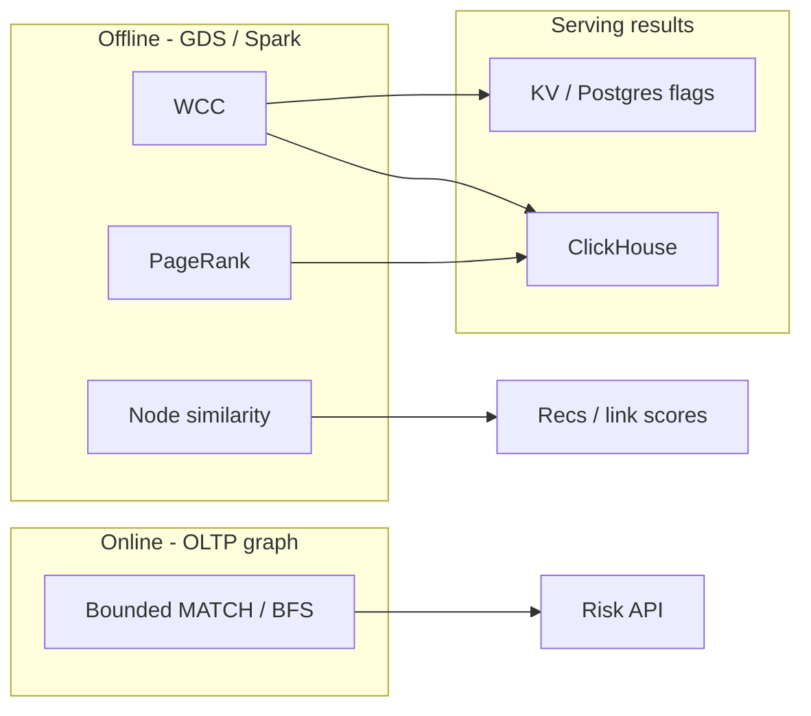

# Graph Algorithms

Code review, 4:02 PM. A PR adds `CALL gds.wcc.stream()` directly inside the risk API's request handler, "so fraud rings are always fresh." The reviewer's first question: what happens to the serving cluster the first time this runs against a 40-million-edge graph in the middle of the afternoon?

A. Nothing — WCC is O(log n) with the right index.
B. The one request just takes longer; other traffic is unaffected.
C. The in-memory graph projection pins RAM and CPU, and every other Bolt session queued behind it stalls.
D. It fails fast with an out-of-memory error and the request moves on.

Pick one before reading on. Storing User → Device → IP → Transaction → Merchant lets you **walk**. Finding a **ring**, a **bridge account**, or **similar merchants** is a different class of work — global (or large-subgraph) algorithms. In fraud, three matter first: **Weakly Connected Components (WCC)**, **PageRank**, **node similarity**. The Staff skill is **when they run** — not calling GDS on the payment path.

---

## Start with the situation { #use-case }

Nightly fraud job:

1. **WCC** on 90-day `USES` + selected `MADE` edges → component ids → candidate rings.
2. **PageRank** (or betweenness on a *small* ring) → who to investigate first inside a component of 500 accounts.
3. **Node similarity** (Jaccard on shared devices/merchants) → link-score for accounts that never share a single hop in a naive MATCH, and recs-style “merchants like this merchant.”

Dashboards still use ClickHouse. The risk API still uses bounded MATCH. Algorithms fill the **batch intelligence** slot.

---

## Why the obvious approach breaks { #why-this-is-hard }

- Algorithms are **O(edges)** or worse and need a **projected** graph in RAM (GDS) or a distributed Pregel (Spark).
- They **do not belong** in a Bolt query that holds the serving page cache.
- WCC on a graph with a supernode IP **collapses the world into one component**.
- PageRank without a window ranks “Amazon” and CGNAT, not mules.
- Similarity is quadratic in naive form; you need knn / sampling / filters.

The hard part is **pipeline design**: what edges go into the projection, when it runs, where results land.

---

## Build the mental picture { #intuition }

| Algorithm | Picture | Fraud question |
|-----------|---------|----------------|
| BFS / shortest path | Layers from a seed | How close is this account to a bad IP? **Online OK if bounded** |
| WCC | Paint connected blobs | What are the rings? **Batch** |
| PageRank | Importance flows on edges | Who is central in this blob? **Batch / on a subgraph** |
| Node similarity | Shared-neighbour Jaccard | Who looks like whom? **Batch**; recs too |
| Louvain | Dense communities | Finer than WCC when the blob is huge |

BFS is an **algorithm** but in Neo4j it is just `MATCH *1..3` — operational. WCC is not a MATCH.



---

## Under the hood { #internals }

**Neo4j GDS:** `gds.graph.project` copies a subset of nodes/edges into an in-memory **compressed** graph. Algorithms run on that. Mutating algorithms write properties back (`componentId`, `score`). The projection is the real schema: if you include `[:FROM]` to NAT IPs, WCC is one blob.

**Spark GraphX / Pregel:** same algorithms when the graph does not fit GDS RAM. Worse interactivity, better scale.

**When vs OLAP:** ClickHouse aggregates **tables**. It does not compute components unless you precompute edges and run a specialised job. Do not fake WCC with `GROUP BY device_id`. That finds **stars**, not multi-hop rings.

---

## Put it to work { #how }

### Project the fraud graph (90-day, no supernodes)

```cypher
CALL gds.graph.project(
  'fraud90',
  {
    User: { label: 'User' },
    Device: { label: 'Device', properties: 'flag' },
    IP: { label: 'IP', properties: 'flag' },
    Merchant: { label: 'Merchant' }
  },
  {
    USES: { type: 'USES', orientation: 'UNDIRECTED' },
    AT: { type: 'AT', orientation: 'UNDIRECTED' }
  }
);
```

Better: **cypher projection** that drops supernodes and old edges:

```cypher
MATCH (u:User)-[r:USES]->(x)
WHERE r.last_seen > datetime() - duration('P90D')
  AND coalesce(x.flag,'') <> 'supernode'
  AND (x:Device OR x:IP)
WITH gds.graph.project(
  'fraud90',
  u,
  x,
  {},
  { relationshipType: 'USES' }
) AS g
RETURN g;
```

(Exact project APIs evolve; the idea is **filter then project**, never project then pray.)

### WCC — rings

```cypher
CALL gds.wcc.stream('fraud90')
YIELD nodeId, componentId
WITH gds.util.asNode(nodeId) AS n, componentId
WHERE n:User
RETURN componentId, count(*) AS users
ORDER BY users DESC
LIMIT 50;
```

Write back for analysts:

```cypher
CALL gds.wcc.write('fraud90', { writeProperty: 'wcc_id' })
YIELD nodePropertiesWritten;
```

Then export:

```cypher
MATCH (u:User)
WHERE u.wcc_id IS NOT NULL
RETURN u.user_id, u.wcc_id;
```

Load into ClickHouse: `ring_id, user_id, computed_at`. Dashboards join **rates**; they do not run WCC.

**When to run:** nightly or on-demand after an incident. **Never** per payment.

**When not:** if 80% of users share one NAT IP still in the projection — you will get one component. Fix the model first.

### PageRank — who matters in the blob

Global PageRank on users+merchants+IPs ranks popular merchants. Useful as a **sanity check**, noisy as a fraud score.

**Do this instead:** project **one WCC** (or the 2-hop ego of a seed) and PageRank *there*.

```cypher
CALL gds.pageRank.stream('fraud90')
YIELD nodeId, score
WITH gds.util.asNode(nodeId) AS n, score
WHERE n:User
RETURN n.user_id, score
ORDER BY score DESC
LIMIT 20;
```

Interpretation: high score = connected to other well-connected nodes (mule clusters, not necessarily the boss). Combine with **betweenness** on small graphs to find **bridges**:

```cypher
CALL gds.betweenness.stream('ring_42')
YIELD nodeId, score
RETURN gds.util.asNode(nodeId).user_id AS user_id, score
ORDER BY score DESC LIMIT 10;
```

Betweenness on the full 100M-edge graph is the job you postpone.

**When:** after WCC, on components above a size threshold (e.g. 20–5,000 users). **Not** on the live serving graph at noon.

### Node similarity — collusion and recs

Jaccard: users similar if they share devices/IPs/merchants.

```cypher
CALL gds.nodeSimilarity.stream('fraud90', { topK: 10, similarityCutoff: 0.2 })
YIELD node1, node2, similarity
WITH gds.util.asNode(node1) AS a, gds.util.asNode(node2) AS b, similarity
WHERE a:User AND b:User
RETURN a.user_id, b.user_id, similarity
ORDER BY similarity DESC
LIMIT 100;
```

Fraud: pairs with high similarity **and** disjoint KYC. Recs: run on `(:User)-[:BOUGHT]->(:Product)` or merchant graph; write `ALSO_BOUGHT`.

**When:** batch. **Not** `nodeSimilarity` inside the 200 ms risk budget.

### BFS — the online one

```cypher
MATCH path = (start:User {user_id: $uid})-[:USES*1..3]-(reachable)
WHERE coalesce(reachable.flag,'') <> 'supernode'
RETURN DISTINCT reachable, length(path);
```

This is **algorithmic BFS** implemented as traversal. Keep it in [Neo4j](neo4j.md) serving. Do not use GDS BFS for the payment API unless you measured it on a dedicated graph and even then you probably wanted MATCH.

### Louvain — optional

When WCC blobs are huge (marketplace), Louvain splits **dense** communities. Run offline; modularity is sensitive to resolution. Do not lead with it in fraud v1 — WCC + filters first.

---

## Mapping to business questions

| Question | Algorithm | Online or batch |
|----------|-----------|-----------------|
| Connected to this seed in ≤3 hops? | BFS / MATCH | Online, bounded |
| Shortest path A–B? | shortestPath, cap length | Investigation |
| What are the rings? | **WCC** | Batch |
| Who is central in ring 42? | **PageRank** / betweenness on subgraph | Batch |
| Who looks like this mule? | **Node similarity** | Batch |
| Customer segments from behaviour | Louvain / embeddings | Batch |
| Fraud $ by category | **Not a graph algorithm** — OLAP | Dashboard |
| Recs carousel | Similarity **precomputed** | Online **read** of results |

---

## Where teams get caught { #gotchas }

!!! warning "WCC + supernode = one ring"
    Filter NAT IPs and mega-merchants **before** project.

!!! warning "PageRank as fraud score"
    Popular ≠ criminal. Use as a **ranker inside a suspicious component**.

!!! warning "GDS on the serving instance"
    Steal RAM, wreck p99. Separate projection host or window.

!!! warning "Writing component ids without a version"
    Nightly WCC **renumbers**. Join on `computed_at`. Do not treat `wcc_id=7` as stable forever.

!!! warning "Similarity on raw Transaction nodes"
    Too sparse or too unique. Similarity on User/Device/Merchant with aggregated edges.

---

## How it fails { #failure-modes }

- Job runs 14 hours, overlaps the next nightly, cluster out of RAM.
- Analysts treat a 2-million-user component as a ring (it is the US NAT blob).
- Risk API blocked on GDS write locks.
- Spark GraphX job on all history without a window; shuffle death.
- Recs team runs similarity every request against live graph.

---

## How to investigate { #debugging }

1. Size the projection: node/edge counts, max degree. If max degree is 10^6, stop.
2. WCC size histogram: if the largest component is 40% of users, the projection is wrong.
3. Spot-check a component in Browser: is it a shared office NAT or a real mule set?
4. Runtime vs `gds.graph.list` memory. If you cannot fit, subgraph or Spark.
5. Compare to OLAP: component’s fraud **rate** in ClickHouse. A huge component with baseline rate is not a ring.

---

## Scale: 10× / 100× / 1000×

**10×.** GDS on a replica, 90-day `USES`, nightly WCC + PageRank on top-N components.

**100×.** Filter harder (degree caps, drop top 0.01% degree nodes into a separate “infrastructure” list). Similarity only on **candidates** (users already in WCC > N or on a watchlist), not all-pairs. Export edges to Spark if RAM fails.

**1000×.** Algorithms live next to the **lake** (Iceberg edge list + Spark / dedicated graph processor). Neo4j holds a **sample or recent** graph for investigation. Online systems read **precomputed** `ring_id`, `pagerank_in_ring`, `similar_users[10]` from KV. Recs are a two-tower model; GDS similarity is a candidate generator at most.

---

## Trade-offs

GDS: excellent iteration for mid-size graphs, dangerous on the serving box. Spark: scale, slow iteration. OLAP: cannot replace WCC. Embeddings/GNNs: more recall for recs and sophisticated fraud, more ML ops — not a substitute for WCC v1.

---

## Alternatives

| Tool | Role |
|------|------|
| Neo4j GDS | Mid-scale, Cypher-adjacent |
| Spark GraphX / GraphFrames | Lake-scale WCC/PageRank |
| NetworkX | Notebook, not production scale |
| DGL / PyG | GNN research/prod ML |
| ClickHouse | Metrics on **outputs**, not components |
| Pregel-on-Flink | Niche streaming graphs |

---

## Apply

If someone wants “real-time connected components” on each payment, say **no**: incremental WCC exists in papers and some products; you still need a bounded online check (MATCH/KV) plus a periodic algorithm. Ship WCC nightly first. Put results where analysts already query (ClickHouse) and where the API can `GET user→ring_risk`.

---

## Check your understanding { #exercise }

??? question "Place the jobs on a clock"
    Payment p99 80 ms. 40M users, 200M USES edges / 90 days. Analysts want rings, top accounts per ring, similar merchants for recs, and a dashboard of fraud rate by ring.

    1. What runs in the risk API process?
    2. What is the nightly GDS (or Spark) pipeline, in order?
    3. Why PageRank before WCC is the wrong order.
    4. Where does ClickHouse come in, and what does it **not** compute?
    5. A NAT IP with 8M users was left in the projection. What do you see, and how do you fix it?

??? success "Answer"
    1. Bounded MATCH (2-hop USES) + **read** of precomputed flags (`ring_risk`, watchlist). No WCC/PageRank/similarity.

    2. Filter supernodes → project 90-day graph → **WCC** → size histogram → PageRank/betweenness **per large-but-not-huge component** → node similarity on candidates → write properties/export to KV + ClickHouse. Recs similarity can be a separate product graph.

    3. Global PageRank without components ranks popular infrastructure. You need blobs first, then rank inside blobs.

    4. ClickHouse: fraud amount, rates, time series **by `ring_id`**. It does not compute WCC.

    5. One giant component (~everyone). Fix: flag/remove that IP (and degree outliers) **before** project; rerun. Do not “Louvain the blob” as the first fix — remove the lie in the edge set.
