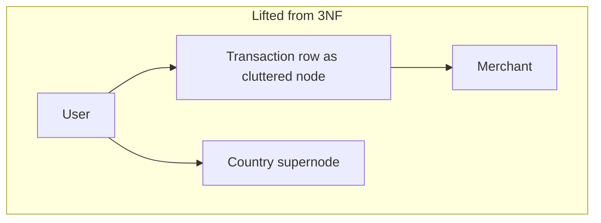
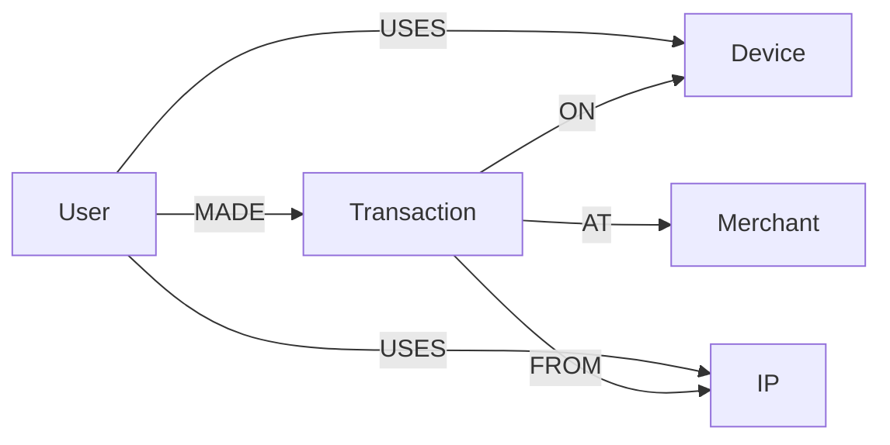

# Graph Modelling

The hardest part of a fraud graph is not Cypher. It is deciding whether a **transaction is a node or a relationship**, whether `USED` points at Device or IP, and what you will do when one IP has five million edges.

A bad model makes “graph databases are fast” false. A good model is **query-shaped**, same as [NoSQL](../databases/nosql.md) — with types and **direction** as the schema.

---

## Use case

Fraud queries you must serve:

1. Devices and IPs used by this user (1 hop).
2. Other users sharing those devices/IPs (2 hops).
3. Merchants hit by that neighbourhood (3 hops).
4. Nightly rings (components), not a modelling trick — an algorithm.

Recommendation query:

5. Products/merchants co-purchased with this one (2 hops via User or via Transaction).

If the model cannot answer (1)–(3) in a few expands without touching a supernode, redo the model. Do not add RAM.

---

## Why this is hard

There are **multiple valid graphs** for the same ledger. Each makes some MATCH cheap and others a scan of relationship types.

- Lift relational tables 1:1 → join tables become nodes, every query grows a hop, supernodes everywhere (`country`, `status`).
- Collapse too hard → `(User)-[:PAID {device, ip}]->(Merchant)` cannot index “all uses of this device.”
- Ignore direction → every expand walks both ways, including edges you did not mean.
- Ignore degree → VPN IP, “Amazon.com,” `PAYMENT_NETWORK` as a node.

---

## Intuition

Model **nouns you start from** as nodes. Model **verbs you traverse** as relationship types. Put properties on the relationship when they belong to the **event of connection** (first_seen, weight). Promote to a node when the event **must be found from more than two ends**.



Country as a node is almost always wrong for fraud traversal: everyone in US connects in one hop.

---

## Internals (what the model compiles to)

In Neo4j, a relationship is a record: type, direction, two node ids, property store. Adjacency is **per type per direction**. Extra types are cheap compared to extra hops. Extra hops on a dense type are expensive.

Indexes sit on **node properties** (and some relationship properties). They find the start. They do not make `MATCH ()-[r:AT]->()` with a filter on `r.amount` a good global query unless you planned a relationship index and even then you should not scan the type.

**Supernodes** destroy expand: the expander must iterate a huge linked list. `LIMIT` does not always save you if the dense type is first.

---

## How — two models for the same fraud domain

A user pays a merchant, with a card, from a device, from an IP.

### Model A — transaction as relationship

```cypher
(:User)-[:PAID {amount, ts, txn_id, card_id, device_id, ip}]->(:Merchant)
```

| Cheap | Expensive |
|-------|-----------|
| Merchants Alice paid | “All activity on device D” (scan PAID props) |
| | Shared-device rings (device is not a node) |

**Reject for fraud.** Device and IP are first-class hop points; they must be nodes.

### Model B — transaction as node (academy default)

```cypher
(:User)-[:MADE]->(:Transaction {txn_id, amount, ts})
(:Transaction)-[:AT]->(:Merchant)
(:Transaction)-[:ON]->(:Device)
(:Transaction)-[:FROM]->(:IP)
(:User)-[:USES]->(:Device)      // optional rollup, first_seen/last_seen
(:User)-[:USES]->(:IP)
```



| Query | Pattern |
|-------|---------|
| Users on this device | `(d:Device {id})<-[:USES]-(u:User)` or via `[:ON]` |
| 2-hop shared device | `(u)-[:USES]->(d)<-[:USES]-(other)` |
| Merchant neighbourhood | `(u)-[:MADE]->(t)-[:AT]->(m)` |

`USES` is a **rollup** so you do not expand 10k `MADE` edges to find devices. Keep it consistent via CDC (last 90 days). `Transaction` stays because investigations need amount/time and a handle for “this payment.”

### Recommendations

Do not reuse the full fraud graph blindly.

Co-purchase:

```cypher
(:User)-[:BOUGHT]->(:Product)
-- or
(:User)-[:MADE]->(:Transaction)-[:CONTAINS]->(:Product)
```

If you only need “people who bought A also bought B,” a **precomputed** `(:Product)-[:ALSO_BOUGHT {w}]->(:Product)` relationship is the online model. Building it is GDS/Spark, not a 3-hop at read time.

### Direction and types

Always explicit:

```
(User)-[:MADE]->(Transaction)     // user is the source of the action
(Transaction)-[:AT]->(Merchant)
(User)-[:USES]->(Device)
```

Traverse backward when the question is backward: `(d)<-[:USES]-(u)`. Do not create both `USES` and `USED_BY` unless you have a measured reason (you almost never do).

Type names are the API: `USES`, `MADE`, `FROM`, `AT`, `BOUGHT`. Never `RELATED_TO`, `LINK`, `EDGE`.

### Time

Edges without time become lies. Put `ts` on `MADE`/`PAID`. For `USES`, store `last_seen` and **drop or archive** edges older than the fraud window. A 7-year `USES` to a VPN IP is a supernode factory.

### Constraints (part of the model)

```cypher
CREATE CONSTRAINT user_id IF NOT EXISTS
FOR (u:User) REQUIRE u.user_id IS UNIQUE;
CREATE CONSTRAINT device_id IF NOT EXISTS
FOR (d:Device) REQUIRE d.device_id IS UNIQUE;
CREATE CONSTRAINT ip_addr IF NOT EXISTS
FOR (i:IP) REQUIRE i.address IS UNIQUE;
CREATE CONSTRAINT txn_id IF NOT EXISTS
FOR (t:Transaction) REQUIRE t.txn_id IS UNIQUE;
```

Duplicate nodes split rings: WCC thinks Alice is two people.

---

## Supernodes

Examples in this workload: corporate NAT IP, mobile carrier CGNAT, “Apple Pay” as a device fingerprint, a marketplace merchant that everyone uses, a `(:Country {name:'US'})` node.

**Mitigations:**

- Do not model high-cardinality-shared **attributes** as nodes (`Country`, `Status`, `Currency`).
- Cap degree: refuse to attach more than N `USES` to an IP; mark `ip.kind = 'NAT'` and skip in MATCH.
- Split: `(:IP)-[:IN_RANGE]->(:Prefix)` for investigation, do not traverse Prefix in the hot query.
- Query: `WHERE NOT ip.flag = 'supernode'` and `*1..3` never `*`.

```cypher
MATCH (u:User {user_id: $id})-[:USES]->(d:Device)<-[:USES]-(other)
WHERE d.degree < 1000   // maintain degree as a property in CDC
RETURN other.user_id
LIMIT 50
```

Maintaining `degree` is modelling, not cheating.

---

## Relationship properties vs extra nodes

| Fact | On the relationship | As a node |
|------|---------------------|-----------|
| `last_seen` on USES | Yes | No |
| `amount`, `ts` of a payment | On `MADE` **if** you never start from txn_id | **Transaction node** if investigations start from txn, card, device, IP |
| Card PAN token | Property only if you never hop **from** card | `:Card` node if shared-card is a fraud hop |
| User email | User property | Not a node |

**Rule:** if a MATCH starts there, it is a node (with a uniqueness constraint). If it only filters a path you already have, it is a property.

Shared **card** is the usual missing node in v1 fraud models. If mules rotate devices but reuse a card, and card is a string on `MADE`, you cannot 2-hop “other users of this card” without a scan. Promote it when that query hits the list — not before, not “just in case” for every column in Postgres.

---

## CDC: the model includes the projector

The graph is derived. The projector must:

1. `MERGE` on business keys (constrained).
2. Update rollup `USES.last_seen` (and never let it move backwards).
3. Increment or recompute `degree` (or recompute nightly).
4. Flag supernodes (`degree > threshold` → `flag='supernode'`).
5. Optionally **drop** `MADE` edges older than 90 days (detach-delete in batches).

If the projector creates `:USES` but not `:MADE`, investigations lose amount/time. If it creates `:MADE` but not `:USES`, the API 2-hop dies on power users. **Both relationship types are part of the schema.**

Idempotency: same `txn_id` replayed must not create a second `:Transaction`. That is why the constraint exists.

---

## Gotchas

!!! warning "Join table as node by default"
    `UserDevice` as a node adds a hop without adding a question.

!!! warning "Properties that should be nodes"
    If you query “from this device,” device is a node, not `t.device_id` on a relationship.

!!! warning "Nodes that should be properties"
    Currency, country, txn status — unless you have a rare query that starts there **and** degree is sane.

!!! warning "Undirected types"
    Cypher can ignore direction with `-[]-`; models should still pick a canonical direction.

!!! warning "Eternal edges"
    Fraud windows are 30–90 days. Bound the graph.

---

## Failure modes

- Investigation query hits a VPN IP, instance CPU 100%, serving MATCH for payments stalls (same database).
- CDC creates duplicate `:User` without constraints; rings fragment.
- Rec team walks the fraud graph live; payment latency SLO dies.
- `RELATED_TO` dump from a data scientist’s notebook becomes production schema.

---

## Debugging

1. Degree histogram:

```cypher
MATCH (n)
RETURN labels(n)[0] AS label, n.degree AS d
ORDER BY d DESC LIMIT 20
```

(or `count { (n)--() }` sparingly — it is expensive globally).

2. For a slow MATCH, `PROFILE` and look at `Expand(All)` row counts — modelling bug if the first expand is millions.

3. Check whether the query uses a **rollup** (`USES`) or the raw fact (`MADE`×10k).

---

## Scale: 10× / 100× / 1000×

**10×.** Model B + constraints + 90-day window.

**100×.** Rollup edges, supernode flags, separate **serving** graph (recent, low-degree types) from **analytic** projection (all edges for WCC). Recs get `ALSO_BOUGHT` edges, not live 3-hop.

**1000×.** Shard by tenant/region if the product allows; otherwise ego-net extract to the risk API (precomputed 2-hop sets in KV) and keep Neo4j for investigation. The model still has Device and IP as nodes — the **online** store just does not hold every historical `MADE`.

---

## Trade-offs

More node types: more hops, more flexibility. More properties on edges: faster 1-hop, worse “start from this device.” Rollups: write amplification in CDC, faster reads.

There is no universally correct fraud graph. There is a graph that matches **this** query list.

A serving graph that is a **strict subset** of the analytic graph (recent, typed, degree-capped) is a trade-off you should take at 100×: investigators may need a second projection with more history. That is modelling, not ops trivia.

---

## Alternatives

| Need | Model move |
|------|------------|
| Only shared-device 2-hop at 50k QPS | Materialised pair table in Postgres/KV |
| Global rings | Do not model rings as edges; run WCC |
| Recs | Precomputed similarity edges or embeddings |
| Ledger integrity | Do not model it here |

---

## Apply

In reviews, force two sketches: transaction-as-node vs transaction-as-edge. Walk query (2) on both. If device is not a node, reject. If country is a node, reject. If `* ` is in the serving query, reject.

---

## Exercise

??? question "Pick the model"
    Queries: (a) 2-hop users sharing a device; (b) merchants in that neighbourhood; (c) nightly components; (d) co-purchased products for recs.

    1. Draw relationship types and directions for fraud serving.
    2. What do you **not** put as a node?
    3. Where does `USES` come from, and what happens if you skip it?
    4. How do recs attach without wrecking fraud MATCH?

??? success "Answer"
    1. User-[:MADE]->Transaction-[:ON]->Device, -[:FROM]->IP, -[:AT]->Merchant; User-[:USES]->Device/IP with last_seen. Direction: action outward from User/Transaction.

    2. Country, currency, status, “the internet,” payment rails. Merchant *is* a node (query b) but flag marketplace supernodes.

    3. CDC upsert on each txn. Without it, (a) expands all MADE edges to discover devices — fine at 5 txns, death at 5k.

    4. Separate type `BOUGHT` / `ALSO_BOUGHT` on Product nodes, or a separate rec graph. Do not ask the payment path to `MATCH (u)-[:MADE]->()-[:AT]->()<-[:AT]-()-[:MADE]-(other)` for a carousel. Precompute (d) with GDS similarity or Spark; store results as edges or in KV.
