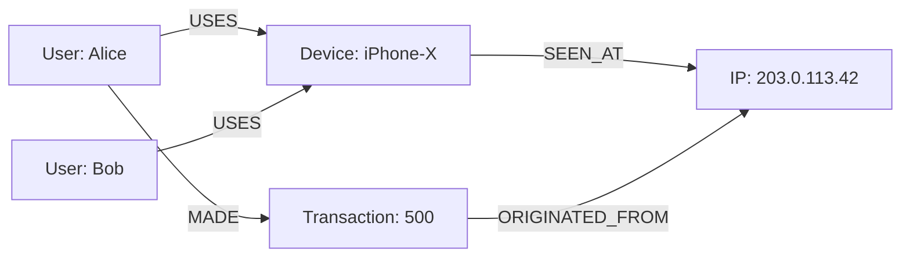
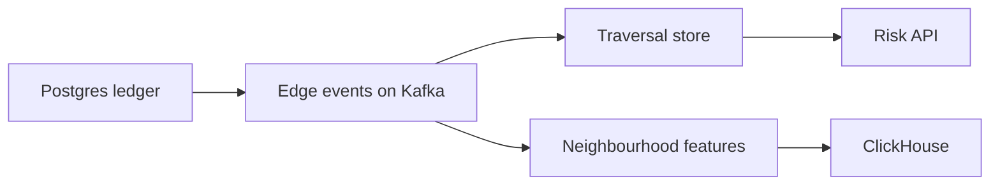

# Graph Thinking

Tuesday, 2:47 PM. An analyst pings you in Slack: "Can you pull all accounts connected within three hops to IP `203.0.113.42` that touched a fraudulent transaction?" The fraud ledger lives in Postgres:

```sql
Users(user_id, name, email)
Devices(device_id, type, fingerprint)
IPs(ip_id, address, country)
Transactions(txn_id, user_id, device_id, ip_id, merchant_id, amount, timestamp)
Merchants(merchant_id, name, category)
```

Before you open a query editor: if each entity fans out to roughly 30 connections, how many rows does a 3-hop join touch — and is the planner still sane at 5 hops?

A. A few hundred rows — joins scale roughly linearly with hop count.
B. Tens of thousands of rows — each hop multiplies by the fan-out factor.
C. Millions of rows, and the planner gives up well before hop 5.
D. It depends entirely on indexes; hop count doesn't matter.

Pick one before reading on. That analyst's sentence is a **graph query**. Forcing it through joins is how you learn when graphs exist.

---

## Use case

**Fraud rings:** User → Device → IP → Transaction → Merchant. Shared devices and IPs are the edges criminals reuse. The product is the **neighbourhood**, not the transaction row.

**Recommendations:** “users who bought this also bought” is a path `(:User)-[:BOUGHT]->(:Product)<-[:BOUGHT]-(:User)-[:BOUGHT]->(:Product)`. Useful for explanation and small catalogues; at Amazon scale this is usually **not** a live graph walk.

This page is the **when**, not Cypher syntax.

---

## Why this is hard

Each hop in SQL is a join. Fan-out multiplies:

| Hops | Typical SQL | Rows touched if fan-out ~30 |
|------|-------------|-----------------------------|
| 1 | one index nested loop | 30 |
| 2 | 2 joins | ~900 |
| 3 | 3–5 joins / CTE layers | ~27k |
| 5 | recursive CTE or generated SQL | millions, planner gives up |

You also have to **dedupe** users already seen, or the join explodes into a DAG unrolled as a tree. The query text grows with depth. The plan is sensitive to statistics you do not have on “graph degree.”

The hard part is not drawing circles. It is recognising **variable depth + high fan-out + path identity** as a different access pattern than OLTP joins.

---

## Intuition

A JOIN: “find rows whose key matches.” Work is B-tree + heap.

A traversal: “from this node, follow this typed pointer.” Work is adjacency.



**Nodes** — entities you start from and return.  
**Relationships** — typed, directed, optionally with properties (`since`, `amount`).  
**Labels** — `:User`, `:Device`.  
**Properties** — attributes; they are not free to index all of.

If the business question names a **path**, think graph. If it names a **set of rows with filters**, think relational or OLAP.

---

## What (the concept, not a product)

A **graph query** is one whose result is defined by **walks** on typed edges: variable length, mixed types, identity of the path. A **relational query** is one whose result is defined by **set operations** on tuples: select, project, join, aggregate.

Neo4j is one implementation. The concept is older than Neo4j. If you export edges to NetworkX you are still doing graph thinking — you just do not have an operational store.

---

## Internals (why joins explode)

SQL 3-hop (the shape that appears in incidents):

```sql
WITH
step1 AS (
    SELECT DISTINCT t.user_id
    FROM Transactions t
    JOIN IPs i ON t.ip_id = i.ip_id
    WHERE i.address = '203.0.113.42'
),
step2_devices AS (
    SELECT DISTINCT t.device_id
    FROM Transactions t
    JOIN step1 ON t.user_id = step1.user_id
),
step2_users AS (
    SELECT DISTINCT t.user_id
    FROM Transactions t
    JOIN step2_devices ON t.device_id = step2_devices.device_id
    WHERE t.user_id NOT IN (SELECT user_id FROM step1)
),
step3_ips AS (
    SELECT DISTINCT t.ip_id
    FROM Transactions t
    JOIN step2_users ON t.user_id = step2_users.user_id
),
step3_users AS (
    SELECT DISTINCT t.user_id
    FROM Transactions t
    JOIN step3_ips ON t.ip_id = step3_ips.ip_id
    WHERE t.user_id NOT IN (SELECT user_id FROM step1)
      AND t.user_id NOT IN (SELECT user_id FROM step2_users)
)
SELECT user_id, 1 AS hops FROM step1
UNION SELECT user_id, 2 FROM step2_users
UNION SELECT user_id, 3 FROM step3_users;
```

Five CTEs for three hops. Each hop: hash or nested-loop join against `Transactions` (the dense fact table). The fact table is wide; you keep touching it.

The same idea in Cypher:

```cypher
MATCH (ip:IP {address: '203.0.113.42'})<-[:ORIGINATED_FROM]-(:Transaction)<-[:MADE]-(u:User)
MATCH path = (u)-[:USES|MADE|ORIGINATED_FROM|AT*1..3]-(other:User)
RETURN DISTINCT other.user_id, length(path) AS hops
```

Still not free: a supernode IP with 5 million edges makes **both** systems die. Graph thinking includes **degree**, not just hops.

**Index-free adjacency** (Neo4j’s term): each relationship is a record with pointers to the two nodes and to the next relationship of that node. Expand is pointer chasing, not a B-tree search per neighbour. The **start** still needs an index (`address`, `user_id`).

---

## How — decide in one page

Ask the query:

1. Is the depth **fixed at 1–2** and the join keys indexed? → Postgres.
2. Is depth **variable** or ≥3 with fan-out? → Graph (or recursive CTE if rare and small).
3. Is it a **global** computation (all components, all PageRank)? → Algorithm job / OLAP / GDS, not per-request SQL or per-request Cypher.
4. Is it a **scan** (“fraud rate by merchant this week”)? → ClickHouse.

Fraud **risk API** (payment in flight): bounded 1–3 hop MATCH from *this* user/device/IP.  
Fraud **ring batch**: WCC on a projection.  
Fraud **dashboard**: OLAP.

Recommendations **online**: usually precomputed pairs, not live 3-hop. Recommendations **offline**: node similarity / embeddings.

---

## Fan-out arithmetic (why “just one more hop” is not SQL)

Let mean degree of `USES` be \(d\), and assume you expand without dedupe:

| Depth | Nodes visited (tree upper bound) |
|-------|----------------------------------|
| 1 | \(d\) |
| 2 | \(d + d^2\) |
| 3 | \(d + d^2 + d^3\) |

For a normal user, \(d \approx 3\) devices + a handful of IPs → tens of nodes at depth 3. For a CGNAT IP, \(d \approx 10^6\) at depth 1. The SQL planner sees `Transactions` as a table with statistics on `ip_id`; it may pick a hash join that **builds 10^6 rows** then joins again. The graph expander walks 10^6 relationship records **from that one node**. Same explosion, different operator name.

**Dedup** (visited set) turns the tree into a BFS DAG — still \(O(\)edges in the ball\()\). That is why a **bounded** 3-hop from a **low-degree start** is the only honest online graph query.

Worked contrast:

- Start: `user_id` with 4 devices, 4 IPs, 40 txns → 2-hop shared-device users might be 20 people. Graph and SQL both fine.
- Start: IP used by 2 million sessions → 1-hop is already an analytic scan. Neither engine is a magic 50 ms API.

Graph thinking includes **choosing the start node**. Analysts who start at `country=US` are running a warehouse query.

---

## Recommendations without pretending they are fraud

The pattern `(:User)-[:BOUGHT]->(:Product)<-[:BOUGHT]-(:User)-[:BOUGHT]->(:Product)` is a 3-hop **collaboration**. At catalogue size 100 it is a demo. At 10M users × 50 products it is a **co-occurrence matrix**, which you compute offline (Spark, GDS similarity, or a two-tower model) and store as:

```
(product_a)-[:ALSO_BOUGHT {w: 0.31}]->(product_b)
```

or as a list in KV. The **live** graph walk is how you explain one edge to a human (“they share 12 buyers”), not how you fill a carousel at 5k QPS.

Fraud wants **recall of a neighbourhood from a seed**. Recs want **top-k similar items**. Same drawing, different systems.

---

## What graph thinking is not

- A reason to store money in Neo4j.
- A reason to skip indexes (you still index the start).
- A synonym for ML (GNN is optional; WCC is not ML).
- “We have a data lake, so we have a graph.” An edge list on Iceberg is a **batch graph**. Useful for algorithms; not an operational traversal store.

---

## Gotchas

!!! warning "Everything is connected, so we need a graph"
    Most schemas have FKs. Almost none need multi-hop at runtime.

!!! warning "Recursive CTE will be fine"
    Fine for org charts of depth 6 and degree 3. Not fine for transaction graphs.

!!! warning "Graph replaces the ledger"
    It does not. Dual-write or CDC. The graph will be wrong; the ledger must not be.

!!! warning "Undirected thinking"
    `USES` vs `USED_BY` vs traversing both. Direction is part of the question.

---

## Failure modes

- **Join explosion in prod BI** — an analyst writes 4-hop SQL against the warehouse replica; ETL SLO missed. Move that question to Neo4j or a precomputed table of pairs.
- **Graph used as warehouse** — `MATCH (t:Transaction) RETURN sum(t.amount)` scans the OLTP graph. ClickHouse exists.
- **Degree explosion** — “3 hops from this IP” where the IP is a mobile gateway. Need filters, cut-nodes, or refuse.

---

## Debugging

When a “graph-shaped” SQL is slow:

1. `EXPLAIN (ANALYZE)`: look for nested loops on the fact table × large build side.
2. Estimate degree: `SELECT device_id, count(*) FROM transactions GROUP BY 1 ORDER BY 2 DESC LIMIT 20`.
3. If the query is rare, materialise **pairs** `(user_id, related_user_id, reason)` nightly in Postgres — a poor man’s graph.
4. If it is frequent and deep, you have justified a graph store — not before.

---

## Scale: 10× / 100× / 1000×

**10× (10M users, 100M txns).** Postgres recursive CTE might still run overnight. Online 3-hop on hot IPs will already hurt. A graph replica starts to pay rent.

**100×.** Fact-table joins for neighbourhoods are gone. Graph must **shard attention**: do not load every historical txn as an edge forever; window the edges (90 days). GDS on full graph needs RAM on the analytics instance, not the serving instance.

**1000×.** Serving graph is **ego-nets** and recent edges; algorithms run on Spark/GDS against a filtered projection. Recsys is embeddings. The mental model (paths vs scans) does not change; the **online** graph gets smaller, not bigger.

---

## Trade-offs

Thinking in graphs buys a language for paths and a storage layout for expand. It costs another system, dual writes, and a new class of incidents (supernodes, unbounded expand).

Thinking only in tables buys one engine until the first 4-hop investigation, which then happens in Python notebooks on exported edges — a graph, just unofficial.

---

## Alternatives

| Approach | When |
|----------|------|
| Postgres joins | 1–2 hops, known keys |
| Recursive CTE | Trees, low degree |
| Materialised pair table | Fixed 2-hop, high QPS, no path listing |
| Neo4j / Neptune / Memgraph | Online variable-depth |
| Spark GraphX / GDS | Global algorithms |
| ClickHouse | Aggregates on edges as facts |

---

## Apply

You will hear “we need Neo4j” in the same meeting as “we need to count orders by day.” Split the questions. If the fraud analyst’s daily tool is a 3-hop walk, graph thinking applies. If it is a dashboard, it does not.

When the ML team asks for “graph features,” they often want **counts** (shared-device count, 2-hop unique users) as columns in a training table. That is a **batch expand** (Spark or GDS) written to Parquet — graph thinking for **feature compute**, not a new serving database. Ray may run the Python that turns neighbourhoods into vectors; it does not replace the expand.

On-call smell: a Looker dashboard that “just needs one more join to devices.” If that join is the third hop and the dashboard is company-wide, you are scanning a graph with SQL. Push back: precompute the feature or move the investigation to a graph tool.

---

## Architecture placement



Graph thinking decides **which box** the question lands in. It does not require all boxes on day one. Many teams live on ledger + Kafka + Spark features for a year, then add Neo4j when investigators cannot work in notebooks.

---

## Exercise

??? question "Is this a graph query?"
    Classify each as Postgres, graph traversal, GDS/OLAP, or recsys-offline. One sentence why.

    1. Last 20 transactions for `user_id`.
    2. All users sharing a device with anyone who shared an IP with a known fraudster (depth ≤ 3).
    3. Fraud GMV by merchant category last week.
    4. Connected components of the 90-day device-sharing graph.
    5. Top-10 similar merchants to merchant M for a rec carousel.
    6. Org chart manager* of an employee.

??? success "Answer"
    1. Postgres (1 hop, PK).
    2. Graph traversal (variable path, typed edges) — bounded MATCH, not WCC.
    3. OLAP/ClickHouse (scan + group by).
    4. GDS WCC (global algorithm, batch).
    5. Offline similarity (GDS nodeSimilarity or embeddings) → precomputed list; not live k-NN on the OLTP graph at 200 ms unless the catalogue is tiny.
    6. Postgres recursive CTE or graph; degree is low — **Postgres is enough**.
