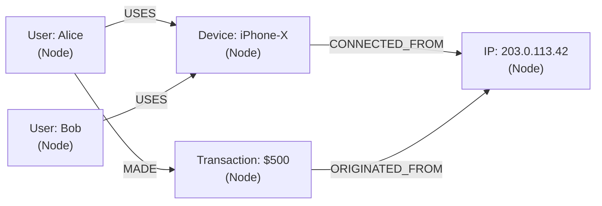

# Graph Thinking

## The Problem That Motivates Graph Databases

You are building a fraud detection system. You have these tables:

```sql
Users(user_id, name, email)
Devices(device_id, type, fingerprint)
IPs(ip_id, address, country)
Transactions(txn_id, user_id, device_id, ip_id, merchant_id, amount, timestamp)
Merchants(merchant_id, name, category)
```

A fraud analyst wants to answer:

> **Find all accounts connected within three hops to IP address `203.0.113.42`, which was used in a fraudulent transaction.**

In SQL:

```sql
WITH
-- Users who used the fraudulent IP
step1 AS (
    SELECT DISTINCT t.user_id
    FROM Transactions t
    WHERE t.ip_id = (SELECT ip_id FROM IPs WHERE address = '203.0.113.42')
),
-- Devices used by those users
step2_devices AS (
    SELECT DISTINCT t.device_id
    FROM Transactions t
    JOIN step1 ON t.user_id = step1.user_id
),
-- Users who used those devices (hop 2)
step2_users AS (
    SELECT DISTINCT t.user_id
    FROM Transactions t
    JOIN step2_devices ON t.device_id = step2_devices.device_id
    WHERE t.user_id NOT IN (SELECT user_id FROM step1)
),
-- IPs used by hop-2 users
step3_ips AS (
    SELECT DISTINCT t.ip_id
    FROM Transactions t
    JOIN step2_users ON t.user_id = step2_users.user_id
),
-- Users who used those IPs (hop 3)
step3_users AS (
    SELECT DISTINCT t.user_id
    FROM Transactions t
    JOIN step3_ips ON t.ip_id = step3_ips.ip_id
    WHERE t.user_id NOT IN (SELECT user_id FROM step1)
      AND t.user_id NOT IN (SELECT user_id FROM step2_users)
)
SELECT user_id, 1 AS hops FROM step1
UNION SELECT user_id, 2 FROM step2_users
UNION SELECT user_id, 3 FROM step3_users;
```

This is 5 nested CTEs for 3 hops. For 4 hops, add another layer. Performance degrades rapidly.

Now in Cypher (Neo4j):

```cypher
MATCH (ip:IP {address: '203.0.113.42'})
     <-[:USED_FROM]-(t:Transaction)
     <-[:MADE]-(u:User)
MATCH path = (u)-[:CONNECTED_TO*1..3]-()
RETURN DISTINCT nodes(path)
```

Two lines. The graph database traverses relationships natively.

---

## When Graph Thinking Applies

Relational databases model entities well. Graph databases model **relationships** well — particularly when:

1. The relationships themselves are first-class objects with properties
2. You need to traverse relationships to arbitrary depth
3. The query is "find everything connected to X via any path of length N"

If these patterns do not appear in your access patterns, a relational database is usually better. Graph databases are not a universal upgrade.

---

## The Graph Mental Model



**Nodes**: entities (User, Device, IP, Transaction)
**Relationships (edges)**: connections between entities, always with a direction and usually a type
**Properties**: data on nodes and relationships (`amount`, `timestamp`, `fingerprint`)
**Labels**: types of nodes (`:User`, `:Device`, `:IP`)

---

## What Graph Databases Add Over Relational

A JOIN in SQL looks up rows by foreign key in a separate table — an index scan.

A graph traversal follows a pointer directly from one node to its connected nodes — no separate lookup. At large depths, this difference becomes significant.

```
SQL 3-hop join: 3 × index lookup × fan-out per hop
Graph 3-hop traversal: follow pointers directly to neighbors
```

For highly connected data with frequent deep traversals, graph traversal is fundamentally faster.

For data with simple relationships or infrequent traversals, PostgreSQL with proper indexes is often faster and much simpler to operate.
