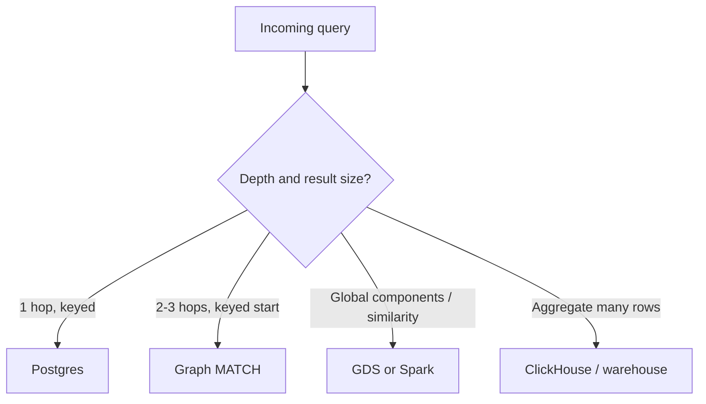
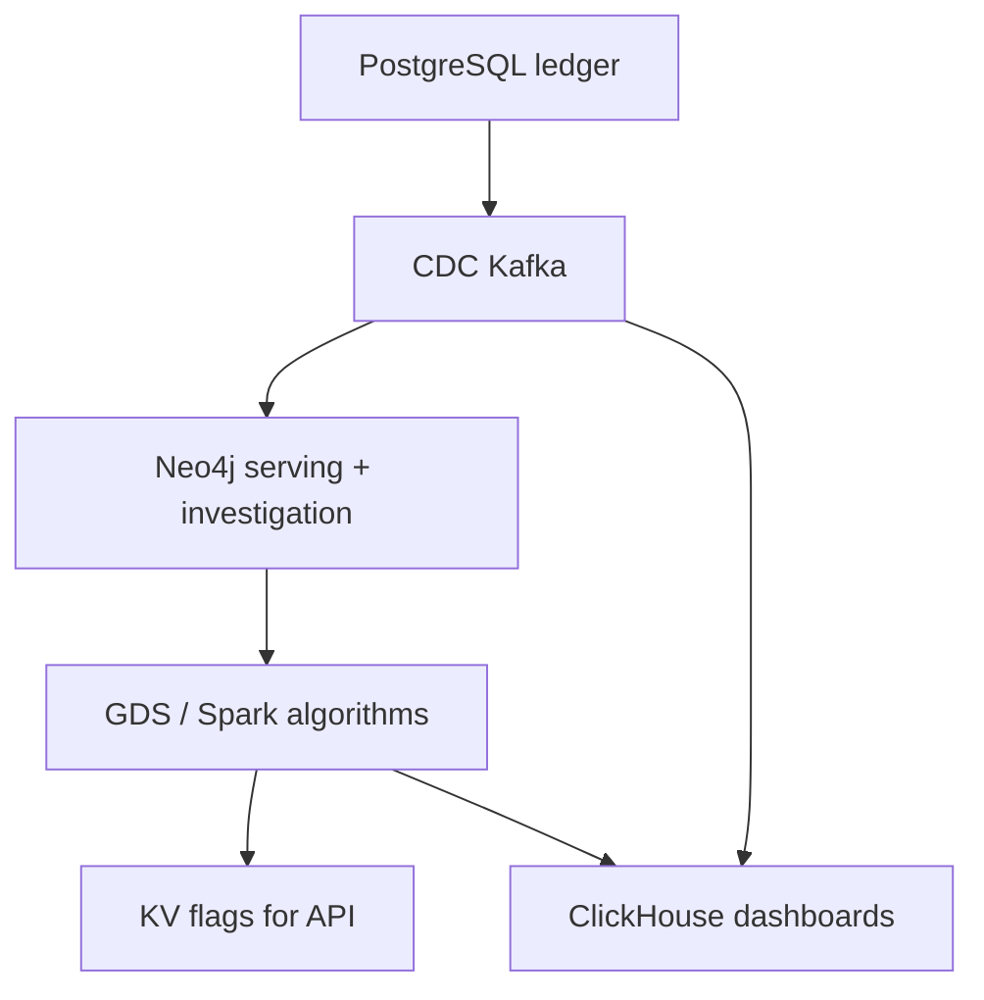

# Graph vs Relational

Design review, 10 AM. A recursive CTE that finds "users within 3 hops of this IP" ran in 40 ms last quarter, back when the table had 2 million rows. Same query, same indexes, now times out at 30 seconds — the table has grown to 40 million rows. Someone proposes migrating the whole fraud ledger to Neo4j. Someone else says "just tune Postgres."

What's the right call?

A. Add or rebuild an index — the query plan just went stale.
B. Increase `work_mem` and let the planner spill less.
C. Move this one traversal to a graph store; leave the ledger in Postgres.
D. Move everything, including the ledger, to Neo4j.

Pick one before reading on. Graph databases are not "better at relationships" — every OLTP schema has relationships, they're called foreign keys. Graphs earn their keep when **multi-hop traversal** is a first-class access pattern — operational pointer chasing — not when you need an analytic scan over facts. Postgres remains the default; this page is the honest comparison so fraud and recs reviews do not end in a second database by fashion.

---

## Use case

Same company, four questions:

1. Last 20 payments for a user (ledger).
2. Users within 3 hops of a bad IP (investigation / risk).
3. Fraud GMV by merchant category (dashboard).
4. Weakly connected rings overnight (batch intel).

(1) Postgres. (2) Graph **or** a materialised neighbourhood. (3) ClickHouse — **neither** Postgres nor Neo4j. (4) GDS/Spark — **not** a recursive CTE at 40M users, **not** a MATCH.

---

## Why this is hard

Vendors sell “relationships.” Engineers hear “joins are slow.” Joins are fast when they are **indexed, shallow, and selective**. They are slow when they **unroll a graph**. Graph expand is slow when it is **a scan in disguise** (`MATCH (t:Transaction) RETURN sum(t.amount)`).

The comparison is **access pattern**, not ideology.

---

## Intuition

**Operational traversal:** start at one node, walk typed edges, depth 1–3, return a small set. Native graphs win as depth and fan-out grow.

**Analytic scan:** read a large fraction of a fact table, group, aggregate. Columnar OLAP wins. Row-store Postgres is acceptable at moderate size. Graph OLTP loses.



---

## Internals

| | Postgres | Neo4j-style graph | ClickHouse |
|--|----------|-------------------|------------|
| Layout | Rows, B-trees, heap | Nodes + relationship chains | Columns, parts |
| 1-hop by PK | Index seek — excellent | Index + expand — extra machinery | PK/sparse index if you designed it |
| 3-hop neighbourhood | Nested joins / CTE; cost blows up with degree | Expand chains; cost ~ edges visited | Awkward; not the product |
| `GROUP BY day` | Seq/index scan | Label scan — poor | Excellent |
| Write txn across entities | **ACID** the ledger | Possible, not the SoR | Poor |
| Degree explosion | Hash join memory | Expand on supernode | Scan more rows |

**Index-free adjacency** helps expand, not aggregation. **Cost-based join** helps 2-table SQL, not 5-hop path identity.

Recursive CTEs (`WITH RECURSIVE`) **are** graph algorithms in SQL. They work on trees (org chart, bill of materials). On a dense fraud graph they are unbounded work with a planner that was not given degrees.

---

## How — the same questions in both dialects

### Case 1: single-hop — Postgres wins

```sql
SELECT * FROM orders WHERE customer_id = 'c001' ORDER BY created_at DESC LIMIT 20;
```

```cypher
MATCH (u:User {user_id: 'c001'})-[:MADE]->(t:Transaction)
RETURN t ORDER BY t.ts DESC LIMIT 20;
```

Both fine. Postgres is fewer moving parts for a ledger. Use it.

### Case 2: two-table join — Postgres

```sql
SELECT DISTINCT c.name
FROM customers c
JOIN orders o ON c.customer_id = o.customer_id
WHERE o.order_date >= DATE '2024-01-01';
```

No graph. “Customers who ordered” is a **set**, not a path.

### Case 3: aggregation — OLAP, not graph

```sql
SELECT country, count(*) FROM orders
WHERE order_date >= current_date - 7
GROUP BY country;
```

Neo4j `MATCH (t:Transaction) RETURN t.country, count(*)` is a label scan. Wrong engine.

### Case 4: 3-hop fraud — graph wins **as a language and as expand**

SQL: the CTE tower in [graph thinking](graph-thinking.md). Cypher: one pattern. At 10M txns and degree 20, measured expand usually beats measured joins. At degree 2,000,000, **both** lose until you fix the model.

### Case 5: path existence — graph

```cypher
MATCH (a:User {user_id: $a}), (b:User {user_id: $b})
MATCH p = shortestPath((a)-[:USES|MADE|FROM|ON*..5]-(b))
RETURN p IS NOT NULL;
```

SQL: recursive CTE or application BFS. Fine as a **rare** analyst query on a replica; not as a 5k QPS API.

### Case 6: materialised pairs — the hybrid that postpones Neo4j

```sql
-- nightly: shared device pairs
INSERT INTO user_related (user_a, user_b, reason, ts)
SELECT t1.user_id, t2.user_id, 'device', now()
FROM transactions t1
JOIN transactions t2 ON t1.device_id = t2.device_id
WHERE t1.user_id < t2.user_id
  AND t1.ts > now() - interval '90 days';
```

This is a **2-hop snapshot**. It dies if you need variable path listing, edge types mixed, or 4 hops tomorrow. It is an excellent Staff answer when the only production query is “shared device?” at 50k QPS — put the pairs in Postgres or Dynamo.

---

## Decision framework

Answer in order. “Yes” moves you toward a graph store. “No” keeps you relational.

1. **Do serving queries traverse >2 hops with non-trivial fan-out?**  
   If no: Postgres.
2. **Do you need paths, not just existence of a 2-hop pair?**  
   If no: materialised pair table.
3. **Is the structure itself the product (rings, bridges, patterns)?**  
   If no: you wanted analytics or ML features.
4. **Would SQL be recursive CTEs maintained by humans?**  
   If no: Postgres.
5. **Can the graph be derived from CDC and rebuilt?**  
   If no: you are about to make Neo4j the ledger — stop.

If (1)–(4) are yes, Neo4j (or similar) is justified **next to** Postgres. If only (3) is yes and only overnight, **GDS/Spark on exported edges** without an online graph might suffice.

---

## Hybrid architecture (the production one)

From [Fraud architecture](../architectures/fraud.md):



| System | Owns |
|--------|------|
| Postgres | Money, truth, ACID |
| Neo4j | Neighbourhood MATCH |
| GDS/Spark | WCC, PageRank, similarity |
| ClickHouse | Rates, time series |
| KV | Precomputed risk bits for p99 |

Recommendations: Postgres/Iceberg events → **offline** similarity or two-tower → **KV** for the carousel. Neo4j optional for “why was this recommended” path debug.

---

## Gotchas

!!! warning "FK-rich schema ≠ graph problem"
    Orders–customers–products is relational until someone walks 4 hops for fraud.

!!! warning "Graph as warehouse"
    Label scans, BI tools on Bolt, `sum(amount)` — incidents.

!!! warning "Recursive CTE as a personality"
    Works in demo, pages in prod on dense data.

!!! warning "Dual write without CDC"
    Graph diverges; finance believes Postgres; security believes Neo4j.

!!! warning "One hop in Neo4j because we already paid for it"
    Still slower ops, still another on-call. Use Postgres.

---

## Failure modes

- Team migrates the **order API** to Cypher; lose constraints, reporting, and hire-ability.
- Graph cluster sized for traversal is used for ETL dumps; GC/page cache death.
- Pair table in Postgres not refreshed; “not related” is stale.
- Analyst JOIN explosion on the OLTP replica taken as “we need Snowflake” when they needed a graph **or** a warehouse **depending on the question** — ask which.

---

## Debugging a “which engine?” incident

1. Write the query in English: path, set, or aggregate?
2. Estimate **start cardinality** and **mean degree**.
3. If aggregate: `EXPLAIN` in warehouse, not Neo4j.
4. If path: `PROFILE` Cypher vs `EXPLAIN ANALYZE` SQL on the same 3 hops and the **same hot IP**.
5. If SQL wins at depth 2 and loses at 4, that is the slide — not “graphs are faster.”

---

## Scale: 10× / 100× / 1000×

**10×.** Postgres + nightly pair table often enough. Neo4j if analysts live in 3-hop Browser.

**100×.** Online graph for investigation/risk MATCH; algorithms off-box; OLAP for money; Postgres still ledger.

**1000×.** Ego-net in KV for the API (precomputed 2-hop), graph for investigation subset, Spark for WCC, warehouse for scans. Relational **does not disappear**. Graph **does not hold history forever**.

---

## Trade-offs

| Choosing graph OLTP | Choosing Postgres only |
|---------------------|------------------------|
| Path queries, Cypher, GDS adjacency | One system of record, SQL, constraints |
| Extra CDC, supernodes, RAM | 4-hop pain, unofficial NetworkX dumps |
| Hire/ops for a second store | Recursion and pair tables as crutches |

Neither choice removes ClickHouse for (3).

---

## Cost and operations (the part architecture decks skip)

| | Postgres | Neo4j cluster | Pair table in Postgres |
|--|----------|---------------|------------------------|
| Backup/PITR | Known | Different tool | Known |
| CDC out | Native | You **are** the sink | Native |
| Staffing | Every DE | Graph specialist + DE | Every DE |
| Failure mode | Bloat, vacuum, failover | Supernode, page cache, GDS RAM | Stale pairs, huge join in ETL |
| Interactive 3-hop | Pain | Browser | No (existence only) |

A graph database is justified when **interactive path listing** pays for that extra column. A pair table is justified when the SLO is 50 ms **existence** of a 2-hop fact. Many fraud v0 products only needed the pair table and a Spark WCC; Neo4j arrived when investigators needed to **see** the path.

**Latency intuition (order of magnitude, not a benchmark):**

- PK lookup Postgres or Neo4j: ~1 ms local.
- 2-hop expand, degree 10: few ms in Neo4j; two indexed joins in Postgres also few ms.
- 3-hop, degree 30, with distinct: graph usually simpler to keep fast; SQL plans get fragile.
- Aggregate 1e9 payments: ClickHouse hundreds of ms; Neo4j should not try.

---

## Recs and fraud are not the same “graph vs relational” decision

Fraud **serving** cares about a **specific seed** and a **small ball**. Relational pairs or a graph both work; graph wins as hops and types grow.

Fraud **rings** care about a **global partition** of vertices. Relational `GROUP BY device_id` is not WCC. You need an algorithm engine.

Recs care about **top-k** under a latency budget. Relational co-occurrence tables (item–item) are the industry default. A live graph walk is a demo. Do not let a fraud Neo4j purchase pull recs onto the same cluster “because both are graphs.”

---

## Alternatives

| Option | Role |
|--------|------|
| Postgres | Default OLTP |
| Recursive CTE | Trees |
| Materialised pairs | High-QPS 2-hop existence |
| Neo4j / Neptune / Memgraph | Online traversal |
| Spark algorithms | Global graph analytics |
| ClickHouse | Analytic scan |
| Feature store + model | Recs / fraud **score** without explaining the path |

---

## Apply

In a design review, forbid the sentence “we have relationships, so Neo4j.” Require the four questions (ledger, neighbourhood, aggregate, rings). Assign an engine to each. If neighbourhood is not in the product, do not buy a graph database.

Write the decision on one slide: **operational traversal vs analytic scan vs global algorithm vs OLTP record.** If two of those words map to the same cluster, expect an incident.

Related academy pages: [graph thinking](graph-thinking.md) for the 3-hop SQL, [modelling](graph-modelling.md) for supernodes, [algorithms](graph-algorithms.md) for WCC vs MATCH, [fraud architecture](../architectures/fraud.md) for the hybrid diagram.

Operational traversal is the graph purchase. Analytic scan is not. Keep those sentences adjacent in the review notes.

---

## Exercise

??? question "Assign the engine"
    E-commerce + fraud + recs. Traffic 10× of today.

    1. Checkout write path.
    2. “Show my orders.”
    3. “Users sharing a device with this user” on the payment path (50 ms).
    4. Nightly rings.
    5. “Fraud rate by category, last 7 days.”
    6. “Customers who bought A also bought B” for a carousel.
    7. When would you **not** deploy Neo4j at all?

??? success "Answer"
    1. Postgres (ACID ledger). Maybe Redis/Dynamo for session, not for the payment row.
    2. Postgres.
    3. Neo4j bounded MATCH **or** KV/Postgres pair table if only this 2-hop existence matters. Graph if you will add hops/types next quarter.
    4. GDS/Spark WCC on a filtered edge list; results to ClickHouse/KV.
    5. ClickHouse (or warehouse). Not Neo4j, not OLTP Postgres at 100×.
    6. Offline similarity / co-occurrence job → KV. Not live 3-hop Cypher.
    7. If (3) is pair-table simple and (4) can run on Spark from Kafka edges without analysts living in Browser — skip online graph. Add Neo4j when path **listing** and interactive investigation are the product.
