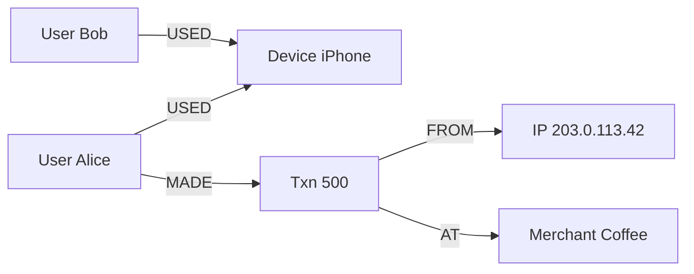
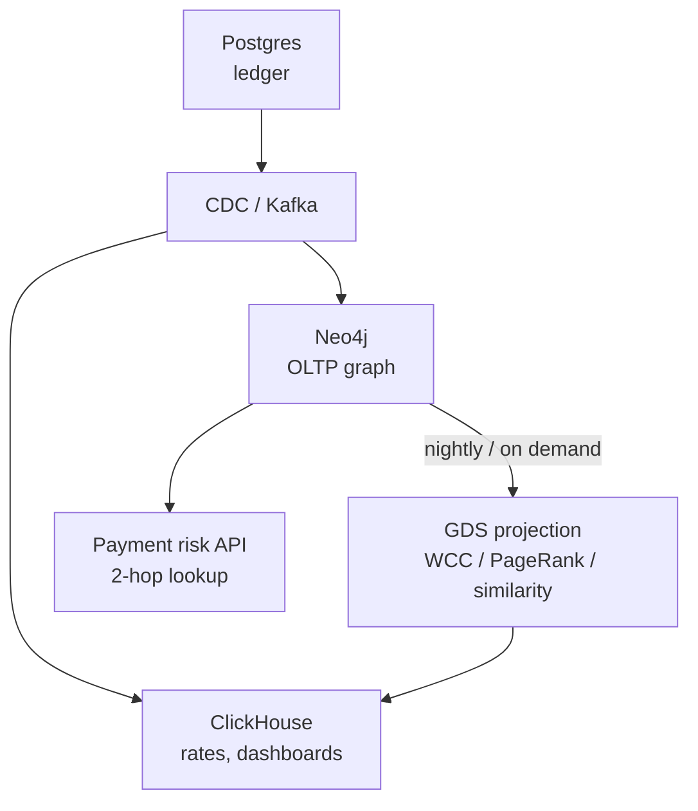

# Graph Databases

!!! info "Version and source policy"
    Cypher syntax, indexes, and algorithm libraries change across releases. Check [Versions & Primary Sources](../reference/version-matrix.md).

11:02 AM. A $4,200 payment just posted. Risk needs an answer in under 200 ms: does this user share a **device, IP, or card** with a known fraud ring, and does that ring also hit the same merchant cluster — a few hops out, on a graph of tens of millions of entities?

Which system answers that, at that latency?

A. The warehouse — run an aggregate query grouped by fraud ring.
B. Postgres — join `Users`, `Devices`, `IPs`, `Transactions`, `Merchants` for this one user.
C. A graph store — start at the user node and traverse typed edges a few hops out.
D. Postgres, but with a covering index on every foreign key involved.

Pick one before reading on. The warehouse can count fraud by country; Postgres can fetch the user's last 20 transactions; neither wants to walk **User → Device → IP → Transaction → Merchant** at request time. When the product question is the **path**, not the row, you model a graph. When the question is a scan or a join of two tables, you do not.

---

## What this module covers

| Topic | What you will learn |
|-------|---------------------|
| [Graph thinking](graph-thinking.md) | When joins explode; when they do not |
| [Graph modelling](graph-modelling.md) | Relationship types, direction, supernodes, query-shaped models |
| [Neo4j & Cypher](neo4j.md) | Patterns, indexes, PROFILE, drivers |
| [Graph algorithms](graph-algorithms.md) | WCC, PageRank, node similarity — and **when** they run vs OLAP |
| [Graph vs relational](graph-vs-relational.md) | Operational traversal vs analytic scan; honest Postgres |

Read in that order. Cypher without modelling produces supernodes. Algorithms without a split between **online traversal** and **offline GDS** produce a locked cluster.

---

## Running use cases

**Fraud (primary).**

```
(User)-[:USED]->(Device)
(User)-[:USED]->(IP)
(User)-[:MADE]->(Transaction)-[:AT]->(Merchant)
(Transaction)-[:FROM]->(IP)
(Transaction)-[:ON]->(Device)
```

Analysts: “accounts within 3 hops of this IP.” Nightly: **weakly connected components** as candidate rings. Recs-adjacent: “merchants similar to merchants this ring hits.”

**Recommendations (secondary).** User–Product–User, or User–Merchant–User. Often **not** the production recsys (that is embeddings + two-towers). Graph is the **explanation** and the **cold-start neighbourhood**, or a GDS similarity job — not a replacement for the feature store.

Also in this academy, briefly: IAM trees, data lineage. Same modelling rules; less operational heat than fraud.

The system of record for payments remains **Postgres**. The graph is a **derived** projection, rebuilt from CDC/Kafka. See [Fraud architecture](../architectures/fraud.md).

---

## Central intuition



A **JOIN** looks up a key in another table (index seek × fan-out per hop). A **traversal** walks adjacency already stored on the node (pointer chasing). After 3–4 hops with fan-out 50, SQL plans explode; Cypher stays a pattern. After 1 hop, Postgres wins on simplicity and often on latency.

Graph databases are **operational stores for neighbourhood queries**. Graph **algorithms** (WCC, PageRank, similarity) are **analytics on a projection** — usually Graph Data Science in memory, or Spark GraphX, not a `MATCH` on the live serving graph at every payment.

---

## When you are in the wrong module

Stay in Postgres / OLAP if:

- “Orders for this customer” (1 hop)
- “GMV by country” (scan + aggregate)
- “Does this FK exist?” (constraint)

Stay here if:

- Variable-depth **path** queries are the product
- You need **rings, bridges, similar nodes** as first-class answers
- SQL recursive CTEs are the proposed 4-hop implementation

[Graph vs relational](graph-vs-relational.md) is the decision page. Use it in design reviews.

---

## How the fraud path actually splits



| Question | Engine |
|----------|--------|
| Last 50 txns for user | Postgres / Cassandra |
| Shared device with known bad user, 2 hops | **Neo4j MATCH** |
| All rings overnight | **GDS WCC**, not a 50-hop MATCH |
| Fraud rate by merchant category | **ClickHouse** |
| Recommend SKUs | Recsys stack; optional GDS similarity |

---

## Mental model to finish with

| Idea | Truth |
|------|--------|
| Node | Entity you will start a query from |
| Relationship type + direction | The API of the graph; `RELATED_TO` is a bug |
| Index | Find the **start** node; traversals then walk edges |
| Supernode | VPN IP, “Amazon,” `country=US` as a node — kills expand |
| GDS | In-memory projection; analytic; can starve OLTP if mixed carelessly |
| System of record | Almost never the graph |

---

## Failure preview

- Unbounded `* ` traversals that walk the company.
- Treating WCC as a per-payment query.
- Modelling every SQL table as a node (join tables become supernodes).
- No uniqueness constraints; duplicate `User` nodes break rings.
- Running PageRank on the live cluster at noon.

---

## Traversal vs algorithm vs scan

Keep these three words in the same design doc:

| Word | Example | Engine |
|------|---------|--------|
| **Traversal** | 2-hop users sharing a device with `u001` | Neo4j `MATCH`, bounded |
| **Algorithm** | WCC of 90-day `USES` | GDS / Spark, batch |
| **Scan** | Fraud $ by category last week | ClickHouse |

Recommendations sit on the same split: live 3-hop “people who bought also bought” is a traversal you should **precompute**; item–item similarity is an algorithm; “top sellers this week” is a scan.

If a proposal uses one cluster for all three, it will fail the SLO of at least one.

---

## What you will be able to do

After the five pages:

- Look at a 4-hop SQL CTE and say whether it is a graph problem or a missing pair table.
- Choose transaction-as-node vs transaction-as-edge from a query list.
- Write Cypher that starts with an index, names types, caps depth, and `PROFILE`s.
- Schedule WCC → PageRank-on-component → similarity so they do not touch the payment path.
- Tell a VP that Postgres still owns money.

---

## How to study this module

1. Read the 3-hop SQL vs Cypher on [Graph thinking](graph-thinking.md). Time both in your head at fan-out 30.
2. Model fraud twice on [Graph modelling](graph-modelling.md) (transaction as node vs relationship).
3. Write Cypher with indexes and `PROFILE` on [Neo4j](neo4j.md).
4. Place WCC / PageRank / similarity on a **clock** on [Graph algorithms](graph-algorithms.md).
5. Defend Postgres on [Graph vs relational](graph-vs-relational.md).

!!! tip "Exit criterion"
    You can draw User–Device–IP–Txn–Merchant, write a 3-hop Cypher, name the supernode, and say why WCC is a nightly GDS job while the risk API is a bounded MATCH.

---

## Related modules

- [Fraud architecture](../architectures/fraud.md)
- [E-commerce architecture](../architectures/ecommerce.md)
- [NoSQL thinking](../databases/nosql.md) — another query-bound model
- [Spark](../spark/index.md) — GraphX / large projections
- [Selection framework](../reference/selection-framework.md)
