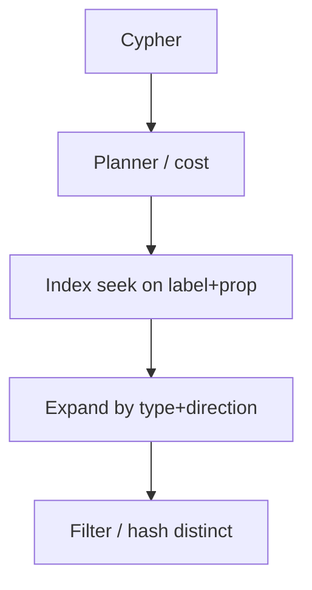

# Neo4j & Cypher

The fraud graph is modelled. You now need **bounded traversals** on the payment path and investigations in a language that looks like the picture. Neo4j is the operational graph store in this academy: Cypher patterns, indexes to find the start, `PROFILE` to see expands. It is not where you run last week’s GMV.

---

## Use case

- Risk API: 2-hop shared device/IP for *this* `user_id`, < 50 ms, `LIMIT`.
- Analyst: 3-hop neighbourhood of a bad IP, minutes OK, still bounded.
- CDC upserts from the payment Postgres.

Recommendations use Cypher only to **read precomputed** `ALSO_BOUGHT` or to debug a neighbourhood — not to compute similarity online.

---

## Why this is hard

Cypher is easy to write and easy to make **cartesian**. Indexes are easy to forget (label scan of all `:Transaction`). Variable-length paths are easy to unbounded-star. The database will try. The cluster will pause.

You must treat Cypher like CQL: **every query has a start key, a type list, a depth cap, and a LIMIT**.

---

## Intuition

ASCII art is the language:

```
(node:Label {prop: value})-[:TYPE]->(other)
```

`MATCH` is declare a pattern. `WHERE` filters. `RETURN` projects. The planner’s job is to **pick a start** (index) and expand. If it starts with `AllNodesScan`, you lost.

---

## Internals



Storage: nodes, relationships, property store, label/type tokens. **Index-free adjacency** after the start: expand walks relationship chains on the node.

**Indexes and constraints** are how `MATCH (u:User {user_id: $id})` is O(log n) not O(|Users|).

**Transactions:** Bolt session writes are transactional; CDC should batch modestly. Do not open a transaction that upserts 10 million edges.

**Memory:** transaction heap + page cache. A supernode expand pulls a huge chain into the expander. Serving and GDS on the same box contend — see [algorithms](graph-algorithms.md).

---

## How

### Run locally

```bash
docker run --name neo4j -p 7474:7474 -p 7687:7687 \
  -e NEO4J_AUTH=neo4j/password \
  -e NEO4J_PLUGINS='["graph-data-science"]' \
  neo4j:5
```

Browser: `http://localhost:7474`. Bolt: `7687`.

### Constraints and indexes first

```cypher
CREATE CONSTRAINT user_id IF NOT EXISTS
FOR (u:User) REQUIRE u.user_id IS UNIQUE;
CREATE CONSTRAINT device_id IF NOT EXISTS
FOR (d:Device) REQUIRE d.device_id IS UNIQUE;
CREATE CONSTRAINT ip_addr IF NOT EXISTS
FOR (i:IP) REQUIRE i.address IS UNIQUE;
CREATE CONSTRAINT txn_id IF NOT EXISTS
FOR (t:Transaction) REQUIRE t.txn_id IS UNIQUE;
CREATE CONSTRAINT merchant_id IF NOT EXISTS
FOR (m:Merchant) REQUIRE m.merchant_id IS UNIQUE;

CREATE INDEX ip_flag IF NOT EXISTS FOR (i:IP) ON (i.flag);
CREATE INDEX txn_ts IF NOT EXISTS FOR (t:Transaction) ON (t.ts);
```

Without the uniqueness constraints, `MERGE` is guesswork and rings split.

### MERGE from CDC (idempotent upsert)

```cypher
MERGE (u:User {user_id: $uid})
  ON CREATE SET u.name = $name
MERGE (d:Device {device_id: $did})
  ON CREATE SET d.fingerprint = $fp
MERGE (ip:IP {address: $addr})
MERGE (m:Merchant {merchant_id: $mid})
  ON CREATE SET m.name = $mname
MERGE (t:Transaction {txn_id: $tid})
  SET t.amount = $amount, t.ts = datetime($ts)
MERGE (u)-[:MADE]->(t)
MERGE (t)-[:ON]->(d)
MERGE (t)-[:FROM]->(ip)
MERGE (t)-[:AT]->(m)
MERGE (u)-[r:USES]->(d)
  SET r.last_seen = datetime($ts)
MERGE (u)-[s:USES]->(ip)
  SET s.last_seen = datetime($ts)
```

`MERGE` on a non-indexed property is a scan. Always MERGE on the constrained id.

### Pattern matching — fraud serving

```cypher
// 1 hop: devices for user
MATCH (u:User {user_id: $uid})-[:USES]->(d:Device)
RETURN d.device_id, d.fingerprint;

// 2 hop: other users sharing a device, skip supernodes
MATCH (u:User {user_id: $uid})-[:USES]->(d:Device)<-[:USES]-(other:User)
WHERE other <> u AND coalesce(d.flag, '') <> 'supernode'
RETURN DISTINCT other.user_id
LIMIT 100;

// 3 hop: merchants in that neighbourhood (bounded)
MATCH (u:User {user_id: $uid})-[:USES]->(d:Device)<-[:USES]-(other:User)
WHERE coalesce(d.flag, '') <> 'supernode'
WITH DISTINCT other LIMIT 200
MATCH (other)-[:MADE]->(t:Transaction)-[:AT]->(m:Merchant)
WHERE t.ts > datetime() - duration('P90D')
RETURN m.merchant_id, count(*) AS n
ORDER BY n DESC
LIMIT 20;
```

### Variable-length — always capped

```cypher
MATCH (ip:IP {address: $addr})
WHERE ip.flag IS NULL OR ip.flag <> 'supernode'
MATCH (ip)<-[:FROM]-(:Transaction)<-[:MADE]-(u:User)
MATCH path = (u)-[:USES|MADE|FROM|ON|AT*1..3]-(other:User)
RETURN DISTINCT other.user_id, min(length(path)) AS hops
LIMIT 500;
```

`*1..3` is the product. `*` is an incident.

### Shortest path (investigation)

```cypher
MATCH (a:User {user_id: $a}), (b:User {user_id: $b})
MATCH path = shortestPath((a)-[:USES|MADE|FROM|ON|AT*..6]-(b))
RETURN [n IN nodes(path) | labels(n)[0] + ':' + coalesce(n.user_id, n.device_id, n.address, n.txn_id)] AS steps,
       length(path) AS hops;
```

Still cap `*..6`. Unbounded shortestPath on a connected-world graph is a CPU bomb.

### Aggregation (small neighbourhoods only)

```cypher
MATCH (t:Transaction)-[:AT]->(m:Merchant {merchant_id: $mid})
WHERE t.ts > datetime() - duration('P1D')
RETURN count(t) AS n, sum(t.amount) AS amt;
```

Company-wide totals: [ClickHouse](../olap/clickhouse.md).

### Python driver

```python
from neo4j import GraphDatabase

driver = GraphDatabase.driver("bolt://localhost:7687", auth=("neo4j", "password"))

CYPHER_2HOP = """
MATCH (u:User {user_id: $uid})-[:USES]->(d:Device)<-[:USES]-(other:User)
WHERE other <> u AND coalesce(d.flag,'') <> 'supernode'
RETURN DISTINCT other.user_id AS user_id
LIMIT 100
"""

def shared_device_users(uid: str) -> list[str]:
    with driver.session() as session:
        recs = session.run(CYPHER_2HOP, uid=uid)
        return [r["user_id"] for r in recs]
```

Parameterise. Do not f-string Cypher.

---

## EXPLAIN and PROFILE

```cypher
EXPLAIN
MATCH (u:User {user_id: $uid})-[:USES]->(d:Device)
RETURN d;
```

Want **`NodeIndexSeek`** / `NodeUniqueIndexSeek`, then `Expand`.  
Reject **`AllNodesScan`**, **`NodeByLabelScan`** on `:Transaction`, cartesian `ValueHashJoin` of two disconnected MATCH.

```cypher
PROFILE
MATCH (u:User {user_id: $uid})-[:USES]->(d:Device)<-[:USES]-(o:User)
RETURN o.user_id;
```

Read **db hits** and **rows** on each Expand. If Expand rows jump 1 → 5,000,000, you hit a supernode.

---

## Gotchas

!!! warning "Unbounded traversal"
    `MATCH (u)-[*]-()` walks the world. Always `*1..N` and types.

!!! warning "Cartesian products"
    `MATCH (u:User), (d:Device)` with no relationship. Millions of rows. Connect the pattern.

!!! warning "MERGE without constraint"
    Race → duplicates.

!!! warning "Eager operators"
    Large `DISTINCT` / `ORDER BY` on unbounded MATCH pulls the neighbourhood into memory.

!!! warning "Serving + GDS on one heap"
    PageRank of the full graph will evict the page cache the API needed.

---

## Failure modes

| Symptom | Cause |
|---------|--------|
| Query 2 ms then 40 s | Hit a supernode IP/device |
| Cluster CPU 100% | `*` or cartesian |
| Duplicate users | Missing constraint, bad MERGE |
| CDC lag | Giant transactions, lock on supernode |
| Bolt session leak | Driver sessions not closed; pool exhaustion |

Availability: Neo4j Causal Cluster (or Aura) — read replicas for analysts, **write** on primary. Do not run WCC on the primary at noon.

---

## Debugging

1. `PROFILE` the exact parameterised query from production (same `$addr`).
2. Degree of the start node and of the first expand type.
3. Query log / `query.log` slow queries.
4. Page cache hit ratio — if GDS just ran, cache is cold.
5. Lock / stopped queries: `SHOW TRANSACTIONS`.

---

## Scale: 10× / 100× / 1000×

**10×.** One instance, constraints, 90-day edges, replicas for analysts.

**100×.** Causal cluster; **separate** GDS box or `gds.graph.project` off-peak; prune edges; risk API may cache 2-hop sets in Redis.

**1000×.** Serving is ego-net in KV; Neo4j is investigation + CDC subset (recent, sampled types). Sharding graphs is still painful (fabric / sharding by tenant). Do not expect linear scale-out like Cassandra.

---

## Trade-offs

Cypher + native expand is the point. You pay for clustering ops, RAM for hot graph, and a second consistency story vs Postgres.

Aura vs self-managed: same modelling, less pager, less control of GDS memory.

---

## Alternatives

| Store | When |
|-------|------|
| Postgres recursive CTE | Trees, rare |
| Amazon Neptune | AWS, Gremlin/SPARQL/openCypher preference |
| Memgraph | Tighter in-memory / streaming ingest |
| JanusGraph / HugeGraph | Huge graphs, you accept ops |
| Spark | Algorithm at lake scale |

---

## Apply

Every production Cypher review: start label + indexed property, typed relationships, max depth, LIMIT, supernode filter, PROFILE attached as screenshot.

---

## Exercise

??? question "Write and critique the risk query"
    Payment for `user_id=u001`. Need other user_ids sharing a device or IP in ≤2 hops, exclude NAT IPs (`flag='supernode'`), 90-day `USES` only.

    1. Write the Cypher.
    2. Which indexes must exist?
    3. What does PROFILE show if `u001` used a CGNAT IP not flagged yet?
    4. Why is `MATCH (u:User {user_id:'u001'})-[*]-(o:User)` wrong even with LIMIT 10?

??? success "Answer"
    1. ```cypher
       MATCH (u:User {user_id: $uid})-[r:USES]->(x)
       WHERE r.last_seen > datetime() - duration('P90D')
         AND coalesce(x.flag,'') <> 'supernode'
         AND (x:Device OR x:IP)
       MATCH (x)<-[r2:USES]-(other:User)
       WHERE other <> u AND r2.last_seen > datetime() - duration('P90D')
       RETURN DISTINCT other.user_id
       LIMIT 100;
       ```

    2. Unique `User.user_id`; indexes on `USES` are usually not required if start is indexed; `IP.flag` optional. Constraint on Device/IP ids for MERGE path.

    3. Expand on that IP’s `USES` in-edges: rows explode (millions), db hits explode, query time seconds+, memory up. Fix: degree cap, flag supernodes in CDC, abort if `count{(x)<-[:USES]-()}` > threshold **before** the second MATCH (careful: counting can also be expensive — store `degree`).

    4. Unbounded types and depth; LIMIT applies **after** a potentially huge search depending on planner; you can still traverse a huge component to find 10 users. Type and depth are the contract, not LIMIT.
