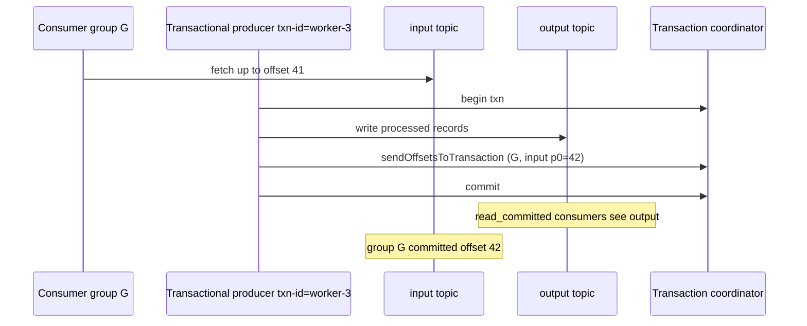

# Exactly-once semantics

## Use case

The e-commerce checkout service writes an `orders` event. A worker reads it, charges the card, and writes `orders-charged`. If the worker crashes after the charge but before committing its Kafka offset, at-least-once delivery charges the card twice. If it commits the offset before the charge, a crash **drops** the charge.

Fraud has the same shape: read `login-events`, score, write `fraud-scores`. Double-counting a score is annoying. Double-charging a card is a newspaper story.

People say "turn on exactly-once". The staff-engineer question is: **exactly-once *of what*, between which two systems?**

---

## Why this is hard at scale

A produce is a network RPC. Timeouts are indistinguishable from success. A consumer poll is another RPC. Your process also talks to Redis, Stripe, Postgres, and webhooks. Those systems do not join Kafka's transaction.

You therefore have three different problems, often mashed into one slogan:

1. **Producer retries** duplicating a record in a topic.
2. **Consumer retries** processing the same record twice.
3. **Read-process-write** across topics: output record(s) + input offset commit must be **one atomic fact**.

Kafka can solve (1) with idempotent producers. Kafka can solve (3) when the write is **back to Kafka**. Kafka cannot make Stripe idempotent for you.

At scale, transactions add a coordinator, extra RPCs, and `read_committed` filtering. Observability pipelines that only need "don't lose logs" should not pay that tax. Payments pipelines might.

---

## Intuition

**At most once:** commit (or not retry) *before* the side effect. Duplicates: no. Loss: yes.

**At least once:** retry and commit *after* the side effect. Loss: no. Duplicates: yes. Make the side effect **idempotent** (upsert by event id).

**Exactly once (Kafka's meaning):** the broker deduplicates producer retries, and a **transaction** atomically (a) writes output records and (b) commits the input offsets. Downstream consumers with `isolation.level=read_committed` never see aborted output.

```
input topic  ──►  process  ──►  output topic
                 ▲                 │
                 └── offset commit ┘
                 one transaction
```

If "process" includes `POST /charge`, that POST is **outside** the transaction. You need an idempotency key at the payment API, or you do not have EOS.

Most production systems run **at-least-once + idempotent sinks**. That is not a cop-out; it is the only design that works with ClickHouse, S3, and HTTP.

---

## Internals: delivery table

| Guarantee | Loss | Duplicates | How |
|-----------|------|------------|-----|
| At most once | Possible | No | No retries; commit before process |
| At least once | No at the processing layer when durable storage, retries, and offsets are configured correctly | Possible | Retry; commit offset after successful processing |
| Idempotent produce | No | No *on retry to the same partition* | PID + sequence |
| Transactional EOS | No | No *for the Kafka read-process-write* | Idempotent produce + txn + `read_committed` |

---

## Internals: idempotent producers

Without idempotence:

```
1. Producer sends batch (seq 5) → broker appends → response lost
2. Producer times out, retries
3. Broker appends again → duplicate records, new offsets
```

With `enable_idempotence=True` the broker assigns a **Producer ID (PID)** and the client stamps **sequence numbers per partition**. The broker keeps the next expected sequence. A retry with the same PID+seq is acknowledged but **not** appended again.

Implications:

- Requires `acks=all` and `max.in.flight.requests.per.connection ≤ 5` (the idempotent producer's in-order dedup guarantee up to 5 in-flight requests has been in place since 0.11, when idempotence was introduced).
- Dedup is **per producer session, per partition**. It does not deduplicate two different processes both sending `order_id=9`.
- It does not span partitions: a transactional send to two partitions needs **transactions**, not just idempotence.
- PID state lives on the broker; a new `KafkaProducer` process gets a new PID (unless it uses a transactional id — next section).

```python
from kafka import KafkaProducer

producer = KafkaProducer(
    bootstrap_servers=["localhost:9092"],
    enable_idempotence=True,  # acks=all implied
    value_serializer=lambda v: v if isinstance(v, bytes) else str(v).encode(),
)
```

Turn this on for almost every producer. The cost is negligible compared with `acks=all`, which you wanted anyway ([replication](replication.md)).

---

## Internals: transactions and what EOS actually guarantees

A **transactional id** (`transactional.id`) is a stable string for a *process instance* (e.g. `orders-charger-3`). On init, the broker **fences** older producers with the same id (zombie fencing): a crashed worker cannot commit after its replacement has started.

A transaction can include:

- Writes to any partitions of any topics
- Offset commits for a consumer group (`sendOffsetsToTransaction`)

Commit is atomic from the point of view of `read_committed` consumers. `read_uncommitted` (default on many clients) **will see** records from open or aborted transactions as they hit the log (control batches excepted depending on client). If you bother with transactions, downstream **must** set `isolation.level=read_committed`.



**This is the whole Kafka EOS contract:** a read-process-write **to another Kafka topic** (or the same cluster) in which the offset move and the output records succeed or fail together. After commit, a restart will not re-emit those outputs. After abort, `read_committed` consumers never see them.

It does **not** guarantee:

- Exactly-once effect on Postgres, ClickHouse, HTTP, email
- Dedup of semantically identical events produced by two app servers (`order submitted` clicked twice)
- Cross-cluster atomicity (MirrorMaker is at-least-once unless you build more)
- That a compacted topic plus transactions will do what you think without `read_committed`

---

## How: read-process-write with kafka-python

`kafka-python` exposes transactions; production Java/`confluent-kafka` is more battle-tested. The shape is the same.

```python
from kafka import KafkaConsumer, KafkaProducer, TopicPartition, OffsetAndMetadata
import json

GROUP = "orders-charger"
IN_TOPIC = "orders"
OUT_TOPIC = "orders-charged"

consumer = KafkaConsumer(
    IN_TOPIC,
    group_id=GROUP,
    bootstrap_servers=["localhost:9092"],
    enable_auto_commit=False,
    isolation_level="read_committed",
    auto_offset_reset="earliest",
    value_deserializer=lambda v: json.loads(v.decode("utf-8")),
)

producer = KafkaProducer(
    bootstrap_servers=["localhost:9092"],
    transactional_id="orders-charger-0",  # unique per running instance
    enable_idempotence=True,
    value_serializer=lambda v: json.dumps(v).encode("utf-8"),
)
producer.init_transactions()

while True:
    batch = consumer.poll(timeout_ms=1000, max_records=100)
    if not batch:
        continue
    producer.begin_transaction()
    try:
        offsets = {}
        for tp, records in batch.items():
            for rec in records:
                event = rec.value
                charged = {**event, "status": "charged"}
                producer.send(OUT_TOPIC, key=rec.key, value=charged)
            last = records[-1]
            offsets[tp] = OffsetAndMetadata(last.offset + 1, "")
        producer.send_offsets_to_transaction(offsets, GROUP)
        producer.commit_transaction()
    except Exception:
        producer.abort_transaction()
        raise
```

Downstream:

```python
KafkaConsumer(
    OUT_TOPIC,
    group_id="warehouse-loader",
    isolation_level="read_committed",
    enable_auto_commit=False,
    bootstrap_servers=["localhost:9092"],
)
```

Flink's Kafka sink with `DeliveryGuarantee.EXACTLY_ONCE` is this protocol plus checkpoint barriers. See [Flink checkpoints](../flink/checkpoints.md).

---

## How: at-least-once plus an idempotent sink (the usual design)

Give every event a stable `event_id` (UUID from the producer, or a hash of natural keys). The sink upserts.

```python
# ClickHouse: ORDER BY event_id defines identity; ReplacingMergeTree(version)
# selects the newest version during merges. Queries still need FINAL/argMax until then.
# Postgres: INSERT ... ON CONFLICT (event_id) DO NOTHING

for message in consumer:
    event = message.value
    db.execute(
        "INSERT INTO charges (event_id, customer_id, amount) VALUES (%s, %s, %s) "
        "ON CONFLICT (event_id) DO NOTHING",
        (event["event_id"], event["customer_id"], event["amount"]),
    )
    consumer.commit()
```

Retries may call `execute` twice; the Postgres unique key makes the *effect* once. Other sinks require their own concrete contract. In ClickHouse, `ReplacingMergeTree(version) ORDER BY event_id` is eventually deduplicated during merges, so correctness-sensitive queries must use `FINAL`, `argMax`, or a materialized serving pattern. In an Iceberg sink, use an atomic `MERGE` keyed by `event_id`. “Idempotent sink” is a design to prove, not a generic database property.

---

## When exactly-once matters

| Workload | Need Kafka transactions? |
|----------|---------------------------|
| Observability logs into ClickHouse | No — idempotent insert / repl table |
| SaaS analytics into a lake | No — exactly-once *files* via Spark/Flink + Iceberg commits |
| IoT telemetry | No — last-write-wins state is compaction or a DB upsert |
| E-commerce `orders` → `orders-charged` **in Kafka** | Yes, if the charge is represented *only* as that output event |
| E-commerce `orders` → Stripe | Stripe idempotency key; Kafka txn does not wrap Stripe |
| Fraud feature stream consumed by a model | Often at-least-once; duplicates skew counts unless keyed upsert |

**Cost:** transaction commit adds a round trip to the coordinator; `commit.timeout`; more control batches in the log; consumers in `read_committed` wait for the commit marker, so end-to-end latency grows (often tens of ms, worse under coordinator load).

---

## Gotchas

**Default isolation is uncommitted.** Building a transactional producer and leaving consumers on default undoes the visibility half of EOS. You will see aborted records.

**Zombie fencing.** Two pods with the same `transactional.id` will fence each other in a loop. One id per *running* instance. Kubernetes replicas need `orders-charger-${POD_ORDINAL}`, not a shared string.

**Transactions are not magic batching.** Huge transactions (minutes of records) hold memory and delay `read_committed` consumers. Checkpoint / txn size should be seconds, not hours.

**`enable.idempotence` ≠ EOS.** It only fixes producer retries. Consumer double-process is unchanged.

**Fencing vs group rebalance.** A rebalance can duplicate processing *unless* the new owner uses the same transactional id and aborted/committed correctly. This is why Flink ties transactions to checkpoints rather than to "each poll".

---

## Failure modes

| Failure | Effect without care | With txn EOS (Kafka-to-Kafka) |
|---------|---------------------|-------------------------------|
| Produce timeout | Duplicate records | Idempotent produce drops the retry |
| Crash after output write, before offset commit | Duplicate outputs on replay | Abort or commit atomically; no extra outputs after commit |
| Crash after Stripe charge | Double charge | **Still double charge** unless Stripe idempotency key |
| Downstream `read_uncommitted` | Sees aborted data | Misconfiguration |
| Coordinator down | Timeouts | Availability dip; not silent loss if you fail the commit |

---

## Debugging

| Metric / signal | What it tells you |
|-----------------|-------------------|
| `record-error-rate` / produce retries | Retry storms; idempotence should keep the log clean |
| `commit-latency-avg` (producer txn) | Coordinator or broker overload |
| Consumer duplicates in output topic | Missing txn, missing `read_committed`, or side effect outside txn |
| Fenced instance (`ProducerFenced`) | Two processes, one `transactional.id` |
| Consumer lag by partition | Txn commit stall looks like lag |
| Under-replicated partitions | Durability of the txn log itself is still ISR |

Search logs for `InvalidProducerEpoch`, `ProducerFenced`, `InvalidTxnState`. Those are fencing and protocol bugs, not "Kafka lost a message".

To *prove* duplicates, hash `event_id` in the output topic over a window. If Kafka-to-Kafka EOS is correct, duplicates are app double-produces (two API servers, no `event_id`).

---

## Scale: 10× / 100× / 1000×

| Scale | EOS stance |
|-------|------------|
| **10×** | Idempotent producers everywhere. Transactions only on money/inventory topics. |
| **100×** | Transaction coordinators and `__transaction_state` become capacity-planned. Observability stays at-least-once. Flink exactly-once checkpoints (not per-record txn) for stream processors. |
| **1000×** | Per-record Kafka transactions will not keep up; use batched transactions (Flink checkpoints every 10–60s) or idempotent sinks. Split payment topics onto a quieter cluster so log/metrics traffic cannot delay commits. |

---

## Trade-offs

| Approach | Once-ness | Latency | Operational load |
|----------|-----------|---------|------------------|
| At most once | Lossy | Best | Low |
| At least once + sink upsert | Effect-once if the sink cooperates | Good | You must design keys |
| Idempotent producer only | No produce dupes; consumer dupes remain | ≈ `acks=all` | Low — **do this anyway** |
| Kafka transactions | EOS for Kafka-to-Kafka | Worse | Medium |
| Flink checkpoint EOS | EOS for job + Kafka sink | Checkpoint interval | High (worth it for complex jobs) |

---

## Alternatives

- **Outbox pattern:** OLTP transaction writes business row + outbox row; a publisher emits to Kafka. Gets you "DB and event" atomicity Kafka cannot provide in reverse.
- **Idempotency keys at the edge:** Stripe, PSP, or your own charge table keyed by `order_id`.
- **Flink / Kafka Streams:** hide the txn protocol behind checkpoints / exactly-once processing. Still Kafka-to-Kafka (or transactional sink). Compare in [Flink vs others](../flink/comparison.md).
- **Spark Structured Streaming + Iceberg:** exactly-once *table commits* for lake paths; not 50ms fraud.

---

## How to apply this at work

Draw the pipeline as boxes. Circle every arrow that is **not** Kafka. For each circle, write the idempotency story. For Kafka-to-Kafka arrows that must not duplicate, write `transactional.id` + `read_committed` + owner process.

If a design doc says "exactly-once" and the sink is ClickHouse, send it back with "idempotent insert, at-least-once delivery". If it says "exactly-once" and both ends are topics, ask for isolation level and fencing ids.

---

## Exercise

Pipeline: `login-events` → worker → (1) Redis `INCR user:{id}:failures` (2) produce `fraud-alerts` if count ≥ 10 in 5 minutes. Product asks for "exactly-once so we don't page twice".

1. What does a Kafka transaction cover here?
2. Will `INCR` double-count on a worker crash? How do you fix it without Redis transactions spanning Kafka?
3. Is "page twice" a Kafka EOS problem?

??? question "Answer"
    1. A Kafka transaction can atomically write `fraud-alerts` and commit the `login-events` offset. Redis `INCR` is **not** in the transaction. `read_committed` consumers of `fraud-alerts` will not see aborted alerts.

    2. Yes. Crash after `INCR` before commit → replay → `INCR` again. Fix: store the last processed `event_id` or offset per user in Redis (`SET processed:{event_id}`) and skip, or drive the count from a Flink keyed window ([windows](../flink/windows.md)) whose state is checkpointed with the Kafka offsets. Do not expect Kafka EOS to include Redis.

    3. Mostly no. Duplicate pages are usually: at-least-once alerts, missing dedup in PagerDuty, or sliding windows emitting overlapping alerts. Dedup pages on `(user_id, window_start)`. Kafka EOS does not debounce a 5-minute rule by itself.
