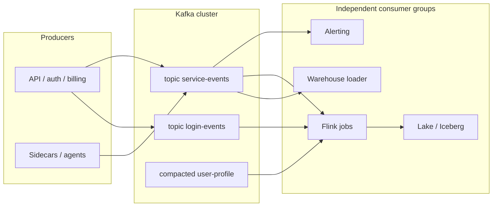

# Apache Kafka

!!! info "Version and source policy"
    Examples target the pinned lab baseline. Check [Versions & Primary Sources](../reference/version-matrix.md) before applying configuration to another Kafka release.

Hundreds of services emit events faster than any one consumer can process them. Auth writes `login_failed`. The API gateway writes `{timestamp, customer_id, user_id, service, endpoint, region, latency_ms, status_code, bytes}` at tens of thousands of records per second. Billing, fraud, search, and the warehouse all want those events — at their own pace, with their own retries, without calling the producer back.

If you put this through a request/response API, a slow warehouse job stalls the API. If you put it in a database table used as a queue, the second consumer cannot replay what the first already deleted. If you put it in a traditional message broker that acknowledges and drops, a bug in alerting means the evidence is gone.

Kafka exists because producers and consumers must evolve independently **without losing the stream**.

---

## What this module covers

| Topic | What you will be able to reason about |
|-------|----------------------------------------|
| [The log abstraction](log.md) | Segments, indexes, retention versus compaction, why Kafka is not a database |
| [Partitions and consumers](partitions.md) | Partitioner, consumer groups, eager versus cooperative rebalance, lag |
| [Replication and durability](replication.md) | ISR, `acks`, `min.insync.replicas`, unclean leader election |
| [Exactly-once semantics](exactly-once.md) | Idempotent producers, transactions, what EOS actually guarantees |
| [Production gotchas](gotchas.md) | Hot partitions, poison pills, schema evolution, rebalance storms |
| [Labs](labs.md) | Produce, consume, watch lag, then kill a broker and inject a poison message |

This module sits on [partitioning](../foundations/partitions.md), [data movement](../foundations/data-movement.md), and [batch versus stream](../foundations/batch-vs-stream.md). Downstream you will use the same topics from [Flink](../flink/index.md).

---

## The central intuition

Kafka is not a queue. It is a **distributed, replicated, append-only log**.

Producers append. Consumers *read from an offset*. The log stays around for a retention window (or is compacted to the latest value per key). Ten consumer groups can read the same bytes at ten different speeds. Replay is seeking, not begging the producer to send again.

```
Partition 0 of `service-events`
offset   0     1     2     3     4     5     6     7
         e0 → e1 → e2 → e3 → e4 → e5 → e6 → e7 → (tail)

alert-processor     committed offset 3
warehouse-loader    committed offset 6
fraud-scorer        committed offset 7  (caught up)
```

A queue that deletes on ack cannot do this. A database table that is not an append log fights the access pattern: sequential write, sequential read, many independent cursors.

---

## Five systems, one event shape

Reuse this record throughout the module. Serialise it however you like in labs (JSON is fine); production will argue about Avro and Protobuf later.

```json
{
  "timestamp": "2024-01-15T10:03:45.123Z",
  "customer_id": "cust_1842",
  "user_id": "u_99102",
  "service": "auth",
  "endpoint": "/login",
  "region": "eu-west-1",
  "latency_ms": 87,
  "status_code": 401,
  "bytes": 512
}
```

| System | How Kafka shows up |
|--------|--------------------|
| **SaaS analytics** | Product events from hundreds of tenants. Partition by `customer_id` so one tenant's burst does not reorder another tenant. Warehouse and real-time dashboards are *different consumer groups* on the same topic. |
| **Observability** | Logs and traces at 500k–2M records/s. Retention is hours to days. Replay exists so a broken ClickHouse sink can catch up without asking apps to re-emit. |
| **E-commerce** | Orders, payments, inventory. Per-`order_id` (or `user_id`) order matters. Duplicate checkout events are a money bug — see [exactly-once](exactly-once.md). |
| **IoT** | Millions of devices, bursty reconnects. Keys are `device_id`. Compaction on a "latest device state" topic is a different access pattern from the raw telemetry topic. |
| **Fraud** | Same login events as observability, plus a low-latency scorer. A slow model must not stall ingest. Lag on the fraud group is an SLA; lag on the archive group is a disk problem. |

The **security / observability** platform is the running numeric example: ~500k log lines/s, ~2M metric points/s, ~50k security events/s. Multiple processors (alert, enrich, store, train) must not couple back to the fleet of producers.

---

## Where it sits in an architecture



Producers need three things from this layer: high write throughput, durability they can name (`acks`, ISR), and a partition key that preserves the ordering they actually care about. Consumers need independent offsets, enough partitions to parallelise, and a retention window longer than their worst outage.

Kafka does **not** compute "failed logins per user in five minutes". That is [Flink](../flink/time.md). Kafka stores and fans out the raw stream.

---

## What Kafka actually guarantees (and does not)

| Guarantee | Scope |
|-----------|--------|
| Order | **Per partition**, not per topic |
| Durability | As strong as `acks` × ISR × `min.insync.replicas` × disk |
| Delivery to a consumer group | At-most-once, at-least-once, or exactly-once *for a read-process-write to Kafka* — see [EOS](exactly-once.md) |
| Fan-out | Independent groups, independent offsets |
| Replay | Until retention or compaction removes the record |

It does not give you:

- Random access by `user_id` across partitions (scan or materialise elsewhere)
- Cross-partition transactions that include Postgres, Stripe, or a webhook
- Automatic schema compatibility because you "use a registry" (the registry only helps if producers and consumers *agree the compatibility mode*)

---

## Throughput intuition before you tune

A single partition is a single log on a single leader broker, consumed by at most one member of a group. Millions of records per second therefore means **many partitions**, **many leaders**, and **many consumers** — plus the disk sequential-write path that Kafka was built around.

| Scale | What usually breaks first |
|-------|---------------------------|
| 10× (tens of thousands/s) | Bad keys: one `customer_id` owns a partition. Consumer lag on that partition only. |
| 100× | Disk and page cache. Replication traffic ≈ ingest × (RF − 1). Under-replicated partitions after a broker bounce. |
| 1000× | Partition count, controller metadata, rebalance time, request-handler threads, and the operational cost of "just add partitions" (it reshuffles keys). |

Details live in [partitions](partitions.md) and [replication](replication.md). The [partition simulator](../simulations/kafka-partitions.html) is worth five minutes before the labs.

---

## The cluster you are actually operating

A Kafka *cluster* is brokers plus a controller (KRaft in 3.x; ZooKeeper + controller in older deployments). Clients (`bootstrap.servers`) ask any broker for metadata: which broker **leads** `service-events` partition 7, where the ISR is, what the topic configs are.

You will live in a handful of objects:

| Object | Role |
|--------|------|
| Topic | Named log, split into partitions |
| Partition | Ordered log; unit of parallelism and replication |
| Consumer group | Independent cursor over partitions |
| ACL / quota | Who may produce/consume, at what rate |

Producers batch (`linger.ms`, `batch.size`) and compress. Followers fetch those batches. Consumers fetch them again. Disk sequential write is the happy path; random reads of old segments (a warehouse backfill) is the unhappy path that evicts page cache from the live tail.

If you remember one operational sentence: **Kafka is a disk and metadata system that happens to speak a consumer protocol.** Incidents that look like "consumer lag" are often disk, ISR, or rebalance.

---

## Contracts to write down before the first topic

Do not create `service-events` until you can fill this:

```
key:           customer_id          # order scope
partitions:    24                   # headroom for consumers
RF / min.ISR:  3 / 2
acks:          all
cleanup:       delete, 48h          # or compact for changelogs
consumers:     alert, warehouse, flink-fraud   # separate group ids
poison policy: DLQ (logs) / halt (payments)
schema:        Avro + BACKWARD      # not "JSON, we'll be careful"
```

E-commerce `orders` will differ (tighter EOS, maybe fewer partitions for order). IoT `device-state` will differ (compact). Observability `logs.raw` will differ (short retention, many partitions, no keys). Same product, five contracts.

Related: [foundations — scale](../foundations/scale.md), [observability architecture](../architectures/observability.md), [fraud architecture](../architectures/fraud.md).

---

## How to study this module

1. Read [the log](log.md) until "offset" and "segment" are muscle memory.
2. Read [partitions](partitions.md) with the simulator open. Predict lag before you generate it in the [labs](labs.md).
3. Read [replication](replication.md) and be able to say what `acks=all` does when ISR shrinks to one.
4. Read [exactly-once](exactly-once.md) sceptically. Name the pipeline it actually covers.
5. Skim [gotchas](gotchas.md), then do the labs including **now break it**.
6. Continue into [Flink](../flink/index.md) with the same `service-events` topic.

You are done with Kafka as a *platform* when you can look at a lag graph, an ISR shrink, and a rebalance, and say which one is the incident.
