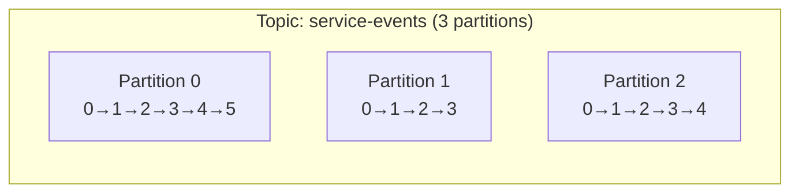

# The log abstraction

## Use case

The observability platform writes every request as an event:

```json
{"timestamp":"2024-01-15T10:03:45.123Z","customer_id":"cust_1842","user_id":"u_99102","service":"api","endpoint":"/orders","region":"eu-west-1","latency_ms":87,"status_code":200,"bytes":4096}
```

Alerting wants them in seconds. The warehouse wants them tonight. Fraud wants a second copy with a different processor. Last Tuesday a parser bug dropped 40 minutes of logs; you need to *replay* those 40 minutes without asking 400 services to re-emit.

You need a store that is cheap to append, cheap to read sequentially, and that does not delete a record just because one consumer finished it.

---

## Why this is hard at scale

Teams try a database table used as a queue: insert event, consumer `SELECT … FOR UPDATE`, delete.

That fails for specific reasons:

- **Coupling.** Producers and consumers share a schema and a connection pool. A warehouse backfill locks rows the API needs.
- **Single cursor.** Delete-on-ack means the second consumer never sees the row. Fan-out becomes N writes, not N reads.
- **Wrong I/O pattern.** OLTP stores are built for point lookups and updates. A 2.5M record/s append path wants sequential writes and sequential reads.
- **No replay.** Once deleted, the evidence is gone. A buggy consumer is a data-loss incident.
- **Backpressure leaks upstream.** If the table is the buffer, a slow consumer either blocks producers or grows the table until the primary falls over.

Object storage (S3) is cheap and durable but has no notion of "consumer group offset 1_204_332 on partition 7" and is a poor fit for 50ms alerting.

---

## Intuition

Treat the stream as a file you only append to.

```
Position:  0    1    2    3    4    5    6    7
           ─────────────────────────────────────→
Event:    [e0] [e1] [e2] [e3] [e4] [e5] [e6] [e7]

Producer appends at the tail (next offset 8)
Consumer A reads from offset 3
Consumer B reads from offset 6
```

- **Immutable.** A written record is not updated in place. A "correction" is a new record (or a compacted later value for the same key).
- **Ordered.** Offsets increase. Offset 5 on partition 0 is not offset 5 on partition 1.
- **Retained independently of consumers.** Time or size (or compaction) decides when bytes go away.
- **Multi-consumer.** Many groups, many offsets, same bytes.

A **topic** is a named stream (`service-events`, `login-events`, `orders`). A topic is split into **partitions** so that append and consume can happen in parallel. Each partition *is* one log.



This is the same idea as [foundation-level partitioning](../foundations/partitions.md): split so workers do not share a write cursor.

---

## Internals: segments and indexes

On disk, a partition is a directory. Kafka does not append forever into one giant file. It rolls **segments**.

```
/var/lib/kafka/service-events-0/
  00000000000000000000.log
  00000000000000000000.index
  00000000000000000000.timeindex
  00000000000000001248.log          ← active segment (being appended)
  00000000000000001248.index
  00000000000000001248.timeindex
  leader-epoch-checkpoint
```

The filename is the **base offset** of the first record in that segment. Default `log.segment.bytes` is 1 GiB; `log.segment.ms` can roll earlier so retention can delete whole files.

| File | Role |
|------|------|
| `.log` | Record batches (the bytes) |
| `.index` | Sparse map: relative offset → byte position in the `.log` |
| `.timeindex` | Sparse map: timestamp → offset |

Indexes are **sparse** (`log.index.interval.bytes`, typically 4 KiB of log between entries). A fetch for offset 1_204_332 does a binary search on the offset index, then a sequential scan of a few kilobytes of log — not a full partition scan.

Producers write **record batches** (many records, often compressed with lz4/zstd). The broker appends the batch to the **page cache**; Linux writes it out. Kafka's throughput story is "sequential append + sequential read from page cache", not "we invented a faster disk".

Retention deletes **closed segments** whose newest record is older than `log.retention.ms` (or whose total bytes exceed `log.retention.bytes`). The active segment is not deleted. That is why a topic with tiny volume can appear to retain "too long": one segment has not rolled.

!!! production-gotcha "Retention is per segment, not per record"
    A 1 GiB segment that rolled yesterday still holds *all* of its records until the whole file is eligible. If you need minute-granularity delete, you need smaller segments — and you pay with more files and more indexes.

---

## Internals: topics, keys, and the producer write path

A producer chooses a **partition**, then the **leader** of that partition appends.

```python
from kafka import KafkaProducer
import json

producer = KafkaProducer(
    bootstrap_servers=["localhost:9092"],
    value_serializer=lambda v: json.dumps(v).encode("utf-8"),
    key_serializer=str.encode,
    acks="all",
    linger_ms=10,
    compression_type="lz4",
)

event = {
    "timestamp": "2024-01-15T10:03:45.123Z",
    "customer_id": "cust_1842",
    "user_id": "u_99102",
    "service": "auth",
    "endpoint": "/login",
    "region": "eu-west-1",
    "latency_ms": 87,
    "status_code": 401,
    "bytes": 512,
}

# Same customer_id → same partition → per-customer order
producer.send("service-events", key=event["customer_id"], value=event)
producer.flush()
```

The default partitioner hashes the key (`murmur2(key) % num_partitions`). Null keys use the **sticky partitioner** (Kafka 2.4+): fill a batch for one partition, then pick another. That is better for compression and throughput than per-record round-robin. Details and hot-key behaviour: [partitions](partitions.md).

---

## Internals: consumers and offset commits

Consumers read batches, process them, then **commit** an offset meaning "I have processed up to here". Commits go to the internal `__consumer_offsets` topic, not to the log you are reading. Two groups never share a cursor.

```python
from kafka import KafkaConsumer

consumer = KafkaConsumer(
    "service-events",
    group_id="alert-processor",
    bootstrap_servers=["localhost:9092"],
    enable_auto_commit=False,
    auto_offset_reset="earliest",
    value_deserializer=lambda v: json.loads(v.decode("utf-8")),
)

for message in consumer:
    process_event(message.value)
    consumer.commit()  # after success — at-least-once
```

If the process dies after `process_event` and before `commit`, the group re-reads that record. That is **at-least-once**. Auto-commit (`enable_auto_commit=True`) commits on a timer regardless of whether your handler succeeded — convenient, and a way to skip records after a crash.

`auto_offset_reset` only applies when the group has **no** committed offset: `earliest` replays retained history, `latest` skips to the tail. It is not "if lag is large, skip".

---

## Retention versus compaction

Two cleanup policies, two jobs.

**Delete** (`log.cleanup.policy=delete`) — the observability default. Keep N hours or M bytes of raw events, then drop whole segments. Replay window = retention. A consumer slower than retention **loses data** (`OffsetOutOfRange`, then `auto_offset_reset` behaviour).

```properties
log.retention.hours=168
# optional size cap per partition
log.retention.bytes=107374182400
```

**Compact** (`log.cleanup.policy=compact`) — "latest value per key". User settings, current order status, device shadow, a changelog of a Flink/Kafka Streams table.

```
Before compaction:
  user_1 → {name: "Alice"}
  user_2 → {name: "Bob"}
  user_1 → {name: "Alice Smith"}

After compaction:
  user_2 → {name: "Bob"}
  user_1 → {name: "Alice Smith"}
```

A tombstone (`key=user_1`, `value=null`) marks the key for deletion; after `delete.retention.ms` the tombstone itself goes away.

Compaction is **not** instantaneous. A cleaner thread rewrites older segments when the "dirty" ratio is high enough (`log.cleaner.min.cleanable.ratio`). The tail (active segment, plus a configurable amount of recent data) is **not** compacted. Duplicate keys in the tail are normal.

You can set `compact,delete` to compact *and* drop records older than a retention — useful for changelogs that should not grow forever.

!!! warning "Compaction is not a query engine"
    You still cannot ask Kafka "give me user_1" without a consumer that has read the compacted topic into memory or a store. Compaction only bounds disk for a key-keyed log.

---

## How: topic config you will actually set

```bash
kafka-topics.sh --bootstrap-server localhost:9092 --create \
  --topic service-events \
  --partitions 12 \
  --replication-factor 3 \
  --config retention.ms=172800000 \
  --config compression.type=producer \
  --config min.insync.replicas=2

# Latest-value store for enrichment (e-commerce user profile, IoT device shadow)
kafka-topics.sh --bootstrap-server localhost:9092 --create \
  --topic user-profile \
  --partitions 12 \
  --replication-factor 3 \
  --config cleanup.policy=compact \
  --config min.cleanable.dirty.ratio=0.5 \
  --config delete.retention.ms=86400000
```

`compression.type=producer` keeps the codec the producer chose. Re-compressing on the broker wastes CPU.

---

## Gotchas

**Page cache is the real buffer.** A broker that looks like it has "free RAM" may be serving all consumers from cache. A second consumer group that scans a cold 7-day topic will hit disk and take the page cache away from the live tail. Observability clusters often isolate "live" topics from "replay" topics, or isolate brokers.

**JSON with no schema** will work in the lab and hurt in month three. Schema evolution is not "we installed a registry"; it is compatibility rules plus what consumers do with unknown fields. Covered in [gotchas](gotchas.md).

**Offsets are not timestamps.** "Replay from 10:00" needs the time index (`offsets_for_times` / `kafka-consumer-groups --reset-offsets --to-datetime`). Clock skew in `timestamp` (create time vs log append time) will seek to the wrong place.

**Very small `segment.bytes`** creates tens of thousands of files. Brokers open many file handles; recovery and replica fetch slow down. Very large segments delay retention.

---

## Failure modes

| Failure | What you see | What actually happened |
|---------|----------------|------------------------|
| Consumer `OffsetOutOfRangeException` | Group jumps to latest (if `auto_offset_reset=latest`) and **skips** | Lag exceeded retention; segments deleted |
| Disk full on broker | Producers time out; ISR shrinks | Retention too long, or one hot partition filled a disk |
| Slow replica fetch | Under-replicated partitions | Follower reading cold segments, or disk saturation |
| Compaction "not working" | Topic still huge | Dirty ratio not reached; keys are unique so there is nothing to compact |
| "We lost Monday" | Replay empty | `delete` policy, 24h retention, nobody noticed lag until Tuesday |

A compacted topic with unique keys (raw `service-events` keyed by UUID) **never shrinks**. Compaction only helps when keys repeat.

---

## Debugging

Start with disk and offsets, not with "is Kafka up".

```bash
# Segment files and sizes for one partition
ls -lh /var/kafka-logs/service-events-0/

# Consumer position versus log end
kafka-consumer-groups.sh --bootstrap-server localhost:9092 \
  --describe --group alert-processor

# Earliest / latest offsets
kafka-run-class.sh kafka.tools.GetOffsetShell \
  --bootstrap-server localhost:9092 --topic service-events
```

| Metric | Healthy | Investigate |
|--------|---------|-------------|
| `LogEndOffset − committed offset` (lag) **per partition** | Flat or sawtooth | Growing on one partition: hot key or stuck consumer |
| Broker disk used / `log.retention.*` | Headroom for a burst | One partition directory dominating a disk |
| `BytesInPerSec` vs `BytesOutPerSec` | Out ≈ in × (groups + RF-1) | Out >> in: replay storm or too many full-speed groups |
| ISR size / under-replicated partitions | 0 URP | Follower cannot copy segments fast enough |

If lag is high *and* the earliest offset is racing toward the committed offset, you are about to hit retention. That is a data-loss countdown, not a latency SLO miss.

---

## Scale: 10× / 100× / 1000×

Start from ~25k events/s on `service-events` (a busy SaaS region).

| Scale | Ingest | Log behaviour |
|-------|--------|----------------|
| **10×** (~250k/s) | Batching (`linger_ms`, `batch.size`) and compression start to matter more than partition count. Page cache still absorbs the tail. |
| **100×** (~2.5M/s) | This is the observability number. Sequential disk and network for replication dominate. Split topics by retention (hot 6h vs cold 7d). More disks (`log.dirs`), not one giant volume. |
| **1000×** | You are into multiple clusters or tiered storage (local tail + object storage for old segments). Controller metadata, replica fetchers, and "replay 7 days" become operational programmes, not flags. |

IoT at 1000× is often many small keys (good for compaction of device state, bad if you naively compact raw telemetry). Fraud at 1000× is usually not 1000× *events* — it is 1000× *cost of a duplicate or a drop*.

---

## Trade-offs

| Choice | You gain | You give up |
|--------|----------|-------------|
| Long retention | Replay, late consumers | Disk, longer ISR catch-up, expensive cold reads |
| Compaction | Bounded "latest per key" | No full history; cleaner CPU; tail still dirty |
| Many small segments | Faster retention | File handles, slower broker recovery |
| JSON values | Fast to ship | Weak evolution, fat bytes, no compact schema |
| One topic for all events | Simple routing | Mixed retention, mixed keys, mixed SLAs |

---

## Alternatives

| Alternative | When it wins | When it loses |
|-------------|--------------|---------------|
| Postgres / outbox table | Low rate, transactional write with OLTP | High rate sequential ingest, many independent consumers |
| RabbitMQ / SQS | Work queues, competing consumers, short retention, routing topologies | Replay, 10+ independent readers of the same stream |
| Pulsar | Separate compute/storage, multi-tenancy | Operational complexity; most teams do not need it first |
| Kinesis | Managed, AWS-native | Shard management, cost at observability volume |
| S3 + notification | Cheap archive | Not a tail; not per-partition order; not 50ms consumers |

If the workload is "process each file once into the lake", you may want object storage and [Spark](../spark/index.md), with Kafka only as the *live* path.

---

## How to apply this at work

When someone says "we'll just publish to Kafka", ask:

1. What is the **key**? What ordering do we actually need?
2. What is the **replay window**? Write that as `retention.ms`, not as a hope.
3. Who are the **consumer groups**, and is any of them allowed to be a day behind?
4. Is this a raw event log (delete) or a changelog (compact)? Do not compact unique-key telemetry.
5. What happens when a consumer hits `OffsetOutOfRange` — skip, halt, or restore from the lake?

If the answer to (2) is "forever" and the answer to (4) is "raw events", you want a lakehouse table, not infinite Kafka.

---

## Exercise

A compacted topic `user-profile` (key = `user_id`) has 50 million unique users. Producers send a full profile snapshot on every change, ~2 updates/user/day. The topic is 1.2 TB and growing. Product wants "rebuild any service from Kafka in 20 minutes".

1. Why is compaction not shrinking the topic much?
2. What config or design change bounds disk without breaking rebuild?
3. Why is `service-events` the wrong topic to compact?

??? question "Answer"
    1. Fifty million unique keys means the compacted baseline is "one record per user". If snapshots are large (JSON with nested prefs), 50e6 × ~20 KB is already ~1 TB *after* compaction. The cleaner only removes *older versions*. Growth is payload size × cardinality, not "compaction is broken". Also the tail is not compacted, so a high-rate changelog always has a dirty head.

    2. Shrink the value (Avro/Protobuf, only changed fields, or store blob in object storage and keep a pointer). Raise cleaner parallelism if the dirty ratio stays high. Optionally `compact,delete` with a retention if you do **not** need ancient keys — but then a rebuild cannot resurrect users who never updated inside the window. A better rebuild story is: compacted Kafka for hot profiles **plus** a snapshot in the lake.

    3. `service-events` keys by `customer_id` or not at all; records are not "latest state". Compacting them would drop history alerting and fraud need, and would not even shrink much if keys are high-cardinality (`user_id` + timestamp uniqueness). Raw events use **delete** retention; changelogs use **compact**.
